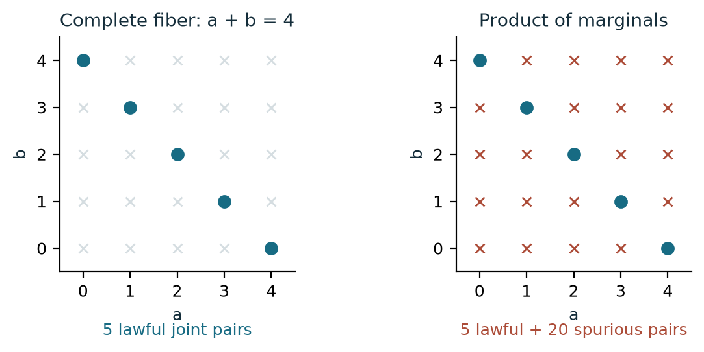
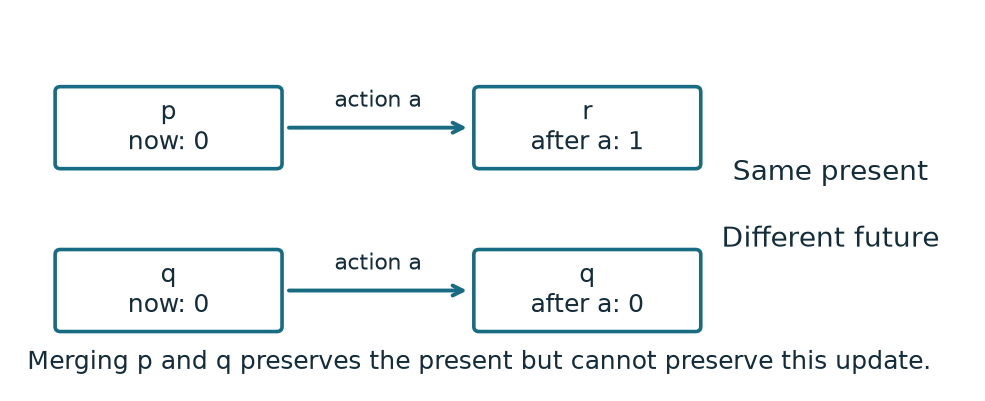
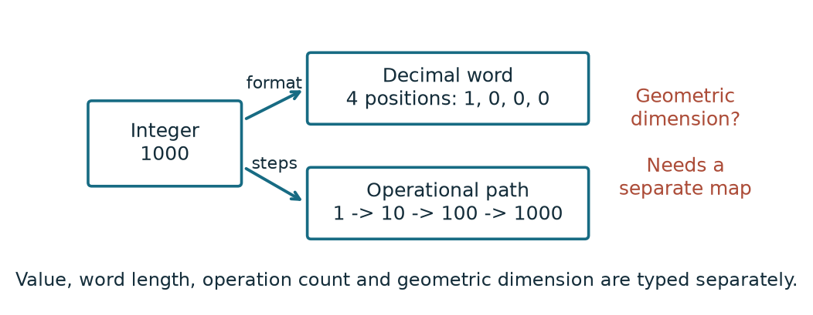
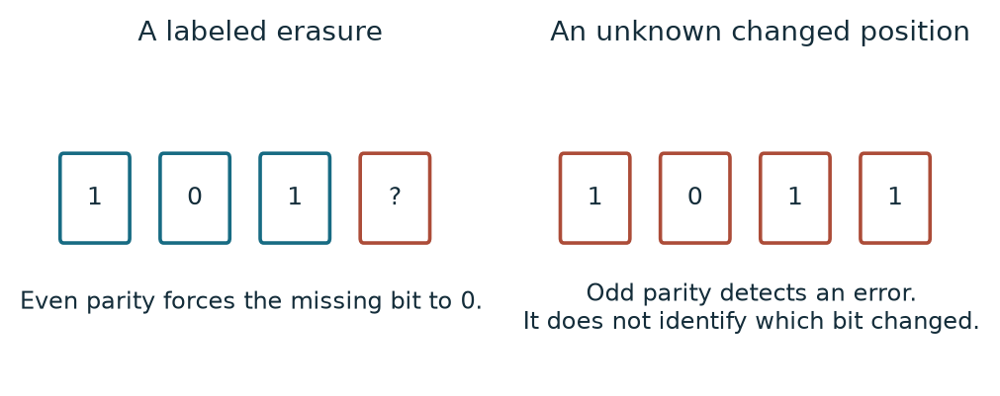

# The RPRM Manifesto

## A relational framework for mathematical unification

**First release candidate.** This paper states a mathematical program,
definitions and scoped preservation results. The companion repository contains
fuller proofs, executable examples, the 2D Mechanical Motion Atlas, a reader's
guide, an agent handbook and separately labeled experimental directions.

### Abstract

RPRM organizes mathematical work around a supplied relation, the roles already
known, the roles being requested, and the observations that must survive a
change of representation. Its unifying purpose is to connect existing
mathematics while preserving its meaning. We define apertures as partial
assignments and requested completions of typed relations; characterize exactly
when a representation preserves a question; and state the additional conditions
needed to preserve all finite continuations of a deterministic partial system.
These conditions supply practical tools for finding lost distinctions,
constructing sufficient quotients, repairing representations and transporting
questions. A faithful relational presentation connects these constructions to
many-sorted first-order mathematics at a stated scope. The accompanying code
provides finite reference implementations, independent checks and selected
formal proofs. Broader applications are proposals with explicit tests and
unresolved bridges. They do not inherit a physical or algorithmic claim merely
from sharing the language.

## 1. The object, the question and the retained information

A mathematical problem has more structure than its displayed answer. It has
a carrier of admitted objects, equality, laws, roles, observations and often
operations that may continue after the present calculation. Simplifying its
representation changes which distinctions remain available.

RPRM makes that structure explicit. It uses ordinary sets, functions, relations
and logic as its metalanguage. “Underneath mathematics” means a common account
in which supplied mathematical structures can be represented and their
statements recovered. It does not mean that logic or set theory has been
derived from an untyped primitive.

The framework addresses four different gaps: a missing value under a law;
a distinction lost by a representation; a missing bridge between descriptions;
and a missing theorem or model. The first three can often be converted into
precise fiber or preservation questions. The fourth remains a proof or modeling
obligation. Naming a gap does not solve it.

The main discipline is simple: specify what the object is, which question is
open, which structure an operation retains, and what establishes the answer.
This paper develops that discipline and a small set of central results. The
repository gives the larger vocabulary and application-specific details so
that the argument here can stay connected and concise.

## 2. Typed relations and apertures

A **sort** supplies a carrier and equality. A **port** is a named role with
a sort. A relation R on ports p1,…,pn is a set of admitted joint tuples.
Extra structure such as an order, topology, metric, units or probability law
is supplied when a claim uses it. Equal numerals in different sorts do not
create an automatic conversion.

An **aperture** supplies values at some ports and asks for compatible values
at the remaining ports, or for a readout of those values. Its complete fiber is

`F(g) = {w in the admitted missing-port carrier : R(g,w)}`.

The fiber has disposition NONE, ONE or MANY according to its cardinality.
An unfinished search is OPEN. Malformed input is an admission error, and a
well-formed map or certificate failing its obligation is REJECT. These outcomes
are not interchangeable.

For `a+b=c` on `{0,1,2,3,4}` with ordinary addition and no wrap, supplying
`a=1,b=3` determines c=4. Supplying only c=4 determines five pairs. Supplying
all three ports leaves one possible empty assignment if the row is lawful,
and none otherwise. A MANY fiber can still determine a readout shared by all
its members.

*Figure 1. Both panels show all 25 pairs in the same carrier. Five satisfy
a+b=4. Replacing the joint fiber by its marginal product adds 20 false answers.*

Composition must retain shared roles. If R relates X to Y and S relates Y
to Z, endpoint composition uses one common y satisfying both relations.
The witness relation keeps triples `(x,y,z)`; endpoint projection keeps only
`(x,z)`. Two different middle witnesses may yield the same endpoints. The
projection preserves reachability and may lose witness identity or multiplicity.

This is a general source of errors: separately valid pieces need not fit the
same joint instance. The familiar relational model and operational-semantics
traditions supply established context for these constructions; the present
account makes its exact questions and preservation obligations explicit.
See [Codd](https://research.ibm.com/publications/a-relational-model-of-data-for-large-shared-data-banks)
and [Plotkin](https://homepages.inf.ed.ac.uk/gdp/publications/sos_jlap.pdf).

## 3. When a representation is sufficient

Let C:X→Z be a representation and Q:X→B a question. The **receiver** names
the questions or behaviors to preserve. C is sufficient for Q exactly when
Q is constant on every C-fiber.

**Question theorem.** There exists a unique h on the reached image C[X]
such that Q=h∘C if and only if C(x)=C(y) implies Q(x)=Q(y).

**Proof.** If Q=h∘C, equal C-values have equal Q-values. Conversely define
h(z)=Q(x) using any x with C(x)=z. Constancy on the fiber makes this independent
of the representative, and membership in the reached image supplies one.
Every such h must take that value, proving uniqueness. No claim about
unreached target values is needed. ∎

An invertible representation is called a **CAR**. A lossy **FOLD** or **ADAPTER**
can still be exact for its stated receiver. Keeping parity of an integer,
for example, preserves the parity question and forgets the particular integer.
A later question requiring the forgotten value needs its preimage family or
a retained route to the source.

If Q does not descend through C, the paired representation `(C,Q)` repairs
that question. It is least informative among representations retaining both
C and Q, up to mutual definability on reached values. In a nonempty finite carrier,
an additional tag needs exactly the maximum number of different Q-values
inside any old C-fiber. The lower bound follows because those values must be
distinguished. Assigning tags separately within each old fiber attains it.
Old fibers can reuse tags because C already distinguishes the fibers.

Sufficiency is an information statement. The cost of constructing a summary,
the size of its encoding and the cost of answering from it remain separate.
A tiny label computed by an expensive calculation has not made the whole
calculation cheap.

## 4. Preserving what can happen next

A representation can preserve the present while destroying the future.
Suppose p and q show the same observation, but action a leads from p to an
observation of 1 and from q to an observation of 0. The single word a exposes
a lost distinction.

*Figure 2. The shown action is an exact separating witness. Equal current
readouts do not establish a lawful operational quotient.*

Let O be an observation and T_a:X⇀X deterministic partial operations.

**Operational theorem.** An exact quotient on the reached summaries exists
if and only if every pair with C(x)=C(y) has:

1. equal observations O(x)=O(y);
2. matching enabledness for every action a;
3. equal successor summaries C(T_a(x))=C(T_a(y)) whenever enabled.

**Proof.** A descended observation and transition cannot disagree between
representatives of the same summary, so the conditions are necessary.
Conversely define the observation and each partial update on a summary by
choosing a source representative. Conditions 1–3 make the observation, domain
and successor independent of that choice. The encoding commutes with one
step. Induction on word length then preserves definedness and the final
observation for every finite sequence of actions. ∎

The **future quotient** merges states with identical tagged observations
after every finite word, including the empty word. A failed execution is
distinguished from a successful returned value. With finite state and action
tables and exact observation and transition comparisons, splitting by enabledness and successor
classes terminates and produces the coarsest stable partition refining the
initial observations. Starting from `(C,O)` instead retains the old summary too.
A pair-graph breadth-first search finds a shortest separating word or exhausts
the complete finite comparison.

Nondeterministic and stochastic receivers have different conditions: compare
sets of successor classes for set-valued behavior, and probability masses into
classes for stochastic behavior. Equal support alone does not preserve a
probability law. The finite reference keeps these operations separate.
Finite-state refinement and sufficient probabilistic representations have
established antecedents; see [David](https://lipn.fr/~david/articles/mfcs10.pdf)
and [Fritz](https://arxiv.org/abs/1908.07021).

## 5. The conceptual bridge

The same integer can have multiple useful descriptions. The integer 1000 is
`10^3`; its base-ten word has four positions, a leading 1 and three zeros;
and the path from 1 by multiplication by ten has three transitions. These
descriptions have different types and answer different questions.

*Figure 3. Value, numeral length and operation count are explicit. A geometric
dimension claim needs an additional construction and preservation argument.*

A compact constructor can also describe a huge object exactly. The word
`1` followed by N zeros supplies its complete length and every digit. A local
digit query can avoid expanding the whole word. Arbitrary strings of that
length do not inherit this shortcut. Nor does a compact Mersenne expression
`2^p−1` certify primality: prime exponent 11 yields `2047=23·89`.

The recurring **three-plus-one** pattern is useful when a law connects four
roles. Four bits with even parity let any three known positions determine
an erased fourth. Their parity also detects a single changed bit when all
four are retained, but it cannot locate which bit changed without more
information. The supplied law and error model establish the conclusion.

*Figure 4. Recovery of a labeled erasure is unique. Detection of an unknown
corruption does not supply its location or the unique original codeword.*

Three agreeing reports can establish truth under a guarantee that at most
one of four reports is wrong. Without that guarantee, agreement can arise
from a shared mistaken source. Internal consistency and external authenticity
are different receivers. This distinction matters equally for a measurement,
a proof certificate and a collection of apparently independent explanations.

A teacher example supplies another useful aperture. If the hypotheses are
the four binary functions on `{0,1}`, two queries identify the function under
truthful answers: the first partitions four hypotheses into two pairs and
the second separates the remaining pair. This is an exact learning result
for that supplied grammar. It is not a claim about arbitrary teachers or
human psychology.

Paired strands can illustrate order and correspondence. On the alphabet
`{A,T,C,G}`, define complement by A↔T and C↔G. Reversing order and complementing
commute; their composition applied twice restores the string. This is a
mathematical string law. A double-helix drawing or biological application
requires additional geometry and a bridge to molecular observations. It
does not supply a protein-folding or biological-function theorem.

These examples make the conceptual method concrete: change the question,
keep the relevant roles and correlations, and prove what each view retains.
The [conceptual chapter](docs/concepts.md) expands these explanations without
treating their shared language as an automatic cross-domain proof.

## 6. A faithful presentation of existing mathematics

A unifying framework needs bridges, not merely a common notation. For a
supplied many-sorted structure with a finite finitary signature, encode each
sort injectively. Represent a function by its graph and a predicate by its
relation; preserve and reflect their atomic meanings. Restrict quantifiers
and intermediate witnesses to the encoded images.

**Relational-presentation result.** Under those conditions, translated
first-order formulas have exactly their source truth values at corresponding
assignments. Terms are translated using existentially supplied graph outputs;
functionality makes the output unique. Induction over terms proves that
correspondence. Induction over formulas then handles atomic statements,
Boolean connectives and image-guarded quantifiers.

Each hypothesis matters. A noninjective encoding can turn unequal source
values into equal target values. An unguarded universal quantifier can ask
about extra target elements that were never in the source. An unguarded
intermediate witness can create a target path with no source counterpart.
The full statement, constructions, induction and countermodels appear in
[Unification](docs/unification.md).

This preserves the supplied mathematics; it does not disprove it. It covers
a specified structural and logical scope. Higher-order statements, topology,
measure, computational cost and physical meaning require the structures and
bridges those questions use. Expressing a problem does not decide it.

## 7. Proof organization and a scoped arithmetic application

The **proof donut** organizes a precise open question together with its
coverage argument, transport maps, compatible seams, continuation rule and
final answer. A set of locally consistent constraints is insufficient unless
they cover the intended cases and share compatible witnesses. Induction
requires a valid base and preserved invariant; descent requires a correct
smaller instance under a well-founded measure.

The finite donut checker and a separately implemented core quotient checker
can examine the same tables. Their agreement is useful implementation
evidence. Neither a self-test nor mutual agreement supplies its own soundness
by circular assumption. The written proofs and formal declarations state
their foundations independently.

The revised Fermat note supplies a substantial bounded-side application:
there are no positive integer solutions of `a^n+b^n=c^n` with n>2 and
the smaller of a and b at most 4000, with no separate bound on the larger input or exponent.
Its proof combines an all-exponent reduction, classical cubic and quartic
descents, explicit arithmetic bounds and finite auxiliary-prime certificates.
The complete argument and replay boundary are in [Fermat](docs/fermat.md).

This work does not claim a new unrestricted proof of Fermat's Last Theorem.
That theorem is established mathematics; the unrestricted RPRM derivation
remains open. A corrected transport must move the target condition along
with the coordinates. A negative intermediate expression alone cannot
replace the original equality or establish a contradiction.

## 8. Applications and origins

The 2D Mechanical Motion Atlas makes the carrier/receiver distinction visible
in twenty ideal mechanism laws and their typed compositions. A full phase,
a displayed sine channel and a normalized picture are different receivers.
The app exposes formulas, parameters, samples and exports. Its numerical
curves are finite IEEE-754 calculations; they do not certify physical loads,
collision avoidance or exact transcendental values.

The experimental area proposes further uses: retained ray-intersection
information under scene edits; exact symbolic music relations; a finite
lattice-conformation toy; and synthetic models for question selection.
Each needs its own evidence. No rendering speedup, molecular prediction,
perceptual law or psychological efficacy follows from the core theorem.
The [experimental index](experimental/README.md) supplies the pack's status,
tools, proposed tests and failure criteria rather than extending this paper
with an individual treatment of every possible application.

An origin model begins by supplying a state carrier, initial states,
operations and observations. It can ask what follows from those premises,
or which premises could fit a supplied observation. A balanced numerical
zero, an empty set, a missing measurement and a seed labeled zero are different
objects. A finite cycle can be repeated indefinitely by induction under its
given update rule; that fact does not choose the rule or explain physical
creation.

The [origins note](docs/origins.md) makes those modeling obligations explicit.
No cosmological law is asserted here. The ambition to connect many domains
does not require pretending to have individually resolved each one.

## 9. What the release makes available

The release supplies definitions, proofs, counterexamples and code so that
others can test and extend the framework independently. Twenty selected
relational and operational-fold declarations are encoded in Lean 4.22.0.
Finite Python and Node checkers compare implementations with independently
computed answers and explicit hostile cases. Those scopes are listed in
[Verification](docs/verification.md); neither the whole manuscript nor every
application is thereby formalized.

The companion [reader's guide](LAYPERSON_GUIDE.md) gives an ordinary-language
entrance. The [agent handbook](AGENT_HANDBOOK.md) supplies a self-contained
reasoning contract. The [glossary](docs/glossary.md), detailed proofs and
application packs remain in the same repository with explicit entry points.
External mathematical work receives scholarly credit; original software is
offered under 0BSD and original prose, figures and data under CC0.

The program is to make connections inspectable: a stated carrier, a real
question, a lawful operation, a retained receiver and an exact account of
what remains open. That is a concrete basis for unification and for useful
new work wherever the necessary bridges can be supplied.

**Companion repository:** [RPRM-open](https://github.com/wjfoster55/RPRM-open).
