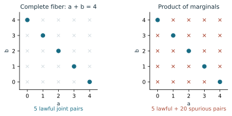
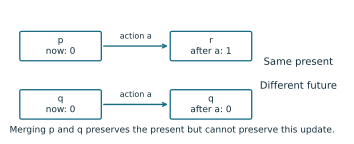
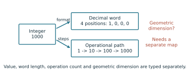
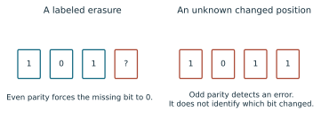
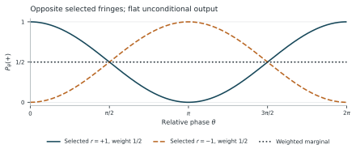
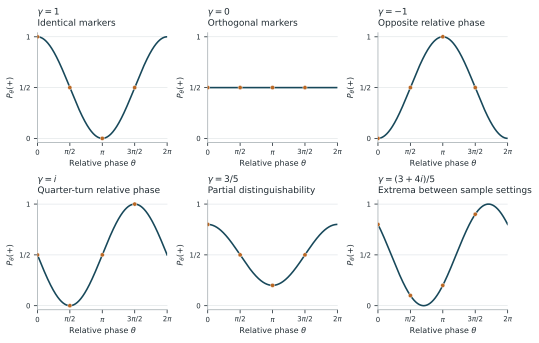

# The RPRM Manifesto

*A relational framework for mathematical unification*

**RPRM means Relational Pressure Retention Model.** The name comes from the
motivating physics idea: observable behavior may arise from an underlying
relational organization, with pressure and retention playing roles in how
its states change and persist. We retain that name for the framework as a
whole. Each physical model must give those terms precise variables, units
and laws; the name itself does not establish them. Part I, section 7,
introduces the relational-layer proposal, developed further in the gravity
and black-hole chapters.

**Version 1 — review edition.**

This edition includes the revised relational-layer account, two developed molecular research proposals, and the author's afterword. Mathematical results and proposed scientific extensions retain their stated evidence and scope.

RPRM organizes mathematical objects, representations and operations around the questions they must preserve. This book develops that proposal through explicit definitions, proofs, complete examples and failed inferences. Its unifying claim concerns a common relational presentation of specified mathematical structures. Physical and biological applications retain their stated models and open experimental obligations.

The physical proposal behind this work is that observable objects, forces and geometry may be manifestations of an underlying relational organization. The mathematical core gives a language for specifying that organization and proving what its observable descriptions retain. Establishing which such organization describes nature requires a physical model and evidence. The distinction between those two tasks is part of the proposal itself.

Part I states the framework and its central laws. Part II develops the mathematical core. Part III applies it to arithmetic and declared mathematical or scientific models. Part IV develops research bridges and proposed tests. The appendices supply a special-term reference, the complete Fermat certificate and a guide to evidence and reproduction. The [companion repository](https://github.com/wjfoster55/RPRM-open) contains the executable examples, Mechanical Motion Atlas, agent handbook, layperson guide and experimental packs.

## Contents

- [Part I. The object, the question, and what must survive](#part-i-the-object-the-question-and-what-must-survive)
- [Part II. The mathematical core](#part-ii-the-mathematical-core)
- [II.1. Relations, occurrence, and exact completion](#ii1-relations-occurrence-and-exact-completion)
- [II.2. What a representation preserves](#ii2-what-a-representation-preserves)
- [II.3. A common relational language that preserves its sources](#ii3-a-common-relational-language-that-preserves-its-sources)
- [II.4. Future equivalence, distinction, and stable repair](#ii4-future-equivalence-distinction-and-stable-repair)
- [II.5. Four-lane abduction and proof-donut certificates](#ii5-four-lane-abduction-and-proof-donut-certificates)
- [II.6. Operational coordinates and conceptual models](#ii6-operational-coordinates-and-conceptual-models)
- [Part III. Arithmetic and applications](#part-iii-arithmetic-and-applications)
- [III.1. Certified arithmetic frontiers](#iii1-certified-arithmetic-frontiers)
- [III.2. A bounded-side Fermat theorem](#iii2-a-bounded-side-fermat-theorem)
- [III.3. Ideal mechanisms: law, state, and display](#iii3-ideal-mechanisms-law-state-and-display)
- [III.4. Exact ray relations and selective recomputation](#iii4-exact-ray-relations-and-selective-recomputation)
- [III.5. Symbolic music and retained order](#iii5-symbolic-music-and-retained-order)
- [III.6. Finite learning and constrained shape search](#iii6-finite-learning-and-constrained-shape-search)
- [III.7. Rules, boundaries, and retained patterns](#iii7-rules-boundaries-and-retained-patterns)
- [III.8. Return depth, exterior observations, and black holes](#iii8-return-depth-exterior-observations-and-black-holes)
- [III.9. Two-path interference and retained coherence](#iii9-two-path-interference-and-retained-coherence)
- [III.10. Gravity, magnetic motion and cosmic expansion](#iii10-gravity-magnetic-motion-and-cosmic-expansion)
- [Part IV. Research bridges and proposed tests](#part-iv-research-bridges-and-proposed-tests)
- [IV.1. Molecular questions and testable research bridges](#iv1-molecular-questions-and-testable-research-bridges)
- [IV.2. Further questions with explicit completion conditions](#iv2-further-questions-with-explicit-completion-conditions)
- [Reference guide. Special terms and where to find them](#reference-guide-special-terms-and-where-to-find-them)
- [Certificate Appendix III.2. The auxiliary-prime premises](#certificate-appendix-iii2-the-auxiliary-prime-premises)
- [Evidence Appendix. Proof, implementation and reproduction](#evidence-appendix-proof-implementation-and-reproduction)
- [Author afterword and acknowledgments](#author-afterword-and-acknowledgments)
- [Bibliography](#bibliography)

## Part I. The object, the question, and what must survive

Mathematics often advances by changing how a problem is represented. An equation becomes a geometric locus; a linear system becomes a map and its kernel; a process becomes a state machine. Each change exposes some questions more clearly. To use it, we must know what the new description retains and how its answers return to the original problem.

RPRM proposes a common framework for making these changes of representation explicit. Begin with a supplied mathematical structure, specify the relation under discussion, identify the known and missing roles, and name the observations and operations that must survive. Then solve the missing relation, prove a representation sufficient, or identify the exact distinction that has been lost. Its unifying aim is to make these connections systematic and composable while preserving the source mathematics.

The framework uses ordinary sets, functions, relations, equality, and logic. Its mathematical content consists of definitions, preservation theorems, constructions, and their applications. Established mathematics supplies many of those results; RPRM's proposed contribution is their connected organization around questions, retained information, and continuation. We first prove the central laws, use a conceptual bridge to explain their reach, and return to the mathematical construction that supports the unifying proposal.

### 1. One relation, several questions

A **carrier** specifies the objects admitted in a problem. A **port** is a named, typed role in a relation. The relation retains the compatible joint assignments; an **aperture** selects the supplied roles and the requested completion or readout.

For example, take the integer carrier $D=\{0,1,2,3,4\}$ at each of three ports and the relation

$$
R=\{(a,b,c)\in D^3:a+b=c\},
$$

using ordinary addition. Supplying $a=1,b=2$ determines $c=3$. Supplying $a=1,c=3$ determines $b=2$. Supplying only $c=3$ asks for the joint fiber

$$
\{(0,3),(1,2),(2,1),(3,0)\}.
$$

Supplying $a=4,c=0$ leaves no completion in this carrier. Admitting negative integers changes that last question's domain and answer.

Generally, for a relation $R\subseteq\prod_{i\in I}X_i$, supplied ports $K\subseteq I$, assignment $\eta$ on $K$, and missing block $A=I\setminus K$, the complete fiber is

$$
F(R,K,\eta)=\{r|_A:r\in R,\ r|_K=\eta\}.
$$

Its disposition is **NONE**, **ONE**, or **MANY**, according to its cardinality. These labels require a complete answer, obtained by a proof or exhaustive admitted computation. An unfinished search is **OPEN**. When every port is supplied, a lawful row has the single empty completion $\{()\}$; an unlawful row has none.

The joint assignment matters. The two pairs $(0,0),(1,1)$ have identical marginal carriers $\{0,1\}$, but multiplying those marginals adds the false pairs $(0,1),(1,0)$. Likewise, composing relations $R\subseteq X\times Y$ and $S\subseteq Y\times Z$ requires the same middle witness $y$. Retaining $(x,y,z)$ preserves that witness; retaining only $(x,z)$ answers reachability and may forget which path was used.

Several completions may nevertheless settle one question. Every pair in the addition fiber above has sum three. The full source remains ambiguous while its sum is determined. This distinction leads to the first preservation law.

### 2. Exactly enough information

A **representation** is a map $C:X\to Z$. A **receiver** specifies the questions or behaviors to preserve. For one question $Q:X\to B$, sufficiency means that its answer can be recovered from the representation.

**Theorem 1 — Question factorization.** A unique decoder $h:C(X)\to B$ satisfying $Q=h\circ C$ exists exactly when

$$
C(x)=C(y)\Longrightarrow Q(x)=Q(y).
$$

**Proof.** A decoder gives the implication by applying $h$ to equal representations. Conversely, define $h(z)=Q(x)$ for any preimage of a reached value $z$. The implication makes this independent of the chosen preimage. Every decoder must give that value, proving uniqueness. $\square$

*Ancestry and grade:* established quotient factorization through equivalence classes, here applied to the fibers of $C$; see [Q]. The proof establishes this reached-image version.

This elementary factorization result is the core of a **FOLD**: a representation with proved sufficiency for its receiver. A strict FOLD merges distinct sources. An invertible representation, called a **CAR**, retains every distinction on its stated image. An **ADAPTER** is a typed translation with a specified preservation guarantee. These properties can overlap.

For example, parity merges integers but exactly preserves parity questions. It cannot recover an arbitrary original integer. A storage system that promises later recovery must retain the source, a reconstructing generator, or a complete preimage route in addition to its working summary.

If $Q$ fails to descend through $C$, the pair

$$
C'(x)=(C(x),Q(x))
$$

repairs that question. It is the least informative refinement retaining both: whenever another representation decodes $C$ and $Q$, pairing those decoders also recovers $C'$.

There is an exact finite repair bound. For nonempty finite $X$, let $m$ be the largest number of different $Q$-values in any one $C$-fiber. A repair tag needs at least $m$ labels, because differing answers inside one old fiber must receive different tags. It needs no more: number the answer classes separately inside each fiber, reusing labels between old fibers. The old summary and tag then determine the answer. This minimizes the tag alphabet; construction time, storage encoding, and query cost remain separate quantities.

### 3. Keeping the future available

Present agreement can disappear after an operation. Two states may display zero while the same action takes one to a display of one and the other to a display of zero. A useful operational representation must retain the distinction that predicts this continuation.

Let $O:X\to B$ be the observation, and let $T_a:X\rightharpoonup X$ be deterministic partial operations indexed by an action alphabet. An operation is **enabled** at precisely the states in its domain.

**Theorem 2 — Operational factorization.** Exact observations and partial updates descend to the reached summaries of $C$ if and only if every pair with $C(x)=C(y)$ has:

1. equal observations;
2. matching enabledness for every action;
3. equal successor summaries whenever that action is enabled.

**Proof.** Descended observations, domains, and updates must be independent of the representative, which gives necessity. Conversely, choose a representative to define each summary's observation and enabled updates. Conditions 1–3 make every choice independent of that representative. After one enabled step the encoding commutes with the update. Induction on the length of an action word preserves execution success or failure and the final observation for every finite word. $\square$

*Ancestry and grade:* established congruence and Moore-refinement machinery; [M] gives the standard complete-automaton treatment. The proof here states the partial-operation adaptation, including its enabledness and failure conditions.

A failure tag is distinct from every successfully returned value. If the receiver needs the failure position, intermediate states, or costs, those become additional retained observations.

For complete finite state and action tables with decidable comparisons, start by grouping equal observations and repeatedly split groups by enabledness and successor groups. Every strict split increases the number of groups, so the process terminates. At termination Theorem 2 applies. Every other stable grouping preserving the original observations refines each stage, by induction, so the final grouping is the coarsest such grouping. It identifies exactly the states with identical tagged observations after every finite word. Conversely, this future-equivalence relation is stable: the empty word gives equal observations, one-letter words give matching enabledness, and prefixing every suffix by an enabled action gives equivalent successors.

Starting instead from $(C,O)$ preserves an existing summary while finding its least stable refinement. Searching the finite graph of state pairs produces a shortest distinguishing word when one exists. The witness explains the repair: this particular future needs a distinction the old representation discarded.

The operation kind remains part of the contract. Nondeterministic updates require equal sets of successor classes. Finite stochastic updates require equal probability mass into each class. Equal supports can carry different probabilities. Their preservation equations therefore differ even when their tables have the same shape.

### 4. A conceptual bridge: changing the question

The integer 1000 has several exact descriptions. It equals $10^3$; its base-ten numeral has four positions; the path $1\to10\to100\to1000$ has three transitions. Value, written form, and operation history are different receivers. Parsing `0001000` and `1000` produces the same integer while forgetting their different widths. Retaining width repairs that formatting question.

A word constructed as one followed by $N$ zeros also illustrates why the receiver matters computationally. Its constructor determines every digit without expanding the entire word. This gives direct access to those digit questions. Other questions need other arguments: a compact expression $2^p-1$ determines an integer, but prime $p$ does not certify its primality, since $2^{11}-1=23\cdot89$.

The recurring **three-plus-one** arrangement becomes exact when a supplied law connects four roles. For four bits satisfying

$$
b_1\oplus b_2\oplus b_3\oplus b_4=0,
$$

any three determine a labeled erased fourth by cancellation. A single changed bit makes the parity check fail, but its syndrome alone does not locate the changed position. Recovering an erasure, detecting an error, and recovering the external message are different apertures.

The same distinction explains the truth-teller example. If four reports concern one binary proposition and at most one report is wrong, a three-to-one majority gives the truth. The proof uses the error bound: at least three reports are correct. If three reports copy one mistaken source, their agreement supplies no such guarantee. This directs attention to what each observation independently constrains.

A teacher example makes abduction equally concrete. Admit the four functions on $\{0,1\}$: constant zero, constant one, identity, and complement. An answer at zero leaves two hypotheses; the answer at one identifies the function. Two queries suffice, and one binary answer cannot distinguish four functions. Here the law family and truthful-answer contract are supplied. Proposing a different family is an additional act of abduction, followed by a new test.

Paired strands give another precise construction. On a declared alphabet with an involutive complement, coordinatewise complement and reversal commute. Their composite applied twice returns the original string. The law concerns symbols and order. A geometric helix or a molecular application adds a carrier and a map whose observations must also be justified.

These examples suggest productive questions: which roles are missing, what does this view forget, and which additional observation would settle the desired answer? We now express that method mathematically, including inference at a position never directly visited.

### 5. Four observation lanes and the proof donut

First propose and freeze the candidate law or source family, retaining how each shadow view is generated from the same source. Its predicted observations then define the joint fiber to audit; transformed views supply compatible constraints without automatically becoming independent measurements.

Let $H$ be that declared family of candidate sources. Four observation lanes are four maps $O_i:H\to B_i$. Given retained observations $o_i$, the compatible source fiber is

$$
H_o=\{h\in H:O_i(h)=o_i\text{ for every supplied lane }i\}.
$$

Each additional observation intersects this fiber with another constraint. The true source stays in the intersection when it belongs to $H$ and the observations are faithful. Alternating lanes therefore accumulates knowledge when earlier constraints and their common source identity remain retained. If the source changes under a known operation, a later observation must include that operation in its map from the original state.

An unvisited question $Q(h)$ is settled exactly when the complete fiber is nonempty and $Q$ is constant on it. This is Theorem 1 restricted to the observed fiber. The full source may remain ambiguous. If $Q$ varies, the surviving alternatives specify the missing distinction; if the fiber is empty, the supplied model and observations are incompatible.

**Theorem 3 — Four-corner completion.** For real multiaffine functions

$$
f(x,y)=a+bx+cy+dxy
$$

on $[-1,1]^2$, the four corner observations determine the entire function, with

$$
f(x,y)=\sum_{\epsilon,\eta\in\{-1,1\}}
\frac{(1+\epsilon x)(1+\eta y)}4f(\epsilon,\eta).
$$

**Proof.** Substitute $f(\epsilon,\eta)=a+b\epsilon+c\eta+d\epsilon\eta$. The signed sums cancel the unwanted terms and give the coefficients $1,x,y,xy$, respectively. Thus the formula returns $f$ at every point. Conversely, any prescribed four real corner values define a multiaffine function by this formula and recover those values at the corners. The observation map is therefore bijective. $\square$

*Ancestry and grade:* established tensor-product linear interpolation, also called bilinear $Q_1$ Lagrange interpolation. Reference [I] gives the corner basis on $[0,1]^2$; an affine change of coordinates gives the formula above.

In particular, the unvisited center is the average of the corners. The weights are nonnegative and sum to one, so positive corner values imply positivity throughout the square. This is a complete inference from four retained lanes under an explicit law.

Two controls show what does the work. Observing only the opposite corners $(-1,-1)$ and $(1,1)$ leaves $f=1$ and $f=xy$ indistinguishable there, although their centers differ. Enlarging the grammar to coordinatewise quadratic functions admits $1$ and $1-(1-x^2)(1-y^2)$; they agree on the whole boundary and differ at the center. A new grammar changes the complete fiber and the inference it licenses.

The **proof donut** organizes this inference around the requested aperture. Its enclosure comprises the admitted types and givens, coverage of the intended sources, faithful transport maps, jointly compatible witnesses, a continuation argument where needed, and a landing at the original question. Four lanes form one useful arrangement; the sufficient enclosure depends on the relation.

For example, the constraints $x=y$, $y=z$, and $z=1-x$ each admit binary assignments, but their joint fiber is empty. Local witnesses must agree at their shared ports. Moving through overlapping triples retains this same obligation: under $z=2y-x$, the ordered state $(x,y)$ updates to $(y,2y-x)$, with inverse $(y,z)\mapsto(2y-z,y)$. Retaining the ordered overlap makes continuation exact.

A finite enclosure supports all finite stages when a proved rule carries it forward. For an invariant, establish that every admitted seed enters a safe set, each admitted transition preserves it, and the safe set implies the requested conclusion. Induction on run length supplies coverage. For descent, every hypothetical bad case must land at another admitted bad case of strictly smaller rank in a well-founded order. A least-rank bad case would then contradict itself. These are proof principles with explicit premises; finite certificates discharge specified parts of those premises.

The signpost is the preserved relation or proved recurrence. Values may keep changing while the same rule covers every finite continuation. Such coverage need not be a literal return to an earlier state: the arithmetic frontier later in the book expands by a proved recurrence. Each next stage inherits the premises needed for the following one. An unbounded family of finite stages is a mathematical quantifier supported by that rule, with each actual computation retaining its own finite boundary.

### 6. The mathematical unification claim

The preceding constructions can preserve supplied mathematical structures in one relational language.

**Theorem 4 — Faithful relational presentation.** Let $M$ be a many-sorted first-order structure with a finite signature of constants, finitary total functions, predicates, and equality. Encode each sort injectively into a target carrier and retain its image. Replace every constant and function by its exact graph and every predicate by its exact image relation. Then a translation with image-guarded quantifiers preserves and reflects every first-order formula at corresponding assignments.

**Proof.** Write $e_s$ for the encoding of sort $s$ and $E_s$ for its image. Translate a term into a formula specifying its encoded value. A variable uses equality with the corresponding encoded assignment; a constant uses its singleton graph. For $f(t_1,\ldots,t_k)$, existentially introduce image-guarded values of the subterms and apply the exact graph of $f$. Induction on terms proves that its output is precisely $e_s(t^M)$, uniquely.

Translate an equation using equality of those term values; injectivity preserves and reflects source equality. Translate a predicate by applying its exact image relation to the term values. The term lemma proves both atomic cases. Translate Boolean connectives recursively. Translate quantifiers by

$$
\exists x:s\,\varphi\ \mapsto\ \exists x:s\,(E_s(x)\land\varphi^{\rm rel}),
$$

$$
\forall x:s\,\varphi\ \mapsto\ \forall x:s\,(E_s(x)\Rightarrow\varphi^{\rm rel}).
$$

Image elements are in bijection with source elements, so the induction hypothesis gives both quantifier cases, including empty sorts whenever the supplied interpretations exist. Structural induction on formulas completes the proof. $\square$

*Ancestry and grade:* established graph elimination, isomorphism invariance, and quantifier relativization [L, S], combined in this exact-image presentation. Reference [S] uses nonempty sorts; the proof above supplies the explicitly admitted empty-sort cases.

The same exact-image construction transports complete aperture fibers bijectively: encoding carries each source completion to a target completion, and every target completion has a unique source preimage. Operations travel through commuting maps, with matching domains for partial operations. Suppose two systems map to a common operational interface: their observations factor through its readout, corresponding actions have matching enabledness, and their updates commute with those maps. From initial states with the same interface image, Theorem 2's induction gives equal retained observations and matching execution outcomes after every corresponding finite word.

This is a precise unification result for the supplied structural and logical scope. Its carriers can be infinite; the terminating table algorithms earlier require finite effective carriers. The presentation preserves and reflects source formula truth. Source proof obligations remain available for the later arguments; translating formal derivations would additionally require a specified proof system and translated assumptions. Broader source classes and stronger receivers enter through further specified bridges.

### 7. The relational layer: proposal and limits of observation

RPRM proposes that physical descriptions may arise from underlying relations and their lawful continuations. On this reading, an observed object is an identifiable pattern of relations at a given observational scale; a force or geometry describes how those patterns can change together. **Relational layer** names this proposed explanatory structure. It does not specify a location beneath space, an additional spatial dimension, a material substance or a particular network unless a model supplies those choices.

The core results make one part of this idea precise. A representation can be complete for its observations and operations while leaving its source incompletely determined. When Theorem 2 applies, equal summaries give the same retained responses after every finite sequence of admitted actions. Distinct source states may therefore remain indistinguishable throughout that entire observational contract. Closure of the description means that its retained behavior can be continued without reopening the source; it does not mean that the source has vanished or that every question about it has been answered.

This is the exact sense in which a relational source can be accessible through its consequences while not being uniquely recoverable from them. Given a family of candidate sources and a record of observations, abduction proposes and compares the compatible explanations. A property shared by every member of the complete nonempty fiber is then conditionally determined, even when the source itself remains MANY. A preferred explanation, a uniquely forced property and a uniquely identified source are different outcomes.

The limit is relative to the admitted observations and interventions. Adding an observation can split an old fiber; adding an action can expose a distinction through its future effects. A claim that no possible physical experiment could ever distinguish two sources would need a justified account of all such experiments. The closure theorems do not supply that account or prove the existence of an additional physical layer. If several candidate mechanisms agree on every admitted prediction, those predictions alone do not select one mechanism as the real source.

A small positive example shows what inference can retain. Admit real coordinates $x,y,z$ and the difference observations $y-x=2$ and $z-y=3$. Their complete joint fiber is

$$
\{(a,a+2,a+5):a\in\mathbb R\}.
$$

The unmeasured difference $z-x=5$ is forced for every member. The closed difference cycle $(y-x)+(z-y)+(x-z)=0$ checks compatibility, while no absolute coordinate is determined: adding one common offset changes none of the observations. Thus a relation can be known exactly without choosing a unique underlying assignment. The specified difference law earns this inference. Applying the example to physical measurements would still require a model of those measurements and their uncertainty.

The physics chapters use this proposal as a research direction. Gravity asks which relations suffice to describe coupled motion and whether a separately specified relational evolution can derive that motion. Black holes ask how internal continuation, accessible observations and causal escape can differ. In both cases, the task is to specify the underlying candidate, derive its observable behavior and identify what could distinguish it from competing descriptions. A successful reformulation may already organize knowledge usefully; a new physical explanation must earn its additional claim.

### 8. From the core to the complete argument

Part II develops the central laws through complete fibers, faithful translations, future quotients, stable repair and proof-donut certificates. Part III begins with certified prime frontiers and two arithmetic results: an exact decision for each supplied exponent-and-gap aperture, and the bounded-side theorem

$$
\min(a,b)\le4000,\quad n>2
\quad\Longrightarrow\quad a^n+b^n\ne c^n.
$$

for positive integers $a,b,c$ and integer $n$. Only the smaller input base is initially bounded. Its proof and complete auxiliary-prime certificate supply the remaining coverage. Fermat's Last Theorem is established mathematics; the independent unrestricted RPRM derivation remains OPEN.

Applications then examine ideal mechanisms, exact rays, symbolic music, finite learning and shape models, rule patterns, and supplied physical models. Each carries its source assumptions into its preservation result. Part IV develops finite minimax and stochastic-aggregation tests and uses them to formulate molecular research proposals. Those proposals and the open physical bridges have stated completion conditions; their mathematical examples do not establish an empirical benefit.

The book retains the proofs needed for its main claims in its reading sequence. Code and formal artifacts support reproduction; references and attributions appear at the end. Written proof, selected formal proof, finite test, conjecture, and interpretation keep their respective roles throughout. The proposed unification grows through these explicit connections: a source structure, a question, a preservation law, and a result that returns to the question that motivated it.

## Part II. The mathematical core

### II.1. Relations, occurrence, and exact completion

Changing the unknown in an equation changes the question before it changes the mathematics. Addition can be evaluated, reversed, or used to constrain two unknown summands. A systematic account must therefore begin with the full relation and retain the roles of its entries. This chapter develops that account through finite tables, affine coordinates, modular arithmetic, and linear systems.

The results are established elementary relation algebra, affine algebra, congruence arithmetic, and linear algebra. The organization by supplied roles and complete fibers gives these familiar constructions a common interface.

#### Values have roles; occurrences have identity

A sort supplies a carrier and an equality. A typed value belongs to that carrier. Additional structure—addition, order, distance, units—is supplied when used. Two sorts may display the same numerals without sharing their interpretation: a count of three and a duration of three are different typed inputs.

An occurrence also has an identity in a declared occurrence set. Two boundary sites may each hold the value five while remaining different possible attachment sites. A value assignment maps occurrences to values; it does not generally have an inverse. If the requested answer names the site used, the occurrence identity must remain available. If it asks only for that site's value, some identities may be merged.

A port is a named, typed role in a relation. The ports of $a+b=c$ distinguish the two summands and the total even when their values coincide. Assigning the same occurrence to several roles is a further incidence condition. In particular, two equal-valued unknowns are not a shared variable unless the relation or incidence record makes them one.

Let $I$ be a finite set of port names and let $X_i$ be the admitted carrier at port $i$. A relation is a set of compatible assignments,

$$
R\subseteq\prod_{i\in I}X_i.
$$

The carriers include the problem's admission restrictions. No direction is inherent in this subset. A choice of supplied ports $K\subseteq I$, together with their assignment $\eta$, leaves the missing block $A=I\setminus K$. These data specify a relation aperture.

#### The complete answer is joint

The completion fiber is

$$
F(R,K,\eta)
=\{u\in\prod_{i\in A}X_i:\eta\mathbin{\oplus}u\in R\},
$$

where $\eta\mathbin{\oplus}u$ combines assignments on the disjoint supplied and missing blocks. A well-typed query may have no compatible completion. Its disposition is **NONE** when this set is empty, **ONE** when it has one member, and **MANY** when it has more than one. An unfinished computation is **OPEN** until completeness is established.

Take $D=\{0,1,2,3,4\}$ at all three ports of $a+b=c$, with ordinary addition. The complete table for the $c$-aperture is:

| $a\backslash b$ | 0 | 1 | 2 | 3 | 4   |
|---|---:|---:|---:|---:|---:|
| 0 | 0 | 1 | 2 | 3 | 4 |
| 1 | 1 | 2 | 3 | 4 | — |
| 2 | 2 | 3 | 4 | — | — |
| 3 | 3 | 4 | — | — | — |
| 4 | 4 | — | — | — | — |

A numeral denotes its singleton output; a dash denotes NONE because the ordinary sum is outside $D$. Supplying only $c=3$ instead gives

$$
\{(0,3),(1,2),(2,1),(3,0)\}.
$$

This is one joint set of four pairs. Its two marginal sets are both $\{0,1,2,3\}$; taking their product would introduce twelve false completions. Separate lists may be useful observations of a fiber, but they preserve that fiber only when the appropriate product factorization is proved.



**Figure II.1.1.** Here the supplied sum changes from $c=3$ to $c=4$, on the same carrier $D=\{0,1,2,3,4\}$. Both panels show all 25 pairs in $D^2$. The five marked pairs $(0,4),(1,3),(2,2),(3,1),(4,0)$ form the complete joint fiber. Its two marginals are both $D$; their product includes twenty additional, spurious completions.

**Theorem II.1.1 — Complete finite solving.** Suppose every port has a complete effective finite enumeration, value equality is decidable, and membership in $R$ is decidable. Enumerating the assignments, retaining precisely those satisfying the relation and supplied values, and projecting to $A$ returns the complete fiber and terminates.

**Proof.** Every retained assignment satisfies the defining conditions, so its missing coordinates belong to the fiber. Conversely, each fiber member extends $\eta$ to an assignment in the enumerated product and passes those conditions. Removing duplicate projected tuples preserves the set. The product is finite and every check terminates. $\square$

The empty missing block also has a precise answer. A product over no ports is the singleton $\{()\}$. If every port is supplied, a lawful row therefore returns ONE$(())$, while an unlawful row returns NONE. If an output value is itself the empty set, a function's graph can instead give the singleton fiber $\{\varnothing\}$, or ONE$(\varnothing)$. Neither singleton is an empty fiber.

A further readout $Q$ on the completion carrier returns the answer set $Q[F]$. Several completions can produce one answer: all four addition pairs above have sum three. A settled source question requires both a nonempty fiber and constancy of the readout on it. An empty fiber supplies no actual source from which to receive an answer.

#### The affine chart, including its collapsed cases

Explicitly work over real-valued ports, with a declared admitted subset at each port, and retain

$$
x=(1-u)L+uR.
$$

The endpoint roles $L,R$, position parameter $u$, and resulting value $x$ form one four-port relation. Restricting $u$ to $[0,1]$ gives interpolation; admitting other real parameters permits extrapolation.

**Theorem II.1.2 — Affine completion and clamp transport.** The single-port fibers are given by the following table, with every candidate intersected with the missing port's admitted set.

| Missing port | Nonzero-coefficient case | Zero-coefficient case |
|---|---|---|
| $x$ | $(1-u)L+uR$ | No denominator occurs.     |
| $u$ | $(x-L)/(R-L)$ if $R\ne L$ | If $R=L$, the whole admitted $u$-carrier when $x=L$, and NONE otherwise.             |
| $L$ | $(x-uR)/(1-u)$ if $u\ne1$ | If $u=1$, the whole admitted $L$-carrier when $x=R$, and NONE otherwise.             |
| $R$ | $(x-(1-u)L)/u$ if $u\ne0$ | If $u=0$, the whole admitted $R$-carrier when $x=L$, and NONE otherwise.             |

**Proof.** Isolating the missing variable gives each generic expression. When its coefficient vanishes, the equation is independent of that variable and becomes either a true equality or a contradiction. Its fiber is respectively the whole admitted carrier or the empty set. The whole carrier may itself be empty, singleton, or larger. $\square$

Thus $L=0,R=2,x=3$ has algebraic parameter $3/2$ and no interpolation completion. With $L=R=x=2$, every admitted parameter works. Neither case supports a rule that any three supplied values always determine a unique fourth.

Now retain one common parameter carrier $U$ and two noncollapsed oriented endpoint pairs. Define

$$
q(u)=L+u(R-L),\qquad q'(u)=L'+u(R'-L').
$$

Each map is injective, because its nonzero slope permits cancellation. Consequently the affine transport, called clamp transport here,

$$
C:q(U)\longrightarrow q'(U),\qquad
C(x)=L'+\frac{x-L}{R-L}(R'-L')
$$

has inverse

$$
C^{-1}(x')=L+\frac{x'-L'}{R'-L'}(R-L).
$$

Substitution proves both inverse identities and shows that the retained parameter is unchanged. This is a CAR between the two attained images. With collapsed endpoints, the equation at $x=L=R$ leaves the whole admitted parameter set as its fiber. Parameter distinctions are lost exactly when that set has more than one member; an empty or singleton parameter set remains injectively represented on its attained image. Changing $U$ changes the declared source and may change its attained image. These cases require their own fiber or restriction rather than division by a vanished coefficient.

#### Modular division is a completion problem

Supply an integer modulus $m\ge2$, with carrier $\mathbb Z/m\mathbb Z$, and ask for $x$ in

$$
ax=b\pmod m.
$$

This is the inverse aperture of multiplication by a supplied residue $a$. It need not define a function of $b$.

**Theorem II.1.3 — Complete congruence fiber.** Let $d=\gcd(a,m)$, using any integer representative of $a$. If $d\nmid b$, the fiber is NONE. If $d\mid b$, it has exactly $d$ residue classes,

$$
x=x_0+k\frac m d\pmod m,\qquad k=0,\ldots,d-1,
$$

where $x_0$ is any one solution. In particular multiplication by $a$ is invertible exactly when $d=1$.

**Proof.** The equality $ax-b=jm$ makes $d\mid b$ necessary. When it holds, put $a=da'$, $m=dm'$, $b=db'$. Coprimality gives integers $s,t$ with $sa'+tm'=1$; hence $x_0=sb'$ solves the congruence. This integer identity follows from the Euclidean algorithm, whose repeated divisions preserve the integer combinations of the two inputs and end at their greatest common divisor.

Every other solution satisfies $m'\mid a'(x-x_0)$. Multiplying the coprimality identity by $x-x_0$ shows $m'\mid x-x_0$. Conversely, every such difference gives a solution. Two listed values coincide modulo $m=dm'$ exactly when their indices coincide modulo $d$, giving precisely $d$ classes. $\square$

Modulo six, $5x=1$ has ONE$(5)$, $2x=0$ has MANY$(\{0,3\})$, and $2x=1$ has NONE. The zero multiplier is included: $d=m$, so $0x=0$ admits every residue and $0x=b\ne0$ admits none. Modular division has not failed to behave like real division; its complete fibers describe a different supplied algebra.

#### A complete fiber without an exhaustive list

For a symbolic example explicitly admit finite-dimensional vector spaces $V=\mathbb F^p$ and $W=\mathbb F^q$ over a supplied field, and a linear map $L:V\to W$. The carriers may be infinite. The relation is $R_L=\{(x,b):Lx=b\}$, with $b$ supplied.

**Theorem II.1.4 — Linear solution fiber.** If $b\notin L(V)$, the fiber is NONE. If $Lx_0=b$, its complete fiber is

$$
x_0+\ker L=\{x_0+v:Lv=0\}.
$$

**Proof.** Linearity gives $L(x_0+v)=b$ whenever $Lv=0$. Conversely, a solution $x$ satisfies $L(x-x_0)=b-b=0$, so it occurs in the displayed family. Translation by $x_0$ is a bijection from $\ker L$ to the fiber, with inverse subtraction of $x_0$. $\square$

Over the rationals, $L(x,y)=x+y$ and $b=3$ give the entire family $\{(t,3-t):t\in\mathbb Q\}$. Restricting the two coordinates to $D$ recovers the four-pair addition fiber. More generally, an extra admitted subset $S\subseteq V$ yields $(x_0+\ker L)\cap S$, which need not remain an affine subspace and may be empty.

The finite enumeration and symbolic description establish completeness in different ways. Both retain all compatible joint assignments. The next question is how much of that answer a particular representation needs to preserve.

### II.2. What a representation preserves

A complete answer can contain more information than its next use requires. A relation may retain every source tuple while a question asks only whether a completion exists, which endpoint is reached, or what value appears at one port. Representation becomes a mathematical choice once these questions are explicit.

This chapter develops the established factorization of functions through their fibers and its finite repair consequence. The information preorder and retained-witness constructions organize those results for the present framework.

#### Information is ordered by what can be recovered

Let $X$ be the admitted source carrier and $C:X\to Z$ a representation. We compare representations on their attained images. At a reached value $z$, the inverse request is the full fiber $C^{-1}(z)$. At an unreached value it is NONE, whatever the ambient notation suggests.

For representations $C$ and $D$ of the same source, write $C\preceq D$ when a map $h:D(X)\to C(X)$ satisfies $C=h\circ D$. Thus $D$ contains at least enough information to recover $C$. No metric, probability law, or code length is needed for this definition.

Define the equality kernel

$$
\ker C=\{(x,y)\in X^2:C(x)=C(y)\}.
$$

Its pairs are precisely the source distinctions erased by $C$.

**Theorem II.2.1 — Factorization and information order.** For a question $Q:X\to B$, a decoder $g:C(X)\to B$ satisfying $Q=g\circ C$ exists exactly when

$$
\ker C\subseteq\ker Q.
$$

It is unique on $C(X)$. Consequently $C\preceq D$ exactly when $\ker D\subseteq\ker C$. The relation $\preceq$ is a preorder; two representations are mutually recoverable exactly when their equality kernels agree, in which case their attained images are canonically bijective.

**Proof.** A decoder sends equal representations to equal answers, proving necessity. For sufficiency define $g(Cx)=Qx$. The kernel condition makes the value independent of the preimage, and every attained value has a preimage. The equation also determines every value of $g$, proving uniqueness.

Apply this result with $D$ as the representation and $C$ as the question to obtain the kernel criterion for the preorder. Identity gives reflexivity and composition of decoders gives transitivity. Mutual recoverability is therefore equivalent to equal kernels. The map $Cx\mapsto Dx$ is then well-defined, and $Dx\mapsto Cx$ is its inverse on the two images. $\square$

For example, on $X=\{0,1,\ldots,11\}$, the residue modulo two is recoverable from the residue modulo six. The reverse fails: zero and two agree modulo two and differ modulo six. Residues modulo two and modulo three are incomparable, since each separates a pair merged by the other. Their joint receiver determines the residue modulo six. This last claim follows directly from divisibility: equal residues modulo both two and three mean their difference is divisible by six; the converse is immediate.

These comparisons concern retained distinctions. Computing a fine representation may be cheaper or more expensive than computing a coarse one. Information order alone settles neither cost.

#### CAR, FOLD, and ADAPTER certify different properties

A **CAR** is a bijection between its declared source and target image, with a two-sided inverse there. Equivalently, a representation is a CAR onto its attained image when its equality kernel contains only identical source pairs. Every question then decodes through the inverse. Conversely, if the identity question $Q(x)=x$ decodes, equal representations must come from equal sources, so the representation is a CAR onto its image.

A **FOLD** certifies sufficiency for a named receiver. For one question it is exactly Theorem II.2.1. A **strict FOLD** additionally merges distinct sources. Thus a CAR is also a FOLD for every question on its source; sufficiency does not require loss. For a family $(Q_p)$, sufficiency means

$$
\ker C\subseteq\bigcap_p\ker Q_p.
$$

This follows by applying factorization to each question. Adding questions can only restrict the representations that qualify.

An **ADAPTER** is a typed translation with a stated preservation guarantee. A map may be an adapter by satisfying a question-factorization equation, a CAR by possessing an inverse, and a FOLD for the selected receiver at the same time. For a relation-valued translation, the guarantee must say whether it preserves existence, complete witnesses, or a specified readout. The terms overlap because they certify different properties.

A source-recovering encoding also needs its image stated. If $E:X\to Z$ and $P:Z\to X$ satisfy $P\circ E=\mathrm{id}_X$, then $E$ is injective: equal encoded values give equal sources after applying $P$. On $E(X)$, the maps are inverse. The identity $E\circ P=\mathrm{id}_Z$ need not hold outside that image. For $X=\{0,1\}$, $Z=\{0,1,2\}$, inclusion $E$, and $P(0)=0,P(1)=1,P(2)=0$, the extra target state two is sent to zero rather than recovered.

Algebraic sufficiency does not assert that a cold store exists. A system promising later recovery must additionally provide the retained source or reconstructing data, their binding to the summary, and an available retrieval route. Those data remain part of the combined representation. A short working summary has not erased distinctions still retained elsewhere.

#### Repair the question that actually failed

Suppose $Q$ does not factor through $C$. Some $x,y$ share $C$ and disagree on $Q$, providing an exact witness of insufficiency. The pair

$$
C'(x)=(C(x),Q(x))
$$

retains the needed distinction.

**Theorem II.2.2 — Least question refinement.** The representation $C'$ is the least element of the information preorder among representations from which both $C$ and $Q$ can be decoded.

**Proof.** Coordinate projections decode $C$ and $Q$ from $C'$. If $C=h\circ D$ and $Q=k\circ D$, the paired decoder $d\mapsto(h(d),k(d))$ recovers $C'$ from $D$. Thus $C'\preceq D$ for every other sufficient refinement. $\square$

The theorem specifies what must be added, not how to obtain it. If the new answer could already be computed from the old summary alone, $Q$ would have factored through $C$. A genuine repair therefore needs another source of information: access to the original state, a valid reopen route, or a further observation.

For finite sources, the size of an auxiliary tag has a sharp bound. Let $\tau:X\to\Lambda$ be a tag whose pair with $C$ makes $Q$ decodable. For each reached summary put

$$
F_z=C^{-1}(z),\qquad c_z=|Q[F_z]|.
$$

**Theorem II.2.3 — Minimum finite repair alphabet.** If $X$ is finite and nonempty, the minimum possible cardinality of $\Lambda$ is

$$
\max_{z\in C(X)}c_z.
$$

If $X$ is empty, the minimum is zero.

**Proof.** Distinct $Q$-values inside one old fiber require distinct tags: otherwise both entries of $(C,\tau)$ agree while the answer differs. This gives the lower bound in each fiber. For the upper bound, number its $Q$-classes separately using labels from one alphabet of the maximum size. Reuse labels between old fibers, which $C$ already distinguishes. The pair then determines exactly one answer. For empty $X$, the unique empty map to the empty tag carrier suffices, and no negative cardinality is possible. $\square$

For full source recovery, take $Q=\mathrm{id}_X$; the bound becomes the largest old source fiber. With nonempty $X$ and a one-label tag, the tag is constant and adds no distinction. For an empty source the zero-label construction describes absence of admitted instances, not a decoded value of an unseen source.

Least information and smallest tag alphabet are compatible but different claims. The first compares all recoverable distinctions; the second counts labels that can be reused conditionally on the old summary. Neither minimizes storage layout or processing time.

#### Endpoint, intermediate witness, and trace

A small branching process makes the distinctions concrete. Let its state carrier be $X=\{s,u,v,t\}$. The partial updates $T_\alpha,T_\beta$ both send $s$ to $u$; $T_\delta,T_\epsilon$ both send $s$ to $v$. Each is undefined elsewhere. A final update $T_\gamma$ sends either $u$ or $v$ to $t$ and is undefined at $s,t$.

Admit exactly the four execution-order words $\alpha\gamma,\beta\gamma,\delta\gamma,\epsilon\gamma$, starting at $s$. Their complete history carrier $\mathcal H$ is:

| History | First update | Middle state | Final update | Endpoint |
|---|---|---|---|---|
| $h_1$ | $\alpha$ | $u$ | $\gamma$ | $t$           |
| $h_2$ | $\beta$ | $u$ | $\gamma$ | $t$           |
| $h_3$ | $\delta$ | $v$ | $\gamma$ | $t$           |
| $h_4$ | $\epsilon$ | $v$ | $\gamma$ | $t$           |

Every row is admitted by the supplied partial maps, and the four-word language supplies no others. Apply the preceding representation theorems with $\mathcal H$ as their source. The endpoint map $C_E(h)=(s,t)$ has one image and one four-member source fiber. The witness map $C_W(h)=(s,\text{middle}(h),t)$ has two images, each with a two-member fiber. The full trace, retaining states and action names, has four singleton fibers. Hence

$$
C_E\preceq C_W\preceq\mathrm{id}_{\mathcal H},
$$

and both refinements are strict. Projecting from the witness record to the endpoint loses the middle state; projecting from the full history to the witness record loses which first action occurred. Recording only the sequence of state observations $O(x)=x$ still leaves $h_1,h_2$ indistinguishable, so even full state observations need not recover the action trace.

The minimum-repair theorem gives exact costs in labels. Recovering the middle from the endpoint needs two labels. Recovering the whole trace from the endpoint needs four. Recovering the trace from its witness triple needs two, reused between the $u$- and $v$-fibers. None of these counts chooses one history or assigns it a probability.

For general relations $R_1\subseteq X\times Y$ and $R_2\subseteq Y\times Z$, the retained witness object is

$$
W=\{(x,y,z):(x,y)\in R_1,\ (y,z)\in R_2\}.
$$

Projecting to $(x,z)$ gives relational composition; its inverse fiber contains the compatible middle witnesses. If distinct action names or derivation tickets matter, they must be included in $W$ before projection. A set of endpoint pairs cannot preserve their multiplicity implicitly.

**Proposition II.2.4 — Rebracketing retained seams.** Suppose a finite family of relation records has fixed port identities and fixed compatibility predicates on its joint tuple. If attachment retains all source rows and seam witnesses and imposes the same complete list of predicates, its different bracketings have canonically bijective output carriers.

**Proof.** Flatten either nested result into its list of source rows and seam witnesses. Both flattenings reach exactly the tuples satisfying the same conjunction of predicates. Rebuilding the nesting gives their inverse maps. $\square$

This is conjunction and tuple rebracketing applied to retained attachments. A step that chooses a seam, deletes a witness, or changes the later compatibility law has changed the construction; it needs a separate composition argument.

The examples establish sufficiency for their stated questions. To execute repeatedly from a summary, we must also preserve enabledness and the next summary under every admitted update. That additional requirement motivates operational factorization and stable repair in Chapter II.4.

### II.3. A common relational language that preserves its sources

The previous chapters let us ask which answers a representation determines and which distinctions it must retain. We now establish how existing mathematical structures enter that language. The construction preserves their values, equations and declared predicates. It also preserves a completion problem when any chosen block of ports is left open.

Consider ordinary integer addition. Replace each integer $n$ by a tagged value $[n]$, and replace the addition function by the relation

$$
G_+=\{([a],[b],[c]):a,b,c\in\mathbb Z,\ a+b=c\}.
$$

The familiar calculation $7+5=12$ becomes a row of this relation. Supplying $[7]$ and $[12]$ at the first and third ports leaves exactly $[5]$ at the second. The graph has changed the presentation while retaining the equation and its inverse questions.

There is one important detail. Suppose the new carrier also contains a symbol $\star$ that encodes no integer. Integer quantifiers must range over the tagged integers, not over this extra element. Write $E$ for that image predicate and $G_0=\{[0]\}$. The integer assertion that every integer has an additive inverse has the relational form

$$
\forall x\bigl(E(x)\Rightarrow
 \exists y\,[E(y)\land
 \exists z\,(E(z)\land G_0(z)\land G_+(x,y,z))]\bigr).
$$

An unguarded universal quantifier would also ask for an inverse of $\star$, for which the graph supplies none. This small example identifies the conditions needed for a general preservation theorem: exact graphs, identifiable source images and explicit quantifier ranges.

#### Structures and their encoded images

Fix a finite, many-sorted first-order signature. It specifies sorts, constants, function symbols of finite arity, predicates of finite arity and equality within each sort. A supplied structure $M$ interprets a sort $s$ as a set $M_s$, each constant as an element of its sort, and each function as a total map with its declared input and output sorts. Predicates are relations on their declared products.

A variable has a declared sort. A **term** is a variable, a constant, or a function applied to correctly sorted terms. An **assignment** gives each free variable an element of its source sort. Evaluate a term recursively: read an assigned variable, use the interpreted constant, or apply the interpreted function to the values of its subterms. The notation $t^M(a)$ denotes this value.

A **formula** is built from equalities between terms of one sort and declared predicates on terms, using Boolean connectives and quantifiers over specified sorts. **Satisfaction**, written $M\models\varphi[a]$, means that this formula is true under the assignment: atomic formulas use the interpreted equality or predicate; negation and conjunction use their ordinary truth conditions; an existential quantifier needs some element of its sort making its subformula true; a universal quantifier requires every element to do so. Other Boolean connectives can be defined from negation and conjunction. Quantifying a variable temporarily extends or replaces its assigned value in the subformula. These rules fix the source semantics that the translation must preserve.

The finiteness here concerns the declared signature and the arity of each symbol. The sets $M_s$ may be infinite. Empty sorts are also allowed in this chapter whenever all the supplied interpretations exist. For example, a constant cannot inhabit an empty sort. A product with no factors is the singleton $\{()\}$; this convention handles nullary functions and predicates.

For every sort choose an injection

$$
e_s:M_s\longrightarrow Y_s,
\qquad E_s=e_s(M_s).
$$

Tagged copies always give such a choice. An arbitrary injection has a unique inverse on its image, although that mathematical inverse need not come with an effective decoding algorithm. The target carrier $Y_s$ may contain extra elements outside $E_s$.

Build a relational structure $M^{\mathrm{rel}}$ on these carriers. Include the image predicates $E_s$. For a constant $c:s$, include the singleton graph $G_c=\{e_s(c^M)\}$. For a function $f:s_1\times\cdots\times s_k\to t$, include exactly the graph

$$
G_f=\{(e_{s_1}x_1,\ldots,e_{s_k}x_k,
 e_t(f^M(x_1,\ldots,x_k))):x_i\in M_{s_i}\}.
$$

For each predicate include exactly its componentwise image. In particular, a graph is not permitted to contain additional output values for an encoded input. These exactness conditions will do the work in the proof.

#### Translating terms and statements

For a term $t:s$, let $V_t(\bar x;y)$ be a target formula meaning that $y$ is the encoded value of that term. Here $\bar x$ lists its free variables. Define the formula recursively:

- For a variable $x$, use $V_x(\bar x;y)\equiv y=x$.
- For a constant $c$, use $V_c(\bar x;y)\equiv G_c(y)$.
- For $f(t_1,\ldots,t_k)$, introduce fresh variables $z_i:s_i$ and use

$$
\exists z_1\cdots\exists z_k
 \left[\bigwedge_{i=1}^k
 (E_{s_i}(z_i)\land V_{t_i}(\bar x;z_i))
 \land G_f(z_1,\ldots,z_k,y)\right].
$$

For a nullary function there are no intermediate variables, so its clause is simply its unary graph. Variable names introduced during translation are always chosen to avoid capture.

**Lemma II.3.1 — Exact term values.** For every admissible source assignment $a$, every term $t:s$, and every $y\in Y_s$,

$$
M^{\mathrm{rel}}\models V_t(ea;y)
\quad\Longleftrightarrow\quad y=e_s(t^M(a)).
$$

**Proof.** For a variable, encoded assignment and equality give the equivalence directly. For a constant, its singleton graph does so. Inductively, each subterm formula forces $z_i$ to the encoded value of $t_i$, and these witnesses exist. The exact function graph then contains precisely the tuple with output $e_s(t^M(a))$. This proves both existence and uniqueness of the encoded term value. If a free-variable context admits no assignment, the statement has no instance in that context. ∎

Translate an atomic equation $t=u$, with both terms of sort $s$, as

$$
\exists y\exists z\,[E_s(y)\land E_s(z)
 \land V_t(\bar x;y)\land V_u(\bar x;z)\land y=z].
$$

Translate $P(t_1,\ldots,t_k)$ by introducing guarded term-value witnesses $z_i$, requiring all $V_{t_i}(\bar x;z_i)$, and applying the image predicate $P^{\mathrm{rel}}$ to those witnesses. A nullary predicate retains its truth value. Translate Boolean connectives recursively without changing the connective, and translate quantifiers by

$$
(\exists x:s\,\varphi)^{\mathrm{rel}}
 =\exists x:s\,[E_s(x)\land\varphi^{\mathrm{rel}}],
$$
$$
(\forall x:s\,\varphi)^{\mathrm{rel}}
 =\forall x:s\,[E_s(x)\Rightarrow\varphi^{\mathrm{rel}}].
$$

**Theorem II.3.2 — Faithful relational presentation.** For every source first-order formula $\varphi$ and every admissible assignment $a$ to its free variables,

$$
M\models\varphi[a]
\quad\Longleftrightarrow\quad
M^{\mathrm{rel}}\models\varphi^{\mathrm{rel}}[ea].
$$

**Proof.** For equality, Lemma II.3.1 reduces the translated assertion to equality of the two encoded term values. Injectivity makes that equivalent to equality of their source values. For a predicate, the same lemma and the exact image definition give the equivalence. Boolean connectives preserve an already established equivalence.

For an existential quantifier, a source witness produces a target image witness. Conversely, a target witness satisfying $E_s$ has a unique source preimage, to which the induction hypothesis applies. For a universal quantifier, the guard asks exactly about image elements, which are in bijection with the source sort. If that sort is empty, the guarded existential is false and the guarded universal true, as required. Structural induction proves the theorem. ∎

This is preservation **and reflection** of truth for the supplied structures. A family of source models is treated model by model using the same syntactic translation. Thus a formula is valid over that family exactly when its translation is valid over the constructed family of image models. Arbitrary target structures need not be image models: the exact graph and image conditions remain part of the construction.

The theorem states a semantic correspondence. It does not supply a translation between unspecified proof calculi, a decision procedure for every resulting relation, or a completed formalization of every branch of mathematics. Additional mathematical objects can be supplied as sorts, with their intended evaluation or membership relations, but those carriers must themselves be specified. In particular, first-order relational notation does not choose full versus restricted higher-order semantics.

This construction draws on established treatments of function graphs, isomorphism invariance and many-sorted logic. Its role here is to make the preservation claim explicit and available to the aperture calculus. The proofs above are included so that the chapter's claim does not depend on an analogy between mathematical notations. [George Voutsadakis, *Finite Model Theory*](https://www.voutsadakis.com/TEACH/LECTURES/FINMODEL/Chapter1.pdf); [María Manzano and Víctor Aranda, *Many-Sorted Logic*](https://plato.stanford.edu/entries/logic-many-sorted/).

#### Leaving any block of ports open

Let $I$ be a finite port set and $R\subseteq\prod_{i\in I}X_i$ a relation. Supply values $\eta$ on ports $K\subseteq I$; let $A=I\setminus K$ be the missing block. As in Chapter II.1, the completion fiber consists of exactly the assignments on $A$ that extend $\eta$ to a row of $R$.

Choose injections $e_i:X_i\to Y_i$ and let $R'=e(R)$ be the exact componentwise image.

**Theorem II.3.3 — Completion transport.** The componentwise map $e_A$ gives a bijection

$$
F(R,K,\eta)
\longrightarrow
F(R',K,e_K\eta).
$$

**Proof.** Every source completion extends $\eta$ to a row of $R$, whose image is a target row extending $e_K\eta$. Componentwise injectivity makes this map injective. Conversely, every target completion comes from a row $e(r)$, since $R'$ is the exact image. Equality of its supplied coordinates with $e_K\eta$, together with injectivity, implies $r|_K=\eta$. Its missing coordinates are therefore a source completion. This proves surjectivity, including $A=\varnothing$, where the sole possible completion is the empty tuple. ∎

Consequently `NONE`, `ONE` and `MANY` are preserved for the full completion. If the target relation contains unrelated tuples, restrict every target port to its source image and require that restricted relation to equal $e(R)$. Guarding supplied ports alone leaves room for spurious completions at missing ports.

A question about a completion may retain less than its full value. Write $F,F'$ for the source and target fibers, let $b:B\to B'$ be an answer map, and suppose readouts $\rho:F\to B$ and $\rho':F'\to B'$ satisfy

$$
\rho'\circ e_A=b\circ\rho.
$$

The target answers are then precisely $b[\rho(F)]$. For a nonempty fiber, a unique source answer gives a unique target answer. The converse requires $b$ to separate the **attained** source answers. For example, sending both $-1$ and $+1$ to their squares preserves neither their distinction nor the ability to recover a sign. An injective completion encoding can therefore coexist with a lossy answer readout.

#### Preserving operations while composing them

A relation table provides a common format, but a format must retain the kind of operation it represents. A deterministic function chooses one output. A partial function may have none. A nondeterministic transition supplies a set of possible successors. A stochastic transition assigns masses. These require different preservation conditions.

For injections $e_X:X\to X'$ and $e_Y:Y\to Y'$, use the following contracts on source-image inputs.

| Kind | Exact transport condition |
|---|---|
| Total function $f$ | $f'(e_Xx)=e_Yf(x)$.     |
| Partial function $f:D\to Y$ | $e_Xx\in D'\iff x\in D$, and the same value equation when enabled.     |
| Relation $R$ | Exact image relation, or agreement on image pairs with all relevant witnesses guarded.   |
| Nondeterministic transition $N$ | $N'(e_Xx)=e_Y[N(x)]$, including the empty successor set.     |
| Finite stochastic kernel $P$ | $P'(e_Xx,e_Yy)=P(x,y)$, with zero mass outside $e_Y(Y)$.       |

In the last row, source and target state sets are finite and masses are nonnegative and normalized. Mathematical preservation allows real masses. A finite exact software record needs an effective representation of its masses; the companion finite implementation uses rational numbers. A general measurable-space version would need its own measurable maps and kernel hypotheses.

**Proposition II.3.4 — Compositions retain the contract.** If two composable operations of the same listed kind each satisfy that kind's contract, their composite does so. For exact image relations this is equality of the complete image composite. For relations specified only by agreement on source-image pairs, the claim concerns source-image endpoints with the intermediate witnesses image-guarded. Composition between different kinds requires a declared adapter.

**Proof.** For total functions, substitute one commuting equation into the other. For partial functions, the domain biconditionals also ensure that the second operation is enabled on one side exactly when it is enabled on the other.

For relations $R\subseteq X\times Y$, $S\subseteq Y\times Z$, a source composite pair has a witness $y\in Y$ with $xRy$ and $ySz$. Encoding supplies the corresponding image witness. Conversely, a target witness in $e_Y(Y)$ has a unique preimage, giving both source edges. Thus the exact image of $S\circ R$ equals the composite of the two exact image relations, with first $R$, then $S$.

For nondeterministic transitions, composition is the union of the second successor sets over the first successor set. Exact image equality identifies those index sets, and image commutes with union:

$$
e_Z\!\left[\bigcup_{y\in N(x)}H(y)\right]
=\bigcup_{y'\in N'(e_Xx)}H'(y').
$$

For finite kernels $P$ and $H$, terms outside the middle image carry zero first-step mass. The remaining sum is indexed by a bijective copy of $Y$:

$$
\sum_{y'\in Y'}P'(e_Xx,y')H'(y',e_Zz)
=\sum_{y\in Y}P(x,y)H(y,z).
$$

The same zero-mass property excludes target outputs outside $e_Z(Z)$. Nonnegativity is preserved, and summing a composite row over its outputs gives the source row sum of one. Each argument extends to any finite sequence by induction. ∎

The middle-image condition is necessary. Take singleton source carriers $X=\{x\}$, $Y=\{y\}$, $Z=\{z\}$, with both source relations empty. Add a target middle element $u\notin e_Y(Y)$, and target edges $e_Xx\to u\to e_Zz$. Each target relation agrees with its empty source on source-image endpoint pairs. Their unrestricted composite nevertheless contains $(e_Xx,e_Zz)$. Restricting the middle witness removes this false path. Agreement at visible endpoints alone does not control what a composition can do between them.

#### When two sources share one operational interface

Faithful encoding retains all the designated source structure. A shared interface can deliberately retain less while preserving specified questions and continuations.

Let two systems have state sets $X_1,X_2$, a common action alphabet $\mathcal U$, deterministic partial updates $T^i_a$, and observations $O_i:X_i\to B$. Supply an interface with state set $Z$, partial updates $S_a$, observation $V:Z\to B$, and representations $C_i:X_i\to Z$. Require, for every source state and action,

$$
O_i(x)=V(C_i(x)),
$$
$$
T^i_a\text{ enabled at }x
\iff S_a\text{ enabled at }C_i(x),
$$
$$
C_i(T^i_a(x))=S_a(C_i(x))\quad\text{when enabled}.
$$

Different action names, parameters or answer types require explicit translations before applying these equations.

**Theorem II.3.5 — Shared finite futures.** If $C_1(x)=C_2(y)$, then every corresponding finite action word has the same tagged success/failure outcome in both systems and, on success, the same final observation. Every successfully reached prefix also has the same observation.

**Proof.** The initial interface states are equal, so their decoded observations agree. Suppose the interface states agree before the next action. The domain biconditionals make that action enabled in both sources or in neither. A disabled action gives the same failure tag. An enabled action gives equal successor interface states by the commuting equations. Induction handles each prefix and hence the entire word. ∎

For a complete example, let $X_1=\mathbb Z/4\mathbb Z$, with actions $+$ and $-$ adding or subtracting one. Let $X_2=\{ab,bc,cd,da\}$, where each label denotes a two-element subset of $\{a,b,c,d\}$. Supply this listed cyclic order, with forward and backward actions. Subset membership by itself would not select that order.

| Integer state | Subset state | Interface value |
|---|---|---:|
| 0 | $ab$ | 0   |
| 1 | $bc$ | 1   |
| 2 | $cd$ | 0   |
| 3 | $da$ | 1   |

In both systems observe the displayed interface value. Take $Z=\{0,1\}$, with either interface action sending $z$ to $1-z$. All actions are enabled; both directions in each source flip parity. The theorem therefore applies: a word of length $k$ yields initial parity plus $k$ modulo two in either source.

Each interface fiber contains two source states. The interface cannot identify the current subset, and its endpoint cannot recover a direction history. Even keeping all four source states would not recover that history: the empty word and four forward steps have the same endpoint. A receiver asking for the trace must retain the word or extend the state to carry it, as Chapter II.2 explains.

If both $C_i$ are bijections onto $Z$, then $C_2^{-1}\circ C_1$ gives an exact correspondence for the declared operations and observations. With a lossy representation, its fiber supplies the remaining source possibilities. Both arrangements can be useful, but they support different questions.

The resulting sense of mathematical unification is precise. Existing structures can retain their own truths within a common relational presentation. Completion questions transport across faithful encodings. Operations compose under explicit preservation conditions. Distinct sources can share an interface whose retained behavior is proved. Calling this an underlying framework refers to these common constructions and their conditions; it does not turn a shared representation into a solution of every question expressed in it.

### II.4. Future equivalence, distinction, and stable repair

A representation can answer today's question and still fail after tomorrow's action. The remedy is to preserve the distinctions that govern the admitted continuations. This chapter constructs the least representation that answers every such future, finds a shortest experiment exposing a loss, and repairs an existing summary until its updates become well defined.



**Figure II.4.1.** In this separate introductory system, $X=\{p,q,r\}$, $O(p)=O(q)=0$, and $O(r)=1$. The sole action is total: $T_a(p)=r$, $T_a(q)=q$, and $T_a(r)=r$; the last self-loop is not drawn. The displayed one-step paths distinguish $p,q$ despite their equal present observations.

The receiver must be fixed first. Let $X$ be a state set, $O:X\to B$ its observation, $\mathcal U$ an action alphabet, and $T_a:D_a\to X$ a deterministic partial update for each $a\in \mathcal U$. An action outside its domain fails. A word $w=a_1\cdots a_k$ executes from left to right, and $T_w$ is defined precisely when every step succeeds. The empty word $\epsilon$ leaves the state unchanged.

Use the disjoint answer carrier

$$
\mathcal B=\{\operatorname{FAIL}\}\;\sqcup\;\{\operatorname{OK}(b):b\in B\},\qquad
F_w(x)=\begin{cases}\operatorname{OK}(O(T_wx)),&T_wx\text{ is defined},\\
\operatorname{FAIL},&\text{otherwise}.\end{cases}
$$

Successful data remain distinct from failure even if the data themselves are named “FAIL” or are empty. The receiver includes **all finite words** in $\mathcal U$. It observes their execution outcome and final readout; no cost or full source-state trace is supplied by this definition.

#### Exact updates and the least future representation

Write $Z_0=C(X)$ for the reached image of a proposed summary $C:X\to Z$. An exact operational quotient has an observation $\bar O:Z_0\to B$ and partial updates $\bar T_a$, with matching enabledness and

$$
\bar O(Cx)=O(x),\qquad \bar T_a(Cx)=C(T_ax)\quad(x\in D_a).
$$

**Theorem II.4.1 — operational descent.** Such a quotient exists exactly when $Cx=Cy$ implies equal observations, matching membership in every $D_a$, and $C(T_ax)=C(T_ay)$ for every jointly enabled action.

**Proof.** A quotient makes each answer, enabledness decision, and successor depend only on the same summary, proving necessity. Conversely define $\bar O(Cx)=O(x)$, $\bar D_a=C(D_a)$, and $\bar T_a(Cx)=C(T_ax)$. Observation and successor agreement make these definitions independent of representatives. If $Cx\in C(D_a)$, some enabled representative shares its summary; enabledness agreement makes $x$ enabled too. Thus domains match exactly. Induction on word length now gives identical failure outcomes or corresponding successful final states and observations. ∎

Define future equivalence by

$$
x\equiv y\quad\Longleftrightarrow\quad F_w(x)=F_w(y)\text{ for every }w\in \mathcal U^*.
$$

**Theorem II.4.2 — canonical future quotient.** The class map $\pi:X\to X/{\equiv}$ is an exact operational quotient. A representation $C$ answers every $F_w$ exactly if and only if $\ker C\subseteq{\equiv}$, equivalently if a unique map $h:C(X)\to X/{\equiv}$ satisfies $\pi=hC$. Consequently $\equiv$ is the coarsest operational equivalence preserving $O$.

**Proof.** Agreement of all answers is an equivalence relation. The empty word gives observation agreement. A one-letter word gives matching enabledness because FAIL differs from every OK value. If $a$ is enabled, equality for every word $aw$ gives $T_ax\equiv T_ay$. Theorem II.4.1 therefore applies to $\pi$.

Each answer is recoverable from $C$ precisely when it is constant on every $C$-fiber. Requiring this for every word gives the kernel condition. Under that condition, $h(Cx)=[x]$ is well defined and uniquely forced; the factorization conversely implies the condition. Finally every operational equivalence preserves all word answers by Theorem II.4.1, so it refines $\equiv$. ∎

If there are $m$ future classes, every sufficient representation has at least $m$ reached values, and $\pi$ attains that bound. For finite $m\ge1$, a fixed-width binary code needs at least $\lceil\log_2m\rceil$ bits. This counts information distinctions, without promising a cheap decoder. The complete source fiber above a future class is that class itself: ONE for a singleton and MANY otherwise. Source recovery requires retaining the additional distinction or a route that reconstructs it.

Future sufficiency does not guarantee exact updating of an arbitrarily more detailed summary. Consider three states $p,q,r$, observation constantly zero, and one total action $p\mapsto p,\ q\mapsto r,\ r\mapsto r$. Set $C(p)=C(q)=0,\ C(r)=1$. Every future answer is OK(0), so $C$ answers them all. Yet summary 0 would have to update to both 0 and 1. The canonical future quotient is constant and updates correctly. Extra retained distinctions must themselves obey the operational equations.

#### A finite procedure and its exact depth bound

Now assume $X$ is effectively enumerated with $n\ge1$ states and $\mathcal U$ is effectively finite. Observations, action enabledness, and enabled targets must be exactly evaluable with decidable comparisons. When a summary $C$ is supplied, its values and equality must also be effective. Merely being told that an unknown carrier is finite does not provide these tables.

Adjoin a new state $\bot$. Complete each update by sending disabled actions to $\bot$ and every action at $\bot$ back to $\bot$. Write these total updates as $\widehat T_a$, and set $\widehat O(x)=\operatorname{OK}(O(x))$, $\widehat O(\bot)=\operatorname{FAIL}$. Executing any word in this completed machine gives exactly $F_w$.

Let $P_0$ group equal $\widehat O$-values. Having formed $P_j$, group states by the signature

$$
\left([x]_{P_j},\ \bigl([\widehat T_ax]_{P_j}\bigr)_{a\in \mathcal U}\right)
$$

to obtain $P_{j+1}$. Including the old block ensures that refinement only splits. Labels for blocks are arbitrary; compare partitions, not their printed names.

**Theorem II.4.3 — finite closure and distinguishing depth.** Two states share a $P_j$-block exactly when all word answers of length at most $j$ agree. If $r=|O(X)|$, there are at most $n-r\le n-1$ strict refinement rounds. The stable partition restricted to $X$ is future equivalence. Every distinguishable source pair has a separating word of length at most $n-r$.

**Proof.** The depth-zero assertion is the definition. For the induction step, the old block retains all shorter answers, and successor-block agreement retains the answers obtained by taking any first action and then at most $j$ further actions. Every word of length at most $j+1$ is empty or has this form, proving both directions.

The completed machine has $n+1$ states and initially $r+1$ blocks: failure has its own block. Each strict round increases the block count, allowing at most $n-r$ such rounds. If a round makes no split, every action already sends each block into one block. Theorem II.4.1 and induction then prevent any later split. Thus the stable partition equals all-word equivalence, and every necessary distinction appears by the asserted depth. An implementation may perform one additional nonsplitting comparison to detect termination. ∎

The failure state does not increase this bound to $n$: it also increases the initial block count. The bound $n-1$ is sharp for partial systems. With $n\ge2$ states $x_0,\ldots,x_{n-1}$, one action $x_i\mapsto x_{i+1}$ for $i<n-1$, no action from $x_{n-1}$, and constant observations, $x_0,x_1$ first differ on $a^{n-1}$: the former succeeds and the latter fails.

An empty source has an empty quotient and no comparison pairs. An empty alphabet permits only $\epsilon$, so present observations already determine future equivalence. Finite descriptions and spatial bounds cannot replace finite-state hypotheses: on $[0,1]$, take $T(x)=\min(1,2x)$, with $O(x)=1$ at $x=1$ and zero elsewhere. The states $2^{-m}$ and $2^{-(m+1)}$ first differ at depth $m$, for arbitrarily large positive integers $m$.

**Theorem II.4.4 — least stable repair.** Starting instead from blocks of $(C,O)$ on $X$, with a separate failure block, and applying the same refinement produces the coarsest operational equivalence contained in $\ker C\cap\ker O$.

**Proof.** The finite splitting argument gives termination, and the fixed point satisfies Theorem II.4.1. Let $E$ be any stable equivalence on the source refining the initial partition, extended to the completed machine by the singleton failure class $\{\bot\}$. Inductively, $E$-equivalent states share the preceding block, have matching enabledness, and have $E$-equivalent successors; those successors therefore share the preceding blocks too. Their next signatures agree. Hence $E$ refines every stage and the final partition, proving coarseness. The final classes also retain the old $C$-value because no initial block was merged. ∎

This repair needs source access or other evidence supplying the missing distinction. It cannot reconstruct a distinction from a summary that already erased it.

#### A complete refinement trace

Take $\mathcal U=\{a,b\}$, ordered $a<b$, and the seven-state machine below. A dash means that the action is disabled. The last four columns give all successive partitions; equal numbers within a column mean the same block. Failure remains a separate implicit block throughout.

| State | $O$ | $T_a$ | $T_b$ | $P_0$ | $P_1$ | $P_2$ | $P_3$               |
|---|---:|---|---|---:|---:|---:|---:|
| $p$ | 0 | $u$ | $p$ | 0 | 0 | 0 | 0       |
| $q$ | 0 | $v$ | $q$ | 0 | 0 | 0 | 1       |
| $u$ | 0 | $r$ | $u$ | 0 | 1 | 1 | 2       |
| $v$ | 0 | $s$ | $v$ | 0 | 1 | 2 | 3       |
| $r$ | 1 | $r$ | $r$ | 1 | 2 | 3 | 4       |
| $s$ | 1 | $s$ | — | 1 | 3 | 4 | 5     |
| $t$ | 1 | $r$ | $t$ | 1 | 2 | 3 | 4       |

At the first round, $a$ separates $\{p,q\}$ from $\{u,v\}$, while enabledness of $b$ separates $s$ from $\{r,t\}$. At the second, $u$ and $v$ split because their $a$-successors lie in those newly separated blocks. At the third, that distinction reaches $p,q$. Every successor of the only remaining nonsingleton block $\{r,t\}$ stays in that block under both actions; all other blocks are singletons. Therefore $P_4=P_3$.

The quotient has classes $\{p\},\{q\},\{u\},\{v\},R=\{r,t\},\{s\}$. Its $a$-updates are respectively $u,v,R,s,R,s$; its $b$-updates fix each enabled class, with $b$ disabled only at $s$. Observations are zero on the first four classes and one on $R,s$. These are the complete quotient tables.

For $p,q$, the word $aab$ returns OK(1) from $p$ and FAIL from $q$. No shorter word distinguishes them, because they remain together in $P_2$. The pair $r,t$ has no distinguishing word at any depth, by stability, although the source-identity fiber above $R$ has two members. The table thus contains both a successful loss witness and a legitimate strict fold.

#### Finding the shortest distinguishing word

For a fixed pair $x,y$, build the directed product graph on $(X\cup\{\bot\})^2$. An action sends $(s,t)$ to $(\widehat T_as,\widehat T_at)$. Mark a pair when its two tagged observations differ. A word separates $x,y$ exactly when its product path reaches a marked pair. Use a first-in, first-out queue and mark each pair visited when it is first enqueued.

**Theorem II.4.5 — shortest-witness decision.** Breadth-first search from $(x,y)$, testing the initial pair and recording each newly reached pair's predecessor and action, finds a shortest separating word or proves none exists. Processing actions in the fixed order gives the shortlex-least witness: minimum length, then lexicographic order.

**Proof.** Induction on path length identifies the reached pair with the two completed executions. Breadth-first search visits path lengths in increasing order, including zero, so its first marked pair has minimum length. Ordered expansion reaches each pair first by its shortlex-least path. Discarding a later path to the same pair loses no possible distinguishing suffix: future behavior depends only on that pair. Exhaustion covers every reachable pair, at most $(n+1)^2$, and therefore every possible separating word. ∎

For a proposed $C$, run this decision on every admitted pair with $Cx=Cy$. A global shortest witness is the least returned word under the declared order; it need not come from the first pair examined. If every pair has no witness, Theorem II.4.2 certifies future sufficiency. This does not certify exact updating of extra summary details, as the earlier three-state example showed. The minimum-witness question is also different from listing the full, possibly infinite family of separating words.

#### Possibilities, probability laws, and composition

Different update kinds require different quotient equations. For a nondeterministic update $N_a:X\to\mathcal P(X)$, including the empty successor set, exact set-valued descent requires

$$
Cx=Cy\ \Longrightarrow\ C[N_a(x)]=C[N_a(y)].
$$

For a finite stochastic kernel $K_a(u\mid x)\ge0$, normalized by $\sum_u K_a(u\mid x)=1$, exact probability-law descent requires, for every reached summary $z$,

$$
Cx=Cy\ \Longrightarrow\ \sum_{u:Cu=z}K_a(u\mid x)=\sum_{u:Cu=z}K_a(u\mid y).
$$

**Proposition II.4.6 — quotients by semantic kind.** Together with observation agreement, these respective equations are necessary and sufficient for exact quotient successor sets or probability laws. They preserve the corresponding retained endpoint sets or laws after every finite fixed action word.

**Proof.** Necessity is independence of the source representative. For sufficiency, define the quotient set or mass row from any representative. The equations make that choice immaterial. The quotient mass row is nonnegative and sums to one because the summary fibers partition the finite source. For iteration, image-taking commutes with unions of successor sets; in the stochastic case, grouping the finite sum over intermediate states by their summary classes gives the quotient transition calculation. Induction proves the word statement. ∎

For an exact one-action contrast, let $C(x)=C(y)=z$, $C(u)=U$, and $C(v)=V$, with $z,U,V$ pairwise distinct. Both $x,y$ have successor set $\{u,v\}$, while their probabilities of $u$ are respectively $1/2$ and $1/4$; the remaining mass goes to $v$. Make $u,v$ absorbing, set $O(x)=O(y)=O(v)=0$, and $O(u)=1$. Set-valued descent holds, but the probability of the next observation being one differs. Equal supports have not preserved the probability law.

Successor sets also forget branch multiplicities and dead branches when other branches survive. A source-aware scheduler or a richer failure-trace receiver needs its own preservation condition. The deterministic future-equivalence theorem is not automatically a theorem about those different observations.

**Proposition II.4.7 — matched composition and endpoint compilation.** If $C$ is an exact operational quotient and $D$ is one for its resulting interface, then $DC$ is an exact operational quotient. For execution-order words $u,v$,

$$
T_{uv}=T_v\circ T_u
$$

as partial maps, including equality of domains.

**Proof.** Observation decoders compose, as do the two enabledness equivalences. For enabled actions, $DC(T_ax)=D(\bar T_a(Cx))=\widetilde T_a(DCx)$, proving the first assertion. For the second, execution of $uv$ succeeds exactly when $u$ succeeds and $v$ succeeds from its endpoint; both routes then have the same endpoint. The empty word compiles to identity. ∎

The second quotient must preserve the interface actually produced by the first. Likewise, compiling an endpoint does not automatically compile a trace. On one state with an identity action, the words $a$ and $aa$ induce the same endpoint map but have different action counts and unit costs. The next preservation question must name which of those observations it intends to retain.

The finite-word equivalence and refinement ancestry is classical Moore minimization; see Julien David, [*The Average Complexity of Moore's State Minimization Algorithm is O(n log log n)*, sections 2.1–2.2](https://lipn.fr/~david/articles/mfcs10.pdf). The proofs here provide the stated partial-operation, disjoint-failure, and retained-summary conditions. No average-case complexity result from that reference is assigned to the procedures above.

### II.5. Four-lane abduction and proof-donut certificates

#### What the enclosure must retain

A proof-donut is an arrangement of established relations around an unresolved question. Its mathematical force comes from the retained relations and their coverage. The enclosure may be a tile, a table, a graph, or an expanding family. Its shape must follow the aperture: the supplied givens, admissible completions, and requested readout.

Let $H$ be a proposed source family, fixed before evaluating the observations. Four supplied lanes have maps $O_i:H\to B_i$. After observing lanes $i_1,\ldots,i_k$, retain the complete joint fiber

$$
H_k=\{h\in H:O_{i_j}(h)=o_{i_j}\text{ for }1\le j\le k\}.
$$

Thus $H_{k+1}=H_k\cap O_{i_{k+1}}^{-1}(o_{i_{k+1}})$. Every later candidate satisfies every earlier observation. If the actual source belongs to $H$ and every observation is faithful, induction on $k$ shows that it remains in every fiber. These are substantive model and observation assumptions.

For an unvisited readout $Q:H\to Y$, the answer is forced exactly when $H_k\ne\varnothing$ and $Q(H_k)$ is a singleton. The source fiber can still be MANY. An empty fiber instead reports incompatibility between the supplied family and observations; it does not supply an answer through vacuous constancy.

Generated shadows retain their common origin. If $S_i:H\to H_i$ constructs a view and $V_i:H_i\to B_i$ reads it, the observation is $O_i=V_i\circ S_i$. Their joint constraints concern one $h$, rather than four independently selected witnesses. Re-expressing an already retained observation supplies no additional restriction. When the source evolves by a known operation $T$, a later reading must instead be pulled back through that operation, for example $O_i\circ T$, so that all constraints still refer to the same starting source.

#### The law that makes four corners sufficient

Take the source carrier to be real multiaffine functions on $[-1,1]^2$:

$$
f(x,y)=a+bx+cy+dxy.
$$

“Multiaffine” means affine in either variable with the other fixed. Define

$$
w_{\varepsilon\eta}(x,y)=\frac{(1+\varepsilon x)(1+\eta y)}4,
\qquad \varepsilon,\eta\in\{-1,1\}.
$$

**Theorem II.5.1.** Corner evaluation is a bijection from this function space to $\mathbb R^4$, with inverse

$$
f(x,y)=\sum_{\varepsilon,\eta}w_{\varepsilon\eta}(x,y)f(\varepsilon,\eta).
$$

**Proof.** The four weights have sums

$$
\sum w_{\varepsilon\eta}=1,\quad
\sum\varepsilon w_{\varepsilon\eta}=x,\quad
\sum\eta w_{\varepsilon\eta}=y,\quad
\sum\varepsilon\eta w_{\varepsilon\eta}=xy.
$$

For example, the second identity factors as
$(\sum_\varepsilon\varepsilon(1+\varepsilon x))(\sum_\eta(1+\eta y))/4=x$; the others follow by the same two-term sums. Substituting $f(\varepsilon,\eta)=a+b\varepsilon+c\eta+d\varepsilon\eta$ gives the displayed formula. Conversely, for any four prescribed corner values, that formula is multiaffine, and at a corner its matching weight is one and all others are zero. It therefore realizes those values. The formula also makes any two such realizations identical. $\square$

At the center the weights are all $1/4$. Throughout the square they are nonnegative and sum to one. Consequently the function lies between its minimum and maximum corner values; in particular, strictly positive corners force strict positivity throughout the square. This is the established bilinear, or $Q_1$, Lagrange interpolation construction, expressed on centered coordinates. The conventional basis on $[0,1]^2$ is given in [DefElement’s degree-one quadrilateral example](https://defelement.org/elements/examples/quadrilateral-lagrange-equispaced-1.html).

#### Four alternating lanes, with every intermediate fiber

Label the corners

$$
p_1=(-1,-1),\quad p_2=(-1,1),\quad
p_3=(1,-1),\quad p_4=(1,1).
$$

Writing $p_i=(\varepsilon_i,\eta_i)$, generate four shadows of a common function by

$$
S_i(f)(x,y)=f(\varepsilon_i x,\eta_i y),
\qquad O_i(f)=S_i(f)(1,1)=f(p_i).
$$

Each coordinate reflection is its own inverse. The view itself preserves the whole function; the final point evaluation forgets almost all of it. The four maps and their orientation are fixed before receiving data.

For a completely inspectable experiment, restrict $H$ to the sixteen multiaffine functions whose corner values belong to $\{-1,1\}$. By Theorem II.5.1, a tuple $(u_1,u_2,u_3,u_4)$ identifies exactly one function. Alternate first between corners of one diagonal, then between corners of the other: lanes $1,4,2,3$, with observations $1,1,-1,-1$. Neither the center nor the left-edge midpoint is visited. Their readouts are

$$
Q(f)=f(0,0)=\frac{u_1+u_2+u_3+u_4}{4},
\qquad E(f)=f(-1,0)=\frac{u_1+u_2}{2}.
$$

In the following table, every free letter ranges independently over $\{-1,1\}$. The displayed sets specify the entire live fiber.

| Retained observations | Complete source fiber, in corner coordinates | Size | Possible $Q$ | Possible $E$     |
|---|---|---:|---|---|
| None | $\{(u,v,w,z)\}$ | 16 | $\{-1,-\tfrac12,0,\tfrac12,1\}$ | $\{-1,0,1\}$       |
| $O_1=1$ | $\{(1,u,v,w)\}$ | 8 | $\{-\tfrac12,0,\tfrac12,1\}$ | $\{0,1\}$         |
| Also $O_4=1$ | $\{(1,-1,-1,1),(1,-1,1,1),(1,1,-1,1),(1,1,1,1)\}$ | 4 | $\{0,\tfrac12,1\}$ | $\{0,1\}$         |
| Also $O_2=-1$ | $\{(1,-1,-1,1),(1,-1,1,1)\}$ | 2 | $\{0,\tfrac12\}$ | $\{0\}$         |
| Also $O_3=-1$ | $\{(1,-1,-1,1)\}$ | 1 | $\{0\}$ | $\{0\}$         |

After the third observation, the unvisited value $E=0$ is already forced although two source functions remain. After the fourth, $Q=0$ is forced and the source is uniquely $f(x,y)=xy$. A receiver asking only for $E$ can stop earlier than one asking for the entire function.

Keeping only the last observation, $O_3=-1$, would leave eight candidates. For example, the constant function $-1$ satisfies that observation but violates the first. Retained history is therefore part of the calculation. The sixteen-function family is a declared finite boundary; applying its answer to another source requires establishing that source’s membership, or proving the relevant conclusion for a larger family.

#### Hostile cases identify the missing premises

Two positive opposite corners do not determine the center even within multiaffine functions. Both $f(x,y)=1$ and $g(x,y)=xy$ equal one at $(-1,-1)$ and $(1,1)$, while their centers are one and zero. Both occur in the second observed fiber above. The other diagonal carries information the first diagonal has not supplied.

Even observing the whole boundary becomes insufficient when the source grammar changes. The quadratic-in-each-variable functions

$$
f_0(x,y)=1,\qquad
f_\lambda(x,y)=1-\lambda(1-x^2)(1-y^2)
$$

agree everywhere on the square’s boundary: at least one factor vanishes there. Their center values are $1$ and $1-\lambda$. Thus every real center value is compatible with the same boundary data in that enlarged family. The multiaffine conclusion depends on its polynomial law, not on the surrounding picture alone.

Compatibility also concerns shared witnesses. For binary $x,y,z$, each relation $x=y$, $y=z$, and $z=1-x$ has solutions, and each pair has a joint solution. All three together have none: the first two give $z=x$, contradicting the third. Completing separate local apertures must retain the equalities identifying their shared ports.

#### Overlapping triples carry a proved relation forward

Suppose the supplied integer relation is

$$
R(x,y,z)\quad\Longleftrightarrow\quad z=2y-x.
$$

The ordered input pair $(x,y)$ has the unique completion $z$. Retaining $(y,z)$ moves the aperture forward, with update

$$
T(x,y)=(y,2y-x),\qquad T^{-1}(y,z)=(2y-z,y).
$$

Starting from $(a,b)$, induction gives $x_n=a+n(b-a)$: substituting consecutive terms into the recurrence produces the next one. This supplies every finite continuation under the stated law. Orientation matters: the triple $(1,2,3)$ continues from $(2,3)$ to four, while the reversed pair $(3,2)$ continues to one.

Three numerical observations do not themselves establish that law. For every real $\lambda$, the polynomial

$$
f_\lambda(t)=1+t+\lambda t(t-1)(t-2)
$$

takes values $1,2,3$ at $t=0,1,2$, but takes $4+6\lambda$ at three. The reusable result is the conditional relation with its assumptions and orientation. Once proved, it can serve as a lemma in later apertures while retaining the route to its supporting argument.

#### Invariant continuation and source coverage

A finite enclosure can support an infinite conclusion when a proof connects every intended source to it.

**Theorem II.5.2.** Let $X$ be a source carrier with seeds $X_0$ and allowed operations $T_a$. Assume every intended source is reached from a seed by a finite allowed sequence. Let $q:X\to Z$ map into an abstract carrier with operations $\overline T_a$, and let $I\subseteq Z$. Suppose:

1. Every seed maps into $I$.
2. Whenever a concrete step $T_a(x)$ is allowed, its abstract step is allowed and $q(T_a(x))=\overline T_a(q(x))$.
3. Every allowed abstract step starting in $I$ ends in $I$.
4. For every intended $x$, membership $q(x)\in I$ implies the original target property $P(x)$.

Then every intended source satisfies $P$.

**Proof.** Induct on the length of a source’s generating sequence. The seed case is condition 1. For an additional allowed step, conditions 2 and 3 carry the previously established abstract membership into $I$. The generation assumption covers every intended source. Condition 4 returns abstract safety to the original property. $\square$

For finite $Z$ and finitely many abstract operations, complete tables can verify the abstract preservation condition. Source coverage, faithful transitions, and the return implication still need proofs over their stated source domains.

For example, every integer is generated from zero by finitely many $+1$ or $-1$ steps. Reduction modulo two commutes with both operations. Write $n=2k+r$, where $r\in\{0,1\}$; then

$$
n^2-n=2(2k^2+2kr-k)+(r^2-r).
$$

The two residue cases make the last term zero. This is a complete proof of evenness for every integer, with the displayed identity providing the return to the integer expression. Sampling integers would leave that coverage argument absent.

#### Strict descent closes an obstruction

Descent supplies a different continuation rule. A **rank map** $r:X\to W$ assigns each source an element of an ordered carrier. The strict order $\prec$ on $W$ is **well founded** when every nonempty subset of $W$ has an element with no strictly smaller member in that subset. The nonnegative integers with their usual strict order provide a standard example. A strict descent step means $r(y)\prec r(x)$, rather than merely a change of appearance.

Let $B\subseteq X$ be the alleged counterexamples, let a core $K_0$ contain none, and let declared regions cover $X\setminus K_0$. Suppose each $x\in B\setminus K_0$, using a region containing it, yields an actual $y\in B$ with strictly smaller rank in a well-founded order. Then $B$ is empty. Otherwise the set of counterexample ranks has a minimal element, but its representative lies outside $K_0$ and produces a smaller counterexample rank, a contradiction. Overlapping regions cause no problem; uncovered sources do.

The classical irrationality argument illustrates the obligation to return an actual smaller witness. Suppose positive integers satisfy $a^2=2b^2$, and choose such a pair with minimal $a$. An odd square is odd, since $(2k+1)^2=2(2k^2+2k)+1$; hence $a=2c$. Substitution gives $b^2=2c^2$, so similarly $b=2d$. Now $c^2=2d^2$, and $(c,d)$ is another positive integer solution with $c<a$, contradicting minimality. This excludes a positive rational square root of two.

A lower picture-coordinate would not suffice unless it ranks actual counterexamples. Nor is the ordinary order on all integers well founded: $0,-1,-2,\ldots$ descends forever. The rank law is part of the certificate.

#### A complete-state cycle supplies a finite continuation proof

Let $T:S\to S$ be a fixed deterministic operation. If a complete state satisfies $T^m(s)=s$ for $m\ge1$, applying $T^k$ gives

$$
T^{m+k}(s)=T^k(s)\qquad(k\ge0).
$$

Every future state is therefore one of the first $m$, by division of its time index by $m$. A predicate verified on all those states holds along that entire orbit. Covering another starting state requires a further argument that it reaches this orbit, or a separate certificate for its orbit.

For an order-two recurrence, the complete state is an ordered pair. Consider the rule fragments

$$
F(0,1)=2,\quad F(1,2)=3,\quad F(2,3)=0,\quad F(3,0)=0.
$$

The scalar sequence has returned to zero, but the state has moved from $(0,1)$ through $(1,2),(2,3)$ to $(3,0)$. Its next state is $(0,0)$, not $(0,1)$. Changing the final fragment to $F(3,0)=1$ closes the pair cycle. Every wrapping window must satisfy the recurrence. A clock, changing rule, or relevant history must also be included in the state; otherwise visible repetition need not imply repeated futures.

#### A certificate can expose its own checking conditions

A certificate can package its carrier, source law, observations, complete fibers, shared-port equations, continuation argument, coverage proof, and original readout. It can also supply data from which an independent checker tests its claimed finite conditions.

For example, take $S=\{0,1,2,3\}$, transitions $0\mapsto1\mapsto0$ and $2\mapsto3\mapsto2$, and $q(s)=s\bmod2$. To claim that $q$ supports a deterministic successor, check every pair with equal $q$-value and verify equal successor images. The nontrivial pairs are $(0,2)$ and $(1,3)$; their successor images are respectively $(1,1)$ and $(0,0)$, so both pass. If only the transition from two changes to $2\mapsto2$, the first pair fails: its successor images become one and zero. The retained table exposes the failed condition.

Such inspection proves a finite instance satisfies the checked premises. The checker can itself be tested on the complete table and the deliberately altered table. A general correctness claim about its implementation additionally requires specified program semantics and a proof that its decisions match those premises. The theorem explaining why the premises imply the promised result remains a separate argument, as does the correspondence between the checked table and its intended source. A certificate’s declaration that it is sound cannot establish the soundness of its own checking rules.

The interpolation, induction, well-founded descent, and deterministic-cycle arguments used here are established mathematics. Their organization supplies a reusable proof-donut discipline: preserve the live joint fiber, settle the requested readout, and justify every continuation and return. Four lanes are this chapter’s supplied arrangement. Another source may need a different number of views or an expanding enclosure, with its own coverage proof.

### II.6. Operational coordinates and conceptual models

#### Numeral value and the width that parsing forgets

The words `1000` and `0001000` have the same base-ten value, but different lengths and addresses. Their difference becomes recoverable when width is retained alongside value. This gives a concrete instance of question repair.

Fix an integer base $b\ge2$, digit carrier $D_b=\{0,\ldots,b-1\}$, and words of positive finite width. Reading a width-$n$ word from left to right, define

$$
P_b(d_0\cdots d_{n-1})=\sum_{i=0}^{n-1}d_i b^{n-1-i}.
$$

**Theorem II.6.1 — Width repairs numeral parsing.** On words of fixed width $n$, parsing is a bijection onto $\{0,\ldots,b^n-1\}$. On all positive finite widths, the map

$$
w\longmapsto(P_b(w),|w|)
$$

is a bijection onto $\{(v,n):n\ge1,\ 0\le v<b^n\}$.

**Proof.** Division by $b$ uniquely determines the last digit as the remainder and the preceding value as the quotient. Repeating this exactly $n$ times determines all digits, including leading zeros. When $0\le v<b^n$, the remaining quotient is zero; conversely any width-$n$ word has value in that interval. This gives an inverse at each width, hence the inverse of the value-width pair. $\square$

For a nonnegative integer $v$, let $r_b(v)$ be its shortest word, using the one-symbol word `0` for zero. The complete unrestricted parsing fiber is

$$
P_b^{-1}(v)=\{0^j r_b(v):j\ge0\}.
$$

If widths are bounded by an integer $M\ge1$, that fiber has $M-|r_b(v)|+1$ members when $|r_b(v)|\le M$, and none otherwise. The largest fiber has $M$ members, so full word recovery from value requires at least $M$ auxiliary labels on this bounded carrier. Width supplies exactly that alphabet. An unreached value-width pair has no word, rather than a default padded answer.

#### A constructor supplies more than matching samples

For a nonnegative integer $N$, construct $w_N=1\,0^N$. Its length is $N+1$; its first digit is one and each later digit is zero. Appending zero multiplies parsed value by $b$, so induction gives

$$
P_b(w_N)=b^N.
$$

The same parameter supplies the ordered path $1,b,b^2,\ldots,b^N$, with exactly $N$ multiplication steps. A receiver asking for a digit at a supplied position can answer from the constructor without materializing the word. A receiver requesting the whole explicit word still requests $N+1$ output symbols.

For $N\ge2$, an arbitrary width-$N+1$ word whose first digit is one and last digit is zero has $b^{N-1}$ possible interiors. Two matching samples therefore leave a large complete fiber. The short constructor justifies the unvisited digits through its law; the sampled word has not supplied that law.

The number $N$ here counts operations or positions. A geometric dimension needs its own structure. A path with three operations, a word with three trailing zeros, and a vector in a three-dimensional space have specified descriptions but no automatic identity between them.



**Figure II.6.1.** With $b=10$ and $N=3$, the supplied constructor gives the four-position word `1000` and the three-step path $1\to10\to100\to1000$. The formatting shown chooses the shortest decimal word, and the path uses the declared start at one and repeated multiplication by ten. Word length and operation count answer different questions; a geometric dimension still needs a separately supplied carrier and map.

#### Carry retains the turn that a residue forgets

A digit successor may stop at $b-1$, wrap to zero, or return zero with a carry. Specify the lifted state

$$
X_b=\mathbb Z\times D_b,\qquad \Phi(k,d)=bk+d.
$$

Here the unbounded integer coordinate $k$ is explicitly admitted.

**Theorem II.6.2 — Lifted carry and residue projection.** The map $\Phi:X_b\to\mathbb Z$ is bijective. The update

$$
T(k,d)=
\begin{cases}
(k,d+1),&d<b-1,\\
(k+1,0),&d=b-1
\end{cases}
$$

corresponds to integer successor. Its digit projection $\pi(k,d)=d$ corresponds to cyclic successor $U(d)=(d+1)\bmod b$.

**Proof.** Euclidean division gives $n=bk+d$ with $0\le d<b$, including negative integers. Two such expressions would give $b(k-k')=d'-d$; the right side has absolute value less than $b$, so both differences vanish. Each branch of $T$ satisfies

$$
\Phi\circ T=\Phi+1,\qquad \pi\circ T=U\circ\pi.
$$

Its inverse decreases a positive digit, and sends $(k,0)$ to $(k-1,b-1)$. $\square$

For base ten, $-1=10(-1)+9$; the row coordinate cannot be restricted to nonnegative integers while retaining all of $\mathbb Z$. Each digit fiber is $\pi^{-1}(d)=\mathbb Z\times\{d\}$. Retaining $k$ restores the whole state.

After $b$ steps,

$$
U^b(d)=d,\qquad T^b(k,d)=(k+1,d).
$$

The quotient cycles, while the lift has no positive period: $\Phi(T^m(k,d))=\Phi(k,d)+m$. A bounded experiment with $-K_0\le k\le K_0$, for an integer $K_0\ge0$, must stop its successor at the upper seam or enlarge its admitted carrier. Wrapping that seam would specify a different operation.

A geometric picture can be supplied exactly. Choose $r>0$, $h\ne0$, and

$$
\Gamma_0(t)=(r\cos 2\pi t,r\sin 2\pi t,ht),\qquad
J(k,d)=\Gamma_0(k+d/b).
$$

The height recovers $k+d/b$, hence $\Phi(k,d)$, so $J$ is injective. Successor advances its parameter by $1/b$. Forgetting height leaves $b$ sampled points on a circle, one for each digit phase. This helix is a declared embedding of the carry law; its geometry was supplied by $r,h,\Gamma_0$.

#### Centered coordinates, complementary lanes, and negation

On one binary axis,

$$
c:\{0,1\}\to\{-\tfrac12,+\tfrac12\},\qquad c(x)=x-\tfrac12
$$

is invertible by adding $1/2$. Its image does not contain zero. On two axes the image of $(0,0)$ is $(-1/2,-1/2)$, a pair of coordinate occurrences. Summation is a further map; it produces $-1$ and generally loses distinctions, since $(-1/2,+1/2)$ and $(+1/2,-1/2)$ both sum to zero.

Bit complement and centered negation are connected by an exact adapter:

$$
c(1-x)=-c(x).
$$

This identity follows by expansion. Negating the uncentered integer value one would instead produce minus one, outside the bit carrier. The coordinate change explains precisely when the two operations correspond.

Now supply the different carrier

$$
\mathcal B=\{(S,R)\in\mathbb R_{\ge0}^2:S+R=1\},
\qquad \delta(S,R)=S-R.
$$

The difference readout is bijective onto $[-1,1]$, because

$$
S=(1+\delta)/2,\qquad R=(1-\delta)/2.
$$

Thus zero difference uniquely gives $(1/2,1/2)$. Extending the centering formula to $S\in[0,1]$ gives $\delta=2c(S)$: this is the explicit scale factor connecting the two constructions. If the total-one premise is removed, zero difference merely says $S=R$, leaving many pairs.

For an integer $k\ge1$, consider $k$ equal real lanes with total one. Writing their common value as $s$ gives $ks=1$, hence $s=1/k$. Half is the two-lane result under this normalization, rather than a center selected independently of the number of lanes and their total.

#### A zero payload and a vacant site are different states

Take four labeled sites in a line and words over $\{\square,0,1\}$ with exactly one vacancy symbol $\square$. There are $4\cdot2^3=32$ states. A zero is an occupied payload value; a vacancy is a known occupancy condition.

For each adjacent edge, enable its move exactly when it contains the vacancy, and swap the two endpoint contents. Repeating the same enabled swap restores the state. The payload moves to the old vacancy address, and the vacancy moves to the payload's old address. There remains exactly one vacancy, and the number of payload ones is unchanged.

The states $(\square,0,1,0)$ and $(0,\square,1,0)$ both contain one payload one. Yet the edge between sites one and two, numbering sites from zero, is enabled only in the second. Counting ones forgets an operational distinction. The representation

$$
C(x)=(\operatorname{ones}(x),\operatorname{vacancy}(x))
$$

repairs it: enabledness depends on the retained vacancy address, the count stays fixed, and the next vacancy is the edge's other endpoint. These laws carry through every finite move sequence. A question about which payload value moves would require another sufficiency check.

Numerical zero, vacancy, and an unassigned port therefore have different roles. A missing assignment records an unanswered question; it does not insert a zero payload. Two further zero roles have their own laws over the reals: a singular coefficient in $0u=0$ leaves every admitted $u$ compatible, while $0u=1$ has none; a residual $\delta(x)=x^2-1$ vanishes exactly at $x=\pm1$. A zero residual certifies its specified equation, not that its source is zero or absent.

#### Three supplied bits and one parity relation

Work in the bit field, where addition is XOR, and impose

$$
b_1\oplus b_2\oplus b_3\oplus b_4=0.
$$

**Theorem II.6.3 — Parity completion.** Any three labeled positions determine the fourth. The encoder

$$
(b_1,b_2,b_3)\longmapsto
(b_1,b_2,b_3,b_1\oplus b_2\oplus b_3)
$$

is a bijection onto the eight legal codewords.

**Proof.** XOR the supplied bits with both sides of the parity equation. Each supplied bit cancels itself, leaving the missing value as their XOR. The displayed encoder satisfies that equation, and projection onto its first three coordinates is its inverse. $\square$

| Input triple | Legal codeword |
|---|---|
| 000 | 0000 |
| 001 | 0011 |
| 010 | 0101 |
| 011 | 0110 |
| 100 | 1001 |
| 101 | 1010 |
| 110 | 1100 |
| 111 | 1111 |

This code has vector-space dimension three over the bit field: `1001`, `0101`, and `0011` form a basis, since the first three coordinates of their linear combination recover its three coefficients. Four counts stored positions; three counts independent binary coordinates in this supplied code.

An erasure supplies the missing position's identity, giving the singleton missing block $A$. An unknown changed position supplies a different problem. For a received word $y=c\oplus e$ with legal $c$, its syndrome is

$$
\sigma(y)=y_1\oplus y_2\oplus y_3\oplus y_4
=e_1\oplus e_2\oplus e_3\oplus e_4.
$$

Exactly one changed bit makes the syndrome one, detecting an error. It does not locate it: received `0001` is one flip away from each of `0000`, `0011`, `0101`, and `1001`. All four are lawful original candidates. Two changes can also turn `0000` into legal `0011`, leaving syndrome zero. Recovery of an external message needs a source/error model beyond internal parity consistency. The three-plus-one force comes from the supplied relation and labeled erasure, not merely from having four positions.



**Figure II.6.2.** Under the even-parity law, the labeled fourth-position erasure `101?` has the unique completion `1010`. The right panel instead shows received `1011`. If exactly one bit changed, its four possible lawful originals are `0011`, `1111`, `1001`, and `1010`. Odd parity detects the error but does not locate it.

#### One teacher, four possible rules

Let a teacher implement one fixed function $h:\{0,1\}\to\{0,1\}$. The complete hypothesis carrier has four members:

| Hypothesis | Answer at 0 | Answer at 1 |
|---|---:|---:|
| Constant zero $h_0$ | 0 | 0   |
| Constant one $h_1$ | 1 | 1   |
| Identity $h_I$ | 0 | 1   |
| Complement $h_C$ | 1 | 0   |

Admit the two evaluation queries and truthful answers. Querying zero leaves either $\{h_0,h_I\}$ or $\{h_1,h_C\}$. Querying one then separates either surviving pair. The final answer pair identifies one row of the table.

**Theorem II.6.4 — Exact query count.** Two evaluation queries suffice and are necessary in the worst case to identify the teacher within this carrier.

**Proof.** The two distinct inputs give the complete table above. One query has only two possible outcomes and can distinguish at most two classes, so it cannot identify all four hypotheses. $\square$

The learner retains the intersected hypothesis fiber. Choosing a query changes that fiber through a known evaluation law; abduction compares its surviving candidate explanations. The bound concerns query count under this truthful, fixed-function model. A constant-zero teacher whose second reported answer is corrupted to one would be misidentified as identity. Contradictory answers to a repeated input would empty the fixed-function fiber. Different costs or noisy answers require their own optimization or error model.

#### Reversal, paired strings, and separately supplied geometry

On the alphabet $\Sigma=\{\texttt A,\texttt T,\texttt C,\texttt G\}$, supply the symbol involution $\kappa$ exchanging $\texttt A\leftrightarrow\texttt T$ and $\texttt C\leftrightarrow\texttt G$. For a width-$m$ word, let $\kappa_*$ complement each symbol and $V$ reverse the positional order. At position $i$,

$$
(V\kappa_*w)_i=\kappa(w_{m-1-i})=(\kappa_*Vw)_i.
$$

Both operations square to identity, and this equality proves that they commute. Consequently reverse complement also squares to identity, including on the empty word. For `ACG`, complement is `TGC`, reversal is `GCA`, and reverse complement is `CGT`.

The paired-string carrier $\{(w,V\kappa_*w):w\in\Sigma^m\}$ is bijective with its first strand: generating the second adds no new source distinction. Comparing separately obtained strings can test the declared pairing relation, with its own observation assumptions.

To place the pair on geometric tracks, additionally define

$$
\Gamma_1(t)=(r\cos(2\pi t+\pi),r\sin(2\pi t+\pi),ht)
$$

using the earlier $r,h$. Choose parameters $t_i=i/b$; put first-strand position $i$ at $\Gamma_0(t_i)$ and second-strand position $m-1-i$ at $\Gamma_1(t_i)$. The complementary positions then share a height on opposite tracks, and their index orders run in opposite directions. This is an explicit string-to-geometry construction. The radius, pitch, and sampling rule are additional supplied data; the symbol involution does not derive them or establish molecular energetics, folding, or biological function.

The constructions use established positional notation, Euclidean division, affine coordinates, parity coding, finite query bounds, and string involutions. Their conceptual connections are the exact maps displayed here: width restores written form, carry restores an integer row, centering transports complement, and a specified relation makes an unvisited answer recoverable.

## Part III. Arithmetic and applications

### III.1. Certified arithmetic frontiers

A complete finite answer can become the input to a larger question. Prime classification gives a particularly clear example: knowing every prime through an integer boundary $B$ is enough to classify every integer through $B^2$. The reason is a factor bound, and the larger classification supplies the next complete input. Each stage has a finite carrier; one proof justifies every stage.

The arithmetic in this chapter is classical trial division and sieving. Its role in RPRM is to exhibit an exact continuation: retain the complete state, prove the successor rule, and preserve the question when the admitted region expands.

#### The retained state and its question

Fix an integer $B\geq2$. Let

$$
P_B=(p_1<\cdots<p_r)
$$

be the complete list of primes at most $B$, and let $\chi_B$ classify every integer in $\{2,\ldots,B\}$ as PRIME or COMPOSITE. For each composite $n$, retain a witness $w_B(n)$ satisfying

$$
2\leq w_B(n)<n,\qquad w_B(n)\mid n.
$$

An admitted state is the certified record

$$
x_B=(B,P_B,\chi_B,w_B).
$$

Completeness is part of admission: a list of some correctly identified primes is insufficient. The seed must be certified, and each successor must account for every integer in its new region. The representation retained for the classification receiver is

$$
C(x_B)=(B,\chi_B).
$$

For any admitted query $2\leq n\leq B$, the question $Q_n$ asks for $\chi_B(n)$. This receiver retains every classification while forgetting the selected factor witnesses. A composite may have several witnesses—$12$ admits $2,3,4,6$—but it has only one primality classification. Choosing its least prime factor makes the witness rule deterministic without claiming to enumerate all its factors.

A witness proves a composite verdict directly. A prime verdict instead depends on the completeness and bound of the divisor search. Retaining only a count of primes would lose the answers to individual $Q_n$.

#### Why the square is sufficient

**Lemma III.1.1 (least divisor).** Every integer $m>1$ has a prime divisor. Its least positive divisor greater than one is prime.

**Proof.** Such a divisor exists because $m\mid m$. Let $d$ be the least. If $d=uv$ with $1<u<d$, then $u\mid m$, contradicting minimality. Thus $d$ is prime. $\square$

**Lemma III.1.2 (factor bound).** Every composite integer $n\geq2$ has a prime divisor $p\leq\sqrt n$.

**Proof.** Write $n=uv$ with $2\leq u\leq v$. Then $u^2\leq uv=n$. By Lemma III.1.1, some prime $p$ divides $u$; hence $p\mid n$ and $p\leq u\leq\sqrt n$. $\square$

**Theorem III.1.3 (complete square-frontier classification).** Given a complete certified list $P_B$, the following algorithm correctly classifies every integer $n$ with $2\leq n\leq B^2$, returning its least prime factor when composite:

```text
For each p in P_B, in increasing order:
    If p*p > n, return PRIME.
    If p divides n, return COMPOSITE with witness p.
After the entire list is exhausted, return PRIME.
```

**Proof.** A returned divisor is proper: the preceding square test guarantees $p^2\leq n$, so $p<n$. All smaller primes have already been tested, making it the least prime factor.

If the algorithm returns PRIME at the square test, every prime at most $\sqrt n$ precedes the current $p$ and has failed to divide $n$. Lemma III.1.2 excludes compositeness. If it exhausts the list, a composite $n\leq B^2$ would have a prime divisor at most $\sqrt n\leq B$, which the complete list would have tested. This again excludes compositeness. The finite loop terminates in every case. $\square$

Both return branches matter. The square test comes before divisibility so that a prime is not rejected for dividing itself: at $n=p=5$, $25>5$ returns PRIME. At $n=25$, equality does not trigger that return, and the factor $5$ is found. Exhaustion also returns PRIME; an admitted candidate need not encounter a listed prime whose square exceeds it.

The same proof explains why a sieve begins marking multiples of $p$ at $p^2$. A smaller composite multiple has the form $pk$ with $2\leq k<p$. Some prime divisor $q$ of $k$ is smaller than $p$, so an earlier prime already marks that multiple. Conversely, if $p$ is the least prime divisor of a composite $n$, writing $n=pk$ gives $k\geq p$; otherwise $k$ would supply a smaller prime divisor of $n$. Thus $n\geq p^2$, and marking from $p^2$ misses no composite. Leaving the smaller multiple $p$ unmarked is essential.

#### A complete successor, then another

Start with the certified list

$$
P_5=(2,3,5).
$$

Theorem III.1.3 gives the following complete classification of $2,\ldots,25$:

| Classification or least factor | Integers |
|---|---|
| PRIME | $2,3,5,7,11,13,17,19,23$   |
| COMPOSITE, witness $2$ | $4,6,8,10,12,14,16,18,20,22,24$     |
| COMPOSITE, witness $3$ | $9,15,21$     |
| COMPOSITE, witness $5$ | $25$     |

These disjoint rows contain all twenty-four admitted integers. The prime row is the complete successor list $P_{25}$, so it now certifies classification through $25^2=625$.

The update $T$ constructs $x_{B^2}$ from $x_B$: apply the classifier to every integer in the new region, retain the resulting classification and witnesses, and extract the prime list. Earlier classifications agree because both stages classify the same integers correctly. The output is a complete admitted state for the next use of $T$.

Keeping the old list while silently enlarging its region breaks the argument. The integer $49=7^2$ has no divisor among $2,3,5$, but lies outside their guaranteed boundary $25$. Exhaustion on that unadmitted input cannot certify it. The updated list $P_{25}$ contains $7$ and correctly returns its factor. The successor state, including its newly found primes, supplies the continuation.

**Theorem III.1.4 (iterated coverage).** From a certified seed with $B_0\geq2$, repeated complete square-frontier updates produce certified boundaries

$$
B_k=B_0^{\,2^k}\qquad(k\geq0).
$$

Every fixed integer $n\geq2$ belongs to some finite stage.

**Proof.** The seed establishes the base case. If stage $k$ is certified, Theorem III.1.3 produces a complete prime list through $B_k^2$, establishing the next stage. The boundary formula follows by induction:
$$
B_{k+1}=(B_0^{2^k})^2=B_0^{2^{k+1}}.
$$
Since $2^k\geq k+1$, we have $B_k\geq2^{k+1}$. For any fixed $n$, a sufficiently large finite $k$ therefore satisfies $n\leq B_k$. Each of the finitely many preceding stages terminates by Theorem III.1.3. $\square$

For the chosen seed the boundaries are $5,25,625,390625,\ldots$. The theorem quantifies over all stages; carrying out any particular stage still requires its finite classification work and storage. It establishes coverage and correctness, with no claim of a new asymptotic speedup.

#### The auxiliary-prime bridge

Prime classification supplies an actual premise of the Fermat argument developed next. For distinct odd prime $p$ and prime $q$, define the full nonzero power image in the field $\mathbb F_q$ by

$$
R_{p,q}=\{a^p\bmod q:1\leq a<q\},
\qquad 1-R_{p,q}=\{1-r:r\in R_{p,q}\}.
$$

The auxiliary-prime theorem requires both exact conditions

$$
R_{p,q}\cap(1-R_{p,q})=\varnothing,
\qquad p\bmod q\notin R_{p,q}.
$$

Its conclusion excludes primitive nonzero integer solutions of
$x^p+y^p=z^p$ in the first case $p\nmid xyz$. The next chapter proves that implication. Here the dependency is explicit: the frontier supplies primality of $p$ and $q$; full residue-image construction supplies the two additional premises.

These premises cannot be replaced by primality. For $(p,q)=(3,19)$, the power image is $\{1,7,8,11,12,18\}$, and its intersection with $1-R_{p,q}$ is $\{8,12\}$, although $3$ is absent from the image. The first condition fails. The stored finite checks also give $(13,443)$: the intersection is empty but $13$ belongs to the power image, so the second condition fails. Even the form $q=2kp+1$, satisfied by both examples, does not supply these conditions.

A stored finite audit records complete classifications through $390625$ and the primality inputs for 302 auxiliary pairs, one for every odd prime $3\leq p\leq1999$. Their largest auxiliary prime is $185849$. The recorded residue checks construct each full image from all $q-1$ nonzero inputs: 4,052,680 source powers and 3,936 distinct image elements summed over the moduli. These are bounded computational premises with stored passing results. They establish neither a supply of suitable auxiliary primes for every exponent nor the remaining case $p\mid xyz$. The general continuation theorem above rests on its written factor proof; the finite receipts audit particular instances and their bridge to the next argument.

### III.2. A bounded-side Fermat theorem

The arithmetic frontier of the preceding chapter can supply primes for a second problem. Here the retained question is whether two positive integer powers can sum to a third power at the same exponent. We will prove a complete theorem in which only the smaller input base is initially bounded.

**Theorem III.2.1 (bounded smaller base).** For positive integers $a,b,c$ and every integer $n>2$,
$$
\min(a,b)\leq4000\quad\Longrightarrow\quad a^n+b^n\ne c^n.
$$
There is no independently assumed bound on $b$, $c$, or $n$.

The proof combines elementary shell inequalities, classical descents for exponents three and four, prime valuations, and a complete finite table of auxiliary primes. The table and its verification procedure appear in Certificate Appendix III.2. These established ingredients and their bounded synthesis make no historical priority claim. Fermat's Last Theorem is already established mathematics; it is not a premise of this argument. The unrestricted independent RPRM route remains an open research question.

We first prove a different result that clarifies how a finite boundary can decide an unbounded aperture: with exponent and both gaps supplied, an exact bracket decides every positive integer smaller base. This does not assume that its answer must be empty.

#### The source relation and normalization

Retain the full source and discrepancy
$$
R(a,b,c,n,D)\iff D=a^n+b^n-c^n.
$$
The question $Q$ asks whether the aperture $D=0$ has a source. Source roots are positive integers, and their common exponent travels with every change of representation.

**Lemma III.2.2 (primitive ordered reduction).** A hypothetical solution at $n>2$ gives one with
$$
a<b<c,\qquad \gcd(a,b)=\gcd(a,c)=\gcd(b,c)=1.
$$
Its smaller root is no larger than the original smaller root. If $e\mid n$, raising each root to $n/e$ gives a solution at exponent $e$.

**Proof.** Divide all three roots by their common gcd. A prime dividing two roots divides the third by the equation; hence a jointly primitive solution is pairwise coprime. Equality $a=b$ would give $(c/a)^n=2$. If a reduced rational $u/v$ has integral $n$th power, then $v^n\mid u^n$, so $v=1$. No integer $n$th power equals two for $n\geq2$. Relabel the two unequal inputs; positivity then gives $c>b>a$. The exponent reduction follows by substitution. $\square$

Every $n>2$ either has an odd prime divisor or is divisible by four. Exponent reduction changes the roots, however. When using the cap 4000 we must retain it on the original $a$; we cannot transfer it unchanged to $a^{n/e}$.

#### An exact decision for every fixed-gap aperture

**Theorem III.2.3 (derived bracket for supplied gaps).** Supply integers $n\geq2$, $s>0$, and $d>0$. The positive integer solutions in $a$ of
$$
D(a)=a^n+(a+s)^n-(a+s+d)^n=0
$$
form either an empty fiber or a singleton. The entire fiber can be decided by exact integer arithmetic inside the derived bracket
$$
0\leq a\leq M,\qquad M=2n(s+d).
$$

**Proof.** On positive real $a$, positive normalization gives
$$
F(a)=\frac{D(a)}{a^n}
=1-\sum_{k=1}^{n}\binom nk\frac{(s+d)^k-s^k}{a^k}.
$$
Every coefficient subtracted is strictly positive. Thus $F$ is continuous and strictly increasing, with limits $-\infty$ at zero and 1 at infinity. It has exactly one positive real zero, so at most one positive integer zero. This asserts monotonicity of $F$, not of the unnormalized polynomial $D$.

At the integer $M$,
$$
\left(1+\frac{s+d}{M}\right)^n
=\left(1+\frac1{2n}\right)^n
\leq\sum_{k=0}^{n}2^{-k}<2,
$$
using $\binom nk\leq n^k$. In contrast, $1+(1+s/M)^n>2$, so $D(M)>0$. The polynomial is defined at the sentinel zero and has $D(0)=s^n-(s+d)^n<0$; we never evaluate $F(0)$.

Begin with $L=0,U=M$. While $U-L>1$, evaluate $D$ at the integer midpoint. Replace $L$ by that midpoint if the value is negative; otherwise replace $U$. The interval strictly shrinks and preserves
$$
D(L)<0,\qquad D(U)\geq0.
$$
At termination $U=L+1$. If $D(U)=0$, return the unique source $(U,U+s,U+s+d,n)$. Otherwise both signs are strict. Every positive integer is at most $L$ or at least $U$; strict increase of $F$ excludes both tails. If $L=0$, the lower positive-integer tail is simply empty. $\square$

The bound is derived afresh from the supplied parameters. The theorem proves complete integer existence and reconstruction for each aperture, without a universal root cap. The positive-real and positive-integer fibers are different: the former is always ONE, while integer landing can be NONE. For $n=2,s=d=1$, the actual square equality $(3,4,5)$ returns ONE.

The companion repository implements this decision in [the fixed-gap tool](rprm/fixed_gap.py), with a [runnable example](examples/fixed_gap.py) and [independent finite checks](checks/fixed_gap.py). It returns the complete fiber and its signed bracket for supplied parameters. Its implementation evidence supports this algorithm at the tested cases; the written proof above supplies the all-height coverage. Resource exhaustion or interruption remains unfinished computation.

**Corollary III.2.4 (one unbounded fifth-power family).** For every integer $w\geq0$,
$$
(w+1)^5+(w+3)^5\ne(w+4)^5.
$$

**Proof.** Set $n=5,s=2,d=1,a=w+1$. Exact evaluation gives
$$
D(11)=-5480,\qquad D(12)=27281.
$$
The normalized monotonicity in Theorem III.2.3 excludes every positive integer $a$. Equivalently, direct expansion yields
$$
P(w)=w^5-60w^3-360w^2-870w-780.
$$
For $w>0$, $P(w)/w^5$ strictly increases and changes sign between 10 and 11. The remaining endpoint is separately $P(0)=-780$. $\square$

This is a complete outside-continuation argument for one gap family. It does not establish that the integer answer is NONE for every choice of exponent and gaps. The bounded-side theorem requires additional arithmetic to close its whole parameter range.

#### Shell inequalities and complete finite coverage

Put $d=c-b\geq1$ on a hypothetical primitive ordered solution.

**Lemma III.2.5 (shell bounds).** Every such solution at $n\geq3$ satisfies
$$
a^n>ndb^{n-1},\qquad nd<a,\qquad 3db^2<a^3,\qquad a\geq2n.
$$

**Proof.** The exact difference-of-powers identity is
$$
a^n=c^n-b^n
=d\sum_{j=0}^{n-1}c^jb^{n-1-j}>ndb^{n-1}.
$$
Since $b>a$, division by $a^{n-1}$ gives $nd<a$. Division by $a^{n-3}$ gives
$$
a^3>ndb^2(b/a)^{n-3}\geq3db^2.
$$

For the last bound, the smallest shell at a fixed $a$ occurs at $b=a+1,d=1$. Write $m=2n-1$. Expanding the shell at $a=m$ around its midpoint $2n+\tfrac12$, the linear term and the positive cubic term imply
$$
(2n+1)^n-(2n)^n>n(2n+\tfrac12)^{n-1}.
$$
The first three terms in the binomial expansion of $(1+3/(2m))^{n-1}$ exceed $m/n$, because
$$
1+\frac{3(n-1)}{2m}
+\frac{9(n-1)(n-2)}{8m^2}-\frac mn
=\frac{(n-1)(n+4)(n-2)}{8nm^2}>0.
$$
Multiplying by $nm^{n-1}$ proves that the smallest shell at $a=m$ already exceeds $m^n$. Finally,
$$
\frac{(a+2)^n-(a+1)^n}{a^n}
=\sum_{k=1}^{n}\binom nk\frac{2^k-1}{a^k}
$$
strictly decreases with positive $a$. Thus every $a\leq m$ is excluded as well, giving $a\geq2n$. $\square$

Consequently any positive integer cap $H$ gives a complete finite enclosure:
$$
\begin{gathered}
2n\leq a\leq H,\qquad 3\leq n\leq\lfloor a/2\rfloor,\\
1\leq d\leq\lfloor(a-1)/n\rfloor,\\
a<b\leq\left\lfloor\sqrt{\left\lfloor\frac{a^3-1}{3d}\right\rfloor}\right\rfloor,\qquad c=b+d.
\end{gathered}
$$
Every hypothetical positive integer solution enters one such enclosure after normalization. The enclosures increase with $H$. The proof below closes $H=4000$; changing $H$ preserves the shell theorem but does not automatically preserve the finite certificate's remaining premises.

**Proposition III.2.6 (exact bounded-coordinate chart).** On jointly primitive positive triples $a<b<c$, the map
$$
(a,b,c)\longmapsto(x,y)=(a/c,b/c)
$$
is a bijection onto the rational triangle $0<x<y<1$. If $L$ is the least common multiple of the reduced denominators of $x,y$, its inverse is $(Lx,Ly,L)$.

**Proof.** For a source triple, the least common denominator is
$c/\gcd(a,b,c)=c$. Conversely, $Lx,Ly,L$ are positive integers; a common divisor greater than one would supply a smaller common denominator, contradicting minimality of $L$. The inequalities and inverse follow directly. $\square$

Retain $n$ as well. The target becomes $x^n+y^n=1$, its residual is $D/L^n$, and the cap is $Lx\leq H$. Pairwise coprimality is an additional image condition when required. Although the displayed coordinates stay below one, their denominators retain arbitrarily large source roots. A fixed rounded grid is a different carrier.

**Proposition III.2.7 (a uniform stronger slope bound).** Every hypothetical solution with $n\geq100$ satisfies $a>81n/40$.

**Proof.** Let $\kappa=81/40$ and suppose $a\leq\kappa n$. For $r=(a+1)/(a+2)$, binomial expansion gives
$$
r^{-n}\geq1+\frac n{\kappa n+1}
+\frac{n(n-1)}{2(\kappa n+1)^2}
+\frac{n(n-1)(n-2)}{6(\kappa n+1)^3}.
$$
Each factor $(n-j)/(\kappa n+1)$, $j=0,1,2$, increases with $n$: its forward difference has positive numerator $1+\kappa j$. Thus the right side is at least its value at 100,
$$
\frac{9991013}{6129013}>\frac{13}{8}.
$$
Hence $r^n<8/13$. Since $a/(a+2)<r^2$,
$$
\frac{a^n+(a+1)^n-(a+2)^n}{(a+2)^n}
<r^{2n}+r^n-1
<\left(\frac8{13}\right)^2+\frac8{13}-1
=-\frac1{169}.
$$
The smallest shell already exceeds $a^n$; every larger shell does too. $\square$

This proposition is independent of a fixed cap. The single rational evaluation supports an argument quantified over every $n\geq100$, rather than a sample of large exponents.

#### The quartic descent

**Lemma III.2.8.** There are no positive integer solutions of $x^4+y^4=z^2$. In particular, the Fermat equation has no positive solution whenever its exponent is divisible by four.

**Proof.** Choose a solution with least positive $z$. If $g=\gcd(x,y)>1$, then $g^4\mid z^2$, so integer prime valuations give $g^2\mid z$; dividing would produce a smaller solution. Thus $x,y$ are coprime. They cannot both be odd, since a square cannot be two modulo four. Relabel $x$ odd and $y$ even.

We will use the primitive Pythagorean parametrization, including its reason. If $A^2+B^2=C^2$ is primitive with $A$ odd and $B$ even, then $C$ is odd and the positive integers $(C+A)/2,(C-A)/2$ are coprime: any common divisor divides $C,A$. Their product is $(B/2)^2$, so unique factorization makes each a square. Therefore
$$
A=m^2-n^2,\quad B=2mn,\quad C=m^2+n^2,
$$
where $m>n>0$ are coprime and have opposite parity.

Apply this to $(x^2,y^2,z)$. If $m$ were even, $x^2=m^2-n^2$ would be three modulo four. Hence $m$ is odd and $n$ even. Now
$$
(y/2)^2=m(n/2)
$$
has coprime positive factors; write $m=u^2,n=2v^2$. We obtain the new primitive triangle
$$
x^2+(2v^2)^2=(u^2)^2.
$$
Primitivity follows because a prime dividing $x,n$ would divide $m$. Parametrize again:
$$
x=r^2-s^2,\qquad v^2=rs,\qquad u^2=r^2+s^2,
$$
with coprime positive $r>s$. Thus $r=R^2,s=S^2$, giving
$$
R^4+S^4=u^2,\qquad 0<u\leq u^2=m<m^2+n^2=z.
$$
This is the same equation with a strictly smaller positive right-hand root, contradicting minimality. Setting $z=c^2$ excludes exponent four; exponent inheritance excludes its multiples. $\square$

#### Cubic descent through an explicitly justified ring

**Lemma III.2.9.** There are no nonzero signed integers $x,y,z$ satisfying $x^3+y^3+z^3=0$. Therefore every exponent divisible by three is excluded.

**Proof.** Normalize and choose a primitive counterexample of least height $\max(|x|,|y|,|z|)$. The roots are pairwise coprime. Cubes modulo nine are $0,1,-1$; a sum of three nonzero residues cannot be zero. Primitivity and the equation exclude two or three coordinates divisible by three. Name the unique divisible coordinate $z$. Thus $3\nmid xy$ and $3\mid x+y$.

Use $\mathbb Z[\omega]$, where $\omega^2+\omega+1=0$, with conjugation $\omega\mapsto\omega^2$. Its norm is
$$
N(m+n\omega)=(m+n\omega)(m+n\omega^2)=m^2-mn+n^2.
$$
It is multiplicative and a positive integer on nonzero elements. Solving $N=1$, or using $(m-n/2)^2+3n^2/4=1$, gives precisely the units $\pm1,\pm\omega,\pm\omega^2$.

For a quotient of two ring elements, round its two rational coordinates to integers. The errors $e,f\in[-1/2,1/2]$ have $e^2-ef+f^2\leq3/4<1$. Multiplication by the denominator therefore gives a remainder of smaller norm. This proves Euclidean division. The Euclidean algorithm supplies gcds and Bezout identities; an irreducible is prime because Bezout shows that an irreducible dividing a product must divide one factor. Induction on the positive norm gives factorization into irreducibles, and their prime property gives uniqueness up to units and order. The needed factorization law has thus been justified for this ring.

Set $\lambda=1-\omega$. Then $N(\lambda)=3$, $\lambda^2=-3\omega$, and imposing $\lambda=0$ gives $\omega=1$ and $3=0$. Hence the quotient by $(\lambda)$ is $\mathbb F_3$, and
$$
\lambda\mid(m+n\omega)\iff3\mid m+n,\qquad
v_\lambda(t)=2v_3(t)\quad(t\in\mathbb Z\setminus\{0\}).
$$
Here $v_\pi$ denotes the multiplicity of a prime factor $\pi$.

The integer
$$
x^2-xy+y^2=(x+y)^2-3xy
$$
has three-adic valuation exactly one. From $(x+y)(x^2-xy+y^2)=-z^3$ we get
$$
v_3(x+y)+1=3v_3(z),
$$
so $9\mid x+y$.

Factor in the ring:
$$
(x+y)(x+y\omega)(x+y\omega^2)=-z^3.
$$
Differences between the factors are unit multiples of $y\lambda$. A common prime other than $\lambda$ would divide both $x,y$, contradicting their integer Bezout identity. Also
$x+y\omega=(x+y)-y\lambda$ has $\lambda$-valuation exactly one: the first term has valuation at least four and the second exactly one. Every other prime exponent in that factor is therefore a multiple of three. Unique factorization gives
$$
x+y\omega=\varepsilon\lambda\gamma^3,\qquad
\gamma=m+n\omega,\qquad \lambda\nmid\gamma.
$$

Write
$$
\gamma^3=A+B\omega,\quad
A=m^3-3mn^2+n^3,\quad B=3mn(m-n).
$$
Then $\lambda\gamma^3=(A+B)+(2B-A)\omega$. Multiplication by the unit families $\pm1,\pm\omega,\pm\omega^2$ gives coefficient sums respectively
$$
\pm3B,\qquad \pm3(A-B),\qquad \mp3A.
$$
Since $A\equiv m+n\ne0\pmod3$ and $B\equiv0\pmod3$, the condition $9\mid x+y$ forces $\varepsilon=\pm1$. Therefore
$$
x+y=\pm9mn(m-n).
$$
Taking norms yields $x^2-xy+y^2=3N(\gamma)^3$. Combining this with the original cubic equation gives
$$
mn(m-n)=\pm\left(\frac{z}{3N(\gamma)}\right)^3.
$$
The rational cube on the right is an integer, so the reduced-denominator argument makes its root an integer. A rational prime dividing both $m,n$ would divide both coefficients of $\varepsilon\lambda\gamma^3=x+y\omega$, contradicting coprimality of $x,y$. Thus $m,n,m-n$ are pairwise coprime; their product is nonzero. Integer prime valuations now make each a signed cube:
$$
m=r^3,\qquad n=s^3,\qquad m-n=t^3.
$$
The primitive nonzero signed triple $(r,-s,-t)$ satisfies the same cubic equation, while
$$
\max(|r|,|s|,|t|)\leq|rst|
=\frac{|z|}{3N(\gamma)}<|z|
\leq\max(|x|,|y|,|z|).
$$
This contradicts the least height. Exponent inheritance finishes the claim. $\square$

The ring lift retains the units, ramified prime, integer return, and decreasing rank. Its factorization law has not been asserted for rings belonging to arbitrary higher exponents.

#### Prime valuations and coprime seam factors

For a nonzero integer $t$, let $v_p(t)$ be the exponent of $p$ in $|t|$.

**Lemma III.2.10 (valuation and seam laws).** Let $p$ be an odd prime, let $X,Y$ be distinct integers with $p\nmid XY$ and $p\mid X-Y$, and let $m$ be a positive integer. Then
$$
v_p(X^m-Y^m)=v_p(X-Y)+v_p(m).
$$
For odd $m$, replacing $Y$ by $-Y$ gives the sum version whenever $X+Y\ne0$. For coprime $X,Y$, a seam $X-Y$ and its $p$th-power companion quotient share no prime except $p$; the corresponding $p$th-power sum has the same property.

**Proof.** For an exponent $k$ coprime to $p$, the difference quotient modulo $p$ equals $kY^{k-1}$, a nonzero residue. For exponent $p$, put $h=X-Y$ and expand $(Y+h)^p-Y^p$. The first term has valuation $v_p(h)+1$. Each later term has larger valuation: the intermediate binomial coefficients are divisible by $p$, and the final term $h^p$ also has larger valuation because $p\geq3$. Writing $m=p^e k$ and iterating proves the formula.

For the final claim, reduce the companion quotient modulo the seam. At $X=Y$ it becomes $pY^{p-1}$. A prime dividing the seam cannot divide $Y$ by coprimality, so only $p$ can divide both factors. Replacing $Y$ with $-Y$ gives the sum claim. If $p$ divides the seam, the valuation formula at exponent $p$ makes the companion's $p$-valuation exactly one. $\square$

We will also use $t^{p-1}=1\pmod p$ for nonzero residues: multiplication by $t$ permutes the nonzero residues, and canceling their product proves the identity. Thus $t^p=t\pmod p$ for every residue.

#### Auxiliary primes exclude the first case

**Lemma III.2.11 (auxiliary-prime implication).** Let $p$ be an odd prime and $q\ne p$ a prime. Form the entire nonzero power image
$$
\mathcal P_{p,q}=\{a^p\bmod q:1\leq a<q\}.
$$
Suppose
$$
\mathcal P_{p,q}\cap(1-\mathcal P_{p,q})=\varnothing,\qquad
p\bmod q\notin\mathcal P_{p,q}.
$$
Then there is no primitive nonzero integer solution of $x^p+y^p=z^p$ with $p\nmid xyz$.

**Proof.** The image is a multiplicative subgroup of $\mathbb F_q^\times$: products and inverses of $p$th powers remain $p$th powers. Since $p$ is odd, it also contains $-1$.

Suppose a first-case solution exists. The congruence $t^p=t\pmod p$ gives
$x+y\equiv z$, $z-x\equiv y$, and $z-y\equiv x\pmod p$; hence none of these seams is divisible by $p$. Lemma III.2.10 makes each seam coprime to its companion quotient. Their products are signed $p$th powers. Integer prime valuations, with signs absorbed because $p$ is odd, yield
$$
x+y=A^p,\qquad z-x=B^p,\qquad z-y=C^p,\qquad
\frac{x^p+y^p}{x+y}=E^p.
$$
The seams are nonzero because the original coordinates are nonzero.

If $q$ divided no coordinate, divide the equation modulo $q$ by $z^p$. Two elements of $\mathcal P_{p,q}$ would sum to one, contradicting its first condition. Thus $q$ divides one coordinate, uniquely by pairwise coprimality. Permuting the signed equation $x^p+y^p+(-z)^p=0$, and changing the sign assigned to the right-hand coordinate, permits us to call it $z$.

Now $-x=B^p$ and $-y=C^p\pmod q$. Because $-1$ belongs to the subgroup, $x,y$ belong to it too. If $x+y\ne0\pmod q$, the identity $x+y=A^p$ would let us divide by that subgroup element and again obtain two members summing to one. Hence $x+y=0\pmod q$.

The quotient polynomial evaluated at $y=-x$ becomes
$$
E^p=p x^{p-1}\pmod q.
$$
It is nonzero since $q\ne p$ and $q\nmid x$. Both $E^p$ and $x^{p-1}$ belong to the subgroup, so division forces $p$ into it, contradicting the second condition. $\square$

Certificate Appendix III.2 supplies one such pair for every odd prime $3\leq p\leq1999$. It records the complete 302 pairs and a finite procedure reconstructing all nonzero power residues. The already retained passing computation checks both conditions and full exponent coverage. The conclusion is an all-height first-case exclusion for each of these exponents. Primality alone supplies neither residue condition; the preceding chapter gives explicit failures of each.

#### All bounded exponent branches except five and ten

**Proposition III.2.12.** Under $a\leq4000$, the preceding results reduce a hypothetical solution to $n=5$ or $n=10$.

**Proof.** Lemma III.2.5 gives $n\leq2000$. Discard all multiples of three and four by the descents. Every remaining exponent is at least five, so the shell inequality also gives
$$
a^5>ndb^4(b/a)^{n-5}\geq5db^4.
$$
Since $4000^5<5\cdot22000^4$, the retained original roots obey
$$
b<22000,\qquad d<a/n\leq800,\qquad c<22800.
$$
Every positive linear seam $c-b,c-a,a+b$ is therefore below 26000. Every corresponding quadratic seam is below
$$
22800^2+22000^2<1100000000.
$$

Put $m=n$ if $n$ is odd, and $m=n/2$ otherwise. Then $m$ is odd; let $p\geq5$ be its least prime divisor. Every prime divisor of $p-1$ is smaller than $p$, so $\gcd(m,p-1)=1$. Raising to $m$ is consequently injective on nonzero residues modulo $p$: raise an equality to an inverse of $m$ modulo $p-1$.

The prime $p$ lies in the appendix's range. Reducing the original equation to exponent $p$, Lemma III.2.11 forces $p$ to divide one of the original roots. If $n$ is odd, use $(X,Y,Z)=(a,b,c)$; otherwise use $(a^2,b^2,c^2)$. Injectivity of $m$th powering modulo $p$ forces the appropriate seam $Z-Y,Z-X$, or $X+Y$ to be divisible by $p$. Lemma III.2.10 then gives its exact valuation
$$
v_p(\text{seam})=n\,v_p(\text{original divisible root})-v_p(m)
\geq n-v_p(m).
$$
The original cap stays attached to $a$, including in the squared-root carrier.

The resulting lower bounds exceed the relevant ceilings:

| Remaining exponent form | Lower bound for its seam | Upper bound |
|---|---:|---:|
| $n=p\geq7$, prime | $p^{p-1}\geq7^6=117649$ | $26000$       |
| $n$ odd composite | $5^{20}$ | $26000$       |
| $n=2p$, prime $p\geq7$ | $p^{2p-1}\geq7^{13}$ | $1100000000$         |
| $n=2m$, odd composite $m$ | $5^{45}$ | $1100000000$         |

For completeness, an odd composite $m$ with least prime factor at least five has $m\geq25$. If $e=v_p(m)\geq1$, then
$$
e\leq p^{e-1}\leq m/p\leq m/5.
$$
The first inequality follows by induction on $e$. Thus $m-e\geq4m/5\geq20$, or $2m-e\geq9m/5\geq45$, proving the composite rows. The listed integer comparisons are strict. Only $n=5,10$ escape them. $\square$

#### Fifth powers: complete seam shapes and strict crossings

**Lemma III.2.13.** A primitive ordered fifth-power solution cannot have $a\leq4000$.

**Proof.** Write $d=c-b<800$. By Lemma III.2.10, a seam and its fifth-power companion share only five. If the associated root is divisible by five, the modulo-five seam argument in Proposition III.2.12 makes the seam divisible by five. Lemma III.2.10 then gives the companion five-adic valuation one. Since their product is a fifth power, the seam has form $5^4t^5=625t^5$. If the associated root is not divisible by five, neither factor contains five; they are coprime, so the seam is an ordinary fifth power.

First suppose $5\mid a$. Then $d=625t^5<800$ forces $d=625$. At $a=4000$, the smallest shell with this gap exceeds $a^5$:
$$
4626^5-4001^5-4000^5=69217768803909375>0.
$$
The ratio $[(a+626)^5-(a+1)^5]/a^5$ is a sum of positive coefficients times inverse powers of $a$, hence decreases with $a$. Its value exceeds one at 4000, so it exceeds one at every smaller positive $a$. This excludes the case.

Now $5\nmid a$. The ordinary gap has exactly the possibilities
$$
d=t^5\in\{1,32,243\},
$$
since $4^5>800$. The auxiliary-prime lemma at $p=5$ forces $5\mid b$ or $5\mid c$. The matching seam $L=c-a$ or $L=a+b$ has form $625u^5<26000$, giving exactly
$$
L\in\{625,20000\}.
$$

If $5\mid b$, then $b=a+L-d,c=a+L$, and define
$$
E_{d,L}(a)=a^5+(a+L-d)^5-(a+L)^5.
$$
Here $L>d$. Its normalized value strictly increases, since the shell ratio
$$
\frac{(a+L)^5-(a+L-d)^5}{a^5}
$$
has positive inverse-power coefficients. Thus its sign crosses zero at most once. When $L=20000$, even the smallest gap has, at the cap,
$$
24000^5-23999^5-4000^5=634741765759880001>0.
$$
The shell ratio increases as $a$ decreases, and the shell increases as $d$ increases. All three large difference-seam branches are excluded.

If $5\mid c$, write $b=L-a,c=L-a+d$, and define
$$
F_{d,L}(a)=a^5+(L-a)^5-(L-a+d)^5.
$$
On $0<a<L$, this function strictly increases: its first term increases and the subtracted shell decreases. For $L=625$, order requires $a\leq312$; then $5d<a$ rules out $d=243$.

The six remaining crossings have the following exact adjacent integer certificates:

| Function | Lower integer | Value there | Value at the next integer |
|---|---:|---:|---:|
| $E_{1,625}$ | 335 | $-18753691826$ | $26900909375$       |
| $E_{32,625}$ | 1028 | $-1142821221024$ | $1641632904757$       |
| $E_{243,625}$ | 2523 | $-35451102937500$ | $32297263771651$       |
| $F_{1,625}$ | 181 | $-926025000$ | $6250588651$       |
| $F_{32,625}$ | 296 | $-4201942176$ | $60664215625$       |
| $F_{1,20000}$ | 3296 | $-329671369090625$ | $353993777122976$       |

For each row, the proved normalized or raw monotonicity excludes all integers on both sides. The two remaining increasing sum branches are still negative at the cap:
$$
F_{32,20000}(4000)=-9503787009999634432,
$$
$$
F_{243,20000}(4000)=-81057900031960689443.
$$
They are negative at every smaller admitted $a$. All possibilities for the divisible root, gap, and exceptional seam have been covered. $\square$

The table is finite exact arithmetic inside a written coverage proof. It can be checked by substituting into the displayed polynomials; an independent retained computation also evaluated every admitted integer in the derived branches. Neither argument assumes the answer from Fermat's Last Theorem.

#### Tenth powers: a complete factor classification

**Lemma III.2.14.** A primitive ordered tenth-power solution cannot have $a\leq4000$.

**Proof.** The tenth-power shell gives $d<400$. Since
$4000^{10}<10\cdot8000^9$, it also gives $b<8000$. Consequently
$$
c+b<16400,\qquad J=c^2-b^2=d(c+b)<6560000.
$$
Factor $c^{10}-b^{10}$ as a difference of fifth powers of the coprime squares $c^2,b^2$.

If $5\mid a$, the companion has five-adic valuation one. All other prime exponents in the seam are multiples of ten, and
$$
J=5^9u^{10}.
$$
The inequality $5^9<6560000<5^9\cdot2^{10}$ forces $u=1$. Thus $J$ is odd, $b,c$ have opposite parity, and $c-b,c+b$ are odd and coprime: any common divisor divides $2b,2c$. Their product is the prime power $5^9$, so the smaller factor is one and
$$
c-b=1,\qquad c+b=5^9=1953125,
$$
contradicting $c+b<16400$.

If $5\nmid a$, seam and companion are coprime, so
$$
(c-b)(c+b)=t^{10}.
$$
When $b,c$ have opposite parity, the two factors are odd and coprime tenth powers. The larger exceeds one, hence is at least $3^{10}=59049>16400$.

The remaining case has $b,c$ both odd. Set
$$
u=(c-b)/2<200,\qquad v=(c+b)/2<8200.
$$
They are coprime, have opposite parity, and satisfy $4uv=t^{10}$. Every odd-prime valuation in each factor is a multiple of ten. The odd factor is therefore a tenth power; the even factor is $2^8$ times a tenth power, because its two-adic valuation is eight modulo ten. The bound $u<200<256$ prevents $u$ from being even. As an odd tenth power below 200, it is one. Thus $v=256w^{10}$, and $v<8200$ forces $w=1$.

The only candidate is $(b,c)=(255,257)$. Here $5\mid b$. The hypothetical equation modulo five gives $c^2\equiv a^2\pmod5$. Apply Lemma III.2.10 to $X=c^2,Y=a^2$ at exponent five: $v_5(c^2-a^2)=10v_5(b)-1\geq9$. This forces
$$
c^2-a^2\geq5^9.
$$
But $c^2=257^2=66049<5^9$, a contradiction. These cases exhaust the possible parities and five-divisibility branches. $\square$

**Completion of Theorem III.2.1.** Normalize by Lemma III.2.2, retaining $a\leq4000$. Lemmas III.2.8–III.2.9 exclude exponents divisible by four or three. Proposition III.2.12 reduces every remaining exponent to five or ten, and Lemmas III.2.13–III.2.14 exclude both. Therefore no source in the stated smaller-base carrier has zero discrepancy. $\square$

#### What the certificates establish and what remains open

The retained finite computation checks the 302 complete auxiliary images, totaling 4,052,680 source powers and 3,936 distinct image elements summed over their moduli. It separately classifies all 1,998 integers $n=3,\ldots,2000$, evaluates 32,319 admitted fifth-branch inputs across 11 nonempty branches, and enumerates 25 positive divisor pairs across the derived tenth-power seam cases. Its passing receipt is evidence for those finite premises and implementation checks. It is not a proof-assistant formalization of this prose. The preceding proofs explain why the finite premises cover the initially unbounded $b,c,n$ ports.

The fixed-gap theorem has its own written universal proof and separate finite implementation evidence. Its corrected reparameterization includes $w=0$. Neither its finite checks nor the bounded-side certificate proves a uniform empty answer for all larger root and prime/gap parameters.

Coordinate preservation likewise does not imply exclusion. For two retained roots, let $s=a+b$, $q=a^2+b^2$, and $t=(s^2-q)/2=ab$. Their power sums obey
$$
S_0=2,\quad S_1=s,\quad S_{j+2}=sS_{j+1}-tS_j,
$$
because each root satisfies $X^2-sX+t=0$. The source image requires $2q-s^2=h^2$ for a nonnegative integer $h$, matching parity of $s,h$, and positive $(s-h)/2,(s+h)/2$. These conditions reconstruct the sorted roots. A single power sum cannot do so: $(1,7)$ and $(5,5)$ both have square sum 50, but cube sums 344 and 250.

Even complete determination of $S_n$ leaves the target $S_n-c^n=0$ to decide. Under an invertible linear change $v\mapsto Jv$, a target row must move as $\ell\mapsto\ell J^{-1}$; then $(\ell J^{-1})(Jv)=\ell v$. Reading an isolated component after discarding the target or its complementary terms changes the question. Similarly, the shell discrepancies at $(5,6,7;3)$ and $(6,7,8;3)$ are $-2$ and 47, so a sign at one root height does not propagate upward without a proved law. The near equality $6^3+8^3-9^3=-1$ remains nonzero under faithful transport.

For the independent unrestricted route, it remains to exclude every hypothetical primitive positive solution at odd prime exponent $p\geq5$ beyond this bounded theorem. For $p\leq1999$, the existing auxiliary table already forces the second case, in which one root is divisible by $p$. Larger primes require additional first-case premises as well. One sufficient completion would map every remaining hypothetical zero to another positive integer zero at the same exponent and strictly smaller integer height, with primitivity restored lawfully. Well-ordering would then contradict a least counterexample. Scaling or dividing displayed coordinates does not supply such an integer return, and the cubic ring's factorization law cannot be inherited by a new ring without proof.

The fixed-gap bracket offers another precise target: prove that its nonnegative endpoint is strictly positive for every surviving prime/gap tuple, using independent arithmetic restrictions. The bracket already decides each supplied aperture; a uniform proof that every such answer is NONE is the remaining quantifier. The established full Fermat theorem and this open obligation in an independent derivation are different statements.

### III.3. Ideal mechanisms: law, state, and display

A piston reaches the same position on its outward and return strokes. That equality answers a position question, but it does not tell us which way the piston will move next. A shaft angle, an assembly branch, or another retained coordinate can supply the missing distinction. Ideal mechanisms make the preservation question tangible: the equations describe compatible configurations, while a display chooses which part of each configuration to show.

We will connect three familiar laws: the phase relation of a single Cardan joint, the circle constraint of a slider-crank, and the no-slip travel of a rack-and-pinion. Their kinematic content is conventional. The contribution here is to derive their complete inverse questions and show exactly what a composed receiver must retain, using the completion and preservation results of Chapters II.1, II.2 and II.4.

Lengths below share a fixed unit and coordinate frame; angles are in radians. Each mechanism has fixed parameters and an initial registration. An unwrapped angle belongs to a declared interval of the real line. A circular phase instead belongs to $\mathbb R/(2\pi\mathbb Z)$, where phases differing by a complete turn are equal. These are different carriers. A bounded real interval still contains infinitely many states.

The laws prescribe configurations as functions of an input phase. A motion additionally supplies a clock, such as $\theta(t)=\theta_0+\omega t$, with a stated angular rate. This does not supply a force or torque law that produces that rate. Rigid links, ideal joints, aligned origins and any no-slip constraints are premises of the examples.

#### A phase law can be invertible without preserving uniform speed

Fix a shaft bend $\beta$ with $|\beta|<\pi/2$, and put $c=\cos\beta>0$. One choice of coordinates for the Cardan cross has an input yoke direction

$$
u(\theta)=(\cos\theta,\sin\theta,0)
$$

and an output yoke direction

$$
v(\phi)=(\sin\phi,-\cos\beta\cos\phi,-\sin\beta\cos\phi).
$$

Both are unit vectors. The input direction is perpendicular to the input shaft axis $(0,0,1)$; the output direction is perpendicular to the output axis $(0,-\sin\beta,\cos\beta)$. The cross requires its two yoke directions to be perpendicular. Therefore

$$
u(\theta)\cdot v(\phi)=0
\quad\Longleftrightarrow\quad
\sin\phi\cos\theta=c\sin\theta\cos\phi.
$$

This relation alone permits output registrations differing by $\pi$. Choose the continuous oriented branch with $\phi=0$ at $\theta=0$. It is described on the circle by

$$
(\cos\phi,\sin\phi)=
\frac{(\cos\theta,c\sin\theta)}
{\sqrt{\cos^2\theta+c^2\sin^2\theta}}.
\tag{III.3.1}
$$

The denominator is positive. Let $f_c:\mathbb R\to\mathbb R$ be the continuous lifted angle of this pair with $f_c(0)=0$. Equivalently, follow the argument of $\cos\theta+ic\sin\theta$ while retaining completed turns. A principal arctangent alone would lose both quadrant and winding.

**Proposition III.3.1 — Registered Cardan transport.** The map $f_c$ is a strictly increasing bijection of the real line and satisfies $f_c(\theta+2\pi)=f_c(\theta)+2\pi$. Its inverse $g_c$ is the continuous lifted argument of $c\cos\phi+i\sin\phi$, with $g_c(0)=0$. The forward derivative is

$$
f'_c(\theta)=
\frac{c}{\cos^2\theta+c^2\sin^2\theta}.
\tag{III.3.2}
$$

On an admitted interval $I$, its inverse fiber above $\phi$ is ONE$(g_c(\phi))$ when $\phi\in f_c(I)$, and NONE otherwise.

**Proof.** The normalized pair in (III.3.1) traverses each quadrant in order and completes one positive turn as $\theta$ completes one turn. This gives its continuous lift and turn identity. Applying the normalization with multiplier $1/c$ to its second coordinate recovers $(\cos\theta,\sin\theta)$. The lifted inverse also starts at zero, so it recovers the unwrapped angle rather than merely its circular class.

For a nonzero planar vector $(a(\theta),b(\theta))$, differentiating its polar coordinates gives the angle derivative $(ab'-ba')/(a^2+b^2)$. Here the numerator is $c$, proving (III.3.2) and strict increase. The turn identity makes the range unbounded in both directions; continuity therefore gives surjectivity. Restricting the bijection to $I$ gives the stated complete fibers. $\square$

For $0<c\leq1$, the angular gain ranges from $c$ to $1/c$. With $\beta=\pi/3$, it is $1/2$ at $\theta=0$ and $2$ at $\theta=\pi/2$. Thus a constant input rate produces a varying output rate
$\dot\phi=f'_c(\theta)\dot\theta$, even though phase transport is invertible. Recovering phase and preserving constant speed are different questions.

The strict bend restriction matters. At $c=0$, the vector in (III.3.1) vanishes when $\cos\theta=0$, and the proof no longer supplies a globally defined invertible phase law. Changing the assembly registration likewise changes the selected map. Neither case is resolved by retaining only a principal arctangent.

#### A slider position has two ordinary branches and special dead centers

Place the crank center at the origin. Let the crank radius be $r>0$, the connecting rod length be $\ell>r$, and the slider move along the horizontal axis. For crank phase $\phi$, write

$$
A=(r\cos\phi,r\sin\phi),\qquad S=(x,0).
$$

The rod constraint $|S-A|=\ell$ gives

$$
(x-r\cos\phi)^2+r^2\sin^2\phi=\ell^2,
\qquad
x=r\cos\phi\pm\sqrt{\ell^2-r^2\sin^2\phi}.
\tag{III.3.3}
$$

The square root is strictly positive because $\ell>r$. These are two different assembly choices for a supplied crank phase. We select the positive-root assembly, characterized by $x-r\cos\phi>0$, and call its position

$$
X(\phi)=r\cos\phi+\sqrt{\ell^2-r^2\sin^2\phi}.
\tag{III.3.4}
$$

Indeed $\sqrt{\ell^2-r^2\sin^2\phi}>|r\cos\phi|$, since the difference of their squares is $\ell^2-r^2>0$. Thus this assembly always has $X(\phi)>0$, while the negative-root assembly always has negative position. Supplying a phase and the assembly gives a unique configuration. Supplying only piston position asks a different inverse question.

**Proposition III.3.2 — Complete positive-assembly slider fiber.** On one circular phase carrier, the image of $X$ is $[\ell-r,\ell+r]$. For $x$ in that interval, put

$$
q(x)=\frac{x^2+r^2-\ell^2}{2rx}.
\tag{III.3.5}
$$

The fiber is NONE outside that interval, ONE at either endpoint, and consists of the two circular phases
$\phi=\pm\arccos q(x)$ at an interior point. On an unwrapped interval $J$, the complete fiber is instead

$$
\left\{2\pi k+\varepsilon\arccos q(x):
k\in\mathbb Z,\ \varepsilon\in\{-1,1\}\right\}\cap J,
\tag{III.3.6}
$$

with duplicate values removed.

**Proof.** Expanding the rod equation gives
$x^2-2rx\cos\phi+r^2=\ell^2$. On the selected assembly $x>0$, so solving for the cosine gives (III.3.5). The image endpoints can also be seen without guessing a branch: writing $z=\cos\phi$,

$$
X=r z+\sqrt{\ell^2-r^2+r^2z^2},\qquad -1\leq z\leq1,
$$

whose derivative with respect to $z$ is
$r+r^2z/\sqrt{\ell^2-r^2+r^2z^2}>0$.
It therefore increases from $\ell-r$ to $\ell+r$.

Conversely, every $x$ in this interval has $q(x)\in[-1,1]$ by that strict monotonicity. Each listed cosine solution satisfies the squared rod equation. It also satisfies the required positive-root condition, because

$$
x-rq(x)=\frac{x^2+\ell^2-r^2}{2x}>0.
$$

There are consequently no extraneous solutions from squaring. The cosine equation has exactly two circular solutions for $-1<q<1$, which merge to one at $q=\pm1$. Adding all integer turns and intersecting with $J$ proves the unwrapped formula. $\square$

This includes the dead centers $\phi=0,\pi$, where the crank and rod are collinear. Differentiation gives

$$
X'(\phi)=-r\sin\phi
\left(1+\frac{r\cos\phi}
{\sqrt{\ell^2-r^2\sin^2\phi}}\right).
\tag{III.3.7}
$$

The bracket is strictly positive, so $X'$ vanishes exactly at the dead centers, is negative on $(0,\pi)$, and is positive on $(\pi,2\pi)$. A local inverse obtained by dividing by $X'$ is unavailable at the dead centers, although the complete circular fiber there is a singleton. Singularity of the derivative and multiplicity of the fiber are different facts.

For an interior position, retaining which of these two open half-cycles contains the phase selects one inverse branch. The signed coordinate $r\sin\phi$ is one way to retain it; position determines the cosine and that sign chooses the sine. At a dead center the two descriptions meet and no artificial second circular state is needed. Full unwrapped recovery still requires the winding.

If both assemblies are admitted, the second branch satisfies
$X_-(\phi)=-X(\phi+\pi)$. Its position range is
$[-\ell-r,-\ell+r]$. For a position in that range, first shift the unrestricted cosine solutions and then intersect with the actual admitted interval:

$$
\left\{2\pi k+\varepsilon\arccos q(-x)-\pi:
k\in\mathbb Z,\ \varepsilon\in\{-1,1\}\right\}\cap J.
$$

Remove duplicate values; outside the negative position range the fiber is empty. Equivalently, solve the positive assembly at $-x$ on $J+\pi$, then translate by $-\pi$. Restricting to $J$ before translating would change the requested domain. For example, with $r=1,\ell=3,J=[0,\pi]$ and $x=-4$, the true negative-assembly fiber is $\{\pi\}$. The positive fiber of $4$ on that same $J$ is $\{0\}$; shifting that restricted fiber gives the inadmissible $\{-\pi\}$ and misses the true solution. The interval must travel with the change of coordinates.

The two assembly position ranges are disjoint. Allowing $\ell\leq r$ would instead permit vanished or negative radicands at some phases; it requires a different admission and branch analysis.

#### Accumulated travel retains a distinction that circular phase loses

For an ideal rack-and-pinion of fixed pitch radius $R>0$, no slip identifies the rack displacement with the oriented arc length traversed by the pinion. With aligned zero positions,

$$
s=R\phi.
\tag{III.3.8}
$$

If the rack has an admitted travel interval $B$, this law is used only for $\phi$ in its declared angular interval $J$ with $R\phi\in B$. An end-stop collision would need another law; the formula does not decide what happens after contact.

**Proposition III.3.3 — Unwrapped rack coordinate.** Equation (III.3.8) is a CAR from $D=\{\phi\in J:R\phi\in B\}$ onto $R D$, with inverse $s\mapsto s/R$. A wrapped phase alone does not determine accumulated travel whenever the admitted carrier contains two angles differing by a full turn.

**Proof.** Division by the fixed positive radius gives both inverse identities. If $\phi$ and $\phi+2\pi$ are both admitted, their circular phases agree while their travels differ by $2\pi R\ne0$. Thus travel cannot factor through that circular receiver, by Theorem II.2.1. $\square$

This is a precise use for a winding record. A wrapped phase $\bar\phi$ together with a chosen representative $\phi_0$ and integer $k$, where $\phi=\phi_0+2\pi k$, reconstructs the lifted angle. The convention for $\phi_0$ must be fixed so that a seam value has one representation. On a closed interval, the start and end of a complete turn remain different unwrapped states even when their circular pictures coincide.

#### Compose the law at the interface, then choose the readout

The Cardan output and the slider input share an angle only after their units, orientation, origin and registration have been matched. A slider position is not another angle merely because both are displayed by real numbers. A change from turns $t$ to radians $\theta=2\pi t$ is an explicit adapter with inverse $t=\theta/(2\pi)$; substituting $t$ directly for $\theta$ would change the motion.

**Proposition III.3.4 — Composition with its inverse witnesses.** Let $f:I\to f(I)$ be a bijective first-stage law and let $H:D\to Y$ be the next law in exactly the same intermediate coordinates. The composed domain and complete inverse fiber are

$$
D_F=\{\theta\in I:f(\theta)\in D\},\qquad
F^{-1}(y)=
\{f^{-1}(\phi):\phi\in D\cap f(I),\ H(\phi)=y\}.
\tag{III.3.9}
$$

If an adapter changes the intermediate coordinates, it must be inserted in both the domain and value equations before this claim is used.

**Proof.** An input is enabled precisely when its first-stage value is admitted by the second stage. At such an input the forward value is $H(f(\theta))$. Every inverse witness on the right therefore gives the required output. Conversely an input producing $y$ supplies the unique intermediate witness $\phi=f(\theta)$ listed there. This proves both completeness and the domain assertion. $\square$

For a finite acyclic arrangement of these deterministic laws, the same argument applies successively in any order respecting dependencies. Every input port must receive the specified value; two uses of a common phase must receive the same phase occurrence. A feedback loop is not covered by this argument: it needs a simultaneous constraint or a separately declared state-update law. Likewise, preserving a current output does not establish that a compressed state can support future updates; Theorem II.4.1 supplies the extra requirement.

Consider a complete example with Cardan bend $\beta=\pi/3$, slider lengths $r=1,\ell=3$, and rack radius $R=1/2$. Admit
$\theta\in I=[0,4\pi]$. The Cardan law maps this interval onto itself; choose the rack travel interval $[0,2\pi]$, so every input is enabled. Feed the same Cardan output $\phi=f_{1/2}(\theta)$ to both the slider and the rack:

$$
\theta\longmapsto\phi
\longmapsto\left(
\cos\phi+\sqrt{9-\sin^2\phi},\ \frac{\phi}{2}
\right)=(x,s).
\tag{III.3.10}
$$

At $\theta=\pi/2$, equation (III.3.1) gives $\phi=\pi/2$. The complete output is
$(x,s)=(2\sqrt2,\pi/4)$. Its rack coordinate gives $\phi=2s=\pi/2$, and the Cardan inverse then gives the unique $\theta=\pi/2$. The recovered phase also verifies the slider coordinate, so a supplied pair with this rack coordinate and any different piston position has NONE as its joint input fiber.

More generally, the paired map in (III.3.10) is injective on $I$: equality of rack coordinates first gives equality of $\phi$, and then equality of $\theta$. Its inverse on the attained curve is
$(x,s)\mapsto g_{1/2}(2s)$, with the admission check
$0\le s\le2\pi$ and $x=X(2s)$. Arbitrary independently chosen piston and rack values do not lie on this curve. Their compatibility is a joint constraint, exactly as in the completion examples of Chapter II.1.

Discard the rack coordinate and the positive example changes. Setting $x=2\sqrt2$ gives $q(x)=0$, so the entire input fiber in $I$ is

$$
\left\{\frac{\pi}{2},\frac{3\pi}{2},
\frac{5\pi}{2},\frac{7\pi}{2}\right\}.
$$

The corresponding retained rack positions are
$\pi/4,3\pi/4,5\pi/4,7\pi/4$. The position-only receiver has forgotten both the half-cycle branch and the winding.

Even the dead-center count depends on the carrier. On the circle, piston position $4$ has one phase. In the closed two-turn interval $I$, it has three input states $0,2\pi,4\pi$. Piston position $2$ has two input states $\pi,3\pi$. The endpoints must not be silently identified when the input is an unwrapped record.

The same example supplies a hostile future. Let the admitted action advance the driver by $\pi/2$, provided the result remains in $I$. Starting from $\pi/2$ or $3\pi/2$ gives the same current piston position $2\sqrt2$. Both advances are enabled, but the next Cardan phases are respectively $\pi$ and $2\pi$, giving piston positions $2$ and $4$. No deterministic update of the position-only summary can reproduce both continuations. Retaining the branch repairs this particular collision; retaining rack travel recovers the whole admitted input and consequently every prescribed phase continuation, including its finite-interval enabledness.

#### What the visible curves preserve

The Mechanical Motion Atlas distinguishes a mechanism's full typed output from the channel chosen for a trace. For the Cardan joint the composed value is the lifted $\phi$, while the visible output channel is $\sin\phi$. At input phases $0$ and $\pi$, this displayed value is zero in both cases. Yet feeding the retained phases to the slider above gives positions $4$ and $2$. Substituting the plotted ordinate for the typed angle would produce the wrong composition.

A further display normalization can erase scale and offset. For retained samples with minimum $m$ and maximum $M>m$, the normalized ordinate is

$$
n(x)=2\frac{x-m}{M-m}-1.
\tag{III.3.11}
$$

Replacing every sample by $ax+b$, with $a>0$, changes the extrema to $am+b,aM+b$ and leaves every normalized ordinate unchanged. Thus identical normalized curves need not represent identical lengths, offsets or gains. If $m,M$ remain attached to the samples, the inverse
$x=m+(n+1)(M-m)/2$ recovers their raw values. When all samples equal $m$, the displayed zero channel alone does not identify that constant; retaining $m$ does. These are affine completion facts from Chapter II.1 applied to the display.

An exact derivative of the mathematical law is also distinct from a sampled slope. For raw channel values $q(\theta_j)$ at equally spaced phases, an interior finite difference has the form

$$
\widehat q'(\theta_j)=
\frac{q(\theta_j+h)-q(\theta_j-h)}{2h}.
$$

It approximates a derivative per input radian where the needed regularity holds. A physical velocity would additionally multiply by the imposed input angular rate. At a wrap or a contact event, connecting samples across the seam can manufacture a slope that is not a derivative of either branch. A plotting rule can omit those adjacent slopes; finite samples still do not establish that every intervening event was detected.

The chapter establishes the stated real-variable results for three ideal laws and their declared composition. The companion Atlas's finite numerical checks and development status are recorded in the Evidence Appendix.

These mathematical results identify the information needed for each configuration question. We can identify exactly when an angle transfers invertibly, when a piston position leaves several configurations, and when accumulated travel recovers the lost distinction. The state and interface equations make a composed mechanism inspectable even before a display moves.

### III.4. Exact ray relations and selective recomputation

A scene edit poses two questions: which geometric answers have changed, and what evidence permits an old answer to be reused? An exact finite ray model makes both questions visible. Its complete contact intervals supply the geometry; a fixed incidence relation supplies the dependency information. Their combination gives a proved update rule and an explicit account of its work.

The geometric construction is the conventional ray–box slab method, specialized here to rational two-dimensional segments; see Pharr, Jakob and Humphreys, [*Physically Based Rendering*, §6.1.2](https://www.pbr-book.org/4ed/Shapes/Basic_Shape_Interface). Dependency-based reuse is likewise an established computation pattern. The application of the earlier chapters is to state exactly which source, receiver and future operations these constructions preserve.

#### III.4.1. A finite scene and its complete intersection relation

Let the ray-label carrier be $\mathcal R=\{0,\ldots,5\}^2$. A label $r=(a,b)$ names the directed segment

$$
p_r(t)=(5t,\ a+(b-a)t),\qquad 0\le t\le1.
$$

The cell carrier is $\mathcal G=\{1,2,3,4\}\times\{0,\ldots,5\}$. A cell $c=(x,y)$ denotes the **closed** square

$$
Q_c=[x-\tfrac12,x+\tfrac12]\times[y-\tfrac12,y+\tfrac12].
$$

Thus there are 36 segments and 24 possible cells. An admitted scene is a subset $M\subseteq\mathcal G$ with $|M|\le3$. Cell identity is its center pair; repeated occurrences of the same cell are not additional occluders. These coordinates are dimensionless model coordinates. No surface material or light-transport law is supplied.

For supplied $r,c$, the complete intersection fiber is

$$
I(r,c)=\{t\in[0,1]:p_r(t)\in Q_c\}.
$$

Put $\delta=b-a$. The horizontal constraint gives

$$
I_x=\left[\frac{2x-1}{10},\frac{2x+1}{10}\right].
$$

When $\delta\ne0$, define

$$
u=\frac{y-\tfrac12-a}{\delta},\qquad
v=\frac{y+\tfrac12-a}{\delta},\qquad
I_y=[\min(u,v),\max(u,v)].
$$

When $\delta=0$, set $I_y=\mathbb R$ if $y-\tfrac12\le a\le y+\tfrac12$, and $I_y=\varnothing$ otherwise.

**Proposition III.4.1 — complete rational contacts.** The fiber is exactly

$$
I(r,c)=[0,1]\cap I_x\cap I_y.
$$

It is empty, a singleton, or a closed interval with rational endpoints. In the nonempty case its endpoints $t_{\rm in}\le t_{\rm out}$ give the exact entry and exit parameters.

**Proof.** Membership in the square is the conjunction of its two coordinate inequalities. Dividing the horizontal inequalities by five gives $I_x$. Dividing the vertical inequalities by nonzero $\delta$, reversing their order when necessary, gives $I_y$. If $\delta=0$, that coordinate is constant, so it either satisfies the whole slab condition or satisfies none of it. Intersecting with the supplied segment domain proves both inclusions. Intersections of these closed intervals have the stated form, and every finite endpoint used is rational. $\square$

The rejection test is $t_{\rm in}>t_{\rm out}$, not $t_{\rm in}\ge t_{\rm out}$. Equality is an admitted point contact. Negative slopes and horizontal segments are already included; a different segment family, moving geometry, or an open-square convention would change the context.

#### III.4.2. Contact rows, nearest identities, and loss

For each ray, retain the row

$$
H_r(M)=\bigl[(c,t_{\rm in}(r,c),t_{\rm out}(r,c)):
 c\in M,\ I(r,c)\ne\varnothing\bigr],
$$

ordered by entry, then exit, then cell coordinates. This sorting is a presentation convention. The nearest-identity receiver returns

$$
N_r(M)=
\begin{cases}
\varnothing,&H_r(M)\text{ is empty},\\
\{c:(c,t_{\rm in},t_{\rm out})\in H_r(M),\
 t_{\rm in}=\min_{h\in H_r(M)}t_{\rm in}(h)\},&\text{otherwise}.
\end{cases}
$$

Its disposition is NONE, ONE or MANY according to the number of cells returned. NONE is a successful geometric answer meaning no contact with an opaque cell. It is distinct from rejection of an inadmissible scene.

For ray $(0,5)$, cells $(1,0)$ and $(1,1)$ have intervals $[1/10,1/10]$ and $[1/10,3/10]$. Their entries tie, so a scene containing both returns MANY with both identities. Sorting the point contact before the longer interval does not authorize choosing only the former.

The complete state is the scene mask together with all rows:

$$
\Sigma(M)=\bigl(M,(H_r(M))_{r\in\mathcal R}\bigr).
$$

This is an injective encoding of the admitted scene: projection to $M$ is its inverse on the attained image. The rows are redundant geometric information retained to support queries and updates. In the language of Chapter II.2, the complete state is a CAR onto its image, while nearest-hit questions are decoded from it.

A single-ray nearest answer can lose information needed by its future. For $r=(0,0)$, scenes $\{(1,0),(2,0)\}$ and $\{(1,0),(3,0)\}$ both return $\{(1,0)\}$. Deleting $(1,0)$ exposes respectively $(2,0)$ and $(3,0)$. Thus that single-ray observation fails the all-future factorization condition of Theorem II.4.2. This is a witness about the specified ray receiver; it does not assert that the two scenes have equal nearest answers on all 36 rays.

#### III.4.3. A complete scene before and after deletion

Take $A=(1,0)$, $B=(2,0)$, and $M=\{A,B\}$. Toggle $A$ off, giving $M'=\{B\}$. Write $A[u,v]$ for the contact record with cell $A$ and interval $[u,v]$. The following table lists every nonempty old row and its entire successor row.

| Ray | Complete row before | Complete row after |
|---|---|---|
| $(0,0)$ | $A[1/10,3/10],\ B[3/10,1/2]$ | $B[3/10,1/2]$       |
| $(0,1)$ | $A[1/10,3/10],\ B[3/10,1/2]$ | $B[3/10,1/2]$       |
| $(0,2)$ | $A[1/10,1/4]$ | empty     |
| $(0,3)$ | $A[1/10,1/6]$ | empty     |
| $(0,4)$ | $A[1/10,1/8]$ | empty     |
| $(0,5)$ | $A[1/10,1/10]$ | empty     |
| $(1,0)$ | $B[1/2,1/2]$ | $B[1/2,1/2]$       |

All 29 rays in $\mathcal R\setminus(\{(0,b):0\le b\le5\}\cup\{(1,0)\})$ have empty rows both before and after. The table plus this explicit complement specifies all 36 rows.

For example, when $a=0$, the first square requires $t\in[1/10,3/10]$ and $bt\le1/2$, giving its six listed intervals. A ray starting at height at least one remains above $1/2$ throughout that first square's horizontal interval. For the second square, rays $(0,0),(0,1)$ survive throughout $[3/10,1/2]$, while $(1,0)$ reaches the corner only at $t=1/2$. Every other ray is too high there. These inequalities also verify the empty complement.

Before the edit, six rays first meet $A$, one first meets $B$, and 29 return NONE. After it, three first meet $B$, and 33 return NONE. The old row of $(1,0)$ remains exact despite the edit; the six rays starting at height zero must change.

#### III.4.4. The admission predicate and exact reuse theorem

For $c\in\mathcal G$, define its fixed incidence list

$$
J_c=\{r\in\mathcal R:I(r,c)\ne\varnothing\}.
$$

The list uses all possible cells, including currently empty ones. For scenes $M,M'$, let

$$
W=M\mathbin{\triangle}M',\qquad
D=\bigcup_{c\in W}J_c,
$$

where the symmetric difference is the set of cells whose occupancy changed. Recompute $H_r(M')$ for $r\in D$, retain $H_r(M)$ otherwise, and pair the resulting rows with $M'$.

The public operations have precise domains. TOGGLE at $c$ changes $M$ to $M\triangle\{c\}$, provided the result has at most three cells. It has no target port. MOVE from $c$ to $d$ requires $M=\{c\}$, $d\in\mathcal G$, and $d\ne c$; its result is $\{d\}$. A MOVE of one member of a larger scene is outside this operation's domain.

The exact update admission predicate requires: the old record equals $\Sigma(M)$; the geometry, ray labels and closed-boundary convention remain fixed; the supplied operation satisfies its domain and determines the admitted $M'$; and any supplied dirty-list claim equals the canonical ordered list of $D$. These are jointly required, rather than alternatives.

**Proposition III.4.2 — lawful selective reuse.** Under that predicate, the mixed row construction equals $\Sigma(M')$, including every nearest-identity answer and tie. TOGGLE is self-inverse wherever admitted; MOVE is inverted by the MOVE with its endpoints reversed.

**Proof.** If $r\notin D$, then no changed cell intersects $r$. Every intersecting cell therefore has exactly the same occupancy in $M,M'$. Its interval is unchanged because the geometry is fixed, so the complete sorted rows agree. If $r\in D$, recomputation explicitly constructs its new complete row. All rows and the new mask consequently equal $\Sigma(M')$. The receiver is a fixed function of those rows, hence agrees too. Finally, symmetric difference with the same singleton twice restores $M$; each intermediate scene is admitted by hypothesis. Reversing a singleton MOVE restores its sole original cell and satisfies the reverse domain. $\square$

This is the dependency principle behind selective recomputation: an exact old result remains exact when all inputs it reads and its rule remain unchanged. More generally, supply a finite acyclic graph of fixed deterministic rules, fixed contexts, a valid old evaluation, and complete base-input read masks. Mark every node reading a changed input and all its successors, including affected final readouts. Induct in topological order: a reused node has old arguments, while a recomputed node receives exact new arguments. If a required partial rule is undefined, that agrees with fresh evaluation's failure; otherwise the full output agrees. Incomplete masks or a changed rule invalidate the premises.

An insertion tests that completeness. Start with the worked scene and add $(4,5)$, which is allowed because the new scene has three cells. Ray $(5,5)$, whose old row was empty, now has contact interval $[7/10,9/10]$ with that cell. An update restricted to rays with old contacts would miss it. The canonical rule includes it through $J_{(4,5)}$, independently of the old scene's candidates.

Old-state validity is essential too. If the horizontal row is forged to be empty and the edit adds $(4,5)$, ray $(0,0)$ is outside the dirty set. Reusing the forgery would preserve an incorrect answer. The actual ingress check compares all supplied rows with a fresh canonical construction.

#### III.4.5. What the cost comparison establishes

The existing implementation stores the 864 ray–cell intervals once, then makes 864 table probes to build the reverse incidence lists. Its full-row baseline uses that same table. Let $m=|M|$, $m'=|M'|$, and $d=|D|$.

| Work category | Declared count | Worked deletion |
|---|---:|---:|
| One-time geometry construction | 864 intersection evaluations | 864 |
| One-time reverse-incidence construction | 864 contact-table probes | 864 |
| Initial old-scene construction, if needed | $36m$ probes; 36 rows | 72; 36   |
| Update ingress validation | $36m$ probes; 36 rows materialized | 72; 36   |
| Selective patch | $dm'$ probes; $d$ rows materialized | 6; 6     |
| Full new-scene row baseline | $36m'$ probes; 36 rows | 36; 36   |
| Returned snapshot | 36 row references, plus its mask | 36 |
| Serialization | actual UTF-8 byte length of the snapshot | reported separately as bytes |

For this edit $D=\{(0,b):0\le b\le5\}$, so $d=6$. Six patch probes are fewer than 36 full-row probes, but the public update also spends 72 probes validating its input. Its ingress-plus-patch count is 78. A separate call to the public nearest-hit receiver validates its snapshot again and incurs another $36m'$ probes and 36 materialized rows. That query cost must be included if requested.

Dirty-list construction, membership tests, allocations, equality checks, sorting, and serialization take additional work. The table counts selected logical operations and records output size; it does not measure those execution times. Initial construction and reusable setup must be charged or explicitly amortized over a declared lifetime. Returning a full snapshot also differs from returning only a patch. These distinctions follow the endpoint-versus-trace and information-versus-cost separation of Chapters II.2 and II.4.

The result established here is equality with fresh evaluation under the stated admission predicate. The companion finite checker is designed to compare all 864 geometric pairs, 2,325 scenes, 13,296 admitted toggles, and 552 singleton moves against an independent boundary-event construction. Those are its fixed finite coverage bounds. The proofs and worked table above do not require treating that census as a theorem about other scene families.

A production performance claim would need a stated lifetime for trusted state, equal dependency information for the baseline, complete requested outputs, and measured end-to-end work. The exact relation and reuse theorem provide a correctness foundation for such a study. They establish no wall-time advantage or image-formation model.

### III.5. Symbolic music and retained order

A chord can be represented by the pitches assigned to named voices, by a multiset of pitch classes, or by a set that also discards repetitions. These representations answer different questions. Adding event times introduces another distinction: the same pitch content can occur in a different order. This chapter derives exact transformations and assignment fibers, then follows a periodic event rule on its complete state.

Pitch-class transposition and inversion are the standard dihedral action on a twelve-cycle. The distance construction is a finite minimum-cost assignment problem, and the event rule is a finite permutation system. Their elementary proofs supply the application; the relational organization makes the retained roles and losses explicit.

#### III.5.1. Pitch labels, pitch classes, and voice fibers

Begin with integer pitch labels $n\in\mathbb Z$. Reduction $\rho(n)=n\bmod12$ gives the pitch-class carrier

$$
\mathbb Z_{12}=\{0,1,\ldots,11\}.
$$

An integer label retains an octave index relative to this declared numbering. The inverse fiber of a class $c$ is $c+12\mathbb Z$; for example, 60 and 72 both give class zero. A register question therefore cannot factor through $\rho$. No frequency or tuning map has yet been supplied.

Now fix three voice labels $V=\{v_0,v_1,v_2\}$. A chord assignment $x:V\to\mathbb Z_{12}$ is the ordered triple $(x_0,x_1,x_2)$. Its multiset representation $C(x)$ is the nondecreasing rearrangement of that triple. Equal-valued voices remain distinct occurrences in the source.

**Proposition III.5.1 — complete voice-assignment fiber.** For a three-token multiset $m$, the complete fiber $C^{-1}(m)$ consists of all its distinct ordered permutations. If class $c$ occurs $n_c$ times, the fiber size is

$$
\frac{3!}{\prod_{c=0}^{11}n_c!}.
$$

**Proof.** A source maps to $m$ exactly when it uses the same three values with the same multiplicities, so it is one of those permutations. Initially label all three occurrences separately. Their six permutations give the same value triple exactly when equal-valued occurrences are exchanged. There are $\prod_c n_c!$ such exchanges for each value triple, giving the stated count. $\square$

Thus $(0,0,7)$ has the complete MANY fiber

$$
\{(0,0,7),(0,7,0),(7,0,0)\},
$$

whereas $(4,4,4)$ has ONE. A putative multiset outside the admitted three-token image has NONE. The carrier counts are $12^3=1728$ labelled triples and $\binom{14}{3}=364$ multisets: choosing twelve nonnegative multiplicities summing to three is equivalent to placing three tokens among eleven separators. Restricting to three distinct values gives $\binom{12}{3}=220$ trichords.

Forgetting multiplicity as well gives $S(x)=\{x_0,x_1,x_2\}$. The triples $(0,0,7)$ and $(0,7,7)$ share $S$ but have different multisets. Meanwhile $(0,4,7)$ and $(7,4,0)$ share $C$ but answer the voice-$v_0$ question differently. These are explicit failures of the factorization condition in Theorem II.2.1. The complete fibers identify the alternatives without selecting a preferred voicing.

#### III.5.2. Transposition and inversion preserve declared structure

For $a\in\mathbb Z_{12}$, $s\in\{1,-1\}$, define

$$
g_{a,s}(x)=sx+a\pmod{12}.
$$

The case $s=1$ is transposition by $a$; $s=-1$ is pitch-class inversion followed by that transposition. Apply the map pointwise to a labelled chord, retaining its voice indices. For example,

$$
g_{2,1}(0,4,7)=(2,6,9),\qquad
g_{0,-1}(0,4,7)=(0,8,5).
$$

**Proposition III.5.2 — inverse and orientation transport.** The 24 maps are bijections, with

$$
g_{a,s}^{-1}=g_{-sa,s},\qquad
g_{a,s}\circ g_{b,t}=g_{a+sb,st}.
$$

Writing $R_k(x)=x+k\pmod{12}$, their compatibility with cyclic shifts is

$$
g_{a,s}\circ R_k=R_{sk}\circ g_{a,s}.
$$

**Proof.** Substitution gives $s(sx+a)-sa=x$, because $s^2=1$, and gives the displayed composition. Values at zero determine $a$, and the difference between values at one and zero distinguishes the two signs, so all 24 maps are distinct. Finally $s(x+k)+a=(sx+a)+sk$ proves the transport equation. $\square$

These are CARs on the declared labelled pitch-class carrier. Sorting afterward adds a separate voice fold. Reversing orientation changes the transported direction from $k$ to $-k$; retaining the old direction would break the operation equation.

The twelve-cycle supplies the distance

$$
d(x,y)=\min(|x-y|,\ 12-|x-y|),
$$

using representatives in $\{0,\ldots,11\}$. It is the length of a shortest path between two vertices of the cycle: the two simple routes have those lengths. Path reversal proves symmetry, and concatenating paths proves the triangle inequality. Zero distance means the same vertex.

Every $g_{a,s}$ preserves this distance, since it maps adjacent vertices to adjacent vertices and has an inverse doing the same. An arbitrary permutation of pitch classes need not do so: multiplication by five modulo twelve is a bijection, but it sends the distance-one pair $(0,1)$ to the distance-five pair $(0,5)$. A different declared adjacency, such as a cycle of fifths, supplies a different distance question.

#### III.5.3. The complete joint matching fiber

Supply labelled triples $x,y$. An assignment is a permutation $\pi$ of the target indices $\{0,1,2\}$; it matches source occurrence $i$ to target occurrence $\pi(i)$. Its cost and the optimum are

$$
k_\pi(x,y)=\sum_{i=0}^{2}d(x_i,y_{\pi(i)}),\qquad
D(x,y)=\min_{\pi\in S_3}k_\pi(x,y).
$$

The inverse request after supplying $x,y$ and a cost $k$ has the complete joint fiber

$$
F_k(x,y)=\{\pi\in S_3:k_\pi(x,y)=k\}.
$$

The optimum fiber $F_{D(x,y)}(x,y)$ is nonempty because six admitted assignments are compared. It is ONE or MANY; a different supplied cost may have NONE. These are occurrence assignments even when several target values coincide.

Here is the full six-row calculation for the example $x=(0,4,7)$, $y=(2,5,9)$, together with a repeated-value control $u=(0,0,7)$, $v=(0,7,7)$. A permutation $012$ means $\pi(0)=0,\pi(1)=1,\pi(2)=2$.

| Assignment $\pi$ | $k_\pi(x,y)$ | $k_\pi(u,v)$       |
|---|---:|---:|
| $012$ | 5 | 5   |
| $021$ | 9 | 5   |
| $102$ | 9 | 5   |
| $120$ | 15 | 15   |
| $201$ | 7 | 5   |
| $210$ | 9 | 15   |

For the first column, $012$ costs $2+1+2=5$, and the table proves

$$
D(x,y)=5,\qquad F_5(x,y)=\{012\}.
$$

For the second,

$$
D(u,v)=5,\qquad F_5(u,v)=\{012,021,102,201\}.
$$

The two target sevens have different occurrence indices. Swapping their assignments can leave every visible value unchanged while changing the retained witness. Moreover, the marginal possibilities for $\pi(0),\pi(1),\pi(2)$ are respectively $\{0,1,2\},\{0,1,2\},\{1,2\}$. Their Cartesian product includes $001$, which assigns target zero twice and is not a permutation. The complete answer is the four-member joint set, not independently selectable marginal lists.

**Proposition III.5.3 — multiset metric and transported optimal fiber.** $D$ descends to a metric on three-token multisets. Simultaneously applying $g_{a,s}$ to both labelled inputs preserves the cost and every member of the optimal assignment fiber.

**Proof.** Reindexing either input permutes the six candidate assignments and their corresponding costs, so the minimum depends only on the two multisets. Nonnegativity follows from that of $d$. A zero-cost matching pairs equal values at every occurrence and thus gives equal multisets; equal multisets conversely admit such a matching. Inverting an assignment and reindexing its sum proves symmetry.

For triples $x,y,z$, choose minimizing assignments $\pi$ from $x$ to $y$ and $\sigma$ from $y$ to $z$. Their composite is a legal assignment, so

$$
\begin{aligned}
D(x,z)
&\le\sum_i d(x_i,z_{\sigma(\pi(i))})\\
&\le\sum_i d(x_i,y_{\pi(i)})
  +\sum_i d(y_{\pi(i)},z_{\sigma(\pi(i))})\\
&=D(x,y)+D(y,z).
\end{aligned}
$$

The last equality reindexes the second sum by $\pi$. Finally, the scalar isometry preserves each summand for each fixed $\pi$. The whole six-cost table is therefore unchanged under the simultaneous action, including exactly which assignments attain its minimum. $\square$

On labelled triples this is a pseudometric: different voice orders can have distance zero. On multisets it is a metric by the proved zero condition. The integer cost measures the supplied cycle distance and matching rule; no claim about perceived similarity follows from its metric axioms.

#### III.5.4. Timed events and the state required for recurrence

To state what timing adds, an elementary symbolic score may retain a finite family of event occurrences

$$
(t_j,v_j,n_j),\qquad
t_j\in\mathbb Z_{\ge0},\quad v_j\in V,\quad n_j\in\mathbb Z.
$$

Here $t_j$ counts declared pulses, and $j$ identifies the occurrence. This is an explicit mathematical event carrier, not a frequency or duration measurement. The two scores

$$
\bigl((0,v_0,60),(1,v_1,67)\bigr),\qquad
\bigl((1,v_0,60),(0,v_1,67)\bigr)
$$

become the same list of voice–pitch pairs when times are discarded, yet give different answers at pulse zero. A retained pitch inventory cannot recover that temporal distinction.

The finite sequencer supplies a narrower, fully specified transition rule. Its context consists of a binary mask $e=(e_0,\ldots,e_{P-1})$, $1\le P\le16$, and an integer modulus $1\le q\le16$. The mask declares which phases advance a symbolic counter. Its state carrier and update are

$$
X_e=\mathbb Z_P\times\mathbb Z_q,\qquad
T_e(f,h)=(f+1\bmod P,\ h+e_f\bmod q).
$$

The counter $h$ is a symbolic state label, not implicitly a pitch. A pitch-generating sequencer would also supply a readout assigning pitches to its states or transitions. The present model already retains the phase and onset indicator needed to discuss the stated recurrence exactly.

Put

$$
K=\sum_{j=0}^{P-1}e_j,\qquad
c_f=\sum_{j=0}^{f-1}e_j,\quad c_0=0,\qquad
g=\gcd(K,q).
$$

**Proposition III.5.4 — inverse, full cycle decomposition, and fibers.** The update is a permutation, with inverse

$$
T_e^{-1}(f,h)=
(f-1\bmod P,\ h-e_{\,f-1\bmod P}\bmod q).
$$

The value $I(f,h)=h-c_f\bmod g$ labels its complete orbits. There are exactly $g$ orbits, each of length $Pq/g$. The complete state fiber above $j\in\mathbb Z_g$ is

$$
I^{-1}(j)=
\{(f,\ j+c_f+g\ell\bmod q):
0\le f<P,\ 0\le\ell<q/g\}.
$$

**Proof.** The inverse first recovers the preceding phase, then subtracts the event added at that phase; substitution gives both inverse identities. At a nonwrapping step, $c_{f+1}-c_f=e_f$, so $h-c_f$ is unchanged. At the wrap, its change is $K$, divisible by $g$. Thus $I$ is invariant.

A full phase lap adds exactly $K$ modulo $q$. Return to the same phase requires a multiple of $P$ steps, and return after $k$ laps requires $q\mid kK$. Writing $K=gK'$, $q=gq'$ with coprime $K',q'$ shows that the least positive $k$ is $q'$. This also includes $K=0$: then $g=q$ and one lap suffices. Every orbit therefore has $Pq/g$ states.

At phase zero, successive laps visit exactly the counter residues congruent to the initial counter modulo $g$. Indeed, multiplication by $K'$ permutes residues modulo $q'$, by the coprime congruence argument of Theorem II.1.3; for $q'=1$ the single residue is immediate. Following $f$ steps then adds $c_f$. These are exactly the displayed fiber states, so each fiber is one complete orbit. There are $g$ such fibers, partitioning all $Pq$ states. $\square$

For $e=(1,0,1,0)$, $q=6$, we have $K=2$, $g=2$, and $c=(0,1,1,2)$. Both complete cycles are shown below; each last entry returns to the first entry in its column.

| Step | Orbit $I=0$ | Orbit $I=1$     |
|---:|---|---|
| 0 | $(0,0)$ | $(0,1)$     |
| 1 | $(1,1)$ | $(1,2)$     |
| 2 | $(2,1)$ | $(2,2)$     |
| 3 | $(3,2)$ | $(3,3)$     |
| 4 | $(0,2)$ | $(0,3)$     |
| 5 | $(1,3)$ | $(1,4)$     |
| 6 | $(2,3)$ | $(2,4)$     |
| 7 | $(3,4)$ | $(3,5)$     |
| 8 | $(0,4)$ | $(0,5)$     |
| 9 | $(1,5)$ | $(1,0)$     |
| 10 | $(2,5)$ | $(2,0)$     |
| 11 | $(3,0)$ | $(3,1)$     |

The phase alone returns after four steps, while the full state then has counter increased by two. The onset pattern repeats every two steps, yet the complete state first returns after twelve. Conversely, retaining only $h$ fails to determine even one counter update: $(0,0)$ and $(1,0)$ share that summary but advance to counters one and zero. This is the operational-descent failure of Theorem II.4.1. Repeated projected values and complete-state recurrence are different questions.

#### III.5.5. A timing adapter and its precise receiver

Suppose masks $e,e'$ have the same admitted length $P$ and exactly the same total $K$, with the same $q$. Let their prefixes be $c_f,c'_f$. Define

$$
A(f,h)=(f,\ h+c'_f-c_f\bmod q).
$$

**Proposition III.5.5 — conjugate event dynamics.** This map is a bijection and satisfies

$$
A\circ T_e=T_{e'}\circ A.
$$

**Proof.** Subtracting the same prefix difference gives the inverse. Away from the wrap, the difference between successive prefixes is $e'_f-e_f$, which gives the displayed equation by substitution. At $f=P-1$, the right-hand counter increment becomes
$c'_{P-1}-c_{P-1}+e'_{P-1}=K-K+e_{P-1}=e_{P-1}$,
equal to the left-hand route. Thus the equation holds at every state. $\square$

This transports the state dynamics exactly and hence maps full cycles bijectively. It does not preserve the unmodified onset readout $e_f$ when the masks differ. For example, $(1,0)$ and $(0,1)$ have the same total but onset values one and zero at phase zero. Their state conjugacy is a precise relation between the supplied sequencers, rather than an assertion of identical event timing.

The chapter's conclusions are the proved symbolic maps, complete assignment fibers, multiset metric, and finite recurrence classification. The existing companion checker compares matching fibers on all 364 multiset representatives and enumerates event contexts with lengths and moduli from one through six; that event census is smaller than the model's one-through-sixteen admission range. The written cycle proof covers the stated symbolic range directly. Synthetic pitch labels and pulse masks provide no perceptual or acoustic evidence, and the six-assignment enumeration carries no performance claim.

### III.6. Finite learning and constrained shape search

#### A candidate family is part of the answer

An inverse problem can have several correct answers even when its forward rule is exact. A search that returns one attractive shape has answered a different question from a search that returns every shape satisfying the observations. Likewise, a learner that records only how many hypotheses remain may know its uncertainty count without knowing which question would reduce it.

The completion framework of Chapter II.1 makes these differences explicit. Here it is applied to two independent finite carriers: ordered lattice paths carrying H/P symbols, and fixed binary response functions constrained by a history. Both examples retain a candidate family, but a lattice vertex is not a hypothesis and a contact is not an answer record. No map identifying those objects is assumed. The shared mathematics concerns constraints, complete fibers, and the questions that survive a projection.

#### An admitted lattice state

Fix a word $s=s_0\cdots s_{n-1}\in\{H,P\}^n$, with $1\le n\le8$. The letters are labels in a toy model. A conformation is an ordered path

$$
p=(p_0,\ldots,p_{n-1}),\qquad p_i\in\mathbb Z^2,
$$

such that $p_0=(0,0)$, the vertices are distinct, and

$$
\|p_{i+1}-p_i\|_1=1\quad(0\le i<n-1),
\qquad \|(x,y)\|_1=|x|+|y|.
$$

Write $\mathcal P_n$ for this path carrier. The index $i$ identifies an occurrence of a letter, including when several occurrences have the same letter. The state is the typed pair $(s,p)$, with matching lengths.

Anchoring removes translation freedom. It does not identify rotations, reflected paths, or reordered chains. The first bond can point east, north, west, or south. Two coordinate tuples differing by reflection remain different states. There is no periodic boundary, bounding box, obstacle field, or prescribed probability distribution. The length cap is eight vertices, not eight bonds.

A nonbonded contact is a pair of nonconsecutive occurrences occupying adjacent lattice sites:

$$
K(p)=
\{(i,j):0\le i<j<n,\ j\ge i+2,\ \|p_i-p_j\|_1=1\}.
$$

This contact map includes every letter type. The energy receiver then keeps only the number of H–H contacts, with a minus sign:

$$
E_s(p)=
-\sum_{(i,j)\in K(p)}
\mathbf 1_{\{s_i=H,\ s_j=H\}}.
$$

Thus energy is a dimensionless nonpositive integer score. Two consecutive H occurrences do not earn a contact merely by having their required chain bond. A P contact contributes zero. Neither convention supplies a calibrated molecular energy.

Let $u=(u_0,\ldots,u_{k-1})\in\mathcal P_k$, with $k\le n$, be a retained prefix. The complete completion family and an energy fiber are

$$
\mathcal C(s,u)=\{p\in\mathcal P_n:p_i=u_i\text{ for }0\le i<k\},
$$

$$
\mathcal F(s,u,e)=\{p\in\mathcal C(s,u):E_s(p)=e\}.
$$

An unconstrained geometric query uses the one-vertex prefix $((0,0))$. For nonempty $\mathcal C(s,u)$, define

$$
m(s,u)=\min_{p\in\mathcal C(s,u)}E_s(p),\qquad
\mathcal M(s,u)=\mathcal F(s,u,m(s,u)).
$$

Every tie belongs to $\mathcal M$. An empty completion family has no minimum; its answer is NONE, with the minimum left undefined. A singleton family is ONE and a larger family is MANY. A malformed path or mismatched word length fails admission before such a query is posed. An admitted but unattained integer energy has a well-defined empty fiber.

**Proposition III.6.1 — Complete finite enumeration.** For every admitted $n,s,u,e$, the families above can be found by a finite exhaustive construction. Testing every legal extension at every level returns exactly $\mathcal P_n$, and filtering that family returns the complete prefix and energy fibers.

**Proof.** At length one the only path is the origin. Given every admitted length-$k$ path, append each of its four neighboring sites except sites already occupied. Every result has an origin, distinct vertices, and unit bonds, so it is admitted. Conversely, removing the final vertex of any admitted length-$k+1$ path leaves an admitted length-$k$ prefix. Its final step is one of the four tested directions and does not revisit an occupied site. Induction therefore gives every admitted path and no others. Each ordered path has a unique prefix and final step, so the construction does not duplicate it.

There are at most $4^{n-1}$ direction words to inspect. Prefix agreement and the contact rule are exact finite tests. Filtering therefore keeps all and only the members of the stated fibers. On a nonempty finite completion family, a minimum exists; comparing all its scores and retaining all ties gives precisely $\mathcal M(s,u)$. $\square$

The bound proves termination within the supplied model. It is not a claim that exhaustive search is efficient for arbitrarily long words, and the admitted implementation stops at eight vertices. Chapter II.5's distinction between a finite checker and a theorem is useful here: the proof establishes completeness of the construction, while any particular program still has to implement that construction correctly.

#### All shapes of HPPH, without an invisible search

Take $s=HPPH$. Use direction letters

$$
E=(1,0),\quad N=(0,1),\quad W=(-1,0),\quad S=(0,-1);
$$

a three-letter direction word determines the four vertices by successive addition from the origin.

For classification only, first fix the initial direction to $E$. The second step can be $E,N,S$, since $W$ returns to the origin. At the third step, immediate reversal is forbidden. The other three directions are legal: a three-step walk cannot return to the origin because each unit step changes the parity of $x+y$, and the only other previously occupied site reachable at the third step is the site reached by immediate reversal. This gives exactly nine first-bond-east paths:

| Direction word | Final vertex $p_3$ | Nonbonded contacts $K(p)$ | $E_{HPPH}(p)$       |
|---|---|---|---:|
| $EEE$ | $(3,0)$ | $\varnothing$ | $0$         |
| $EEN$ | $(2,1)$ | $\varnothing$ | $0$         |
| $EES$ | $(2,-1)$ | $\varnothing$ | $0$         |
| $ENE$ | $(2,1)$ | $\varnothing$ | $0$         |
| $ENN$ | $(1,2)$ | $\varnothing$ | $0$         |
| $ENW$ | $(0,1)$ | $\{(0,3)\}$ | $-1$         |
| $ESE$ | $(2,-1)$ | $\varnothing$ | $0$         |
| $ESS$ | $(1,-2)$ | $\varnothing$ | $0$         |
| $ESW$ | $(0,-1)$ | $\{(0,3)\}$ | $-1$         |

To recover the actual carrier, apply each of the four rotations generated by $R(x,y)=(-y,x)$ to each row. These 36 paths are distinct: the first bond determines which rotation was applied, and the normalized direction word then determines the row. Every admitted four-vertex path has exactly one such normalization. The table and this rotation rule are consequently a complete classification, not a sample.

**Proposition III.6.2 — The complete HPPH minimizer fiber.** Among all 36 admitted four-vertex paths, HPPH has minimum energy $-1$, exactly eight minimizers, and 28 paths at energy $0$. Every other integer energy fiber is empty.

**Proof.** The only H occurrences have indices 0 and 3, so at most one H–H contact can contribute. Hence $E_{HPPH}(p)\ge-1$. In fact, the only possible nonbonded contact for any four-vertex path is $(0,3)$: the candidate pairs $(0,2)$ and $(1,3)$ have equal lattice parity at their endpoints and cannot be unit neighbors. In the nine-row table, precisely $ENW$ and $ESW$ place $p_3$ adjacent to the origin. Their four rotations give eight distinct paths of energy $-1$. The other seven rows and their rotations give $7\cdot4=28$ paths of energy zero. The classification is complete, so no other energy occurs. $\square$

For full visibility, all eight minimizing coordinate tuples are printed here:

| Word | Complete path $p$   |
|---|---|
| $ENW$ | $((0,0),(1,0),(1,1),(0,1))$     |
| $ESW$ | $((0,0),(1,0),(1,-1),(0,-1))$     |
| $NWS$ | $((0,0),(0,1),(-1,1),(-1,0))$     |
| $NES$ | $((0,0),(0,1),(1,1),(1,0))$     |
| $WSE$ | $((0,0),(-1,0),(-1,-1),(0,-1))$     |
| $WNE$ | $((0,0),(-1,0),(-1,1),(0,1))$     |
| $SEN$ | $((0,0),(0,-1),(1,-1),(1,0))$     |
| $SWN$ | $((0,0),(0,-1),(-1,-1),(-1,0))$     |

Under a different receiver that identifies rotations and reflections, these eight minimizers form one symmetry orbit. That is a lawful quotient when the questions permit it. It does not change the answer of eight to the original coordinate-path question.

Prefix constraints expose another distinction. Retaining the first two bonds $EN$ leaves exactly $ENE,ENN,ENW$; its minimum is $-1$ and its minimizing fiber is ONE, namely $ENW$. Retaining $EE$ instead leaves $EEE,EEN,EES$, all at energy zero. Its constrained minimizing fiber is MANY with three members.

**Proposition III.6.3 — Constrain before minimizing.** Intersecting the unconstrained minimizer family with a constraint need not give the constrained minimizer family.

**Proof.** For HPPH with prefix $EE$, none of the eight unconstrained minimizers begins with that prefix, so the intersection is empty. Yet the constrained completion family consists of the three paths just listed. Each has energy zero and each is a constrained minimizer. Thus the intersection is empty while $\mathcal M(HPPH,EE)$ has three members. $\square$

A search routine that filters only its already selected global optima would incorrectly report no constrained optimum in this example. It has discarded the candidates needed by the changed question.

#### What contact and energy receivers forget

Consider the two HPPH paths $EEE$ and $ENN$. Both have empty contact maps and energy zero, but the squared distance between their endpoints is respectively

$$
\|p_3-p_0\|_2^2=9
\quad\hbox{and}\quad
\|p_3-p_0\|_2^2=5.
$$

Even the pair $(K(p),E_s(p))$ therefore fails to determine this geometric question. Since endpoint distance is invariant under rotations and reflections, the loss persists after removing orientation from the requested answer. Among the minimizers, $ENW$ and $ESW$ provide a further collision for an oriented question: their final $y$-coordinates are $1$ and $-1$, although they have identical energy and contact map.

The completion theorem of Chapter II.1 applies directly. Recovering the full path from energy requires distinguishing the members of each energy fiber. Returning the minimum score $-1$ neither chooses one of its eight paths nor supplies their coordinates.

Continuation can demand still more than a current score. Define the partial geometric operation $\operatorname{ext}_d(p)$ by appending the neighboring site in direction $d$. It is enabled exactly when the length is below eight and the new site is unoccupied. On a full H/P state, extension also requires an explicitly supplied new H or P occurrence; the direction alone does not determine that symbol.

**Proposition III.6.4 — Contacts and energy do not preserve extension enabledness.** On the admitted carrier, the receiver $(s,p)\mapsto(s,K(p),E_s(p))$ does not support every directional extension as an operation with the same domain.

**Proof.** Take $s=PPP$ and the paths

$$
p=((0,0),(1,0),(2,0)),\qquad
q=((0,0),(1,0),(1,1)).
$$

Both have empty contact maps and energy zero, so their receiver values agree. Extending west from $p$ returns to its occupied vertex $(1,0)$ and is disabled. Extending west from $q$ reaches the unoccupied vertex $(0,1)$ and is enabled. Supplying the same new letter P in both cases gives the same obstruction for full-state extension. A reduced domain predicate would have to assign the same truth value to equal receiver values; these two different outcomes make that impossible. $\square$

This is an operation failure, not merely an inability to reconstruct the drawing. Keeping the ordered path repairs it. Other reduced descriptions might also suffice for a specified action family, but their sufficiency must be proved.

Symmetry transport gives a positive comparison. Reflection $\sigma(x,y)=(x,-y)$ preserves the origin, lattice distances, self-avoidance, occurrence indices, contacts, and energy, and satisfies $\sigma^2=\mathrm{id}$. It also transports actions if their direction ports are reflected:

$$
\sigma(E)=E,\quad \sigma(W)=W,\quad
\sigma(N)=S,\quad \sigma(S)=N,
$$

$$
\sigma(\operatorname{ext}_d(p)) =
\operatorname{ext}_{\sigma(d)}(\sigma(p))
$$

whenever either side is enabled, with enabledness equivalent on both sides. Indeed, reflection is a bijection of occupied sites, preserves the length cap, and maps the proposed new site to exactly the proposed reflected new site. This is an invertible change of coordinates together with its action adapter. Keeping the label north unchanged would pose a different action question.

#### Choosing a question requires the partition

In the lattice model, a score could lose the information needed to decide a legal extension. In the learning model, a count of surviving hypotheses will lose the partition needed to choose an informative question. Take the independent finite hypothesis carrier

$$
\mathcal H=\{h_{00},h_{01},h_{10},h_{11}\},
\qquad h_{ab}(0)=a,\quad h_{ab}(1)=b.
$$

The two contexts and two answers are both bits. The complete function table is:

| Hypothesis | Answer at context $0$ | Answer at context $1$     |
|---|---:|---:|
| $h_{00}$ | $0$ | $0$       |
| $h_{01}$ | $0$ | $1$       |
| $h_{10}$ | $1$ | $0$       |
| $h_{11}$ | $1$ | $1$       |

An admitted history $L=((c_1,a_1),\ldots,(c_\ell,a_\ell))$ contains $0\le\ell\le32$ ordered records. Repeated occurrences and contradictory records are retained. The compatible family is

$$
S(L)=\{h\in\mathcal H:h(c_i)=a_i\text{ for every }i\}.
$$

For a nonempty candidate set $S$, context $c$ partitions it into

$$
S_{c,a}=\{h\in S:h(c)=a\},\qquad a\in\{0,1\}.
$$

With equal unit costs and no prior probabilities, the one-question worst-case score is

$$
w_S(c)=\max(|S_{c,0}|,|S_{c,1}|).
$$

An informative minimax question minimizes this score and has score strictly less than $|S|$. Every tied optimal informative context is retained. Choosing the numerically smaller context is only a deterministic tie convention.

The earlier teacher example in Chapter II.6 established a question-count bound. Here the useful new issue is which information a policy needs:

| History | Compatible $S$ | Context $0$: answer-0 / answer-1 branches | Context $1$: answer-0 / answer-1 branches | Optimal informative contexts       |
|---|---|---|---|---|
| Empty | $00,01,10,11$ | $\{00,01\}/\{10,11\}$ | $\{00,10\}/\{01,11\}$ | $\{0,1\}$, score $2$           |
| $(0,0)$ | $00,01$ | $\{00,01\}/\varnothing$ | $\{00\}/\{01\}$ | $\{1\}$, score $1$             |
| $(1,0)$ | $00,10$ | $\{00\}/\{10\}$ | $\{00,10\}/\varnothing$ | $\{0\}$, score $1$             |
| $(0,0),(1,1)$ | $01$ | $\{01\}/\varnothing$ | $\varnothing/\{01\}$ | None; identified         |

The two middle rows both have two surviving hypotheses. In one, context 0 teaches nothing; in the other, it identifies the remaining hypothesis. Candidate count alone cannot select the informative question.

**Proposition III.6.5 — Exact one-step minimax selection.** For every $S\subseteq\mathcal H$ with $|S|\ge2$, at least one context is informative. Minimizing $w_S(c)$ over the two contexts gives the smallest possible worst surviving cardinality among the admitted deterministic one-question choices. The optimal informative context set does not factor through $|S|$.

**Proof.** Two distinct functions in $S$ differ at context 0 or context 1. At such a context both answer branches are nonempty, so each has at most $|S|-1$ members. Hence its score is strictly below $|S|$. Any admitted deterministic choice is one of the two contexts, and its worst surviving cardinality is precisely the maximum of its two branch sizes. Comparing those two maxima therefore attains the stated minimum. Finally, the middle rows of the table have the same cardinality but disjoint singleton optimal-context sets, proving the failure to factor through count. $\square$

Starting with the empty history and a fixed truthful rule $h_{01}$, the tie convention selects context 0. Its answer 0 leaves $\{h_{00},h_{01}\}$; the next selected context is 1, whose answer 1 leaves $\{h_{01}\}$. This is identification conditional on the response source belonging to the fixed four-function model. It is not evidence that an arbitrary changing response source obeys one permanent law.

If the history includes both $(0,0)$ and $(0,1)$, then $S(L)=\varnothing$. The model reports inconsistency and supplies no next-question guarantee. Its prediction set at either context is empty. An empty fiber is not permission to assert either answer by vacuous reasoning. With one surviving hypothesis, both scores are one but neither context is informative; identification stops.

#### History can matter after hypotheses agree

For compatible-rule predictions and the minimax score, the entire history can be replaced by $S(L)$. A new answer updates this family by intersection:

$$
S(L\mathbin{\|}(c,a)) =
\{h\in S(L):h(c)=a\}.
$$

But recording an answer is admitted only below the capacity of 32 records.

**Proposition III.6.6 — A capacity-aware receiver.** The candidate family alone does not preserve the domain of answer append. The pair

$$
r(L)=(S(L),|L|)
$$

does preserve compatible-rule predictions, minimax selection, and answer append, on the image of the admitted history carrier. It need not recover the history.

**Proof.** Let $L_1$ contain one occurrence of $(0,0)$, and let $L_{32}$ contain 32 occurrences of that record. Both give $S=\{h_{00},h_{01}\}$. Append is admitted for $L_1$ and forbidden for $L_{32}$, so enabledness is not determined by $S$.

For the repaired receiver, the domain test is exactly $\ell<32$. For an admitted answer record its update is

$$
(S,\ell)\longmapsto(\{h\in S:h(c)=a\},\ell+1),
$$

which equals $r(L\mathbin{\|}(c,a))$. Predictions and minimax selection depend only on $S$, so they factor through this pair as well. Finally, the histories $((0,0),(1,1))$ and $((1,1),(0,0))$ are distinct but both map to $(\{h_{01}\},2)$. The receiver therefore does not reconstruct order. $\square$

No minimality claim is needed for this repair. If the requested output includes the original record sequence or the occurrence indices of a contradiction, more history must be retained. At capacity, a mathematical partition can still be scored; the operation of appending its next observed answer remains disabled. This separates a current question from an admitted future operation.

#### What these finite models can contribute

Both examples make an observable failure of a proposed reduction easy to exhibit. Energy forgets geometry and may forget whether an extension is legal. Candidate count forgets which question separates the remaining rules. Even a complete candidate set can forget a history-dependent capacity limit. Conversely, a complete finite enumeration, a correctly transported symmetry, and a receiver retaining the needed capacity coordinate give exact positive results.

These results concern the two declared finite models. The accompanying finite implementations are numerical or discrete tools whose correctness and replay status are separate evidence. The 36-path classification, eight minimizers, collisions, and binary partitions in this chapter are independently inspectable from the displayed definitions and arithmetic; their completeness does not depend on accepting an unseen program run.

A proposed shape-search reduction can now be tested against a precise baseline: exhaustive enumeration on the same admitted carrier. It must preserve the requested optimum, every requested tied minimizer, and any continuation domains it claims to preserve. Performance comparisons must charge for constructing and checking the reduced representation as well as searching it. If a reduction silently drops one of the eight HPPH minimizers, or reports NONE for the lawful $EE$-constrained optimum, it fails that declared task even if its preferred drawing looks plausible.

Such tests can motivate a separate scientific proposal about stability or dynamics by making its required information explicit. A static minimum supplies neither a probability distribution nor a trajectory, transition rate, or folding time. A physical proposal must additionally specify its molecular state, interactions, units, environment, observations, and, for dynamics, transition law and time parameter. It then needs comparison with an appropriate physical baseline and measured outcomes. None of those physical identifications follows from calling the two symbols H and P.

The finite response model has the same boundary in another domain. Its truthful fixed functions and binary questions are declared mathematical assumptions, not a validated model of people, diagnosis, therapy, or communication efficacy. Keeping these carriers distinct allows the exact results to do useful work: they show what a proposed receiver must retain and what a future experiment would have to supply, without turning a successful toy computation into a scientific conclusion.

### III.7. Rules, boundaries, and retained patterns

A local rule, a picture of its evolution, and a proposed interpretation of that picture answer different questions. We can make their relationships exact: transport a rule together with its seed and boundary, retain both sources of an overlay, and state the integer addresses against which a proposed prime pattern is compared. This also reveals a useful limit. A fixed finite state space eventually repeats; a prime indicator cannot. A construction intended to continue indefinitely must account for that difference in its actual state and update law.

The example uses conventional elementary cellular automata. Their familiar rule numbering and reflection/color equivalences come from Wolfram's work; the definitions and proofs needed here are supplied below. [Wolfram, *A New Kind of Science*, numbering note](https://www.wolframscience.com/nks/notes-3-2--history-of-numbering-scheme/), [rule-equivalence note](https://www.wolframscience.com/nks/notes-3-2--rule-equivalences-for-cellular-automata/).

#### A complete local law and its admitted exterior

Fix a nonnegative integer width $W$. A row is a binary word $x\in\{0,1\}^W$, with positions numbered $0,\ldots,W-1$ from left to right. An elementary rule is a function
$$
f:\{0,1\}^3\longrightarrow\{0,1\}.
$$
There are eight possible inputs and two choices of output at each, giving $2^8=256$ rules. Encode a rule by
$$
r_f=\sum_{l,c,r\in\{0,1\}}2^{4l+2c+r}f(l,c,r).
$$
The eight displayed bits therefore run from input $111$ down to $000$. The local variable $r$ in a neighborhood denotes its right bit; $r_f$ denotes the whole rule number.

An update reads the **previous** row at every position before writing the next. Its boundary is part of the law. A zero boundary supplies zero outside the finite row on every update. A periodic boundary reads positions modulo $W$ when $W>0$; at width one all three neighborhood inputs refer to the same cell. At width zero there is one empty row and its update is itself, without evaluating a neighborhood. Fix the boundary throughout a run and write its total row map as $F_f$.

A retained grid with $H\geq0$ rows records $x_0,\ldots,x_{H-1}$, where $x_{t+1}=F_f(x_t)$ and $x_0$ is the supplied seed. Thus one retained row means the seed alone. Zero retained rows gives an empty displayed grid; the declared seed may still be retained as metadata. A finite zero-boundary window is a supplied boundary-value problem. It need not equal the restriction of an infinite automaton whose exterior cells evolve.

Rule 30 has the complete truth table below. Its Boolean formula is $f(l,c,r)=l\mathbin{\mathrm{XOR}}(c\mathbin{\mathrm{OR}}r)$; checking all eight rows proves that formula under the numbering convention.

| Neighborhood | 111 | 110 | 101 | 100 | 011 | 010 | 001 | 000 |
|---|---:|---:|---:|---:|---:|---:|---:|---:|
| Rule 30 | 0 | 0 | 0 | 1 | 1 | 1 | 1 | 0 |
| Reflected rule 86 | 0 | 1 | 0 | 1 | 0 | 1 | 1 | 0 |
| Output-complement rule 225 | 1 | 1 | 1 | 0 | 0 | 0 | 0 | 1 |
| Color-conjugate rule 135 | 1 | 0 | 0 | 0 | 0 | 1 | 1 | 1 |

#### Three reversible rule changes with different evolution contracts

For a local rule define reflection $Mf$, output complement $Of$, and color conjugation $Kf$ by
$$
Mf(l,c,r)=f(r,c,l),\qquad Of(l,c,r)=1-f(l,c,r),
$$
$$
Kf(l,c,r)=1-f(1-l,1-c,1-r).
$$
Each is an involution on the complete rule carrier: swapping twice restores the input, complementing the output twice restores the output, and complementing both inputs and output twice cancels every complement. The inverses of these rule transformations do not imply an inverse for the row update. Rule zero, for example, sends every row of a fixed width to the all-zero row in one step.

Let $P$ reverse a finite row and let $C$ complement each of its bits.

**Proposition III.7.1 (transport the seed and boundary with the rule).** Under either zero or periodic boundary,
$$
P F_f=F_{Mf}P.
$$
Under periodic boundary,
$$
C F_f=F_{Kf}C.
$$
The corresponding identities hold for every finite number of updates, with the transformed seed. For fixed exterior values, the second identity instead transports exterior zero to exterior one, and conversely.

**Proof.** At position $i$ of the reversed row, the old position is $W-1-i$. Its left and right neighbors exchange roles. Both the zero and periodic boundary assignments obey this reflection, so evaluating $Mf$ on the reversed neighborhood gives the old output at $W-1-i$. This is exactly the first identity at every position. At width zero it is equality of the unique empty row.

For color conjugation, the neighborhood of the complemented row is the componentwise complement of the old neighborhood whenever the boundary is complemented as well. Substitution into $Kf$ gives
$$
Kf(1-l,1-c,1-r)=1-f(l,c,r).
$$
Periodic identification commutes with that complement. A fixed exterior zero does not: its transformed exterior is one. This proves the second identity with its boundary condition. Apply either one-step identity inductively, beginning at the correspondingly transformed seed, to obtain the complete finite-time transport. $\square$

A boundary hostile can be checked with one cell. Under Rule 30 and a zero exterior, seed $1$ reads neighborhood $010$ and gives $1$, whose complement is $0$. Rule 135 on complemented seed $0$ with unchanged zero exterior reads $000$ and gives $1$. With the correctly complemented one exterior it reads $101$ and gives $0$, as required. The boundary transport is necessary even at the smallest nonempty width.

Output complement has a different contract. It gives $F_{Of}=C F_f$ for one step on the **same** row and boundary. It generally does not give a color-conjugate entire history. For example, take the identity local rule $f(l,c,r)=c$, numbered 204. Its output complement, Rule 51, flips the center bit on each update. From seed $0$ on a one-cell periodic row, the two histories are respectively $0,0,0,\ldots$ and $0,1,0,1,\ldots$. Complementing the identity history gives $1,1,1,\ldots$, a different history. The local rule-number involution and the state-transport equation must not be exchanged.

#### The complete paired relation and its lossy displays

Align two supplied grids at the same time and position. At one cell the source is $(a,b)\in\{0,1\}^2$. Encode it as $z=a+2b$. The four-state display is a CAR onto $\{0,1,2,3\}$, with inverse
$$
a=z\bmod2,\qquad b=\lfloor z/2\rfloor.
$$
Other displays are readouts of that same source:

| $(a,b)$ | Four-state $a+2b$ | A | B | XOR | Equality | AND | OR     |
|---|---:|---:|---:|---:|---:|---:|---:|
| (0,0) | 0 | 0 | 0 | 0 | 1 | 0 | 0 |
| (1,0) | 1 | 1 | 0 | 1 | 0 | 0 | 1 |
| (0,1) | 2 | 0 | 1 | 1 | 0 | 0 | 1 |
| (1,1) | 3 | 1 | 1 | 0 | 1 | 1 | 1 |

**Proposition III.7.2 (complete pointwise display fibers).** Four-state encoding retains exactly one source pair at each admitted code. A, B, XOR and equality each have two source pairs above either binary value. AND has one source above one and three above zero. OR has one source above zero and three above one. A proposed value outside the corresponding image has NONE.

**Proof.** The table contains every element of the four-element source carrier exactly once. Selecting all rows with a specified output therefore gives the complete fiber and the stated counts. The displayed inverse verifies the four-state case directly. $\square$

These are pointwise fibers before additional evolution constraints. If the two rules and seeds are fixed, the whole paired grid is already determined. If some are missing, their common evolution can couple cells. Multiplying independent pointwise fiber counts would then ignore those constraints. Retaining the actual paired grids and their generating settings preserves the source while a selected picture exposes only one readout.

#### Summaries must retain their own lost distinctions

For a binary block of length $n\geq0$, its count $s$ forgets the positions of the ones. For an admitted integer $0\leq s\leq n$, its fiber has
$$
\binom ns
$$
members: choose the $s$ occupied positions. The count is NONE for other values, ONE at $s=0,n$, and MANY when $0<s<n$. For $n=0$, there is one empty block with count zero. Dividing by a known positive $n$ gives density with the same fibers; density at an empty block requires an explicit convention rather than division by zero.

Parity is determined by count and, for blocks of length at least two, forgets strictly more than count. For $n\geq1$, each parity has $2^{n-1}$ preimages: choose the first $n-1$ bits freely, and the required parity determines the last. At $n=0$, parity zero has the unique empty block and parity one has NONE. A summary's base, block size, alignment and remainder policy are part of its definition; changing them changes the question.

Even exact count is not generally sufficient for its next value. On width three with Rule 30 and zero boundary,
$$
001\longmapsto011,\qquad010\longmapsto111.
$$
Both source rows contain one active cell, but their next counts are two and three. Substitution into the eight-row truth table verifies every output. Thus no deterministic update of count alone can reproduce this admitted evolution. Keeping the base cells supplies a reopen route; claiming an autonomous summary dynamics requires the stronger factorization law of Chapter II.4.

A hierarchy that stores every base cell and changes only the displayed aggregation can support exact drill-down. A hierarchy that discards each block in favor of its count has a different inverse. Describing both as “zooming out” would hide the difference in retained state.

#### One complete prime comparison, including every error

Choose width five, six retained rows, seed $00100$ in both grids, zero exterior, Rule 30 for A and its reflected Rule 86 for B. The symmetric seed equals its reversal, so Proposition III.7.1 requires B to be the horizontal reverse of A at every row. Choose XOR as the displayed predictor and declare a one to mean “predicted prime.” Assign integer address
$$
N(t,i)=5t+i,\qquad0\leq t<6,\quad0\leq i<5.
$$
These choices specify the comparison; they are not an inferred or certified historical prime map.

The whole calculation is small enough to print. Strings retain the five columns in their declared order. The truth column is conventional primality at addresses $5t,\ldots,5t+4$.

| Row $t$ | A: Rule 30 | B: Rule 86 | XOR prediction | Four-state source | Prime truth   |
|---|---|---|---|---|---|
| 0 | 00100 | 00100 | 00000 | 00300 | 00110 |
| 1 | 01110 | 01110 | 00000 | 03330 | 10100 |
| 2 | 11001 | 10011 | 01010 | 31023 | 01010 |
| 3 | 10111 | 11101 | 01010 | 32313 | 00101 |
| 4 | 10100 | 00101 | 10001 | 10302 | 00010 |
| 5 | 10110 | 01101 | 11011 | 12312 | 00001 |

For instance, A's first update reads neighborhoods $000,001,010,100,000$, producing $01110$. Applying the same complete truth table to each successive row yields the A column; horizontal reversal gives B. The four-state and XOR columns follow from the four-row relation table. The primes below thirty are exactly
$$
2,3,5,7,11,13,17,19,23,29.
$$
Trial division through the square root, justified in Chapter III.1, checks the entire truth column; zero and one are nonprime without being composite.

All thirty addresses fall into the following disjoint sets:

| Outcome | Complete address set | Count |
|---|---|---:|
| True positive | $\{11,13,29\}$ | 3   |
| False positive | $\{16,18,20,24,25,26,28\}$ | 7   |
| False negative | $\{2,3,5,7,17,19,23\}$ | 7   |
| True negative | $\{0,1,4,6,8,9,10,12,14,15,21,22,27\}$ | 13   |

Precision and recall are both $3/10$, specificity is $13/20$, and accuracy is $16/30=8/15$. An always-nonprime baseline has twenty correct negatives and ten missed primes, giving accuracy $2/3$, recall zero, and undefined precision because it predicts no positives. The overlay's three correct positive addresses do not erase its fourteen errors or establish an accuracy advantage. Empty denominators remain undefined; they are not silently converted to a favorable score.

This is an exact comparison on the declared address interval. It is not a random-sampling model or a confidence statement about later integers. A search over offsets, rules, seeds or positive codes introduces a selection procedure that must be recorded separately and tested on untouched cases if predictive performance is claimed. The prime labels here are certified independently of the automata; agreement with a label cannot serve as that label's primality proof.

#### Why a fixed finite carrier cannot supply the complete prime indicator

**Proposition III.7.3 (eventual repetition on a fixed finite carrier).** Let $F:S\to S$ be a total deterministic update on a finite nonempty set. Every run has integers $\mu\geq0,p\geq1$, with $\mu+p\leq|S|$, such that
$$
x_{t+p}=x_t\qquad(t\geq\mu).
$$

**Proof.** The $|S|+1$ states $x_0,\ldots,x_{|S|}$ include equal states $x_i=x_j$ with $0\leq i<j\leq|S|$. Applying the same deterministic update to equal states gives equal successors; induction gives $x_{i+k}=x_{j+k}$ for every $k\geq0$. Take $\mu=i,p=j-i$. The equality concerns complete states under one fixed law, not merely repeated pictures. $\square$

**Proposition III.7.4 (limit of the fixed-width prime display).** Fix a positive width $W$, a deterministic update of a finite row-state carrier, a fixed readout of that state at each column, a fixed positive-code subset, and the row-major address $N(t,i)=s+tW+i$ with fixed integer $s\geq0$. Such a display cannot equal primality at every address $N\geq s$.

**Proof.** By Proposition III.7.3 its row states eventually repeat with a positive period $p$. Fixed readouts consequently repeat too. Flattening rows into addresses gives an eventually periodic binary sequence of period $L=pW>0$.

The prime indicator is not eventually periodic. First, primes are unbounded: if only finitely many primes $q_1,\ldots,q_m$ existed, their product plus one would have a prime divisor different from each $q_i$, by the least-divisor argument. The empty-list case already fails because two is prime. Now suppose prime truth repeated with positive period $L$ after some threshold. Choose a prime $q$ beyond that threshold. Repeating the period $q$ times would make
$$
q+qL=q(1+L)
$$
prime as well. Both factors exceed one, a contradiction. Thus the eventually periodic display cannot be the full prime indicator. $\square$

For the paired binary automata at fixed width, the complete row carrier has at most $2^{2W}$ elements, so the proposition applies. It also applies to any other genuinely finite retained state satisfying the same update and readout hypotheses. A grid whose width grows, a readout that consults an unbounded step counter, or a process that introduces additional state does not satisfy those hypotheses. Such a change needs its own explicit carrier, law and proof. The expanding square frontier of Chapter III.1 is one example where additional arithmetic state is actually retained and every new stage is justified.

The fixed-width result explains a concrete continuation boundary. Repeating a finite state can certify the future of that finite model. It cannot cover an aperiodic target under a fixed periodic readout merely because a finite patch resembles that target.

The rule transformations preserve evolution when their seeds and boundaries travel with them. The complete overlay example records both correct classifications and errors, and the finite-state theorem identifies the obstruction to an unrestricted prime display. Companion implementation checks and interface status are recorded in the Evidence Appendix.

### III.8. Return depth, exterior observations, and black holes

An outward observation can remain unchanged while an internal process continues. That possibility is mathematically precise, but it leaves several different questions: has the source returned, can it escape, how much time has elapsed, and what physical model describes it? This chapter develops a return construction that separates those questions, then makes an exact comparison with a supplied black-hole metric.

The return and graph results are written mathematical constructions using the relation and preservation methods of Part II. The spacetime calculation uses an established model from general relativity. A physical derivation of that model from the return construction remains **OPEN**. No new gravitational law or empirical black-hole result is asserted.

The relational-layer proposal gives these calculations their shared question: can a source keep undergoing lawful changes while an exterior description closes on a smaller set of observable relations? The model below answers that question exactly for its own address receiver. Its internal depth changes while the address remains fixed. This illustrates observational sufficiency with an unresolved source, the distinction developed in Part I, section 7. It supplies a candidate way to organize the black-hole question; identifying that candidate with physical spacetime requires the later bridge.

A causal horizon and an information-losing representation must also be distinguished. In the supplied Schwarzschild model, the horizon concerns which future-directed causal paths can reach the exterior; it is not merely a choice to stop recording a coordinate. The ingoing chart is regular at the horizon. Whether a feature is accessible therefore depends on the observer and permitted paths, while loss through a chosen representation depends on the readout. [Tong, §§6.1.2–6.1.3](https://davidtong.org/teaching/general-relativity/grhtml/S6)

#### An open return with alternating sides

Consider a C-shaped return whose ends do not rejoin at the same lifted source state. Its unmatched return is handed to a deeper level on the complementary side; that side then hands the return onward. The smallest algebraic model needed here retains the alternating side, depth, projected address, and live return receipt. It does not yet supply a geometric embedding of the C-shaped path.

Choose a nonempty address set $L$, a function $\rho:L\to\mathbb R_{>0}$, and the state carrier
$$
X=\{-1,+1\}\times\mathbb N_0\times L.
$$
Write $x=(\sigma,k,\ell)$. The sign $\sigma$ names the side, $k$ is retained depth, and $\ell$ is the projected address. The positive label $\rho_\ell$ records a declared match between the down and back distances. It is not an error magnitude whose reduction to zero would establish closure.

There is one action $a$, a return handoff, with total update
$$
T_a(\sigma,k,\ell)=(-\sigma,k+1,\ell).
$$
Its complete transition relation is
$$
R_T=\{(x,y)\in X^2:y=T_ax\}.
$$
Supplying the source port asks for its next state; supplying the target instead asks for every predecessor. These are different apertures of the same relation.

Define the address representation, side observation, and receipt by
$$
C(x)=\ell,\qquad
O_{\mathrm{side}}(x)=(\sigma,\ell),\qquad
D(x)=\operatorname{OPEN\_RETURN}(\ell,\rho_\ell).
$$
The tag in $D$ keeps the return obligation explicit. In this minimal model $\rho$ is fixed by the address, so $C$ and $D$ have the same equality fibers: each determines the other. They still have different declared roles. Neither is a substitute for comparing complete lifted states.

For a supplied initial state $x$, source closure after $j$ handoffs means $T_a^jx=x$, including side and depth. Address agreement alone is a weaker question.

**Proposition III.8.1 — Exact continuation and nonreturn.** For every $x=(\sigma,k,\ell)$ and finite integer $j\geq0$,
$$
T_a^j(\sigma,k,\ell)=((-1)^j\sigma,k+j,\ell).
$$
The address and live receipt remain invariant. The side observation has period two, while the complete state has no positive return time.

**Proof.** The formula is the initial state at $j=0$. Applying $T_a$ to the expression for $j$ flips the side, increases depth by one, and leaves the address unchanged, producing the expression for $j+1$. Induction proves it for every finite $j$.

Projection now gives $CT_a^j=C$ and $DT_a^j=D$. The side agrees with its initial value exactly when $j$ is even. For every positive $j$, however, $k+j>k$; the complete source state therefore differs. Thus the retained receipt remains live even when both the address and side observations have returned. $\square$

A concrete beginning is
$$
(+1,0,\ell)\longmapsto(-1,1,\ell)
\longmapsto(+1,2,\ell)\longmapsto(-1,3,\ell).
$$
The third displayed state is on the initial side at the initial address, but it is not the first state. Replacing depth by its parity would turn the display into a two-state cycle; that replacement would erase precisely the distinction used by the nonreturn proof.

The theorem establishes noncompletion at every finite stage of the supplied process. It does not produce a physical singularity, assign energy to depth, or say how long a handoff takes.

#### What the exterior representation forgets

**Proposition III.8.2 — Complete fibers and operational sufficiency.** At every $\ell\in L$, the complete address fiber is
$$
C^{-1}(\ell)=\{-1,+1\}\times\mathbb N_0\times\{\ell\},
$$
an infinite MANY fiber. The address representation is an exact operational quotient for address observations under all finite forward words. In the inverse transition aperture, a depth-zero target has NONE and a positive-depth target has exactly ONE predecessor.

**Proof.** The fiber description follows in both directions from $C(\sigma,k,\ell)=\ell$. Distinct depths already give infinitely many members. Since every action is enabled and $C(T_ax)=C(x)$, the induced update on $L$ is the identity. Its observation is also the identity. These equations preserve the address after every finite word by induction.

For a target $y=(\sigma,k,\ell)$, a predecessor must have side $-\sigma$, depth $k-1$, and address $\ell$. If $k=0$, that depth is inadmissible. If $k\geq1$, the state
$$
(-\sigma,k-1,\ell)
$$
is admitted and substitution gives $T_a(-\sigma,k-1,\ell)=y$. The forced coordinates prove uniqueness. $\square$

Thus $T_a$ is injective and is a CAR from $X$ onto its positive-depth image, with the displayed inverse there. It is not a globally invertible update of all $X$, because depth-zero states are absent from its image. More generally, the image of $T_a^j$ consists exactly of depths at least $j$, with inverse
$$
(\sigma,k,\ell)\longmapsto((-1)^j\sigma,k-j,\ell)
$$
on that image.

The whole observation fiber is also larger than one forward orbit. An orbit from $(\sigma,k,\ell)$ visits one side at each successive depth; the fiber contains both sides at every nonnegative depth. Confusing them would turn an exact inverse answer into a selected history.

The sufficiency claim depends on the action alphabet. If an inverse action is admitted only at positive depth, then $(+1,0,\ell)$ and $(+1,1,\ell)$ have equal address representations but different inverse-action enabledness. The same address quotient consequently fails for that expanded set of operations. Likewise, depth does not factor through $C$: those states give a direct equal-representation, unequal-answer witness.

One invariant address can describe the exterior observation along an unbounded continuation. This is a finite description of a rule, not a finite-state claim about $X$, and not a finite-bit storage guarantee for an arbitrary label set $L$.

#### The clock is a separate supplied role

Decorate a fixed state sequence with a positive duration $h_j$ for its $j$th handoff. At a finite stage $N$, elapsed time is
$$
\tau_N=\sum_{j=0}^{N-1}h_j.
$$
The recurrence has imposed no equation on the $h_j$.

**Proposition III.8.3 — Clock underdetermination.** The supplied state rule, address observation, and live receipt do not determine whether an infinite sequence of handoffs has finite or infinite total duration.

**Proof.** Choose $h_j=1$. Then $\tau_N=N$, so the partial sums are unbounded. Choose instead $h_j=2^{-j-1}$. Multiplying the finite geometric sum by two and subtracting gives
$$
\tau_N=1-2^{-N},
$$
whose limit is one. Every duration in both assignments is positive. They decorate exactly the same state sequence and produce exactly the same address and receipt observations, but disagree on whether the duration sum is bounded.

Formally, regard the clock-decorated runs as the source. Forgetting the clock identifies these two runs, while the bounded-total-duration question distinguishes them. By the factorization criterion, that question cannot be decoded from the retained clock-free data. $\square$

Neither assignment creates a state at a completed infinite handoff. The carrier contains finite integer depths only, and the construction has supplied no topology, limit-state completion, or rule for continuing beyond an accumulation time. A physical clock law would be additional structure even if the projected address and matched-distance label were already fixed.

The same distinction applies to other quantities. Constant address does not imply constant internal depth; matched down/back distance does not imply a source return; a count of transitions does not determine an energy cost. Each becomes a well-posed question after its value assignment and units are supplied.

#### From one continuing return to a collective region

A collective proposal adds interactions: neighboring continuations may be recruited, and a region may develop without outwardly completing routes. Strictly increasing depth in one process does not prove that this happens. A separate transition system must specify which interactions and escapes are admitted.

For a finite mathematical model, let $G=(V,E)$ be the directed graph of **all admitted transitions**. Choose an exterior target set $V_{\mathrm{out}}\subseteq V$. Define the question
$$
Q_{\mathrm{out}}(x)=
\begin{cases}
1,&\text{some finite directed path from }x\text{ reaches }V_{\mathrm{out}},\\
0,&\text{no such path exists}.
\end{cases}
$$
A state already in $V_{\mathrm{out}}$ has a zero-step completion. Put
$$
B_0=V_{\mathrm{out}},\qquad
B_{j+1}=B_j\cup
\{x\in V:\exists y\in B_j,\ (x,y)\in E\}.
$$

**Proposition III.8.4 — Complete finite outward classification.** The stable set $B_*$ is exactly $Q_{\mathrm{out}}^{-1}(1)$. Its complement has no outward completion and is forward closed under every admitted edge. If any path exists, one with at most $|V|-1$ edges exists.

**Proof.** At $j=0$, membership means a zero-step completion. Suppose $B_j$ consists exactly of states reaching the exterior in at most $j$ steps. A state already in $B_j$ retains that property. A newly added state takes one edge to such a state, so it reaches the exterior in at most $j+1$ steps. Conversely, any successful path of at most $j+1$ steps either has length zero or begins with an edge whose remaining path has length at most $j$. Its source therefore belongs to $B_{j+1}$.

The ascending sets stabilize because $V$ is finite. The induction accounts for every finite successful path. When a path repeats a vertex, remove the segment between two occurrences; the shortened sequence is still a directed path with the same endpoints. Repetition removal produces a simple path, with at most $|V|-1$ edges. If $V$ is empty there is no initial state. If $V_{\mathrm{out}}$ is empty, every admitted state has no outward completion. Thus the conditional path-length bound causes no exceptional case.

Finally, if $x\notin B_*$ had an edge to $y\in B_*$, the stable predecessor rule would put $x$ in $B_*$, a contradiction. Thus the complement is forward closed and lacks an outward completion. $\square$

This answers an existential path question. Two small hostile cases show what it does not answer.

| Complete supplied graph | Outward completion | Indefinite continuation |
|---|---|---|
| Vertices $s,o$, edges $s\to s$ and $s\to o$, exterior $\{o\}$ | Exists from $s$, in one step | Also exists: repeat the self-loop forever           |
| One vertex $d$, no edges, empty exterior | Does not exist | Does not exist: the state is a dead end   |

In the first graph, a possible escape does not make escape inevitable along every admitted run. In the second, absence of escape does not establish an indefinitely continuing internal process. A no-path region, a persistent process, and guaranteed eventual escape are three distinct questions.

The procedure classifies a given complete graph. Deleting the edge $s\to o$ would make the first example appear to have no escape, but would change the model. A collective emergence claim must generate its region from a declared local rule while retaining all routes permitted by that rule.

Finite size is also a substantive hypothesis. On an infinite graph, a finite window can hide a path that leaves the window and later reaches the exterior. An unbounded conclusion requires an invariant, a complete symbolic reachability proof, or a justified coverage theorem.

#### The direction in which an escape statement transfers

Before comparing the graph with another model, it is useful to state exactly what a representation must preserve. Let $X_1,X_2$ be state sets with successor sets $N_1(x)$ and $N_2(y)$, exterior subsets $E_1,E_2$, and a map $C:X_1\to X_2$.

**Proposition III.8.5 — Escape preservation and reflection.** Suppose
$$
x\in E_1\iff Cx\in E_2,\qquad
C[N_1(x)]=N_2(Cx)\quad(x\in X_1).
$$
Then $x$ has a finite outward completion exactly when $Cx$ does. If the successor equality is weakened to inclusion
$$
C[N_1(x)]\subseteq N_2(Cx),
$$
only the implication from source escape to target escape follows in general.

**Proof.** Map a source path vertex by vertex. Successor inclusion makes every consecutive image pair an admitted target edge, and the exterior condition preserves its endpoint. Thus source escape implies target escape.

For the converse under equality, start at the specified source $x$ and take a finite target path from $Cx$. At each step, equality of successor sets supplies a successor of the current source whose image is the next target vertex. Repeating for the finitely many steps constructs a lifted source path. Its last image is exterior, so the exterior equivalence makes its last source exterior too.

To see why inclusion alone is insufficient, take $X_1=\{x\}$ with no edges and empty exterior. Take $X_2=\{y,o\}$, with edge $y\to o$, exterior $\{o\}$, and $Cx=y$. Both the exterior condition and forward successor inclusion hold, yet $x$ cannot escape and $y$ can. $\square$

The criterion concerns finite paths and does not require finite carriers. Finiteness was needed for the terminating classification in Proposition III.8.4. For a physical comparison, even this exact criterion must be matched to the right physical path question. Mapping local transitions to possible spacetime paths gives a forward correspondence; it does not by itself show that all relevant spacetime escapes have local representatives. A local no-path conclusion therefore needs a completeness or lifting argument before it can imply a physical no-escape conclusion.

#### A supplied spacetime with an exterior coordinate map

For this calculation, a spacetime is a smooth manifold with a metric $g$, a symmetric bilinear form on tangent vectors at each point. A coordinate chart assigns local real coordinates, and the metric square of a tangent vector $V$ is $g(V,V)$. With signature $(-+++)$, a nonzero vector is timelike when that square is negative and null when it is zero; these are the causal vectors. A chosen timelike vector field $U$ fixes a future component: a nonzero causal vector $V$ is future-pointing when $g(U,V)<0$. These are conventions of the supplied Lorentzian model. The coordinate tangent vectors $\partial_v,\partial_r$ act as partial derivatives; for $V=\alpha\partial_v+\beta\partial_r$, applying $V$ to the coordinate function $r$ gives $V(r)=\beta$.

Take the Schwarzschild model with $M>0$, signature $(-+++)$, and units $G=c=1$. On the exterior manifold
$$
\mathcal M_{\mathrm{ext}}=\mathbb R\times(2M,\infty)\times S^2,
$$
its metric is
$$
ds^2=-f(r)\,dt^2+f(r)^{-1}dr^2+r^2d\Omega^2,
\qquad f(r)=1-\frac{2M}{r}.
$$
Here $d\Omega^2$ is the unit-sphere metric, expressed in a regular local sphere chart when components are used. This is a supplied GR starting model. The ingoing coordinate construction below is the standard Eddington–Finkelstein construction; see [Tong, *General Relativity*, §§6.1.2–6.1.3, equations (6.262)–(6.264)](https://davidtong.org/teaching/general-relativity/grhtml/S6).

Define on $r>2M$
$$
r_*(r)=r+2M\log\left(\frac{r}{2M}-1\right),\qquad v=t+r_*(r).
$$

**Proposition III.8.6 — Exterior CAR and directed interval transport.** The map
$$
C_{\mathrm{ext}}(t,r,\Omega)=(v,r,\Omega)
$$
is a smooth bijection between the two exterior coordinate descriptions. Its inverse is
$$
(v,r,\Omega)\longmapsto
\left(v-r-2M\log\left(\frac{r}{2M}-1\right),r,\Omega\right).
$$
In the new coordinates the metric has radial block
$$
g'=\begin{pmatrix}-f&1\\1&0\end{pmatrix},
$$
and corresponding radial tangent vectors have equal metric values.

**Proof.** For each fixed $r>2M$, the logarithm is real and finite, and the change from $t$ to $v$ is translation by $r_*(r)$. The displayed inverse is therefore defined for every exterior target and composes with the forward map to the identity in both directions. Differentiation gives
$$
\frac{dr_*}{dr}
=1+\frac{2M}{r-2M}
=\frac1f,
$$
so $dt=dv-dr/f$. Substitution yields
$$
-f(dv-dr/f)^2+dr^2/f
=-f\,dv^2+2\,dv\,dr.
$$

To state the tensor direction explicitly, let $w$ contain new-chart radial tangent components, and set
$$
J=\frac{\partial(t,r)}{\partial(v,r)}
=\begin{pmatrix}1&-1/f\\0&1\end{pmatrix},
\qquad
g=\begin{pmatrix}-f&0\\0&1/f\end{pmatrix}.
$$
Old-chart components are $Jw$. Matrix multiplication gives
$$
g'=J^TgJ
=\begin{pmatrix}-f&1\\1&0\end{pmatrix},
$$
and associativity gives the exact observation identity
$$
w^Tg'w=(Jw)^Tg(Jw).
$$
Thus the interval and its sign agree for corresponding vectors at corresponding exterior events. $\square$

For the full spacetime metric, the component conversion is the block Jacobian $\operatorname{diag}(J,I_2)$. Angular components are unchanged, and the same matrix identity preserves their contribution as well. A timelike trajectory's interval readout and the behavior of one coordinate component are different observations; one cannot replace the other mid-calculation.

There is an exact direction-error control. The forward radial Jacobian is
$$
K=\frac{\partial(v,r)}{\partial(t,r)}
=\begin{pmatrix}1&1/f\\0&1\end{pmatrix}.
$$
Putting this matrix into the inverse-Jacobian formula gives instead
$$
K^TgK=\begin{pmatrix}-f&-1\\-1&0\end{pmatrix},
$$
with the wrong cross-term sign. The forward matrix is valid in its own direction; the mistaken assignment of tangent components causes the failure.

#### The exterior map and the larger ingoing patch

The logarithmic coordinate equivalence just proved is defined only on $r>2M$. It does not assign a Schwarzschild time to an event at $r=2M$. The metric expression obtained on that overlap permits a separate extension.

**Proposition III.8.7 — Smooth positive-radius extension.** On
$$
\mathcal M_{\mathrm{in}}=\mathbb R\times(0,\infty)\times S^2
$$
the expression
$$
ds^2=-f\,dv^2+2\,dv\,dr+r^2d\Omega^2
$$
is smooth and nondegenerate, including at $r=2M$, and has Lorentzian signature.

**Proof.** For $r>0$, $f=1-2M/r$ is smooth. The radial block has determinant
$$
\det\begin{pmatrix}-f&1\\1&0\end{pmatrix}=-1.
$$
Its two real eigenvalues therefore have opposite signs and are nonzero. The angular block is positive definite in any regular local sphere chart because $r^2>0$. The full metric is consequently nondegenerate with one negative and three positive directions. At $r=2M$, its radial block is $\left(\begin{smallmatrix}0&1\\1&0\end{smallmatrix}\right)$, so the same conclusion holds there directly. $\square$

This argument uses the extended metric itself at the horizon. It does not evaluate the singular matrix $J$ there. The exterior CAR, its attained image, and the extension to a larger carrier are separate constructions. The endpoint $r=0$ is excluded, and no claim that this ingoing patch is the complete maximal extension is needed.

#### Future radial null directions, including the horizon

A radial tangent has form $\alpha\partial_v+\beta\partial_r$. Its null condition is
$$
-f\alpha^2+2\alpha\beta
=\alpha(-f\alpha+2\beta)=0.
$$
The two resulting lines need a time orientation before they describe future rays.

**Proposition III.8.8 — The two future radial null rays.** A consistent ingoing future orientation is represented by
$$
n=-\partial_r,\qquad
\lambda=\partial_v+\frac f2\partial_r.
$$
Both decrease radius for $0<r<2M$. At $r=2M$, $n$ points inward and $\lambda$ has constant radius. Outside, $\lambda$ points toward increasing radius.

**Proof.** Direct contraction gives
$$
g(n,n)=0,\qquad g(\lambda,\lambda)=0,\qquad
g(n,\lambda)=-1.
$$
The field $U=n+\lambda$ is timelike, with
$$
g(U,U)=-2,\qquad g(U,n)=g(U,\lambda)=-1.
$$
Choose $U$ future pointing. Both null rays then point to that same future cone. This choice agrees with the usual exterior orientation: there $\partial_v=\partial_t$ is timelike and
$$
g(U,\partial_v)=-1-\frac f2<0.
$$

The factored null equation shows that every nonzero radial null vector lies on one of the two lines. The future condition chooses positive multiples of the displayed representatives. Their actions on the radius function are
$$
n(r)=-1,\qquad \lambda(r)=\frac f2.
$$
Now $f<0$ for $0<r<2M$, $f=0$ at $r=2M$, and $f>0$ outside. These signs prove every asserted direction, including the horizon case. $\square$

At the horizon, $\lambda=\partial_v$ is tangent to its radial null generator; it does not point toward increasing $r$. These vector normalizations specify directions, without claiming affine parametrizations. The familiar horizon interpretation belongs to the supplied Schwarzschild geometry and its causal structure, not to the coordinate algebra alone. [Tong, §6.1.3](https://davidtong.org/teaching/general-relativity/grhtml/S6)

In particular, the radial calculation is not a general event-horizon theorem for arbitrary transition systems or geometries. A finite graph's designated exterior vertex and a spacetime's future-directed escape to infinity have different carriers and quantifiers.

#### The physical bridge that remains OPEN

The return recurrence has exact forward behavior; the graph construction has a complete finite outward receiver; the supplied spacetime has a directed coordinate equivalence and a regular ingoing metric. Combining them into a physical explanation requires additional structure at identifiable places.

For the relational-layer hypothesis, three questions must be answered separately. First, does a proposed source law reproduce the chosen exterior observations? Second, which source properties are common to all explanations compatible with those observations? Third, does any available measurement distinguish the proposed law from alternatives? A complete answer to the first question can leave the other two open. The hidden depth in the return construction is an explicit model coordinate, not a quantity inferred to exist in a physical black hole merely because the exterior address is unchanged.

A prospective collective model must first give a configuration carrier $X_{\mathrm{loc}}$, its admitted interactions, and the full successor sets or updates. The C-gap side alternation, retained depth, and live return obligation must have explicit roles in that law. Neighbor recruitment must follow from it. An exterior-free region obtained by removing escape transitions by instruction would not demonstrate the proposed emergence.

Next, a configuration-to-event map and a transition-to-path assignment must state what physical observations they preserve. For example, a proposed map $\Phi:X_{\mathrm{loc}}\to\mathcal M$ would need to explain which admitted transition is represented by which spacetime path, with the relevant causal orientation and endpoints. If the map is approximate, it needs an error bound, a scaling regime, and conditions under which that bound is valid. A common diagram or repeated projected address supplies none of these choices.

The path question then needs its own completeness argument. Forward images of local paths can establish corresponding physical possibilities. To infer physical absence of escape from local absence, the relevant physical escaping paths must also be represented or otherwise excluded. Proposition III.8.5 shows the missing direction even in a two-vertex target. For a claim involving infinity, finite reachability must additionally be connected to the appropriate asymptotic or infinite-path condition.

Clock, length, energy, and conservation laws are further supplied roles. The two clock decorations prove that the current return data do not choose one time law. A proposed physical bridge must make quantitative predictions under one consistent set of parameters and compare them with the established spacetime model at declared observations. Coordinate slowing, an invariant interval, accumulated proper time, and internal update count must stay distinct.

These obligations define useful rejection controls. A complete generated transition model should preserve an ordinary escaping regime alongside any proposed no-escape region. A claimed exact representation should pass its successor and observation equations, with escape witnesses retained when they exist. A proposed clock or path law should be rejected on its stated domain if its predicted values disagree with the specified baseline or measurements beyond its admitted error. Any proposed departure from GR needs a measurable discriminator and a stated rejection condition; a faithful reorganization of GR instead earns that more limited result.

The unresolved physical claim is the transition-to-spacetime bridge. The return construction gives explicit states and laws with which to formulate it, while the mathematical controls above identify what an eventual bridge must preserve and what evidence would show that it fails.

### III.9. Two-path interference and retained coherence

**Conventional quantum model, with an exact receiver theorem and explicit experimental research questions.** The supplied quantum assumptions support the derivations below. The result identifies information sufficient for specified measurements; the proposed physical comparisons remain unperformed.

The useful question is concrete: which parts of a description must survive if we want to predict a changed interference measurement? A table containing only path populations cannot generally answer that question. A complex off-diagonal term can answer an entire specified phase scan. Even that term cannot reconstruct the detector, the preparation history, or outcomes of arbitrary other measurements. We will prove these statements within a small conventional quantum model.

Feynman's two chapters provide the starting distinction between coherent alternatives and distinguishable final records. Chapter III.3 treats joint electron–photon amplitudes and explicitly distinguishes a coincidence distribution from a distribution in which the photon outcome is ignored. We use those as physical baselines, not as a proposed RPRM discovery. [Feynman, III.1, §§1–4 to 1–7](https://www.feynmanlectures.caltech.edu/III_01.html); [Feynman, III.3, §§3–1 to 3–2](https://www.feynmanlectures.caltech.edu/III_03.html).

#### The admitted model and its physical assumptions

Take a path Hilbert space $\mathcal H_P=\mathbb C^2$ with orthonormal basis $|0\rangle,|1\rangle$, a marker space $\mathcal H_D=\mathbb C^m$, and a finite output space $\mathcal H_S=\mathbb C^k$. Here $m\geq1$, $k\geq2$. The marker includes every unobserved degree of freedom needed for this model: a detector, scattered radiation, or an explicitly included environment. A large omitted environment is an approximation issue, not permission to assume that its record vanished.

Finite dimension does **not** mean finitely many states: complex amplitudes vary continuously. The finite exact examples below are a separately declared test set. A literal spatial double slit has additional propagation, wavelength, aperture, loss and detector-response parameters. The two-output construction below is an exact two-path interferometer model of the interference algebra. A finite spatial model needs its own map from physical modes to output bins and an approximation assessment.

The notation can be read as finite-dimensional complex matrix algebra. A ket $|v\rangle$ is a column vector; its bra $\langle v|$ is its conjugate transpose. Thus $\langle u|v\rangle$ is conjugate-linear in $u$, and $|v\rangle\langle v|$ is an outer-product matrix. A star denotes complex conjugation on a scalar and conjugate transpose, or adjoint, on a matrix.

A normalized vector has $\langle v|v\rangle=1$; a unitary matrix satisfies $U^*U=UU^*=I$. The trace $\operatorname{Tr}(A)$ is the sum of diagonal entries.

A density matrix $\rho$ is Hermitian, meaning $\rho^*=\rho$, positive semidefinite, and of trace one. Positive semidefinite means $v^*\rho v\ge0$ for every vector $v$; a normalized pure vector has density matrix $|v\rangle\langle v|$.

The tensor product describes paired subsystems: its basis vectors are pairs of source basis vectors, and $A\otimes B$ acts by $(A\otimes B)(u\otimes v)=Au\otimes Bv$, extended linearly.

A positive operator-valued measure (POVM) is a family of positive semidefinite matrices called effects, summing to identity; $A\succeq B$ means $A-B$ is positive semidefinite.

Assume normalized states, tensor-product composition, linear unitary evolution for a closed composite, and the Born rule

$$
\Pr(j)=\operatorname{Tr}(\rho E_j),\qquad
E_j\succeq0,\quad\sum_jE_j=I.
$$

These are supplied quantum-mechanical assumptions; they are not derived from relation notation. We use the finite-dimensional density-operator and measurement conventions described in the official Caltech notes. [Preskill, Chapter 2, §§2.1 and 2.3](https://www.preskill.caltech.edu/ph219/chap2_15.pdf); [Preskill, Chapter 3, §3.1](https://www.preskill.caltech.edu/ph219/chap3_15.pdf).

An ideal path-preserving marker interaction has

$$
U_{PD}=|0\rangle\langle0|\otimes U_0+
|1\rangle\langle1|\otimes U_1,
$$

where each $U_i$ is unitary on the marker. With initial marker $|r\rangle$, write $|d_i\rangle=U_i|r\rangle$. For a normalized path input $a|0\rangle+b|1\rangle$, the complete pure state after marking is

$$
|\Psi\rangle=a|0\rangle|d_0\rangle+b|1\rangle|d_1\rangle,
\qquad |a|^2+|b|^2=1.
\tag{III.9.E1}
$$

Its norm is one regardless of the marker overlap, because the path basis is orthogonal. This idealization does not describe every photon-scattering geometry; path mixing, loss, phase noise and mode distortion require additional operations. It is enough to expose the required correlation term.

Throughout this document the inner product is conjugate-linear in its first argument. Fix

$$
p=|a|^2,\qquad \gamma=\langle d_0|d_1\rangle,
\qquad \chi=a^*b\gamma.
\tag{III.9.E2}
$$

The phase of $\gamma$ matters. A change in the representatives of the two marker rays must be accompanied by the compensating change in $a,b$; the joint state and $\chi$ then remain unchanged. Path-basis phase conventions must likewise be changed together with the measurement matrix. All equations below use the fixed convention (III.9.E2).

#### Trace the complete marker, rather than delete its correlations

For a marker orthonormal basis $\{|\mu\rangle\}$, define the partial trace by

$$
\rho_P=\sum_\mu(I\otimes\langle\mu|)|\Psi\rangle\langle\Psi|
(I\otimes|\mu\rangle).
$$

Expanding (III.9.E1), the coefficient of $|1\rangle\langle0|$ is

$$
ba^*\sum_\mu\langle\mu|d_1\rangle\langle d_0|\mu\rangle
=a^*b\langle d_0|d_1\rangle=\chi.
$$

Thus, in the ordered path basis,

$$
\rho_P=\begin{pmatrix}p&\chi^*\\\chi&1-p\end{pmatrix}.
\tag{III.9.E3}
$$

The diagonal terms retain path populations. The off-diagonal terms retain the coherence relevant to later path mixing. Positivity gives

$$
|\chi|^2\leq p(1-p)\leq\tfrac14,
\tag{III.9.E4}
$$

also obtained from $|\gamma|\leq1$ by Cauchy–Schwarz. Conversely, (III.9.E4), $0\leq p\leq1$, and Hermiticity make (III.9.E3) a valid density matrix: its principal minors are nonnegative and its trace is one.

The marginal is complete for measurements acting only on the path:

$$
\langle\Psi|(E\otimes I)|\Psi\rangle
=\operatorname{Tr}(E\rho_P).
\tag{III.9.E5}
$$

This follows by inserting $\sum_\mu|\mu\rangle\langle\mu|=I$ in the left side. It is not a complete description of joint path–marker measurements. Many joint states have the same marginal.

For a mixed initial marker $\sigma_D$, retain the full joint operator

$$
\rho_{PD}=\sum_{i,j=0}^1 a_i a_j^*|i\rangle\langle j|
\otimes U_i\sigma_D U_j^*,\quad (a_0,a_1)=(a,b).
$$

Here and below a star on an operator denotes its adjoint. Its reduced coherence is still

$$
\chi=a^*b\operatorname{Tr}(U_1\sigma_DU_0^*).
\tag{III.9.E6}
$$

Formula (III.9.E6), or a supplied full joint density matrix, replaces an unsupported assumption of two pure detector states. A finite purification of $\sigma_D$ recovers the pure-state calculation on a larger marker. The purification is a mathematical representation, not an assertion that every environment degree is experimentally controllable.

#### A normalized output model and a phase convention that can be checked

For a finite spatial output model, let $T:\mathbb C^2\to\mathbb C^k$ be an isometry: $T^*T=I_2$. Output row $j$ has marker vector

$$
|v_j\rangle=aT_{j0}|d_0\rangle+bT_{j1}|d_1\rangle.
$$

The probability of that output, ignoring the marker, is

$$
P(j)=\|v_j\|^2
=p|T_{j0}|^2+(1-p)|T_{j1}|^2
+2\operatorname{Re}(T_{j0}^*T_{j1}\chi).
\tag{III.9.E7}
$$

Summing over $j$ gives one: the column norms of $T$ are one and their inner product is zero. Loss or unmonitored outputs must be retained as additional outcomes or modeled by a complete POVM. Renormalizing detected counts is conditioning; it is not automatically the original unconditional distribution. Equation (III.9.E7) fixes the missing information in a path-population table without inventing an actual slit geometry.

For the hand calculations choose two outputs, $+$ and $-$, and

$$
U_\theta=\frac1{\sqrt2}
\begin{pmatrix}1&e^{i\theta}\\1&-e^{i\theta}\end{pmatrix}.
\tag{III.9.E8}
$$

Its columns are orthonormal. It applies the relative phase $\theta$ to path 1, then recombines. The two output marker vectors are

$$
\frac{a|d_0\rangle+e^{i\theta}b|d_1\rangle}{\sqrt2},
\qquad
\frac{a|d_0\rangle-e^{i\theta}b|d_1\rangle}{\sqrt2}.
$$

Taking their squared norms proves

$$
P_\theta(\pm)=\tfrac12\pm\operatorname{Re}(e^{i\theta}\chi).
\tag{III.9.E9}
$$

The corresponding effects are

$$
E_\theta^+=\tfrac12\begin{pmatrix}1&e^{i\theta}\\e^{-i\theta}&1\end{pmatrix},
\qquad E_\theta^-=I-E_\theta^+.
$$

For balanced input $a=1/\sqrt2$, $b=e^{i\phi}/\sqrt2$, equation (III.9.E9) is

$$
P_\theta(\pm)=\tfrac12\left[1\pm
\operatorname{Re}(e^{i(\theta+\phi)}\gamma)\right].
\tag{III.9.E10}
$$

In particular, with $\phi=0$, $\gamma=i$ gives $P_{\pi/2}(+)=0$. This sign control catches swapping $\gamma$ and its conjugate. Identical marker vectors give $\gamma=1$, a full fringe; orthogonal marker vectors give $\gamma=0$, a flat marginal. Marker vectors differing only by a phase have $|\gamma|=1$: they contain no distinguishable path record, but the fringe position may shift.

Under an ideal continuous phase scan,

$$
P_{\max}=\tfrac12+|\chi|,\quad P_{\min}=\tfrac12-|\chi|,
\quad V=\frac{P_{\max}-P_{\min}}{P_{\max}+P_{\min}}=2|\chi|.
\tag{III.9.E11}
$$

Balanced paths give $V=|\gamma|$. Unbalanced paths give $V=2\sqrt{p(1-p)}|\gamma|$. A restricted scan, unstable phase, unequal output response, or a different recombiner needs a different measurement model; four samples alone need not contain the true maximum and minimum.

Nevertheless two exact ensemble probabilities determine the coherence:

$$
\operatorname{Re}\chi=P_0(+)-\tfrac12,\qquad
\operatorname{Im}\chi=\tfrac12-P_{\pi/2}(+).
\tag{III.9.E12}
$$

The additional checks $P_0(+)+P_\pi(+)=1$ and
$P_{\pi/2}(+)+P_{3\pi/2}(+)=1$ test the model. Actual finite-shot estimates have uncertainty; (III.9.E12) does not read a complex amplitude from one particle.

#### The which-path tradeoff in this model

For balanced paths and pure marker states, define distinguishability through an actual decision task. A marker state is prepared as $\tau_i=|d_i\rangle\langle d_i|$ with equal prior probabilities. An effect $0\preceq M\preceq I$ means “guess path 0”; its complement means “guess path 1.” Its success probability is

$$
P_{\rm guess}(M)=\tfrac12\left[1+\operatorname{Tr}(M\Delta)\right],
\quad \Delta=\tau_0-\tau_1.
$$

The Hermitian operator $\Delta$ has trace zero and rank at most two. Direct multiplication gives $\operatorname{Tr}\Delta^2=2(1-|\gamma|^2)$, so its nonzero eigenvalues, when present, are $\pm\sqrt{1-|\gamma|^2}$. In its eigenbasis the maximum of $\operatorname{Tr}(M\Delta)$ is the positive eigenvalue: choose $M$ to project onto its positive eigenspace. Consequently

$$
D:=2\max_M P_{\rm guess}(M)-1=\sqrt{1-|\gamma|^2},
\qquad D^2+V^2=1.
\tag{III.9.E13}
$$

Orthogonal markers allow perfect guessing and have zero marginal visibility. Identical marker rays allow only chance guessing under equal priors and have unit visibility. Partial marking interpolates continuously. This exact pure-state calculation is consistent with the established visibility/which-way bound. The general tradeoff is not a new result here. [Englert, *Fringe Visibility and Which-Way Information: An Inequality*, PRL 77, 2154 (1996), official abstract](https://doi.org/10.1103/PhysRevLett.77.2154).

If only part of a purified marker is accessible, the allowed guessing measurements are a subset of the full-marker measurements. Their optimal $D$ cannot exceed the full-marker value, while tracing the full marker gives the same $V$. Thus $D^2+V^2\leq1$ for that restricted guessing task. Do not insert unequal path priors or a visibility from a selected subensemble into (III.9.E13) while retaining the equal-prior definition of $D$.

Zero visibility is not by itself a diagnosis of a path detector. For example, equally mixing the path inputs $(|0\rangle+|1\rangle)/\sqrt2$ and $(|0\rangle-|1\rangle)/\sqrt2$, without a coupled marker, gives $\rho_P=I/2$. The reduced screen statistic alone does not identify why coherence was lost.

#### Ignoring, moving, reversing and selecting are different operations

**Ignoring a record.** An orthogonal marker basis labels distinct complete final outcomes. If $A_{i\mu}=a_i\langle\mu|d_i\rangle$, then

$$
P(j)=\sum_\mu\left|\sum_{i=0}^1T_{ji}A_{i\mu}\right|^2.
\tag{III.9.E14}
$$

The path alternatives inside a fixed final marker outcome are added coherently; probabilities are summed over the distinct marker outcomes. Replacing the outer sum by a coherent sum before squaring changes the measurement. Erasing a spreadsheet column does not perform that change on the quantum system.

**Proposition III.9.1 (local marker channels preserve the path marginal).** Let
$\Lambda_D(X)=\sum_rK_rXK_r^*$, with $\sum_rK_r^*K_r=I$. For any path effect $E$, cyclicity of the full trace gives

$$
\begin{aligned}
\operatorname{Tr}\left[(E\otimes I)(I\otimes\Lambda_D)(\rho_{PD})\right]
&=\sum_r\operatorname{Tr}\left[(E\otimes K_r^*K_r)\rho_{PD}\right]\\
&=\operatorname{Tr}\left[(E\otimes I)\rho_{PD}\right].
\end{aligned}
\tag{III.9.E15}
$$

So a marker-only trace-preserving operation cannot change the path marginal. This includes a nonselective marker measurement, a marker reset, and unitary motion of the marker after correlation. A reset can move the record into its environment; it does not reverse the entangling interaction. The channel convention used in this derivation is the standard operator-sum convention. [Preskill, Chapter 3, §3.2.1](https://www.preskill.caltech.edu/ph219/chap3_15.pdf).

**Displacement.** A common unitary translation or evolution of the complete marker preserves $\langle Ud_0|Ud_1\rangle=\gamma$. A passive replotting of the output changes labels, not probabilities. Path-only propagation of an already diagonal path density matrix can change each path's output envelope, but it does not supply the missing cross term in (III.9.E7). Moving hardware before the interaction may change $U_0,U_1$, the propagation, or the admitted measurement; it then needs a new calculation. No unconditional recovery follows from distance or displacement alone.

**Coherent reversal.** If the entire controlled interaction remains accessible, applying $U_{PD}^*$ to (III.9.E1) restores $(a|0\rangle+b|1\rangle)|r\rangle$. This is a joint physical operation with a specified inverse. For a qubit marker initially in $|0\rangle$ and marked by controlled-NOT, the inverse is a second application of that same controlled-NOT. If an unacted-on environment still has path-correlated states $|e_0\rangle,|e_1\rangle$, its overlap remains in the reduced coherence. Resetting only the visible pointer is not this inverse.

**Postselection.** With a marker measurement $\{F_r\}$, the complete joint probability is

$$
P(s,r\mid\theta)=\operatorname{Tr}[(E_\theta^s\otimes F_r)\rho_{PD}].
\tag{III.9.E16}
$$

The marginal is the sum over $r$; the conditional distribution is
$P(s\mid r,\theta)=P(s,r\mid\theta)/q_r$ only for
$q_r=\operatorname{Tr}[(I\otimes F_r)\rho_{PD}]>0$.

For $|\Psi\rangle=(|00\rangle+|11\rangle)/\sqrt2$, measure the marker in
$|r\rangle=(|0\rangle+r|1\rangle)/\sqrt2$, $r\in\{+1,-1\}$. The unnormalized path vector is $(|0\rangle+r|1\rangle)/2$, so $q_r=1/2$ and

$$
P(+,r\mid\theta)=\tfrac14(1+r\cos\theta),\qquad
P(+\mid r,\theta)=\tfrac12(1+r\cos\theta).
\tag{III.9.E17}
$$

Each selected pattern has unit visibility; their equally weighted sum is flat at $1/2$. They are opposite fringes, not an unconditional recovery. Receiving $r$ and applying a conditional phase correction to the path before its final measurement can align them, but that is an additional operation using a communicated outcome. The ensemble distinction in this example is also treated in the official quantum-erasure lecture section. [Preskill, Chapter 2, §2.5.4](https://www.preskill.caltech.edu/ph219/chap2_15.pdf).



**Figure III.9.1.** For the balanced orthogonally marked state measured in the eraser basis, the two conditional probabilities in (III.9.E17) have opposite fringes. Each marker outcome has weight one half. Their weighted marginal is constant at one half. These curves depict the supplied model's probabilities.

#### The coherence-sufficiency receiver

Here is the proposed RPRM presentation of these conventional predictions. Fix the state carrier

$$
\Omega=\left\{\begin{pmatrix}p&\chi^*\\\chi&1-p\end{pmatrix}:
0\leq p\leq1,\ |\chi|^2\leq p(1-p)\right\}.
$$

Use the representation $C(\rho)=\chi$ for the receiver comprising all probabilities (III.9.E9), with the path basis, recombiner and phase convention fixed. The admitted continuing operations are relative phase gates
$Z_\alpha=\operatorname{diag}(1,e^{i\alpha})$, followed eventually by a terminal balanced output measurement. These gates give

$$
C(Z_\alpha\rho Z_\alpha^*)=e^{i\alpha}C(\rho).
\tag{III.9.E18}
$$

Every finite sequence of these gates is represented by adding its phases. The family of all such phases is continuous; this is an algebraic proof for finite words, not a finite enumeration of all settings.

**Theorem III.9.2 (exact sufficiency for the phase family).** Two states have the same receiver value if and only if they give the same probability for every admitted phase setting. The forward direction is (III.9.E9). For the reverse direction, the settings $0$ and $\pi/2$ identify the real and imaginary parts by (III.9.E12). Thus $C$ represents exactly the equivalence classes for this probability family. Any other exact sufficient description must determine $\chi$; no information-size or unique-coordinate claim is implied.

**Proposition III.9.3 (complete reduced-state fibers).** Given a proposed $c\in\mathbb C$, put
$r=\sqrt{1-4|c|^2}$ when $|c|\leq1/2$. Solving
$p(1-p)\geq|c|^2$ gives

$$
C^{-1}(c)=\left\{\begin{pmatrix}p&c^*\\c&1-p\end{pmatrix}:
\tfrac{1-r}{2}\leq p\leq\tfrac{1+r}{2}\right\}.
\tag{III.9.E19}
$$

The disposition is `NONE` for $|c|>1/2$, `ONE` for $|c|=1/2$, and `MANY` for $|c|<1/2$. `ONE` refers only to the reduced density matrix in $\Omega$, not its joint purification or preparation history. The choice $p=1/2$ supplies a mathematical section for every admitted $c$. It does not reconstruct the discarded actual population.

**Hostile continuation.** The states $|0\rangle\langle0|$ and $|1\rangle\langle1|$ both have $C=0$ and the same entire phase scan. Apply the Hadamard matrix $H=\frac1{\sqrt2}\begin{pmatrix}1&1\\1&-1\end{pmatrix}$, the zero-phase recombiner in (III.9.E8), to the path before that scan: their new coherences are $+1/2$ and $-1/2$, and $P_0(+)$ becomes one and zero. Therefore $C$ does not support arbitrary path operations. To include arbitrary path-only operations and measurements, retain $p$ too, giving the full $\rho_P$; to include joint marker questions or future interactions with its retained correlations, return to the joint state and those interactions. These are explicit enlargements of the admitted receiver and operation family.

This is a compression of a **known mathematical state description**, not a physical device that extracts two exact real numbers from a single unknown qubit. The ordinary density matrix already supplies the sufficient information. The proposed contribution is the explicit hierarchy of questions, discarded structure, complete fibers, and hostile continuations.

#### Compatible records and incompatible counterfactuals

For a fixed $\theta$ and fixed marker POVM, the path-output and marker effects act on different tensor factors and commute. Equation (III.9.E16) therefore supplies an ordinary joint outcome distribution. Once observed, its setting, output, marker label, time and acceptance flag can be ordinary classical record fields. Complete fibers and joins on those actual fields are lawful.

The path population observable $Z=\operatorname{diag}(1,-1)$ and the balanced interference observable $X=\begin{pmatrix}0&1\\1&0\end{pmatrix}$ do not commute: $[Z,X]:=ZX-XZ=2iY\ne0$, where $Y=\begin{pmatrix}0&-i\\i&0\end{pmatrix}$. Changing the phase setting also generally changes the sharp measurement. The two complementary marker measurements used for which-path readout and the example eraser are different settings. They are not simultaneously available sharp outcomes for one undisturbed specimen.

The Born model specifies distributions indexed by a setting. It does not supply a joint probability distribution of definite outcomes for every unperformed incompatible measurement. A classical table can store the **predicted probabilities** for all these settings; that is not a table of jointly measured outcomes. Sequential measurements are possible, but require their state-update instruments and describe a different experiment.

#### Exact positive and hostile controls

All rows below have $a=b=1/\sqrt2$, $|d_0\rangle=|0\rangle$, and
$|d_1\rangle=\gamma|0\rangle+\sqrt{1-|\gamma|^2}|1\rangle$.
The marker vectors and $a,b$ use the fixed convention (III.9.E2); changing a marker representative's phase without compensating its path amplitude changes the joint preparation. Entries are theoretical probabilities derived above, **not measured or simulated counts**.

| Marker overlap $\gamma$ | $P_0(+)$ | $P_{\pi/2}(+)$ | $P_\pi(+)$ | $P_{3\pi/2}(+)$ | Continuous-scan $V$ | Equal-prior $D$ | Purpose               |
|---|---:|---:|---:|---:|---:|---:|---|
| $1$ | 1 | 1/2 | 0 | 1/2 | 1 | 0 | Identical-marker positive control   |
| $0$ | 1/2 | 1/2 | 1/2 | 1/2 | 0 | 1 | Orthogonal-marker hostile control   |
| $-1$ | 0 | 1/2 | 1 | 1/2 | 1 | 0 | Same magnitude, opposite fringe   |
| $i$ | 1/2 | 0 | 1/2 | 1 | 1 | 0 | Conjugation and phase-sign control   |
| $3/5$ | 4/5 | 1/2 | 1/5 | 1/2 | 3/5 | 4/5 | Partially distinguishable paths   |
| $(3+4i)/5$ | 4/5 | 1/10 | 1/5 | 9/10 | 1 | 0 | Non-axis phase; sampled extrema are not true extrema   |



**Figure III.9.2.** Every row of the complete marker table is shown on the same axes for balanced input. Solid curves use (III.9.E9); dots mark the four tabulated probabilities. The last row makes the sampling limit visible: its true extrema lie between the marked phase settings. Curves and dots are theoretical probabilities, not acquired counts.

For the fifth row, $\chi=3/10$, so equation (III.9.E9) directly gives
$P_0(+)=1/2+3/10=4/5$; (III.9.E13) gives
$D=\sqrt{1-9/25}=4/5$. For the last row,
$\chi=(3+4i)/10$, hence
$P_{\pi/2}(+)=1/2-4/10=1/10$. Its actual maximum lies at a phase that cancels $\arg\gamma$, not at one of the four tabulated settings.

Additional required controls have equally short calculations:

| Operation or lossy description | Exact result | Rejected inference |
|---|---|---|
| Retain only $p=1/2$ for the first three rows | Their $P_0(+)$ values are 1, 1/2, 0 | Populations determine interference     |
| Retain only $\lvert\gamma\rvert$ | Rows $1,-1,i$ collide but shifted patterns differ | Visibility determines the phase scan     |
| Apply any common marker unitary after orthogonal marking | $\gamma$ stays zero | Moving the completed record automatically restores interference   |
| Measure or reset only the marker and ignore the outcome | Path marginal stays $I/2$ by (III.9.E15) | Ignoring or locally deleting the record is a coherent inverse   |
| Measure the orthogonal marker in the eraser basis | (III.9.E17): opposite selected fringes; marginal 1/2 | A selected fringe is the unconditional distribution |
| Apply the complete controlled-NOT inverse before output measurement | Product state restored; $P_0(+)=1$ | Reversal is impossible even with coherent joint control   |
| Unbalanced $p=9/10$, identical markers, positive real $a,b$ | $\chi=3/10$: same scan as the fifth row | A phase scan identifies the marker and path population separately       |
| Equal mixture of opposite coherent phases with no coupled marker | $\rho_P=I/2$ | A flat scan alone proves an actual path record exists   |

#### Reproduction and further test proposals

The exact implementation is a bounded model-reproduction exercise. Its input domain is rational complex matrices of dimension at most six, with a two-dimensional path and marker, two or three path outputs, and four quarter-turn phase settings. A scaled matrix $A/\sqrt d$ acts on a density as $A\rho A^*/d$, so the computation retains exact rational arithmetic. The implementation does not represent arbitrary continuous spatial slit geometry. Section A states the retained reproduction contract: the expected probabilities, comparison routes and rejection rules. The reported code review and committed-byte replay are summarized in the Evidence Appendix. Physical measurements and finite-shot sampling remain separate, unperformed proposals.

##### A. Exact mathematical reproduction contract

Freeze the six marker rows, the four displayed phases, $U_\theta$, the complete input vectors, and all output labels. Use exact rational complex arithmetic with symbolic $\sqrt2$, or an exact algebraic-number implementation. At these settings the probabilities are rational. Store expected entries independently from the implementation. Compare three routes:

1. Full joint-state evolution in $\mathbb C^2\otimes\mathbb C^2$, summing probabilities over the marker basis.
2. Explicit matrix partial trace, then $\operatorname{Tr}(E_\theta^+\rho_P)$.
3. The compressed receiver $\chi$ and equation (III.9.E9).

The reference baseline is route 1, implemented independently of the compressed formula; route 2 is the conventional reduced-density baseline. Require exact agreement for all six rows and all four phases, both outputs, normalization, Hermiticity and positivity. Also compare (III.9.E7) against full-state evolution for the rational three-output isometry

$$
T=\begin{pmatrix}3/5&-12/25\\4/5&9/25\\0&4/5\end{pmatrix}.
$$

Its column norms are one and their inner product is zero. For balanced real input, the complete output distributions at $\gamma=1,0,-1$ are respectively
$(9,841,400)/1250$, $(369,481,400)/1250$, and
$(729,121,400)/1250$. Include all three outputs. Check joint and conditional probabilities in (III.9.E17), including their weights and the reconstructed marginal. Reject the implementation on any mismatch, undefined conditional normalized anyway, omitted outcome, or invalid density matrix accepted as a state.

Freeze mutations that deliberately drop $\chi$, replace it by its magnitude, conjugate it, coherently add orthogonal marker outcomes, or display a selected pattern as the marginal. The fixtures must reject every mutation for its intended reason. A checker that merely compares two implementations of the same mistaken formula is insufficient. Add the Hadamard hostile continuation to ensure that the implementation rejects a request outside the $\chi$-only operation contract instead of silently treating it as supported.

##### B. Predicted held-out settings

As a model-reproduction test, use the two calibration settings in (III.9.E12) to obtain $\chi$, then predict held-out phases and compare with an independently supplied full state. Include non-axis phases so that the final table row cannot pass by reading maxima off the four calibration points. This is exact reconstruction from two quadratures, not statistical learning or a new quantum prediction. The full reduced density matrix is the principal baseline; the path-diagonal and visibility-only descriptions are deliberately weaker negative controls.

For a later finite-shot simulation, publish the random generator, seed, shot counts, state preparation, phase list and estimator before running. Keep calibration and held-out draws separate. Report the simulated status and uncertainty. An elementary conservative error rule is available without asymptotic approximations. With $n$ independent Bernoulli shots at one setting, the empirical frequency has variance $p(1-p)/n\leq1/(4n)$. Applying Markov's inequality to its squared error gives a tail bound $1/(4n\epsilon^2)$. For a fixed total of $M$ calibrated and checked setting probabilities, the union bound therefore gives family error at most $\alpha$ at tolerance
$\epsilon=\sqrt{M/(4n\alpha)}$. Choose $0<\alpha<1$ and a sample size making this bound useful; a tighter exact-binomial rule may be specified instead before the run. A prediction inferred from two calibration frequencies needs their propagated uncertainty as well: its calibration error is at most
$(|\cos\theta|+|\sin\theta|)\epsilon\leq\sqrt2\epsilon$, in addition to a held-out frequency error $\epsilon$. Set these rules before draws; do not interpret a confidence event as an exact proof. The sample counts and settings remain to be chosen and frozen.

##### C. Possible physical comparison

A physical implementation would require a specified source, two paths, independently calibrated marker coupling, phase control, complete readout efficiencies and loss accounting. Record the setting and every output category, including no-detection categories when meaningful for the chosen source. Acquire coherent, orthogonally marked, partially marked, and eraser-basis controls with randomized setting order. Estimate the preparation and apparatus parameters on calibration trials, then freeze them for predictions on held-out trials. Report unconditional and conditional counts with their denominators.

The primary comparison is ordinary joint-state quantum mechanics versus the proposed receiver implementation of the **same** model. The expected discrepancy is zero within the stated numerical and measurement uncertainty. A systematic discrepancy first challenges the receiver implementation, calibration, or admitted apparatus model; it is not automatically evidence against quantum mechanics. No physical settings, sample size, detector-loss model or data have yet been supplied, so this remains a protocol outline and not a registered or completed experiment.

##### D. What could count as an additional contribution

This foundation proves a compact statement about sufficiency and missing information, while reproducing existing physics. An added explanatory contribution could be a rigorously assessed improvement in how readers distinguish a marginal from a selected pattern or identify an unsupported continuation. An added engineering contribution could be a demonstrated reduction in storage, computation or acquisition cost relative to an equally task-aware conventional implementation, with the same error target. Both require a separately frozen endpoint and baseline; fewer symbols alone proves neither.

A new physical prediction would instead require an explicit different preparation, interaction or measurement law, a parameter-to-observable map, and a preregistered outcome that distinguishes it from the conventional prediction. That additional law is not supplied here. The demonstrated conclusion is the coherence receiver is an exact, explicitly bounded presentation of established two-path statistics, with a complete reduced-state fiber and clear failure cases when the admitted questions change.

### III.10. Gravity, magnetic motion and cosmic expansion

**Supplied physical models, exact changes of description, and open mechanism questions.** The calculations below organize conventional dynamics through explicit states, receivers and preservation conditions. The radial quotient and magnetic trajectories are derived in full. The final section formulates a carry-based cosmological proposal and the additional structure needed to test it.

The relational-layer proposal is that the coupled behavior represented by a force law could arise from a more basic organization of states and their allowed changes. Its first mathematical question is modest and exact: which relations already suffice to continue the motion at the chosen observational scale? Its further physical question is whether an independently specified relational law explains why those equations hold. The radial calculation answers the first question within Newtonian mechanics and gives the second a concrete target.

#### Gravity: the relative state and a useful exact receiver

For an isolated Newtonian pair of positive point masses, let $\mathbf r\ne0$ be their relative position, $\mathbf v=\dot{\mathbf r}$, and $\mu=G(m_1+m_2)>0$. The relative equation is

$$
\dot{\mathbf v}=-\mu\frac{\mathbf r}{|\mathbf r|^3}.
$$

This is an attractive acceleration. Velocity is a separate state variable, so attraction alone does not decide whether the separation is currently growing. Newtonian gravitation and the role of transverse motion in an orbit are treated in [Feynman, Leighton and Sands, *The Feynman Lectures on Physics*, I.7](https://www.feynmanlectures.caltech.edu/I_07.html). The model here excludes collisions, external forces and relativistic corrections.

Define the three scalar observations

$$
r=|\mathbf r|>0,\qquad
u=\frac{\mathbf r\cdot\mathbf v}{r},\qquad
j=|\mathbf r\times\mathbf v|^2\ge0.
$$

They retain separation, its instantaneous rate of change, and squared specific angular momentum. Their dimensions are length, length/time and length$^4$/time$^2$. The gravitational parameter has dimensions length$^3$/time$^2$.

**Proposition III.10.1 (closed radial equations).** Every differentiable solution of the supplied relative equation, on an interval with $r>0$, projects to

$$
\dot r=u,\qquad
\dot u=\frac{j}{r^3}-\frac{\mu}{r^2},\qquad
\dot j=0.
$$

**Proof.** Differentiating the norm gives $\dot r=\mathbf r\cdot\mathbf v/r=u$. Differentiating $u$ gives

$$
\dot u=\frac{|\mathbf v|^2-u^2}{r}-\frac{\mu}{r^2}.
$$

The cross-product identity yields $j=r^2(|\mathbf v|^2-u^2)$, giving the second equation. Finally
$\frac{d}{dt}(\mathbf r\times\mathbf v)=\mathbf v\times\mathbf v+\mathbf r\times\dot{\mathbf v}=0$, so $j$ is constant. ∎

This is a concrete receiver for the earlier preservation calculus. Rotate both vectors by the same proper orthogonal map. The three scalar values do not change, and the central-force equation commutes with that rotation.

**Proposition III.10.2 (complete rotational fibers).** Two relative states have equal $(r,u,j)$ exactly when one is a simultaneous proper rotation of the other.

**Proof.** Rotations preserve the displayed scalars. Conversely, write
$\mathbf v=u\mathbf e_1+\mathbf v_\perp$, with $\mathbf e_1=\mathbf r/r$. Equal scalars give equal $|\mathbf v_\perp|=\sqrt j/r$. If this length is positive, normalize $\mathbf v_\perp$ to $\mathbf e_2$ and complete the positively oriented orthonormal frame with $\mathbf e_3=\mathbf e_1\times\mathbf e_2$. The proper rotation sending one such frame to the other sends both source vectors correctly. If the length is zero, both velocities are radial and any proper rotation sending the first radial unit vector to the second does the job. ∎

Thus separation and specific orbital energy $\mathcal E_{\rm orb}=(u^2+j/r^2)/2-\mu/r$ can be computed without retaining the spatial orientation. A question about a sky direction or orbital plane needs a finer receiver. The reduced equations are smooth on $r>0$; wherever the supplied initial-value problems have unique solutions on a common interval, their solutions commute with this projection. No statement is made about continuing a collision through $r=0$ without additional rules.

Two controls make the physical meaning visible. A circular solution has $u=0$ and $j=\mu r$, so both radial derivatives vanish although the vector acceleration remains inward. For outward radial motion with $j=0$, the quantity

$$
\mathcal E=\frac12u^2-\frac\mu r
$$

is constant: its derivative is $u(-\mu/r^2)+\mu u/r^2=0$. If $u>0$ initially and $\mathcal E>0$, then $u^2=2\mathcal E+2\mu/r$ cannot reach zero. Separation keeps increasing while the acceleration remains attractive. These are exact controls against identifying attraction with inevitable approach.

The new research question is whether a recovered RPRM local interaction rule yields this equation, a controlled approximation to it, or a different prediction. It must specify its physical state, time, units, interaction composition and conserved quantities. Encoding the existing equation proves a reformulation; deriving that equation from separately motivated premises would be a further result. A first comparison should include radial infall, circular motion and positive-energy escape using the same frozen rule and parameters.

Write a prospective relational state as $s\in S$, its evolution as $\Psi_t$, and its measured radial description as $C(s)=(r,u,j)$. If $\Phi_t$ denotes the supplied radial flow, the proposed exact bridge must satisfy

$$
C(\Psi_t(s))=\Phi_t(C(s))
$$

for every admitted state and time where evolution is defined. An exact operational bridge must also match domains throughout its stated comparison regime:

$$
s\in\operatorname{dom}\Psi_t
\iff C(s)\in\operatorname{dom}\Phi_t.
$$

The intended initial radial states must be covered by $C$. Equality only while both trajectories happen to exist would not preserve their failure or stopping behavior. An approximate bridge must state its domain guarantees, error bound and regime. The clock and gravitational parameter must have physical interpretations; reproducing a picture of approach does not determine them. If the source law is defined by copying the radial flow, the equation establishes an encoding. A derivation from independently motivated premises must identify those premises and show the equation follows.

When this bridge holds, states with the same $C(s)$ have identical radial futures under the admitted evolution. The radial measurements can then determine relational properties constant on that fiber while leaving other source details unresolved. This is a precise role for abduction: compare candidate source laws through what they force and what would separate them. Orientation is already an instructive control. It is forgotten by the radial receiver but may be measured by a finer spatial receiver; its absence from the quotient does not make it universally unobservable. Nor does radial equivalence establish that an additional microscopic layer exists.

#### Magnetic motion: orientation matters

For a nonrelativistic point particle with constant mass $m>0$, fixed charge $q$, zero electric field and a supplied spatially uniform, time-independent magnetic field $\mathbf B=B\mathbf e_z$, with fixed scalar $B$, the magnetic Lorentz equation is

$$
m\dot{\mathbf v}=q\mathbf v\times\mathbf B.
$$

The force depends on velocity as well as position. Its transverse character and the full Lorentz law are given in [*The Feynman Lectures*, II.13](https://www.feynmanlectures.caltech.edu/II_13.html). This section concerns the prescribed-field point-particle model; interactions of bulk magnets require additional source and material variables.

Put $\omega=qB/m$. The equations become

$$
\dot v_x=\omega v_y,\qquad
\dot v_y=-\omega v_x,\qquad
\dot v_z=0.
$$

**Proposition III.10.3 (exact rotation and conserved speed).** With initial transverse velocity $(a,b)$,

$$
v_x(t)=a\cos(\omega t)+b\sin(\omega t),\qquad
v_y(t)=b\cos(\omega t)-a\sin(\omega t),
$$

and $v_z$ is constant. In particular $|\mathbf v|^2$ and kinetic energy are constant.

**Proof.** Differentiating the two displayed functions verifies the equations and initial values. Their squared sum is $a^2+b^2$ by cancellation of the cross terms and $\cos^2+\sin^2=1$. Alternatively, differentiating the kinetic energy gives $q\mathbf v\cdot(\mathbf v\times\mathbf B)=0$. ∎

For $\omega\ne0$, integrating gives transverse displacements

$$
\Delta x=\frac{a\sin(\omega t)+b(1-\cos(\omega t))}{\omega},\qquad
\Delta y=\frac{b\sin(\omega t)-a(1-\cos(\omega t))}{\omega}.
$$

If $\omega=0$, velocity is constant and displacement is $t\mathbf v(0)$; this is also the limit of those expressions. For $\omega\ne0$, nonzero transverse speed and nonzero longitudinal velocity give a helix; nonzero transverse speed and zero longitudinal velocity give a circle; zero transverse speed and nonzero longitudinal velocity give a straight line; both velocities zero give a stationary point. Radius and pitch follow from the physical parameters and initial velocity. A drawn helix alone would not supply those parameters or that force law.

Speed is a sufficient receiver for kinetic energy and remains constant under this evolution. It is insufficient for displacement or rotation direction. Opposite transverse velocities have the same speed and different displacements; changing the sign of $qB$ reverses the rotation convention. A scalar “attraction” label would erase these distinctions.

The zero-work calculation is restricted to the magnetic Lorentz term for a point charge. It does not imply that two permanent magnets cannot accelerate each other, or that current sources and fields have no energy exchange. A mechanical potential for a maintained current loop and the total circuit energy are different accounting objects; their distinction is explicitly discussed in [*The Feynman Lectures*, II.15, sections 15–2 and 15–3](https://www.feynmanlectures.caltech.edu/II_15.html).

A useful RPRM application could organize the minimum state needed for each of these different measurements, then check the corresponding evolution and energy account. Proposed mechanisms should face parallel-velocity, transverse-velocity, reversed-charge and zero-field controls before being generalized to material magnetism.

#### Cosmic expansion and a carry proposal

A conventional expanding-universe model uses a scale factor $a(t)>0$, taken here to have dimensions of length. Use dimensionless comoving coordinates $\boldsymbol\chi$ in a spatially flat FLRW chart:

$$
ds^2=-c^2dt^2+a(t)^2d\boldsymbol\chi^2.
$$

On a constant-time spatial slice, comoving points with coordinate separation $\Delta\chi$ have proper separation $D(t)=a(t)\Delta\chi$. Therefore $\dot D=H D$, where $H=\dot a/a$. The metric alone does not select $a(t)$; the source dynamics and matter assumptions must supply it. See [David Tong, *Cosmology*, sections 1.1–1.3](https://davidtong.org/pdfs/teaching/cosmology/cosmo1.pdf).

The evidence-backed hot early-universe account and a proposed explanation of ultimate origin must retain different scopes. The cosmic microwave background provides observations of the earlier hot universe; [NASA's overview of Big Bang evolution](https://science.nasa.gov/astrophysics/programs/physics-of-the-cosmos/big-bang-and-the-evolution-of-the-universe/) describes that evidence. Neither the observed expansion nor the notation $a=0$ alone specifies what, if anything, precedes a model's singular limit.

A carry-based origin proposal begins with a precise question about state representation. The following lemma is elementary arithmetic; the physical identification remains a proposal.

**Proposition III.10.4 (the chosen base determines a numeral carry).** For an integer base $b\ge2$, write $n=bk+d$ uniquely with $0\le d<b$. Increment sends $(k,d)$ to $(k,d+1)$ if $d<b-1$, and to $(k+1,0)$ otherwise. In both cases the decoded integer becomes $n+1$. A carry occurs at exactly the indices $n\equiv b-1\pmod b$.

**Proof.** Substitute each successor into $bk+d$. The resulting integer is $n+1$; the new digit lies in the admitted range, so uniqueness of quotient and remainder gives the specified successor. The branch condition is precisely the displayed congruence. ∎

For example, the step from integer nine to ten crosses a base-ten carry boundary but not a base-three carry boundary. Both presentations encode the same integer step. A physical-event claim attached to the carry therefore needs either invariance under this change of representation or an independently justified physical structure selecting a particular base. The numeral convention cannot silently select it.

The strongest workable research formulation is consequently: identify a physical or candidate microscopic state, show which observation saturates, specify the new retained coordinate needed for continued evolution, and derive its relation to $a(t)$, a clock and an observable. This could produce a useful multiscale representation even if it makes exactly the conventional predictions. A proposed new cosmological mechanism must additionally specify the altered evolution law and a discriminating consequence.

Several expanding histories can share the same present scale: $a_1(t)=a_0\exp(h(t-t_0))$ and $a_2(t)=a_0\exp(2h(t-t_0))$, with $h>0$, both have $a(t_0)=a_0$ and different $H(t_0)$. These are mathematical candidate histories, not asserted solutions of one fixed matter model. They show exactly why a current scale or repeated numeral cannot determine an expansion rate without additional dynamics.

A complete proposal should state whether its diagram depicts a spatial slice, observed light-cone data, a map projection or a construction history. A spiral or branching picture can suggest a candidate, but the comparison needs the actual coordinates, selection rule and measured statistic. The same care applies to claims about gravity over cosmological distances: the isolated Newtonian two-body model above is not silently the full cosmological model.

#### Current result and next test

The radial receiver, rotational fiber, magnetic trajectory and base-dependent carry statements have explicit written derivations. No new physical data, numerical experiment, empirical fit, novel-force derivation or cosmological origin result has been produced in this calculation.

The next useful work is to compare these exact carriers with a proposed microscopic interaction model, then choose one concrete new rule at a time. Freeze its equations and units, compare all its admitted controls against the source model, and report any failure with the same prominence as successful examples. A proposed improvement must specify what improves—prediction, computation, interpretation or a newly derivable relation—and provide the corresponding evidence.

## Part IV. Research bridges and proposed tests

### IV.1. Molecular questions and testable research bridges

**Experimental research proposals. The mathematical results below concern supplied finite models. No improved biological prediction, validated diagnostic method or treatment result is reported.**

A useful molecular representation must preserve a specified question. Coordinates, contact patterns, energy estimates, experimental abundance and transition probabilities need not retain the same distinctions. Chapter III.6 demonstrated this on a complete lattice carrier. The next step is to state what an analogous claim would mean for an experimental endpoint or a stochastic dynamics model, and give a test that can fail.

This chapter supplies two such tests. The first measures how much a representation merges different scalar answers. The second asks whether merging microscopic states preserves their future probabilities. Both use conventional mathematics: finite minimax approximation and Markov-chain lumpability. Their role here is to make proposed scientific reductions accountable to the question and continuation they promise to retain. Neither theorem derives a molecular law or selects a useful biological representation by itself.

#### A scalar answer and the price of merging it

Let $X$ be a finite nonempty set of admitted records. Supply a scalar answer $q:X\to\mathbb R$ and a representation $r:X\to Z$. Use only the attained representation carrier $r(X)$. A decoder $d:r(X)\to\mathbb R$ predicts the answer from this representation. Its worst error is
$$
L(d)=\max_{x\in X}|q(x)-d(r(x))|.
$$
For each attained $z$, let $a_z$ and $b_z$ be the minimum and maximum answers in its nonempty fiber. These extrema exist because the source is finite.

**Proposition IV.1.1 (complete finite minimax error).** Among all decoders on the attained carrier,
$$
\min_d L(d)=\frac12\max_{z\in r(X)}(b_z-a_z).
$$
One attaining decoder is $d(z)=(a_z+b_z)/2$. In particular, exact answer recovery is possible precisely when every fiber has zero answer range.

**Proof.** A decoder chooses one number $v=d(z)$ for both endpoint records in a fiber. The triangle inequality gives
$$
b_z-a_z\le |b_z-v|+|v-a_z|
\le2\max(|b_z-v|,|a_z-v|).
$$
Its maximum error on that fiber is therefore at least half the range. The midpoint is within half the range of every answer between the endpoints, so it attains the lower bound on each fiber simultaneously. Taking the maximum over the finitely many attained fibers proves the claim. Zero range means exactly that the answer is constant on each fiber, the factorization condition of Chapter II.2. $\square$

For example, take four synthetic records with answers $0,2,5,5$ in arbitrary score units. A representation placing the first two in one fiber and the last two in another has minimum worst error one. The decoder values one and five attain it. Splitting the first fiber repairs the observed answer; keeping the same representation cannot. This is a complete arithmetic example, not a table of molecular measurements.

On real data, distinguish an observed assay score from an unknown underlying physical quantity. The theorem can audit exact supplied scores. A claim about physical values must also propagate measurement uncertainty and the assay model. Two point estimates being different does not alone establish a reproducible physical difference. Missing measurements have no supplied scalar value and must not be assigned zero to make the theorem run.

There is another boundary. A representation that uniquely identifies every training record has singleton fibers, so this audit gives zero error even if it predicts nothing about a new record. Learning the midpoint from held-out answers would use the evaluation target to fit the decoder. The finite theorem is an information test on a stated carrier, not a generalization theorem. A predictive proposal needs a decoder fitted on development data and independently evaluated afterward. A proposed binning or resolution must also be fixed before inspecting evaluation answers; approximate closeness of two distinct representation values is not the exact equality used in the proposition.

#### A probability law requires more than a possible-next-state set

Let $S$ be a finite nonempty microscopic carrier and let $P$ be a supplied row-stochastic matrix:
$$
P_{xy}\ge0,\qquad\sum_{y\in S}P_{xy}=1.
$$
It defines a time-homogeneous Markov chain $X_t$ at an explicitly supplied time step. The probability of the next state depends on the current complete state through $P$. The matrix is an assumption of this section, not a consequence of listing conformations.

Let $r:S\to B$ be a surjection onto a finite block carrier. Write
$$
K_x(b)=\sum_{y:r(y)=b}P_{xy}
$$
for the complete next-block distribution from microscopic state $x$. The reduced observation is $Y_t=r(X_t)$. Recording which blocks have positive probability supplies only a support set; it need not determine the probabilities within that set.

**Proposition IV.1.2 (exact stochastic operation preservation).** There exists one stochastic matrix $Q$ on $B$ such that $Y_t$ is a time-homogeneous Markov chain with transition matrix $Q$ for every initial distribution on $S$ if and only if
$$
r(x)=r(x')\quad\Longrightarrow\quad
K_x(b)=K_{x'}(b)\quad\text{for every }b\in B.
$$
When it exists, $Q_{r(x),b}=K_x(b)$, which determines $Q$ uniquely.

**Proof.** For necessity, start once at the point mass on $x$ and once at the point mass on $x'$ in the same block. Both reduced chains start at that block. Their next-block distributions must equal the same row of $Q$, giving the required equality for every target block.

For sufficiency, consider any reduced history of positive probability whose current block is $a$. Conditional on that history, the current microscopic state has some probability distribution supported on $r^{-1}(a)$. The microscopic Markov property makes the next-block distribution the corresponding mixture of the rows $K_x$. All those rows equal the same supplied row $Q_{a,\cdot}$, so their mixture is that row too. It depends only on the current block. Each row is nonnegative and sums to one, so $Q$ is stochastic. Surjectivity supplies a representative for every block, proving uniqueness. $\square$

The condition is usually called strong lumpability. Established treatments distinguish preservation for every starting distribution from weaker initial-distribution conditions. [Geiger and Temmel, §2.4](https://arxiv.org/pdf/1212.4375). Here it is the stochastic counterpart of the operation factorization in Chapter II.4, with an entire distribution as the retained next answer. It is stronger than finding an averaged transition table for one favored starting distribution.

The proof supplies the full finite-time path law, not just a single marginal. For any initial distribution and block sequence $b_0,\ldots,b_k$, the probability is the initial block probability times $Q_{b_0b_1}\cdots Q_{b_{k-1}b_k}$, by successive conditioning; sequences of zero probability contribute zero. Consequently every finite-time event determined by these blocks is preserved, including hitting a specified union of blocks by a stated step. A target that divides the interior of a block requires a finer receiver.

#### All entries of a successful reduction and a failed one

Take $S=\{a,b,c,d\}$, blocks $A=\{a,b\}$, $B=\{c,d\}$, and the following two complete transition matrices, with row and column order $a,b,c,d$:
$$
P=\begin{pmatrix}
1/2&1/4&1/4&0\\
1/4&1/2&0&1/4\\
1/4&0&1/2&1/4\\
0&1/4&1/4&1/2
\end{pmatrix},\qquad
\widetilde P=\begin{pmatrix}
1/2&1/4&1/4&0\\
1/4&3/4&0&0\\
1/4&0&1/2&1/4\\
0&0&1/4&3/4
\end{pmatrix}.
$$
Every entry is nonnegative and every row sums to one. In $P$, both states of either block have probability $3/4$ of remaining in that block and $1/4$ of entering the other. Thus
$$
Q=\begin{pmatrix}3/4&1/4\\1/4&3/4\end{pmatrix}
$$
is the exact reduced dynamics. Starting at $a$, the probability of block $B$ after one step is $1/4$, and after two it is
$$
\tfrac34\tfrac14+\tfrac14\tfrac34=\tfrac38.
$$
Direct multiplication from the microscopic distribution $(1/2,1/4,1/4,0)$ gives the same two-step value.

In $\widetilde P$, starting at $a$ gives next-block probability $1/4$ for $B$, while starting at $b$ gives zero. Both starting states have the same reduced value $A$. The exact condition fails.

Even equilibrium occupancy does not expose this failure. Both displayed matrices are symmetric and stochastic, so their column sums are one and the uniform microscopic distribution is stationary. Both therefore have stationary block probabilities $(1/2,1/2)$. Yet their transition behavior differs.

The failed reduction also exhibits memory under its own stationary distribution. For $\widetilde P$, conditioning only on $Y_1=A$ gives an equal mixture of $a,b$, and hence
$$
\Pr(Y_2=B\mid Y_1=A)=\tfrac18.
$$
If we additionally know $Y_0=B$, the only transition from that block into $A$ is $c\to a$. The conditioning event has probability $(1/4)(1/4)=1/16>0$. Its current microscopic state is therefore $a$, giving
$$
\Pr(Y_2=B\mid Y_1=A,Y_0=B)=\tfrac14.
$$
The previous block changes the next-block probability. Averaging away that memory would define a different process. These four-state chains are synthetic controls; their states carry no assigned amino-acid or folded/unfolded identity.

#### An explicit finite-horizon approximation contract

Exact lumpability can be too demanding for a useful fitted model. An approximate claim can still be precise. For distributions on a finite set, define total variation
$$
\operatorname{TV}(u,v)=\frac12\sum_b|u_b-v_b|.
$$
Supply a stochastic candidate $Q$ and suppose the **entire** microscopic carrier satisfies
$$
\sup_{x\in S}\operatorname{TV}(K_x,Q_{r(x),\cdot})\le\varepsilon,
\qquad\varepsilon\ge0.
$$
Let $C_{xb}=1$ when $r(x)=b$, and zero otherwise, so multiplication by $C$ aggregates row distributions.

**Proposition IV.1.3 (accumulated marginal error).** For every initial row distribution $\mu$ and integer $t\ge0$,
$$
\operatorname{TV}(\mu P^tC,\ \mu C Q^t)
\le\min(1,t\varepsilon).
$$

**Proof.** A mixture of the rows $K_x-Q_{r(x),\cdot}$ has total variation at most $\varepsilon$, by the triangle inequality and mixture weights summing to one. Thus for every microscopic distribution $\nu$,
$$
\operatorname{TV}(\nu PC,\nu CQ)\le\varepsilon.
$$
Multiplication by a stochastic matrix contracts total variation: for row vectors $u,v$,
$$
\sum_b\left|\sum_a(u_a-v_a)Q_{ab}\right|
\le\sum_a|u_a-v_a|\sum_b Q_{ab}
=\sum_a|u_a-v_a|.
$$
Write $u_t=\mu P^tC$, $v_t=\mu C Q^t$. The triangle inequality and these two facts give
$$
\operatorname{TV}(u_{t+1},v_{t+1})
\le\varepsilon+\operatorname{TV}(u_t,v_t).
$$
The initial error is zero; induction gives $t\varepsilon$. Total variation between probability distributions is at most one, giving the other bound. $\square$

This is an all-source-state premise with a stated time horizon. A maximum over sampled transitions is not automatically the supremum over a physical state space, and an estimated matrix is not its unknown generating matrix. Sampling and model error require their own bounds. The result concerns block marginals at each time; it does not by itself bound the error of every path-dependent statistic or an infinite mean first-passage time. Changing the sampling lag also changes the matrix being tested.

For the failed four-state chain above, use its stationary block-average candidate
$$
\widetilde Q=\begin{pmatrix}7/8&1/8\\1/8&7/8\end{pmatrix}.
$$
Each microscopic next-block row is at total variation $1/8$ from its assigned candidate row, so $\varepsilon=1/8$ is exact on these four states. At step two the theorem gives a marginal bound $1/4$. At eight steps its bound is already one and gives no useful discrimination. A successful finite-horizon approximation must earn the particular horizon it advertises.

#### Two developed scientific proposals

The two experiments below ask what a representation must retain to answer a declared scientific question. In the first, the answer is a probability distribution over future states. In the second, it is a cellular assay score. Their common structure is explicit: supply the source model or observations, name the receiver, exhibit a distinction lost by a proposed grouping, and test whether retaining that distinction earns a useful improvement.

**Both proposals are unexecuted.** The preceding finite calculations are mathematical controls. The following designs have produced no new trajectory analysis, fitted predictor, biological validation or measured performance gain.

#### Folding dynamics: when can a smaller state preserve the future?

A description of a conformation can be adequate for one current observable and inadequate for its subsequent behavior. The question is therefore not simply whether two structures look similar. At a stated sampling lag, do states given the same reduced description have the same probabilities for the future events we intend to predict?

The NTL9 study by Voelz and colleagues provides a concrete source lead: it combines molecular simulation with a Markov state model. The proposed experiment would begin by obtaining appropriately reusable trajectory inputs and reproducing the relevant source analysis. Agreement with those simulations would establish fidelity to that supplied model; a physical claim would require a further comparison with an independently measured observable. [Voelz et al. (2010)](https://pubmed.ncbi.nlm.nih.gov/20070076/).

**The supplied problem.** Fix one simulation setting, its state assignment, one lag and a finite microscopic state set $S$. Retain the model settings, trajectory ancestry, saved times and state-assignment rule. Select an initial partition $\mathcal P_0$ that preserves the current readouts required by the question. For a target-reaching question, for example, membership in the target must be constant within each initial block. There is no freedom to improve a score by merging the target with its complement and thereby changing the question.

The proposed reduced state retains exactly the distinctions needed for those readouts and their declared continuation. For a complete supplied transition matrix, compare each state's probabilities of entering every current block. Split a block whenever two of its states disagree, retain the disagreeing rows as a witness, and repeat. Since the finite procedure only splits blocks, it eventually stops. The supporting dynamics specification proves that this gives the coarsest stable refinement of the starting partition under exact comparisons. At the final partition, Proposition IV.1.2 supplies the reduced transition law. This is conventional strong lumpability and partition refinement; an RPRM name does not make it a new molecular algorithm.

**The existing example makes the experiment's failure mode concrete.** For the complete four-state matrices already displayed in this chapter, the probabilities of entering $A=\{a,b\}$ and $B=\{c,d\}$ are:

| Starting state | Next-block probabilities under $P$: $A,B$ | Under $\widetilde P$: $A,B$ |
|---|---|---|
| $a$ | $3/4,\ 1/4$ | $3/4,\ 1/4$ |
| $b$ | $3/4,\ 1/4$ | $1,\ 0$ |
| $c$ | $1/4,\ 3/4$ | $1/4,\ 3/4$ |
| $d$ | $1/4,\ 3/4$ | $0,\ 1$ |

For $P$, both states in either block agree, so the two-state reduction is exact. Starting at $a$, it gives probability $3/8$ of being in $B$ after two steps, just as the microscopic calculation does. For $\widetilde P$, $a$ and $b$ already disagree about the next step despite sharing description $A$. Both initial blocks must split, and this repair returns four singleton states: it correctly declines that compression. Both original matrices have stationary block occupancies $(1/2,1/2)$, so matching those occupancies would miss the failure. These letters and probabilities are synthetic; none is assigned a molecular identity.

**The empirical comparison.** Fit the state assignment and transition estimator on development trajectories, or use a separately supplied assignment whose provenance is retained. Keep whole independent trajectory groups out of fitting and parameter selection; restarted segments sharing a parent run remain together. Count only within-trajectory lagged transitions. A state with no observed outgoing transitions has an unknown row, not an automatically justified self-loop. Unobserved states, short trajectories and inadequate sampling remain explicit limitations.

Compare three methods given the same trajectories, lag and source features: the unreduced finite model, ordinary Markov-state coarse graining, and the proposed refinement or declared approximate reduction. Freeze a common outcome space, such as the original observable blocks of $\mathcal P_0$, before evaluation. Every method must predict probabilities for those same events on the same held-out transition pairs. A refined model can sum its probabilities back to the original blocks. Scoring different methods on their own different partitions would compare different questions.

Use a frozen held-out probability score, such as average negative log likelihood, together with calibration for the same events. Estimate uncertainty with the trajectory dependence preserved. Any smoothing rule must be selected during development and applied consistently; an observed transition assigned probability zero cannot be repaired after seeing its evaluation score. For a separate kinetic claim, also freeze the target, finite horizon and observable. A finite-time occupancy is not an infinite mean first-passage time.

Exact refinement of an estimated matrix may yield little compression. An approximate model must then announce a different contract. For a completely supplied finite matrix, report every row's discrepancy and the maximum $\varepsilon$ of Proposition IV.1.3. Its guarantee is about block marginals through the chosen horizon. In the chapter's failed example, $\varepsilon=1/8$ permits a two-step bound $1/4$; at eight steps the bound reaches one and no longer distinguishes useful performance. An estimate from sampled trajectories does not establish the same all-state bound for an unknown physical process.

Charge for state construction, fitting, refinement, retained source information, storage and repeated queries. Report prediction fidelity and total cost separately. The candidate earns an efficiency claim only if its claimed fidelity holds while its complete cost improves against an ordinary matched method.

**What would reject the proposal?** One unequal pair of aggregate rows rejects an advertised exact quotient. A fitted quotient that fails held-out transition predictions does not establish simulation fidelity. A reduction that needs every original state may preserve the mathematics while failing the useful-compression hypothesis. A benefit that disappears under trajectory separation, a common scoring carrier or full cost accounting rejects the claimed added value. Insufficient sampling gives an unresolved result, not a successful reduction.

The immediate deliverable would be a source-bound partition and transition model, or an explicit failure, with separating states, complete fitted residuals and held-out results. Obtaining and validating the trajectory inputs, fixing the lag and estimator, selecting the horizon and tolerances, and implementing the comparison remain outstanding. The [folding-dynamics specification](research-packs/folding-dynamics/README.md) retains the full protocol.

#### BRCA1 cellular function: which context does the assay question require?

A protein-level description and a nucleotide-level record do not retain the same distinctions. The proposed question is narrow: can a representation preserve useful information for predicting a specified BRCA1 cellular-function score while using fewer retained features or producing a better audited comparison?

Findlay and colleagues reported function scores for 3,893 single-nucleotide variants across 13 selected BRCA1 exons in a HAP1 cellular setting, with separate RNA measurements. This supplies a defined assay context for the proposal. It does not make the function score a measurement of tumor growth, treatment response or individual cancer risk. RNA coverage is also incomplete: the study's sequence-function map excludes exon 18 from RNA measurements. [Findlay et al. (2018), Figures 1, 2 and 4](https://pubmed.ncbi.nlm.nih.gov/30209399/).

**Choose the answer before choosing the inputs.** The primary experiment predicts the published cellular-function score from admitted sequence and reference annotations. A separate RNA-score prediction would have its own eligible records and target; it is not silently pooled with the first task. Measured RNA is not an input to this sequence-only function experiment. Adding an RNA measurement would create a different, assay-augmented task and would require independent input/target construction and matched baselines receiving that same measurement.

The source carrier is the finite set of records passing the declared source filters, with valid reference and transcript mappings. It is not all BRCA1 variants. Retain the score definition, experimental context, uncertainty where supplied and measurement dependencies. Missing scores remain missing. Exclude target-derived classifications, copies of the target measurements and record identifiers from predictors.

**The existing synthetic example shows exactly what a retained distinction can do.** Use four abstract records, a coarse representation $C_0$, an additional flag $h$, and scores in arbitrary units:

| Record | $C_0$ | Flag $h$ | Score |
|---|---|---:|---:|
| $\alpha$ | P | 0 | 0 |
| $\beta$ | P | 1 | 2 |
| $\gamma$ | Q | 0 | 5 |
| $\delta$ | Q | 0 | 5 |

The coarse P fiber merges answers zero and two. Proposition IV.1.1 therefore gives unavoidable worst error one for any decoder using only $C_0$; predictions one and five attain that bound on the two fibers. Adding $h$ splits P while leaving the two Q records together. Every resulting fiber has a constant score, so the minimum worst error on this supplied carrier becomes zero.

If P is observed but $h$ is missing, the compatible answers remain $\{0,2\}$. Filling the missing flag with zero would discard a live alternative. Conversely, assigning each record a unique identifier also produces zero observed fiber error. That apparent success demonstrates why this audit cannot replace prediction of unseen records. The table does not identify actual variants, and $h$ is not asserted to represent a measured biological mechanism.

**The candidate rule and fair comparison.** The repository specification supplies a coarse consequence/protein/domain representation and four optional context groups: nucleotide identity, splice-distance class, reference-sequence context and finer position. Their 16 subsets form a finite search family. The proposed rule selects a low-cost representation whose development fibers meet a fixed answer-loss budget and retain sufficient sharing between distinct variants. Ordinary feature selection receives exactly those same candidates, available inputs, decoder family and search budget.

As an initial design, the supporting specification uses a fiber-error budget of one quarter of the training score's interquartile range and requires at least half of eligible development records to belong to fibers containing at least two distinct variants. Replicates of one variant do not count as that sharing. These are declared experimental choices, not biological thresholds. If the scale is zero or undefined, or no representation satisfies the criteria, the corresponding selection remains OPEN. A more detailed representation is not automatically admitted merely because it memorizes every record.

Keep each variant and its replicates together. Use outer held-out exons, with feature selection, preprocessing and regularization chosen only within the remaining exons. Freeze the chosen model before predicting an outer exon. Report each exon and the pooled result, with a separate domain-transfer stress test. These tests do not establish transfer to unassayed regions.

Compare a training-median predictor, an ordinary all-admissible-feature model, and conventional subset selection. A protein-only comparison belongs on the common eligible missense subset, with both methods scored on the same rows; it cannot be used as an artificially deprived baseline for the entire variant population. Full-task comparisons use their own common eligible population. The advantage attributable to a context feature and the advantage attributable to the proposed selection rule are separate claims.

The primary endpoint is held-out mean absolute error in assay-score units, reported with equal-exon aggregation as well as a pooled score. Record every missing fold, singleton fraction and exclusion. A post hoc fiber audit on held-out scores may explain a collision, but those scores cannot be used to select the representation, refit its decoder or manufacture midpoint predictions.

For a retention-at-lower-cost claim, the initial specification sets a noninferiority margin of 0.05 times each fold's training score interquartile range; its paired normalized error difference must satisfy the frozen one-sided uncertainty criterion, and total resource savings must survive construction and fitting costs. Predictive superiority instead requires an uncertainty bound below zero against the matched comparator. Fix the uncertainty method before evaluation and report the limited number of independent exon groups. Any planned but unavailable outer fold prevents a full-cohort claim.

**What would reject the proposal?** A reproducible difference between scores merged by a representation rejects exact score retention on that admitted carrier; interpreting it physically also needs the assay uncertainty. An apparent prediction gain that vanishes when exons are separated, relies on target-derived inputs, or is reproduced by ordinary feature selection at equal or lower cost does not establish an RPRM advantage. A record-identifying representation is a deliberate negative control for generalization. Missing observations, failed selection and empty evaluation groups cannot be counted as successful predictions.

The useful outcome could be a smaller representation with demonstrated retention at lower cost, a predictive improvement under matched inputs, or a precise counterexample showing which proposed representation fails. None has yet been obtained. Source-file acquisition and reuse checks, validated column and transcript mapping, frozen comparison settings, fitted models and prediction tables remain outstanding. The [BRCA1 cellular-function specification](research-packs/brca1-function/README.md) supplies the detailed experiment record.

#### Supporting proposals and completion

The [immune-mechanism evidence specification](research-packs/immune-mechanisms/README.md) remains a separate supporting proposal. Its current task is to retain source-supported alternatives and missing observations; it does not yet have the joint quantitative benchmark needed for a predictive comparison. The [research index](research-packs/README.md) distinguishes these unexecuted specifications from executable synthetic packs.

The two developed studies make the scientific obligation concrete. A dynamics representation must preserve the requested future at its declared lag and horizon. An assay representation must preserve the relevant distinctions and earn its predictive or cost claim on unseen admissible records. The finite mathematics tells us what would count as success or failure. The scientific comparison must still supply the evidence.

### IV.2. Further questions with explicit completion conditions

**Research agenda. The results in earlier chapters keep their stated scope. The extensions below are open questions or proposed evaluations, not additional proved conclusions.**

The useful next question is often more specific than whether the framework “applies.” A representation can be correct but expensive to construct; a current answer can be preserved while a later action is lost; a physical interpretation can share a diagram with a mathematical model without yet supplying a map between them. Each direction below names the missing result and an outcome that would defeat the proposed advance.

#### Arithmetic: close the remaining quantifier

The bounded-side Fermat proof and fixed-gap decision theorem answer different complete questions. The first excludes $a^n+b^n=c^n$ for positive integers $a,b,c$, integer $n>2$, and $\min(a,b)\le4000$. The second, for supplied integers $n\ge2$ and $s,d>0$, decides every positive integer $a$ satisfying $a^n+(a+s)^n=(a+s+d)^n$. Neither result alone supplies the further uniform empty-fiber conclusion for every surviving prime/gap tuple.

One sufficient continuation of the independent unrestricted route would be an explicit descent. For every hypothetical primitive positive solution at an odd prime exponent $p\ge5$ remaining outside the bounded theorem, construct another positive integer solution at the same exponent and strictly smaller positive integer height. State the height, restore primitivity if needed, and prove all source and target conditions. Well-ordering would then give a contradiction. A smaller real coordinate or rescaled drawing does not satisfy the integer-return condition.

A second sufficient route would establish a uniform exclusion at the exact fixed-gap bracket for every surviving prime/gap tuple. The bracket already decides each tuple. The missing work is a mathematical restriction forcing its answer to be NONE throughout the claimed parameter family. A prime-sieving frontier supplies certified prime labels; it does not supply that power-sum exclusion merely by covering more integers.

The source-to-target discrepancy must remain visible in either route. If an adapter changes the equation, exponent, positive-integer domain or target readout, it needs an explicit return to the original question. A proposed descent fails if it leaves the admitted integers, changes the exponent without lawful transport, or cannot prove strict decrease. These are conditions on a proposed proof mechanism. Fermat's Last Theorem itself is established; what remains open here is this independent derivation.

#### Prime computation: charge for entering the useful representation

A recurrence can have a simple future once its initial state has been classified. For a Mersenne modulus, the familiar recurrence $s\mapsto s^2-2\pmod M$ supplies a zero-observation question. Describing states by when they first reach zero makes that future readout simple. Finding the correct class of a large starting state is the computational task, so the class label cannot be assumed as a free input to a claimed speedup.

The companion prime pack retains the unproved large candidate separately. Its presence is not a completed primality certificate, discovery claim or live assignment record. Established factoring and primality methods supply the comparison context. [GIMPS, mathematics and research strategy](https://www.mersenne.org/various/math.php).

A useful new adapter must return a correct retained class or a checkable certificate and count its own construction, modular arithmetic, memory and verification. Freeze prime and composite controls before evaluating it, including composites that share the same numeral symmetries as prime candidates. Compare with ordinary methods using equivalent input information. One wrong admitted classification refutes an exact adapter. A cheap final lookup after an expensive undisclosed preprocessing step establishes no total saving.

The rule-explorer chapter gives a complementary boundary: a fixed finite state with a fixed readout eventually repeats and cannot reproduce the full prime indicator. Growing the state can escape that theorem's premises, but the additional state and its update must then be supplied and justified. The certified square frontier does this explicitly. A visual pattern that happens to continue for several rows has not yet done so.

#### Physical bridges: identify the state, clock and observable

The black-hole and cosmology chapters give precise mathematical objects on both sides of a proposed interpretation. The remaining physical bridge needs a state map, a dynamics map and a specified observable. The following distinctions determine what must be added.

| Direction | Already available | Missing result for the stronger interpretation |
|---|---|---|
| Return depth and a black-hole model | Exact return/continuation construction; path preservation/reflection condition; a supplied regular spacetime chart and its causal behavior | A physical state identification, clock and causal correspondence, with an observable consequence under an explicit physical model |
| Relational gravity | Exact radial reduction of the supplied attractive two-body dynamics, including angular momentum and escape/circular controls | An independently specified relational evolution law and a derivation or discriminating prediction connecting it to measured motion |
| Magnetic orientation | Exact charged-particle rotation under the declared uniform, time-independent field | A defined extension to a different field/material system, with its forces, energy and observation law |
| Cosmic carry | Exact base-dependent numeral carry and separately supplied expansion quantities | A physical state variable, dynamics and clock, plus representation invariance or an independently justified physical base selection |

These interfaces cannot be supplied by equal numbers or matching shapes alone. In particular, an inward acceleration can coexist with outward motion or a circular trajectory in the conventional gravitational model. A proposed rule that predicts all distant objects must immediately move inward would fail those admitted controls. Similarly, carry at a particular written digit depends on the chosen numeral base; it cannot select a physical cosmic event without a further law relating the representation to measurable state.

A reformulation can succeed by reproducing the supplied source equations and observations through a proved adapter. A new physical explanation makes a further commitment: it must specify what additional mechanism is asserted and which measurements would distinguish it from existing alternatives. If it produces exactly the same observations under all admitted tests, then its empirical distinction has not been established by those tests. Its possible value may instead be mathematical organization or a demonstrated computational or explanatory improvement.

#### Two paths: evaluate the receiver on the same experiment

The interference chapter gives an exact coherence receiver for its declared phase-measurement family, complete reduced-state fibers, and explicit operations that exceed that receiver's scope. It reproduces the supplied quantum model. The natural next evaluation compares this receiver with an ordinary reduced-density-matrix implementation on exactly the same requested outputs.

The proposed model test estimates the two coherence quadratures from declared calibration settings and predicts independent held-out settings, including non-axis phases and unequal populations. The two-quadrature receiver is scored on unconditional phase outputs. Conditional eraser checks separately use the supplied joint state or outcome-resolved unnormalized path states, with outcome weights retained; they are not predictions from the coherence-only receiver or the path marginal alone. A simulated finite-shot version must freeze the generator, shot counts, calibration/held-out separation and propagated uncertainty before producing draws. These settings and statistical executions remain pending; the exact rational tests already reported are a different result.

A physical version additionally supplies state preparation, marker coupling, phase calibration, detector efficiencies and loss accounting. Selected eraser outcomes retain their weights; every requested output category and its denominator remain visible. A discrepancy first tests the implementation, calibration and admitted apparatus model. It does not by itself identify a new physical law.

An engineering benefit would be reduced total storage, computation or acquisition cost at the same output accuracy and scope. The conventional comparator must be allowed to exploit the same phase-family restriction. An explanatory benefit would require a separately designed comprehension assessment. Fewer written variables or a more appealing diagram is not the measurement of either benefit.

#### Instruction, communication and musical interpretation

The finite teacher example proves identification under its supplied fixed-function and truthful-answer contract. It also shows why a count of remaining hypotheses can lose the question needed next. This provides an exact instructional design problem: give a reader enough definitions and observations to distinguish a correct answer from a plausible but incompatible one.

The standalone agent handbook can therefore be tested with frozen questions, supplied inputs, expected answers and a scoring rule. Held-out cases should require transfer, such as spotting a missing enabledness condition or distinguishing a joint fiber from independent marginals. An assessment records the tested handbook version, the context actually supplied and every wrong answer. Passing those cases supports comprehension for the tested setting; it does not certify all future agents or establish a psychological or therapeutic theory.

The music chapter likewise supplies exact symbolic transformations and timing distinctions. Testing perceived similarity or an instructional benefit would add a tuning or stimulus construction, listener/task model and measured endpoint. A correct pitch-class isometry does not decide such an outcome. Keeping these as separately scoped questions preserves the useful symbolic mathematics while leaving room for an empirical contribution.

#### A useful stopping point for each proposal

A research pack can be complete as a proposal while its hoped-for result remains unproved. It should leave a usable statement, an admitted source, an actual candidate map or algorithm, conventional comparators, a concrete test and the result that would reject the claim. Missing data or parameters remain named. Negative outcomes and unsuccessful representations belong beside successful ones, so the next investigator can continue from the actual boundary.

The common method is then practical: identify the question, preserve what its answer and continuation require, expose a failing case when that preservation breaks, and test the added benefit on the same task as its comparator. Every extension earns its own conclusion. The earlier mathematical results remain available regardless of which of these proposed directions succeeds.

## Reference guide. Special terms and where to find them

This guide points back to definitions already used in the argument. RPRM
is the framework's name. Its mathematical vocabulary has the meanings
specified below; the names alone supply no preservation or scientific claim.

| Term | Meaning in this manuscript | Main location |
|---|---|---|
| Carrier and sort | The admitted objects and their equality; a sort gives a named type. A finite description need not describe a finite carrier. | II.1, II.3 |
| Occurrence | An identified member of a declared occurrence set, to which a value is assigned. Equal values need not identify the same occurrence; assigning one occurrence to several port roles requires the stated incidence condition. | II.1, II.6 |
| Port | A named, typed role in a joint relation. | II.1 |
| Aperture | The supplied roles and requested completion or readout. Changing the question can leave the relation unchanged. | II.1 |
| Complete fiber | Every compatible completion at the admitted scope, represented explicitly or by a proved complete family. | II.1 |
| NONE, ONE, MANY | The complete fiber has zero, one or several members. An unfinished search instead remains OPEN. | II.1 |
| Receiver | The questions, observations or continued behavior that a representation must preserve. A nonempty ambiguous source fiber can still determine one readout. | II.2, II.4 |
| CAR | An invertible representation between its declared source and target image. The inverse and its domain are part of the claim. | II.2 |
| FOLD | A representation proved sufficient for its declared receiver. A strict fold merges distinct source states. | II.2 |
| ADAPTER | A typed translation with a specified preservation obligation. Its name does not establish that the obligation holds. | II.2–II.3 |
| Reopen route | Retained source bytes, a reconstructing generator or a complete preimage route for a question that needs forgotten structure. | II.2 |
| Clamp transport | The invertible affine transport between two noncollapsed oriented endpoint descriptions using the same parameter carrier. Here it is not a numerical clipping operation. | II.1, Theorem II.1.2 |
| Future quotient | Classes of states with equal tagged observations after every finite word in the admitted action alphabet. Failure remains distinct from every successful output. | II.4 |
| Stable repair | The coarsest refinement retaining an initial summary and observations while making its admitted updates well defined. | II.4 |
| Lane and shadow view | A shadow is a generated view $S_i$ of a common source; a lane observation applies its readout, $O_i=V_i\circ S_i$. Known intervening operations travel with the map. Generated views are not automatically independent measurements. | II.5     |
| Proof donut | The organization of types, source coverage, faithful maps, shared witnesses, continuation and return to the original question. Four lanes are one supplied arrangement. | II.5 |
| Three plus one | A specified relation in which three supplied roles may constrain a fourth. Unique completion needs the actual law and its admission conditions. | II.6 |
| Operational coordinate | A defined coordinate for an operation, representation or trace. A numeral's length or operation count does not by itself establish geometric dimension. | II.6 |
| Square frontier | The complete sieve stage from known primes through M to certified classifications through M², with its repeatable coverage proof. | III.1 |
| Fixed-gap aperture | For specified integer exponent and positive gaps, the entire positive-integer smaller-root question with its derived finite decision bracket. Decision does not mean every aperture is empty. | III.2 |
| C-gap and return depth | Names for the alternating return construction with retained labels, address and increasing natural-number depth. Its physical identification is a separate open bridge. | III.8 |
| Coherence receiver | The declared two-path phase family, represented sufficiently by the complex off-diagonal entry χ. Later operations or joint marker questions can require additional state. | III.9 |
| Strong lumpability | Equality, within each source block, of transition mass into every retained block, yielding one reduced Markov law for every initial source distribution. | IV.1 |
| Open research bridge | A missing state map, dynamics, observation law or empirical test needed for a proposed extension. Earlier results keep their own scope. | IV.1–IV.2 |

Symbols are local to each stated model. In particular, a letter used for an
arithmetic modulus, a physical parameter or an observation map does not
identify those objects. The local carrier, units, maps and equations fix
its meaning. The evidence appendix separately distinguishes written proof,
formal declaration, finite computation and scientific evaluation.

## Certificate Appendix III.2. The auxiliary-prime premises

### The exact finite claim

For each odd prime $p\leq1999$, the table below supplies a prime $q\ne p$. Its required receiver is the **complete** nonzero power image
$$
\mathcal P_{p,q}=\{a^p\bmod q:1\leq a<q\}.
$$
Every pair satisfies
$$
\mathcal P_{p,q}\cap(1-\mathcal P_{p,q})=\varnothing,
\qquad p\bmod q\notin\mathcal P_{p,q}.
$$
These are the finite premises of Lemma III.2.11. The lemma supplies the all-height conclusion for each listed exponent. The table alone makes no assertion about larger primes or second-case solutions.

There are 302 pairs, listed in increasing order of $p$. Each displayed ordered pair has the form $(p,q)$. The largest second coordinate is 185849. The table is explicit numerical certificate data, followed by a bounded procedure sufficient to check every required premise without consulting an external program.

### One complete row

For $(p,q)=(5,11)$, the nonzero residues $a=1,\ldots,10$ have fifth powers modulo 11, in order,
$$
1,10,1,1,1,10,10,10,1,10.
$$
Hence $\mathcal P_{5,11}=\{1,10\}$. Subtracting these residues from one gives $1-\mathcal P_{5,11}=\{0,2\}$ modulo 11, disjoint from the power image. The residue $5$ is also absent from $\{1,10\}$. Both 5 and 11 are prime: neither has a divisor among the primes up to its square root. This checks every premise for this row. The remaining rows require their own complete images and checks under the procedure below.

### All 302 pairs

```text
(3, 7)  (5, 11)  (7, 29)  (11, 23)  (13, 53)
(17, 137)  (19, 191)  (23, 47)  (29, 59)  (31, 311)
(37, 149)  (41, 83)  (43, 173)  (47, 659)  (53, 107)
(59, 827)  (61, 977)  (67, 269)  (71, 569)  (73, 293)
(79, 317)  (83, 167)  (89, 179)  (97, 389)  (101, 809)
(103, 1031)  (107, 857)  (109, 1091)  (113, 227)  (127, 509)
(131, 263)  (137, 1097)  (139, 557)  (149, 1193)  (151, 1511)
(157, 1571)  (163, 653)  (167, 2339)  (173, 347)  (179, 359)
(181, 1811)  (191, 383)  (193, 773)  (197, 7487)  (199, 797)
(211, 2111)  (223, 7583)  (227, 5903)  (229, 5039)  (233, 467)
(239, 479)  (241, 2411)  (251, 503)  (257, 9767)  (263, 5261)
(269, 2153)  (271, 2711)  (277, 1109)  (281, 563)  (283, 9623)
(293, 587)  (307, 1229)  (311, 6221)  (313, 5009)  (317, 8243)
(331, 5297)  (337, 3371)  (347, 2777)  (349, 3491)  (353, 4943)
(359, 719)  (367, 3671)  (373, 1493)  (379, 10613)  (383, 23747)
(389, 14783)  (397, 6353)  (401, 3209)  (409, 1637)  (419, 839)
(421, 4211)  (431, 863)  (433, 1733)  (439, 4391)  (443, 887)
(449, 3593)  (457, 21023)  (461, 9221)  (463, 18521)  (467, 9341)
(479, 3833)  (487, 1949)  (491, 983)  (499, 1997)  (503, 7043)
(509, 1019)  (521, 16673)  (523, 5231)  (541, 11903)  (547, 5471)
(557, 4457)  (563, 7883)  (569, 25037)  (571, 5711)  (577, 2309)
(587, 8219)  (593, 1187)  (599, 4793)  (601, 6011)  (607, 20639)
(613, 6131)  (617, 4937)  (619, 2477)  (631, 6311)  (641, 1283)
(643, 10289)  (647, 9059)  (653, 1307)  (659, 1319)  (661, 14543)
(673, 2693)  (677, 5417)  (683, 1367)  (691, 6911)  (701, 22433)
(709, 2837)  (719, 1439)  (727, 2909)  (733, 7331)  (739, 2957)
(743, 1487)  (751, 52571)  (757, 12113)  (761, 1523)  (769, 7691)
(773, 15461)  (787, 22037)  (797, 11159)  (809, 1619)  (811, 8111)
(821, 6569)  (823, 8231)  (827, 11579)  (829, 8291)  (839, 26849)
(853, 3413)  (857, 6857)  (859, 18899)  (863, 27617)  (877, 14033)
(881, 22907)  (883, 3533)  (887, 23063)  (907, 30839)  (911, 1823)
(919, 3677)  (929, 7433)  (937, 9371)  (941, 7529)  (947, 7577)
(953, 1907)  (967, 15473)  (971, 19421)  (977, 7817)  (983, 13763)
(991, 21803)  (997, 3989)  (1009, 10091)  (1013, 2027)  (1019, 2039)
(1021, 10211)  (1031, 2063)  (1033, 4133)  (1039, 4157)  (1049, 2099)
(1051, 29429)  (1061, 21221)  (1063, 4253)  (1069, 10691)  (1087, 4349)
(1091, 21821)  (1093, 4373)  (1097, 15359)  (1103, 2207)  (1109, 15527)
(1117, 11171)  (1123, 4493)  (1129, 4517)  (1151, 9209)  (1153, 25367)
(1163, 37217)  (1171, 25763)  (1181, 30707)  (1187, 9497)  (1193, 16703)
(1201, 12011)  (1213, 26687)  (1217, 31643)  (1223, 2447)  (1229, 2459)
(1231, 19697)  (1237, 19793)  (1249, 12491)  (1259, 17627)  (1277, 25541)
(1279, 12791)  (1283, 33359)  (1289, 2579)  (1291, 12911)  (1297, 5189)
(1301, 26021)  (1303, 20849)  (1307, 10457)  (1319, 42209)  (1321, 29063)
(1327, 5309)  (1361, 10889)  (1367, 10937)  (1373, 60413)  (1381, 38669)
(1399, 97931)  (1409, 2819)  (1423, 5693)  (1427, 19979)  (1429, 5717)
(1433, 20063)  (1439, 2879)  (1447, 49199)  (1451, 2903)  (1453, 5813)
(1459, 14591)  (1471, 23537)  (1481, 2963)  (1483, 14831)  (1487, 11897)
(1489, 14891)  (1493, 20903)  (1499, 2999)  (1511, 3023)  (1523, 21323)
(1531, 79613)  (1543, 6173)  (1549, 6197)  (1553, 49697)  (1559, 3119)
(1567, 6269)  (1571, 12569)  (1579, 6317)  (1583, 3167)  (1597, 6389)
(1601, 3203)  (1607, 32141)  (1609, 16091)  (1613, 32261)  (1619, 12953)
(1621, 45389)  (1627, 45557)  (1637, 62207)  (1657, 26513)  (1663, 6653)
(1667, 13337)  (1669, 16691)  (1693, 16931)  (1697, 13577)  (1699, 37379)
(1709, 85451)  (1721, 34421)  (1723, 17231)  (1733, 3467)  (1741, 38303)
(1747, 17471)  (1753, 7013)  (1759, 38699)  (1777, 7109)  (1783, 39227)
(1787, 185849)  (1789, 17891)  (1801, 28817)  (1811, 3623)  (1823, 25523)
(1831, 18311)  (1847, 48023)  (1861, 74441)  (1867, 18671)  (1871, 14969)
(1873, 18731)  (1877, 15017)  (1879, 7517)  (1889, 3779)  (1901, 3803)
(1907, 26699)  (1913, 26783)  (1931, 3863)  (1933, 88919)  (1949, 132533)
(1951, 42923)  (1973, 3947)  (1979, 39581)  (1987, 7949)  (1993, 67763)
(1997, 87869)  (1999, 19991)
```

### Complete bounded verification

All divisions and remainders in this procedure are integer operations. A failure in any step rejects the certificate.

1. For each odd integer $h=3,5,\ldots,1999$, test divisibility by every integer $d$ with $2\leq d$ and $d^2\leq h$. Keep exactly the integers with no divisor. Compare this ordered list with the table's entire first-coordinate list, requiring equality entry by entry and no extra rows. The least-divisor lemma from Chapter III.1 proves that this classifies every prime in the interval; it does not rely on a preexisting prime list.
2. For each pair, check that both coordinates are integers, $p$ is an odd prime, $q>p$ is prime by the same divisor procedure, and $q=2kp+1$ for a positive integer $k$. The last condition describes this certificate's construction; primality and the two image conditions remain separate obligations.
3. For **every** integer $a=1,\ldots,q-1$, calculate its residue $a^p\bmod q$. An elementary bounded rule is $r_0=1$, $r_{j+1}=a r_j\bmod q$ for $j=0,\ldots,p-1$; retain $r_p$. Collect the set of all results. Duplicate images are removed only after all source inputs have been represented. This constructs the full $\mathcal P_{p,q}$, rather than a sampled subset or an unproved generator orbit.
4. Require that zero is absent and that the set contains exactly $(q-1)/p$ elements. The cardinality check is an additional consistency test of these rows; the auxiliary-prime proof uses the explicitly constructed full image, not an assumption that any proposed subset has this size.
5. For each retained image element $r$, calculate $(1-r)\bmod q$ and require it to be absent from the set. Then separately require $p\bmod q$ to be absent. The two checks establish the two hypotheses of Lemma III.2.11 without conflating them.

The loops have explicit finite bounds: 999 odd candidate integers in the exponent classification; 302 table rows; $q\leq185849$; at most $q-1$ source inputs per image; and at most $p\leq1999$ modular multiplications per source under the elementary rule. Primality divisions need no candidate divisor above 431 because $432^2>185849$. Modular repeated squaring can shorten step 3, provided it returns the same exact power residue; no such optimization is needed to define the procedure.

The retained passing computation for this exact table used all 4,052,680 nonzero source inputs and obtained 3,936 image elements when image sizes are summed across the 302 moduli. It checked both residue exclusions and complete prime-exponent coverage. These counts are reported from the existing verified receipt; this appendix does not claim a new execution. They summarize the finite computation and do not replace the explicit data and checking rule above.

### How the finite data closes the bounded-side theorem

The shell proof derives $n\leq2000$ from the sole initial smaller-base cap 4000. Cubic and quartic descent remove their respective exponent classes. For each remaining exponent, its least odd prime divisor is among the table's first coordinates. Lemma III.2.11 therefore forces that prime to divide one original root. The seam-valuation bounds in Proposition III.2.12 exclude every remaining exponent except five and ten. Their branches are then closed in Lemmas III.2.13 and III.2.14.

The fifth-power certificates are the six adjacent sign brackets, the two endpoint values, and the two shell comparisons written in the chapter; direct substitution evaluates each exactly. The tenth-power proof gives the whole factor classification and excludes its last candidate. Thus no unexplained box bound on the larger roots or an independently assumed exponent cutoff enters the argument.

## Evidence Appendix. Proof, implementation and reproduction

A mathematical statement, its written proof, a formal declaration and an executable example are different objects. This appendix maps those objects to the argument they support. A successful finite check establishes its declared comparison on its admitted inputs; a written coverage argument explains when that comparison supplies a premise of a larger theorem.

### Evidence by result family

| Manuscript result family | Main mathematical evidence | Executable or formal support, with its boundary |
|---|---|---|
| II.1. Typed relations and complete fibers | Written finite, affine, modular and linear arguments | Finite relation checks; selected relation/graph/fiber lemmas in Lean. The full symbolic affine and modular exposition is not thereby formalized. |
| II.2. Recovery, factorization and repair | Written factorization, information-order and finite repair proofs | Lean observation factorization, reached-image and uniqueness declarations; finite core checks. Minimum repair alphabet and cost conclusions have their own written scope. |
| II.3. Faithful relational presentation | Full term and formula inductions, exact image guards, fiber and interface proofs | Independently evaluated finite source and translated formulas. Function-graph Lean lemmas support narrower identities; the full first-order translation is not a Lean theorem here. |
| II.4. Partial operations and all finite futures | Written quotient, refinement, distinguishing-depth and witness arguments | Lean deterministic partial-operation factorization and finite-word transport; finite machine census. The minimal-refinement and shortest-witness proofs remain written proofs. |
| II.5. Four lanes and proof donut | Complete joint fibers, interpolation and its counterexamples; invariant, descent and cycle reasoning | Finite certificate-family checks. They verify stated certificate conditions; they do not turn an unproved source-coverage premise into a theorem. |
| II.6. Operational coordinates | Written parse/carry, coding, query and paired-string arguments | Finite examples and the earlier core tools; no physical dimensionality or biological mechanism is certified. |
| III.1. Prime frontiers | Factor bound, complete sieve marking and all-stage continuation proof | Independent integer-divisor comparisons on the complete declared stages, plus exact auxiliary-prime checks. |
| III.2. Fermat | Complete bounded-side reduction, classical descents and remaining branch arguments; exact fixed-gap decision proof | All 302 auxiliary premises are printed in the certificate appendix and checked by integer arithmetic. No Lean proof of FLT or independent unrestricted RPRM proof is claimed. |
| III.3. Ideal mechanisms | The displayed laws, inverse fibers and matched-domain composition proofs | Numerical conformance and typed-chain checks for the companion Atlas. Its display, finite numerical evidence and physical dynamics remain distinct. |
| III.4. Rays | Exact slab derivation, complete worked scene and conditional reuse theorem | Independent finite geometry/update comparisons. Selected probe counts are not wall-time measurements. |
| III.5. Symbolic music | Complete assignment fibers, metric proof, cycle and conjugacy arguments | Finite matching and event-context checks. Symbolic correctness does not establish a perceptual claim. |
| III.6. Shape search and finite learning | Full enumeration/classification, minimizing fibers, continuation and query proofs | Existing finite toy checkers, with independently inspectable examples printed in the chapter. No molecular or human-response validation follows. |
| III.7. Rule patterns | Complete rule transforms and tables; finite-state periodicity and prime obstruction proofs | Finite pure-model and presentation-helper suites with explicit source bindings. Actual interface browser review remains unperformed. |
| III.8. Black holes | Written continuation and path-transport arguments, coordinate algebra and the explicitly supplied spacetime model | Independent mathematical review. A physical identification of the continuation construction with spacetime remains an open research bridge. |
| III.9. Two-path interference | Density-matrix, correlation, channel and coherence-fiber proofs under the stated quantum model | Exact rational-component lab with 31 fixture tests and two inspected explanatory figures. Each execution record identifies its source bytes. No physical experiment is reported. |
| III.10. Gravity, magnetism and cosmology | Written model equations, radial fibers, magnetic motion and carry distinctions | Independent mathematical review. No new force law or cosmic-origin mechanism is measured or established. |
| IV.1. Molecular research bridges | Finite minimax, strong-lumpability and finite-horizon marginal error proofs; complete synthetic controls | Independent exact arithmetic of the displayed examples. Biological protocols are proposals and need their own data, baselines and measurements. |

The written arguments, implementation checks and formal declarations have different scopes. Their records identify the versions actually inspected. Internal review and document inspection do not constitute an independent scientific replication.

### Companion applications: implementation status

The following records retain the implementation evidence associated with the mathematical applications. Their individual source scopes and replay stages remain distinct.

#### Mechanical Motion Atlas

The atlas contains twenty registered mechanism laws and thirty-eight builder component types, including clocks, coordinate handoffs and readout operations. The library combines ideal kinematics with explicitly selected profiles and proxies. A chosen cam profile, an indexing pulse, and a no-slip rack constraint do not have the same physical status merely because all produce numerical traces. Chapter III.3 proves the stated real-variable results for the three selected ideal laws and their declared composition.

The numerical application evaluates finite samples with floating-point trigonometry and square roots. Its forward result for supplied inputs is not a general inverse-fiber solver. When run, its finite identity, linkage-constraint and export comparisons provide implementation evidence at their tested inputs; they are distinct from the proofs in Chapter III.3 and from physical validation. A matched port label does not establish shaft alignment, load capacity, backlash, friction, collision clearance or safe engagement. Those questions need additional variables, laws and measurements.

#### Ray update interface

For the ray-update tool, comparison with a fresh canonical construction establishes old-state geometric validity. Its serialized interface additionally requires the exact three-field schema, exact integer fields, no duplicate keys or unknown metadata, and at most 128 KiB. A digest alone would establish none of these geometric equalities.

#### Rule Lab

The companion Rule Lab model implements all 256 rule tables, the declared transforms, explicit seeds and boundaries, seven paired readouts, and independently certified finite prime comparisons. Its retained base arrays support reopening what a displayed summary omits. The model suite covers all eight neighborhoods for every rule, 768 rule-transform cases, 129,024 generated-grid comparisons, and the stated finite symmetry, readout, primality and invalid-input controls. These are implementation checks; the all-time transport and finite-state obstruction have written proofs in Chapter III.7.

The interface source includes the 3/7/9 multiscale hierarchy, summary diagnostics, aperture selection and camera controls. A separate suite checks the pure presentation calculations and static wiring. Actual browser rendering, interactions, downloads, storage and accessibility review remain **NOT_RUN_UI**. The mathematics can be inspected without that interface. Neither its examples nor its finite prime comparisons establish a new unbounded prime generator, a physical model or a performance advantage.

#### Two-path implementation

The companion implementation supplies 31 exact fixture tests. These include all 48 entries of the six-marker, four-phase, two-output table and all nine probabilities in the three-output examples in Chapter III.9, section A. Four reviewer-derived regression controls cover a non-leading negative principal minor, a noncanonical complex preparation, a nonprojective scaled local channel and a complete three-by-four outcome table. These controls are reproducible implementation checks, not held-out experimental outcomes. The suite belongs to the common verification runner, with its source hashes and actual execution result retained in each fresh receipt.

### The twenty formal declarations

The current formal source uses Lean 4.22.0 and imports only `Init`. Its relation file contains these eleven declarations in namespace `RPRM.Relations`:

| Declaration | Exact role |
|---|---|
| `identity_left`, `identity_right` | Identity laws for relations |
| `compose_assoc` | Associativity with existential middle witnesses |
| `converse_involutive` | Reversing a relation twice |
| `converse_compose` | Reversal of composition order under converse |
| `graph_identity`, `graph_compose` | Function graphs and their composition |
| `graph_converse_inverse` | Converse graph under the stated two-sided inverse |
| `retraction_section_injective` | Injectivity implied by a left inverse |
| `aperture_backward_forward` | Decoding an encoded fiber member under the stated left inverses |
| `aperture_forward_backward` | Encoding a decoded target fiber member under the additional right inverse |

Its carrier file contains nine declarations in namespace `RPRM`:

| Declaration | Exact role |
|---|---|
| `factorization_iff` | Observation sufficiency under the stated surjectivity |
| `decoder_unique` | Decoder uniqueness on the onto target |
| `toReachable_onto` | Surjectivity after restriction to the reached image |
| `option_map_eq_iff` | Equality of tagged partial results |
| `operational_fold_iff` | Observation, enabledness and successor congruence |
| `run_commutes` | Commutation with every finite action word |
| `run_defined_iff` | Agreement on execution definedness |
| `future_preserved` | Preservation of finite-word observations |
| `fiber_conditions_preserve_all_futures` | Quotient maps and the combined finite-execution guarantees |

The declarations quantify over their supplied types and maps, rather than only a finite test table. Partial execution uses `Option`, so failure differs from a successfully returned ordinary value. The formal replay builds fresh source modules, treats warnings as errors, obtains axiom reports through separately generated probes, and allows dependencies only among `propext`, `Quot.sound` and `Classical.choice`. Its record reports which of those each declaration actually uses.

Lean and its standard library remain trusted dependencies. Recording a compiler hash identifies the compiler used; it does not authenticate a complete installation against an official distribution. No custom axiom asserting the truth of RPRM, a physical theory or the proof donut is admitted by this replay. The status of these twenty declarations must not be expanded to every proposition in this book.

### Reproducing a finite result

An executable result needs an admitted input family, expected comparison, exact source version and actual execution record. The companion verification runner starts each requested checker afresh and requires both successful process exit and a new receipt for that run. The aggregate record distinguishes PASS, failure and checks not run. A previous PASS cannot substitute for a failed successor run.

From the companion repository root, run the mathematical and implementation checks with Python and Node.js available:

```sh
python -I -B verify.py
python -I -B examples/quickstart.py
python -I -B examples/proof_donut.py
```

The default runner requests seventeen suites: thirteen Python suites and four Node.js suites. Supplying Lean 4.22.0 adds the eighteenth suite, which checks the twenty formal declarations:

```sh
python -I -B verify.py --lean /path/to/lean
```

Without that argument, formal checking is explicitly not run. The `--python-only` option requests thirteen suites, or fourteen when Lean is also supplied, and explicitly marks the four Node.js suites as not run. The fixed-gap checker, Rule Lab and the two-path model are registered in the common runner. Their folders also document direct commands and exact model boundaries. See the companion [verification guide](https://github.com/wjfoster55/RPRM-open/blob/main/docs/verification.md) for dependencies, receipts and failure behavior.

A **cold replay** executes a fresh local checkout of specified committed bytes. It records the revision, inputs, runtime identity, outputs and result, and compares the executed files with their Git object bytes. A file hash is an identity check. It does not prove the program implements the intended theorem, that a finite family covers a larger source, or that a model describes nature.

A suite count describes requested checks, not successful execution. Read the fresh aggregate result and its child receipts for the checkout actually tested. The seven executable experimental packs and the three unexecuted research specifications have different evidence: passing a software suite does not execute a proposed biological study. The companion [experimental index](https://github.com/wjfoster55/RPRM-open/blob/main/experimental/README.md) identifies each included item and its status.

Source hashes compared before and after an execution detect persistent input changes between those checks. They do not prove uninterrupted immutability between observations. Receipts retain this exact meaning. Generated logs, receipts and caches are outputs, not mathematical premises to be accepted solely because their status field reads PASS.

### Why checking a checker is not circular proof

The proof-donut workflow requires a supplied source, faithful observations, compatible joint witnesses, coverage or continuation where needed, and a return to the original question. Those are mathematical obligations. A program can verify a finite certificate satisfying specified obligations. Its own correctness must still be argued from its implementation, compared with an independent method, or formally established at a stated scope.

For example, the prime producer and the independent divisor census calculate classifications by different procedures. Their finite agreement checks implementation behavior on that range. The factor theorem explains why a complete sieve stage classifies its interval and supports the next stage. Neither procedure receives primality merely by reading the other's PASS field.

Likewise, applying the relational framework to its own finite tables can expose an inconsistency or demonstrate a preservation law. It cannot create a premise declaring the entire framework infallible. The written theorem, finite source coverage and implementation record keep their separate roles even when the same vocabulary organizes all three.

### Scientific and visual results

Scientific evaluation adds a source-to-model bridge, measured variables and an experiment able to discriminate the proposed benefit. A conventional model can be reformulated correctly while an additional physical hypothesis remains untested. The scientific chapters name that boundary locally so that reading an application directly does not erase it.

Synthetic controls test algorithms and reveal failed inferences. A simulation result concerns its supplied simulation unless compared with appropriate physical measurements. An assay result concerns its particular endpoint; it is not automatically a treatment, diagnosis or disease-wide explanation. Experimental packs retain baselines, missing inputs and rejecting outcomes for those later tests.

Figures depict supplied formulas or complete declared examples. Their captions identify quantities, settings, comparison cases and the evidence represented. Numerical plotting, page rendering and visual inspection test presentation; they do not replace an algebraic proof. Conversely, an algebraically correct formula does not establish that its printed figure is legible or correctly labeled. Both obligations belong in a finished release, with their actual review status recorded separately.

## Author afterword and acknowledgments

I'd like to start by thanking my wife, Mi Young, and my dog, Luna, for being with me through this, and all the musicians whose music kept me company along the way.

I see RPRM as a culmination of shared human effort. It was only possible because of the work of scientists, researchers, philosophers, artists, workers and countless others. I truly believe everyone contributed in some way, even without knowing it. I was just the person crazy enough to try to put the pieces together. Beyond that, I don't want to claim credit for any of the ideas presented here. I want this work to be freely available for everyone to use, change and build on. I just wanted it out in the world.

To anyone I may have offended along the way, I am genuinely sorry. That was never my intention. To the friends and family I may have distanced myself from during this time, I apologize.

I'd like to close with a few personal thoughts. I believe we are moving from an age defined by information into an age defined by collaboration. Over the past two months, this work consisted almost entirely of me talking to ChatGPT and Claude. My mathematics education never went beyond algebra. I couldn't give you a proper explanation of sine or cosine, and science wasn't my strength in school either. For me, this was a journey of intuition guiding intelligence.

As someone who often struggles to express himself, I also want to offer a heartfelt thank-you to everyone whose work has made GPTs and other language models possible. You've given people another way to express themselves, and that has meant a great deal to me.

That experience has left me believing that far more people can contribute to mathematics, science and other fields than we currently make room for. People bring different ways of noticing, questioning and understanding things. I think we have much more to gain from helping those abilities work together.

My hope is that RPRM helps people identify their problems more accurately and, through that, find better solutions. I also believe it can help us distinguish numerology from meaningful, testable relationships by asking what a pattern actually tells us and how we could check it. That is all I wish for it.

I love you all. Thank you.

## Bibliography

The entries distinguish sources for definitions and standard theory, original research supplying scientific context, and further historical reading. Their stated roles identify what the manuscript uses. Dates attached to lecture notes refer to the cited versions; undated online resources were consulted on 7 September 2026. The opening's reference labels [Q], [M], [I], [L] and [S] are retained below.

### Mathematical definitions and standard theory

**[Q] Lean Language Reference contributors.** *The Lean Language Reference*, [“Quotients”](https://lean-lang.org/doc/reference/latest/The-Type-System/Quotients/), online reference, undated. The compatibility requirement for quotient lifting supplies a standard formulation of factorization through equivalence classes. Part I applies it to equality of retained representations and their attained image. The linked “latest” documentation is a changing edition.

**[M] David, Julien (2010).** [“The Average Complexity of Moore's State Minimization Algorithm is $O(n\log\log n)$”](https://lipn.fr/~david/articles/mfcs10.pdf). In *Mathematical Foundations of Computer Science 2010*, Lecture Notes in Computer Science 6281, pp. 318–329. Sections 2.1–2.2 supply finite-word equivalence and the Moore refinement construction used as standard ancestry in Part I and Chapter II.4. The manuscript does not import the paper's average-case complexity bound for its own algorithms.

**[I] Scroggs, Matthew W., et al. (2025).** *DefElement: an encyclopedia of finite element definitions*, [author manuscript, arXiv:2506.20188](https://arxiv.org/abs/2506.20188). The specific online reference is [“Degree 1 Lagrange on a quadrilateral”](https://defelement.org/elements/examples/quadrilateral-lagrange-equispaced-1.html), an undated maintained entry. Its polynomial space, vertex evaluations and basis supply the conventional bilinear interpolation construction discussed in Part I and Chapter II.5.

**[L] Voutsadakis, George (2024).** [*Finite Model Theory*, Chapter 1](https://www.voutsadakis.com/TEACH/LECTURES/FINMODEL/Chapter1.pdf). LSSU Math 600 lecture slides, January 2024. Slides 47–48 and 53–56 are reference treatments of isomorphism invariance and replacing function symbols by their graphs. They provide standard logical ancestry for Part I and Chapter II.3.

**[S] Manzano, María, and Víctor Aranda (2022).** [“Many-Sorted Logic”](https://plato.stanford.edu/entries/logic-many-sorted/). *Stanford Encyclopedia of Philosophy*, first published 15 December 2022. Section 6.1 treats reduction through sort predicates and guarded quantifiers. The manuscript explicitly distinguishes that treatment's nonempty-sort convention from the empty-sort cases covered by its own stated assumptions.

**Geiger, Bernhard C., and Christoph Temmel (2012; revised 2015).** *Lumpings of Markov chains, entropy rate preservation, and higher-order lumpability*. [Author manuscript](https://arxiv.org/pdf/1212.4375), arXiv:1212.4375, version 6 dated 20 April 2015. Section 2.4 supplies terminology and context for strong lumpability in Chapter IV.1. The chapter proves its elementary first-order criterion and finite-horizon bound directly; the source's broader entropy results are not premises of those proofs.

### Established Fermat attribution

**Wiles, Andrew (1995).** [“Modular elliptic curves and Fermat's Last Theorem”](https://annals.math.princeton.edu/1995/141-3/p01). *Annals of Mathematics*, second series, 141(3), pp. 443–551. DOI: [10.2307/2118559](https://doi.org/10.2307/2118559). This is the principal publication for the established modularity route to Fermat's Last Theorem, credited in connection with Chapter III.2.

**Taylor, Richard, and Andrew Wiles (1995).** [“Ring-theoretic properties of certain Hecke algebras”](https://annals.math.princeton.edu/1995/141-3/p02). *Annals of Mathematics*, second series, 141(3), pp. 553–572. DOI: [10.2307/2118560](https://doi.org/10.2307/2118560). This companion contribution belongs with the Wiles attribution. The two publications identify the established proof tradition; Chapter III.2 separately states the scope and dependencies of its bounded-side derivation. Neither citation closes the manuscript's open independent unrestricted route.

### Standard models and computational constructions

**Pharr, Matt, Wenzel Jakob, and Greg Humphreys (2023).** *Physically Based Rendering: From Theory to Implementation*, fourth edition. [Section 6.1.2, ray–bounds intersections](https://www.pbr-book.org/4ed/Shapes/Basic_Shape_Interface). The intersected-slab construction is the conventional geometric antecedent for Chapter III.4's exact rational contact relation. Rendering performance and floating-point robustness conclusions are outside that chapter's finite proof.

**Wolfram, Stephen (2002).** *A New Kind of Science*. Wolfram Media. The notes on [numbering](https://www.wolframscience.com/nks/notes-3-2--history-of-numbering-scheme/) and [cellular-automaton rule equivalences](https://www.wolframscience.com/nks/notes-3-2--rule-equivalences-for-cellular-automata/), p. 883, identify the rule-address convention and transformation ancestry used in Chapter III.7. The citation is to these specific constructions, rather than a premise for a general physical interpretation of the resulting patterns.

**Feynman, Richard P., Robert B. Leighton, and Matthew Sands (1963–1965).** *The Feynman Lectures on Physics*, volumes I–III. Caltech's maintained online edition. Chapter III.10 uses [I.7](https://www.feynmanlectures.caltech.edu/I_07.html) for Newtonian gravitation, [II.13](https://www.feynmanlectures.caltech.edu/II_13.html) for magnetic forces, and [II.15](https://www.feynmanlectures.caltech.edu/II_15.html) for magnetic-system energy accounting. Chapter III.9 uses [III.1](https://www.feynmanlectures.caltech.edu/III_01.html) and [III.3](https://www.feynmanlectures.caltech.edu/III_03.html) for interference, amplitudes and the distinction between combining alternatives coherently and distinguishing them.

**Preskill, John (2015).** [*Lecture Notes for Ph219/CS219: Quantum Information*, Chapter 2, “Foundations I: States and Ensembles”](https://www.preskill.caltech.edu/ph219/chap2_15.pdf). California Institute of Technology; updated July 2015. Sections 2.1, 2.3 and 2.5.4 provide standard state, density-operator and ensemble/quantum-erasure treatments used in Chapter III.9.

**Preskill, John (2018).** [*Lecture Notes for Ph219/CS219: Quantum Information*, Chapter 3, “Foundations II: Measurement and Evolution”](https://www.preskill.caltech.edu/ph219/chap3_15.pdf). California Institute of Technology; updated October 2018. Sections 3.1 and 3.2.1 support Chapter III.9's measurement and quantum-channel treatment. The date is taken from the document's title page, although its URL retains an older filename suffix.

**Englert, Berthold-Georg (1996).** [“Fringe Visibility and Which-Way Information: An Inequality”](https://doi.org/10.1103/PhysRevLett.77.2154). *Physical Review Letters* 77, p. 2154. DOI: 10.1103/PhysRevLett.77.2154. The publisher's abstract identifies the visibility/which-way-information inequality used as established context in Chapter III.9. The chapter supplies its own derivation for its declared pure-marker model.

**Tong, David (2019).** *General Relativity*. University of Cambridge lecture notes, Michaelmas Term 2019; [Chapter 6, “Black Holes”](https://davidtong.org/teaching/general-relativity/grhtml/S6). Sections 6.1.2–6.1.3 supply the Schwarzschild and ingoing-coordinate setting for Chapter III.8. They ground the supplied metric, coordinate extension and causal discussion; they do not identify the manuscript's mathematical return construction with a physical black hole.

**Tong, David (2019).** [*Cosmology*](https://davidtong.org/pdfs/teaching/cosmology/cosmo1.pdf). University of Cambridge, Part II Mathematical Tripos lecture notes, Michaelmas Term 2019. Sections 1.1–1.3 supply the expanding-universe metric and scale-factor framework used in Chapter III.10. The manuscript distinguishes those supplied model equations from additional proposed mechanisms.

### Empirical context and experimental starting points

**NASA Science (undated).** [“Big Bang and the Evolution of the Universe”](https://science.nasa.gov/astrophysics/programs/physics-of-the-cosmos/big-bang-and-the-evolution-of-the-universe/). Institutional overview in the Physics of the Cosmos program. It supplies accessible observational context for Chapter III.10's discussion of the hot early universe and cosmic microwave background. This is an institutional synthesis, not an original experimental paper or a theory of ultimate origin.

**Tsuboyama, Kotaro, et al. (2023).** [“Mega-scale experimental analysis of protein folding stability in biology and design”](https://www.nature.com/articles/s41586-023-06328-6). *Nature* 620, pp. 434–444. DOI: 10.1038/s41586-023-06328-6. This study is retained as further reading in the repository's additional leads. No stability experiment or reviewed stability specification is included in the developed main-book proposals.

**Voelz, Vincent A., Gregory R. Bowman, Kyle Beauchamp, and Vijay S. Pande (2010).** [“Molecular simulation of ab initio protein folding for a millisecond folder NTL9(1–39)”](https://pmc.ncbi.nlm.nih.gov/articles/PMC2835335/). *Journal of the American Chemical Society* 132(5), pp. 1526–1528. DOI: 10.1021/ja9090353. This original simulation study is the dynamics source lead in Chapter IV.1. Its citation does not imply that the manuscript has acquired the trajectories or performed a new kinetic validation.

**Findlay, Gregory M., et al. (2018).** [“Accurate classification of BRCA1 variants with saturation genome editing”](https://www.nature.com/articles/s41586-018-0461-z). *Nature* 562, pp. 217–222. DOI: 10.1038/s41586-018-0461-z. The BRCA1 cellular-function and RNA readouts supply the cancer-relevant assay context in Chapter IV.1. Prediction of an assay endpoint is distinct from predicting individual risk or treatment response.

**Fliegauf, Manfred, et al. (2015).** [“Haploinsufficiency of the NF-κB1 Subunit p50 in Common Variable Immunodeficiency”](https://pubmed.ncbi.nlm.nih.gov/26279205/). *American Journal of Human Genetics* 97(3), pp. 389–403. DOI: 10.1016/j.ajhg.2015.07.008. The reported transcript/protein route supplies one mechanism-specific foundation for Chapter IV.1's immune research proposal.

**Kuehn, Hye Sun, et al. (2014).** [“Immune dysregulation in human subjects with heterozygous germline mutations in CTLA4”](https://pubmed.ncbi.nlm.nih.gov/25213377/). *Science* 345(6204), pp. 1623–1627. DOI: 10.1126/science.1255904. The study supplies a distinct regulatory-pathway foundation for Chapter IV.1. The two immune studies are retained as different experimental mechanisms, with unresolved alternatives and missing assays preserved.

### Historical antecedents and further reading

These works offer historical context for communication, computation, compatible maps, physical postulates and symmetry. They are included as further reading; the manuscript's proofs identify their actual premises locally.

**Shannon, Claude E. (1948).** *A Mathematical Theory of Communication*. *Bell System Technical Journal* 27, pp. 379–423 and 623–656. [Corrected reprint](https://people.math.harvard.edu/~ctm/home/text/others/shannon/entropy/entropy.pdf); [publisher record for the October installment](https://onlinelibrary.wiley.com/doi/abs/10.1002/j.1538-7305.1948.tb00917.x). Historical context for explicitly defining source, channel and receiver roles and the scope of an information-theoretic question. Its engineering notion of information is not presumed to coincide with every receiver used in this manuscript.

**Turing, Alan M. (1936/1937).** [“On Computable Numbers, with an Application to the Entscheidungsproblem”](https://londmathsoc.onlinelibrary.wiley.com/doi/10.1112/plms/s2-42.1.230). *Proceedings of the London Mathematical Society*, second series, 42, pp. 230–265. The original paper was received and read in 1936; the publisher catalogs publication as 1937. Historical context for a precisely defined computational model, explicit machine examples and the scope of a decision result.

**Eilenberg, Samuel, and Saunders MacLane (1945).** [“General Theory of Natural Equivalences”](https://www.ams.org/journals/tran/1945-058-00/S0002-9947-1945-0013131-6/S0002-9947-1945-0013131-6.pdf). *Transactions of the American Mathematical Society* 58, pp. 231–294. DOI: 10.1090/S0002-9947-1945-0013131-6. A historical antecedent for categories, functors and compatible transformations, relevant to reading the manuscript's explicitly commuting representation maps.

**Einstein, Albert (1905).** [“Zur Elektrodynamik bewegter Körper”](https://onlinelibrary.wiley.com/doi/10.1002/andp.19053221004). *Annalen der Physik*, fourth series, 17, pp. 891–921; the publisher's continuous volume numbering is 322(10). DOI: 10.1002/andp.19053221004. [English translation](https://physics.umd.edu/courses/Phys371/AnlageSpring17/Einstein_1905_relativity.pdf): *On the Electrodynamics of Moving Bodies*. Historical context for stated physical postulates, operational definitions and their derived consequences.

**Noether, Emmy (1918).** *Invariante Variationsprobleme*. *Nachrichten von der Gesellschaft der Wissenschaften zu Göttingen, mathematisch-physikalische Klasse*, pp. 235–257. [*Invariant Variation Problems*, M. A. Tavel's English translation](https://web.stanford.edu/~cantwell/AA218_Course_Material/Resources/Invariant_Variation_Problems_Emmy_Noether.pdf), originally published in *Transport Theory and Statistical Physics* 1(3), pp. 186–207 (1971); Tavel’s separate introduction occupies pp. 183–185. Historical context for relating transformation hypotheses to invariance and differential consequences. A named invariant in a finite model does not by itself invoke Noether's variational theorems.
