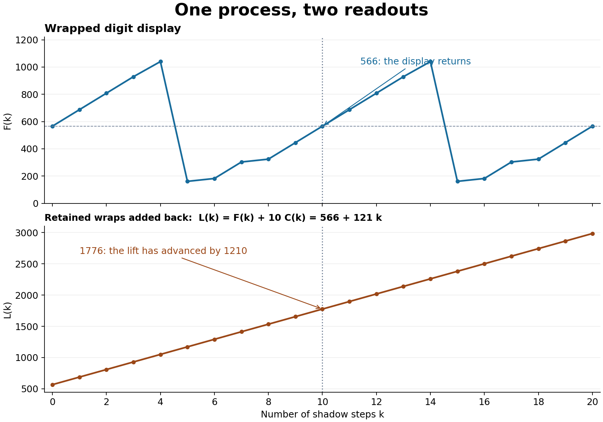

# RPRM operational closure — master packet 07

**We found the exact sawtooth-to-line connection in the current carry model.** The displayed trajectory repeats, while restoring the accumulated wraps gives

\[
\text{lifted value}=\text{wrapped value}+10\times\text{weighted wraps}=566+121k.
\]

After ten steps the display returns to 566, but the lifted value is 1776. The return has accumulated **1210**. This answers the straight-line/sawtooth question for the operation we specified: both are exact views, carrying different information.



This session now coordinates the hypothesis at the user's request. The current Yang–Mills, P versus NP and fluid tasks were read without changing their work. Poincare was checked against primary sources as a solved reference; the other Millennium targets were compared at their stated scope.

The useful connection is **retaining what the next operation can distinguish, then proving what forces an endpoint**. The carry computation proves the first part. Poincare illustrates an established instance of the second: a geometric quantity cannot remain nonnegative under its proved accumulated decrease forever, including the necessary transition and topology controls. We have not proved that every Millennium problem reduces to one common stopping rule.

There is already concrete cross-lane progress. The current YM calculation used retained support/channel information to reduce a source-bound coefficient by about 16 percent. Our fresh follow-up also rejects a tempting fix: a simple proportional shift scales both sides of the majorant test, leaving a failed sign failed. The SAT audit proves why exact finite closure can still need exponentially many pieces in a restricted representation, while a different representation solves that particular family cheaply.

The exact question to carry forward is: **which quantity, built from the actual problem data, both survives our operations and has a proved bound that prevents indefinite unresolved continuation?** A safe digit needs that target-dependent meaning. Reaching 5 or 6 by itself does not provide it.

## Read and run

- [Mathematical explanation and written proofs](CLOSURE_PROOF.md): carry identity, cycle obstruction, complete finite potential family and distinct stopping criteria.
- [Master comparison and open obligations](MASTER_STATE.md): current results, remaining quantifiers and concrete discriminators for all seven problems.
- [YM audit](agents/YM_AUDIT.md), [PNP audit](agents/PNP_AUDIT.md), [Poincare and other target audit](agents/POINCARE_REFERENCE.md).
- [Fresh closure evidence](evidence/fresh_checks.json): 10,477 source states, 216,583 transition checks, 729 finite cycle models, parity cubes of widths 3–8 and stopping counterexamples.
- [Fresh YM shift evidence](evidence/ym_shift.json): 75 exact rational checks, including the preserved failed bound.

From this directory, using Python 3.10 or newer:

```powershell
python -I -B work/check_closure.py --output evidence/closure_replay.json
python -I -B work/check_ym_shift.py --output evidence/ym_shift_replay.json
```

Both checkers use only the standard library. Use a new path for each replay; the closure checker enforces this, while the YM checker writes the supplied output path. Timestamps change; the mathematical results should not. They do not read saved PASS files to decide their results. The bounded checks support the separate written arguments; they do not establish general software soundness.

To redraw the figure, install/use matplotlib and run:

```powershell
python -I -B work/draw_closure.py --evidence evidence/closure_replay.json --output-dir figures_replay
```

The original plot was rendered with matplotlib 3.10.8 and visually inspected. [Provenance](PROVENANCE.md) distinguishes new proofs/tests, inherited lane evidence and published theorems. [MANIFEST.json](MANIFEST.json) binds packet bytes; it does not prove their mathematical contents.

**Disposition:** the carry connection and scoped elementary lemmas are established by written proofs. E34's full identity/Sha, general BSD, and the other open Millennium targets remain OPEN. No paper or general solution is claimed. The source, failed obligations and counterexamples are preserved for the next user-guided iteration.
