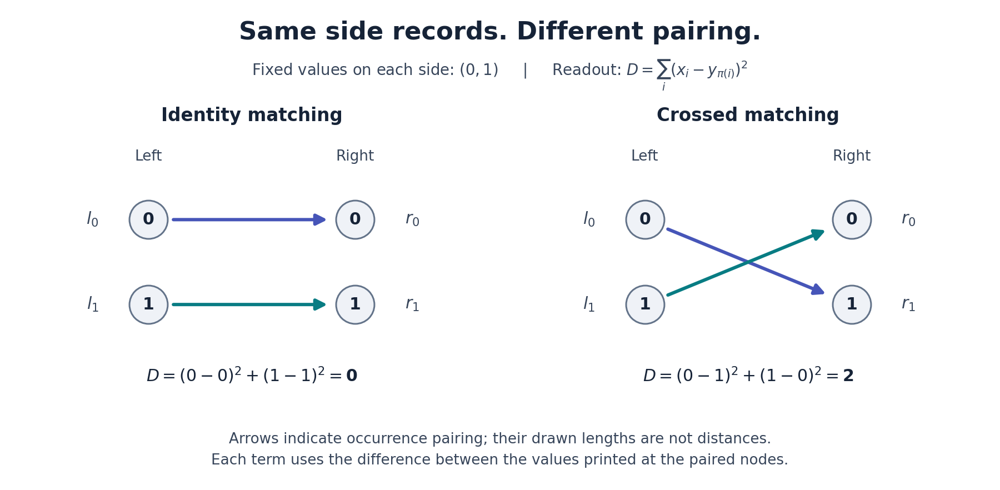

# Seam 09 — what the relation contributes

**The coin/seam idea has a precise realization: the same separate records can support different joint relations.** What is missing can be the pairing between occurrences, rather than an additional value belonging to either side.

Both sides below contain the same numbers. Changing only their matching changes the requested total squared difference from zero to two. For this complete two-matching fiber, one binary distinction is necessary and sufficient.



Full point coordinates in a fixed metric frame already determine their distance. Separate lengths can leave relative alignment unknown. These are different amounts of retained information; the experiment does not assert that every seam requires a new independent object.

## The distance interpretation on the actual BSD curve

For E34, the relevant arithmetic squared distance is `D=H(P-Q)`, using the fixed full canonical-height convention. It is not the Euclidean distance between the plotted x,y coordinates. The actual points give

`P-Q=(162,-2016)`.

The fresh rigorous computation gives:

| Arithmetic quantity | Certified interval |
|---|---|
| Distance `sqrt(H(P-Q))` | `[2.0339867006, 2.0340237084]` |
| Height pairing | `[0.6971157745, 0.6973317973]` |
| Regulator | `[7.0990676287, 7.1002016338]` |

If p and q are the two individual heights, the exact pairing is `(p+q-D)/2`, and the regulator is `p*q-pairing^2`. The pairing supplies relative alignment; the regulator is the square of the arithmetic parallelogram's area. This is established height geometry applied and computed afresh, not a new identity inferred from decimal agreement.

A distance threshold needs a basis and scale contract. Reversing one generator preserves the lattice regulator while changing the distance. Replacing Q by Q+nP also preserves the regulator while allowing the distance to grow without bound. The packet retains concrete thresholds that give opposite answers for two bases of the same lattice; it does not dismiss a distance readout with an explicitly fixed basis.

This advances the **arithmetic-side** interpretation of the seam. The separate equality connecting the analytic BSD coefficient to the arithmetic period, regulator and actual Sha order remains OPEN. The next bridge must preserve this joint geometry, the previous mixed-refinement condition, and both limiting boundary requirements.

## Read and replay

- [Main mathematical explanation](DISTANCE_AND_SEAM.md): complete Gram relaxation, distance/pairing formulas, exact interval proof, exceptions and basis tests.
- [Geometry and theorem audit](agents/GEOMETRY.md), [independent numerical review](agents/NUMERICAL_REVIEW.md), [finite joint-relation proof](agents/JOINT_RELATION.md).
- [Candidate freeze](PREFREEZE.md), [provenance and verification scope](PROVENANCE.md).
- [Fresh arithmetic evidence](evidence/distance.json), including the final exact projective coordinates in hexadecimal and all gcd records.
- [Fresh finite matching evidence](evidence/joint.json).

From this directory, with Python 3.10 or newer, use new output paths:

```powershell
python -I -B work/check_distance.py --output evidence/distance_replay.json
python -I -B work/check_joint.py --output evidence/joint_replay.json
```

Both checkers are standalone standard-library programs and refuse to overwrite a result. The numerical checker uses rational logarithm bounds and outward rounding, not floating-point logarithms. It checks eight points at eight duplication steps, the first three by an independent chord-law route, plus all 625 bounded integer matrix controls. The matching checker covers all 32 admitted sources. The written theorems have their separately stated scopes; finite tests do not certify general software soundness.

To regenerate the schematic with matplotlib:

```powershell
python -I -B work/draw_joint.py --evidence evidence/joint_replay.json --output-dir figures_replay
```

The original PNG was visually inspected. Its arrows show pairing; their drawn lengths do not measure the numeric readout. The ZIP manifest checks byte integrity, not mathematical truth.

Previous coordinating packets: [master 07](../closure-master-07/README.md) and [bridge 08](../closure-bridge-08/README.md). No prior lane or packet was modified. This pass supplies a completed result for continued user-guided investigation; it creates no unattended work.
