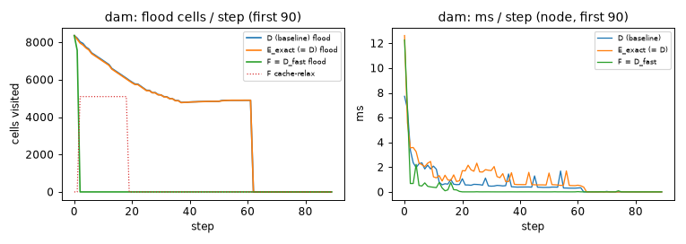
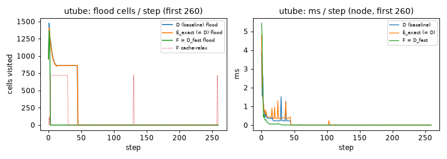
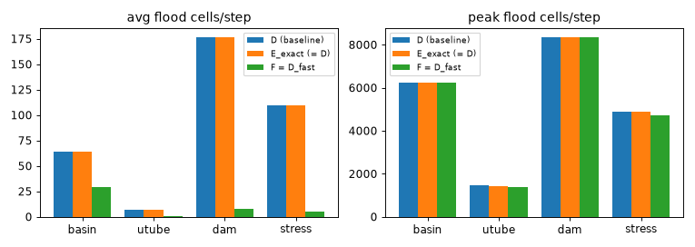

# D_fast cost comparison (D vs E_exact vs F) — honest, post-audit

Grid 100x64. Steps: basin 2000, utube 6000, dam 2000, stress 2000.
Driven headlessly through node against the same `js/` physics the demo uses.

- **E (E_exact)** is verified frame-for-frame identical to **D** (`experiments/test_frame_equality.js`): its flood cost tracks D because frame-identity forces the full row-major relabel every frame. It is a faithful mirror, not a speedup.
- **F (D_fast)** is the certificate-gated variant that actually skips work; it is NOT frame-identical to D (hydrostatic-equivalent deviations on fragmenting scenes).

`flood cells` = connected-component + cavity cells visited by the level solve; `cache-relax` = cavity cells F touches while relaxing off a cached target (no flood); `skip%` = body-processings that skipped the flood (cert-moving + settled). ms/step is wall-clock in node.

| scenario | model | mass err % | U-tube Δh | peak flood | avg flood | avg cache-relax | cert-skip % | settled-skip % | skip % | avg ms | peak ms |
|---|---|---|---|---|---|---|---|---|---|---|---|
| basin | D | 0.000 | - | 6226 | 64.1 | 0.0 | 0.0 | 0.0 | 0.0 | 0.0297 | 8.078 |
| basin | E | 0.000 | - | 6226 | 64.3 | 0.0 | 0.0 | 0.0 | 0.0 | 0.0403 | 11.513 |
| basin | F | 0.000 | - | 6226 | 29.3 | 5.8 | 1.7 | 95.2 | 96.9 | 0.0277 | 12.185 |
| utube | D | 0.000 | 0.066 | 1477 | 6.9 | 0.0 | 0.0 | 0.0 | 0.0 | 0.0116 | 3.873 |
| utube | E | 0.000 | 0.066 | 1408 | 6.8 | 0.0 | 0.0 | 0.0 | 0.0 | 0.0128 | 4.794 |
| utube | F | 0.000 | 0.054 | 1369 | 0.6 | 8.8 | 1.2 | 98.7 | 99.9 | 0.0110 | 5.442 |
| dam | D | 0.000 | - | 8361 | 176.8 | 0.0 | 0.0 | 0.0 | 0.0 | 0.0459 | 10.567 |
| dam | E | 0.000 | - | 8356 | 176.2 | 0.0 | 0.0 | 0.0 | 0.0 | 0.0582 | 12.626 |
| dam | F | 0.000 | - | 8356 | 8.0 | 81.5 | 1.6 | 98.3 | 99.9 | 0.0262 | 12.264 |
| stress | D | 0.000 | - | 4889 | 109.5 | 0.0 | 0.0 | 0.0 | 0.0 | 0.0337 | 6.690 |
| stress | E | 0.000 | - | 4889 | 109.5 | 0.0 | 0.0 | 0.0 | 0.0 | 0.0413 | 8.884 |
| stress | F | 0.000 | - | 4703 | 5.0 | 49.2 | 2.0 | 97.8 | 99.8 | 0.0228 | 9.209 |

## Speedup — F (D_fast) vs D, and E_exact vs D

E_exact should read ~1× (it does D's work); F is where the reduction is.

| scenario | E avg flood ÷ D | F avg flood ↓ vs D | F peak flood ↓ | F avg ms ↓ |
|---|---|---|---|---|
| basin | 1.00× | 2.2× | 1.00× | 1.07× |
| utube | 0.99× | 11.9× | 1.08× | 1.05× |
| dam | 1.00× | 22.2× | 1.00× | 1.75× |
| stress | 1.00× | 21.7× | 1.04× | 1.48× |

## Ablation — the certificate's own contribution (measured on F)

`F_noCert` = D_fast with the certificate-moving-skip disabled (pure
dirty-region tracking + quiescence: every MOVING body is re-flooded, only
SETTLED undisturbed bodies are skipped). The extra reduction from `F_noCert`
to `F` is precisely what the RPRM `P_geo` certificate buys on top of plain
incremental tracking. (D and E_exact do the same full flood, so both are
shown as the un-skipped baseline.)

| scenario | D avg flood | F_noCert avg flood | F avg flood | dirty-track ↓ (D→noCert) | **certificate ↓ (noCert→F)** |
|---|---|---|---|---|---|
| basin | 64.1 | 38.5 | 29.3 | 1.7× | **1.3×** |
| utube | 6.9 | 4.7 | 0.6 | 1.5× | **8.1×** |
| dam | 176.8 | 54.3 | 8.0 | 3.3× | **6.8×** |
| stress | 109.5 | 43.7 | 5.0 | 2.5× | **8.7×** |

