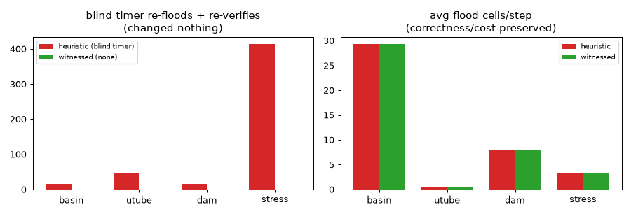

# Witnessed vs heuristic cache invalidation for F (D_fast)

Grid 100x64. Steps: basin 2000, utube 6000, dam 2000, stress 3000.
Same `js/` physics; only F's invalidation guard differs (`D.Invalidation` = `heuristic` | `witnessed`).

## Correctness (must be preserved)

| scenario | mode | mass err % | U-tube Δh | avg flood | peak flood | avg cache-relax | skip % |
|---|---|---|---|---|---|---|---|
| basin | heuristic | 0.000 | - | 29.3 | 6226 | 5.8 | 96.9 |
| basin | witnessed | 0.000 | - | 29.3 | 6226 | 3.6 | 96.9 |
| utube | heuristic | 0.000 | 0.054 | 0.6 | 1369 | 8.8 | 99.9 |
| utube | witnessed | 0.000 | 0.054 | 0.6 | 1369 | 3.3 | 99.9 |
| dam | heuristic | 0.000 | - | 8.0 | 8356 | 81.5 | 99.9 |
| dam | witnessed | 0.000 | - | 8.0 | 8356 | 43.3 | 99.9 |
| stress | heuristic | 0.000 | - | 3.4 | 4703 | 39.4 | 99.9 |
| stress | witnessed | 0.000 | - | 3.4 | 4703 | 20.5 | 99.9 |

## Invalidation accounting (the point)

The heuristic spends **blind timer work**: `timer re-floods` (an active certified body re-flooded purely because 128 frames elapsed) and `timer re-verifies` (a settled body's cavity re-summed purely on the clock). The witnessed policy spends **zero** blind timer work; every re-flood it does carries a **named implicated cell** (a `successor_defect`), and `unwitnessed` counts any volume drift with no cell witness (a completeness gap — we want this to be 0).

| scenario | heuristic timer re-floods | heuristic timer re-verifies | witnessed re-floods (all named) | unwitnessed drift |
|---|---|---|---|---|
| basin | 0 | 15 | 5 | 0 |
| utube | 0 | 46 | 1 | 0 |
| dam | 0 | 15 | 0 | 0 |
| stress | 0 | 414 | 0 | 0 |

## A witnessed successor_defect (a named cell, not a timer)

On `basin`, the witnessed policy logged 5 named defects; the first: frame 4, body 5, **cell (x=61, y=62)** changed by Δmass=0.295 (volume) — that cell IS the witness that forced the re-flood. The heuristic cannot point at a cell; it re-floods on a clock.

## Honest verdict

- **Correctness preserved:** witnessed matches heuristic on mass error and U-tube Δh (and passes `test_cache_invalidation.js` in BOTH modes), with **0** unwitnessed drifts across all scenes (the volume witness set is complete on this suite).
- **Blind work removed:** the heuristic performed **490** timer-driven re-floods/re-verifies across the suite that changed nothing; the witnessed policy performs **0** — it acts only on a named change. (On these scenes the blind work is entirely the *settled re-verify*; the active-body CacheTTL re-flood never fired because bodies settle in <128 active frames.)
- **Flood cost unchanged; cache-relax modestly cheaper.** As the trust audit predicted, the per-frame volume-drift check already catches real invalidations, so witnessed does **not** beat heuristic on average/peak FLOOD cost — the dominant term is identical. It does cut the cheaper *cache-relax* work by skipping the blind settled re-verify (e.g. dam 81.5→43.3, stress cut ~2×), but that term is small, so wall-clock barely moves. We do not oversell it as a speedup.
- **The real value is principled:** invalidation is now *minimal and witnessed* (every re-flood points at the exact cell that forced it — a `successor_defect`), and the fixed 128-frame timer, an unprincipled magic constant, is gone. This is the corpus's Fold→FutureTest→Five→Refold discipline (name the witness, backward-localize) applied to F's cheapest, most heuristic component.

