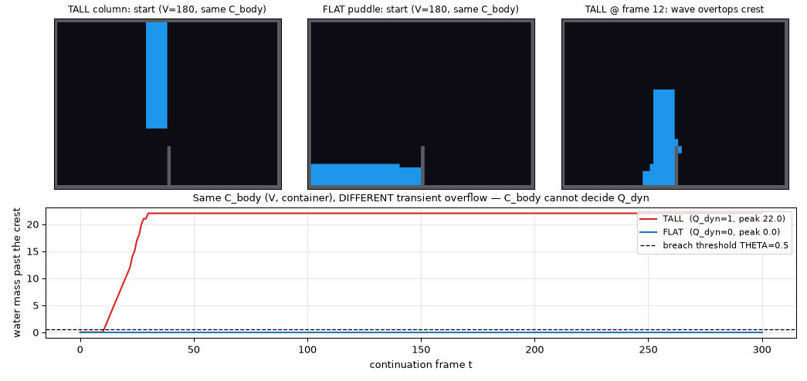

# The dynamic frontier: C_body is insufficient for a dynamic receiver

**For William. Written to the same honesty filter as `RPRM_FLUIDS.md`.**

`SUFFICIENCY_TEST.md` certified (with 0 false positives / 1100 scenes) that model
D/F's cheap body summary

> **C_body = (per-body conserved volume `V`, containing-cavity / container geometry)**

is a sufficient statistic for the **static** receiver `Q_hydro` ("resting
free-surface level"). `RPRM_FLUIDS.md` §3.1/§3.3 then *conjectured* that the moment
the receiver asks a **dynamic** question, `C_body` fails Prop 2 and you are forced
back to the dynamic field. This note discharges the concrete half of that
conjecture: it **exhibits a clean witness pair and a disagreement rate** proving
`C_body` is insufficient for a precisely-stated dynamic receiver.

**Scope, up front (this is the important honesty guardrail).** This is a **Prop-1
refutation of a specific summary for a specific receiver** — *not* a universal
lower bound, *not* a proof that no local representation can answer the dynamic
question. It is exactly the "insufficiency of *this* summary" that
`RPRM_FLUIDS.md` §3.1 frames as a defensible conjecture, and we do **not** upgrade
it to an impossibility theorem. Everything is reproducible:
`experiments/dynamic_frontier.py` (harness) + `experiments/dynamic_frontier_sim.js`
(the real-dynamics rollout bridge).

---

## 1. The dynamic receiver, stated exactly

> **Q_dyn(x) = 1** iff, under the known continuation *"step the sim's own dynamics
> forward under gravity with **no new inflow** for `H` frames,"* the water mass in
> a declared monitored region (past a lip / crest) exceeds a breach threshold `θ`
> at **some** frame `t ≤ H`; else **0**.

This is an *aperture* in the RPRM sense (`RPRM_FLUIDS.md` §1.1): the supplied data
is a start state; the requested answer is a transient-overflow bit over a horizon.
Its ground truth is an **actual dynamic rollout** of the sim's own physics
(`dynamic_frontier_sim.js` drives the real `js/` models), **not** a summary
read-off. We use the momentum model **B** as the continuation, so the information
`C_body` discards shows up concretely as **in-flight momentum**; model A (binary)
gives the same qualitative result. Parameters used: grid 48×64, `H = 300`,
`θ = 0.5` cell-mass past the crest.

---

## 2. The witness pair (concrete numbers)

Container: a closed box with a central divider that rises 10 cells from the floor
(crest at row 36), leaving an open gap above it; the monitored region is the whole
**right** compartment. Two states, **identical container** and **identical volume
`V = 180`** (so **identical `C_body`**), differing only in the discarded spatial
arrangement of that water in the **left** compartment:

- **TALL** — a width-6 column of the full `V`, standing tall against the divider.
- **FLAT** — the same `V` spread as a shallow puddle on the left floor.

| receiver | TALL | FLAT | agree? |
|---|---|---|---|
| **Q_hydro** (quasistatic oracle resting right-mass) | 0.000 | 0.000 | **yes** — TV(tall,flat) = 0.000 |
| **Q_dyn** (model-B rollout, H=300) | **1** (peak right-mass **22.0**, first breach frame **11**) | **0** (peak right-mass 0.0) | **NO** |

`C_body(TALL) = C_body(FLAT)` but `Q_dyn(TALL) = 1 ≠ 0 = Q_dyn(FLAT)`. By Prop 1
(`C(x)=C(y) ⇒ Q(x)=Q(y)` is *required* for a decoder to exist), **`C_body` is
insufficient for `Q_dyn`**. ∎ (one witness suffices)



**The sharp, honest version.** The quasistatic oracle *assigns the tall column the
same resting-left answer as the flat one* (both "settle left, right dry"). But the
real momentum rollout shows the tall column's collapse **runs up the divider and
deposits ~22 cell-mass over the crest**, which the one-way crest then **traps** on
the right. That deposit is a **path-dependent, momentum-driven** outcome that a
quasistatic summary — and `C_body` — provably cannot represent: the two states are
`Q_hydro`-indistinguishable yet `Q_dyn`-distinct. **That gap is the whole result.**
It is not model B being "wrong"; it is genuine splash-over-a-one-way-barrier
physics that the static representation discards by construction.

---

## 3. Summary-collision disagreement rate (a scene suite)

One witness proves insufficiency; a rate shows it is not a fluke. For each
`(container, V)` **class** — where every arrangement shares `C_body` — we roll out
several arrangements (flat, columns at 4 positions/widths, twin columns, a ramp)
and count how often equal-summary states **disagree** on `Q_dyn`. We also verify
the quasistatic truth is **identical within each class** (so the disagreement is
purely dynamic).

| crest_h | V | arrangements | Q_dyn=1 | Q_dyn=0 | pairwise disagreement | static TV in class | mixed? |
|---|---|---|---|---|---|---|---|
| 8 | 140 | 7 | 3 | 4 | 57.1% | 0.000 | YES |
| 8 | 180 | 7 | 3 | 4 | 57.1% | 0.000 | YES |
| 8 | 220 | 4 | 2 | 2 | 66.7% | 0.000 | YES |
| 10 | 140 | 7 | 3 | 4 | 57.1% | 0.000 | YES |
| 10 | 180 | 7 | 3 | 4 | 57.1% | 0.000 | YES |
| 10 | 220 | 4 | 2 | 2 | 66.7% | 0.000 | YES |
| 12 | 140 | 7 | 3 | 4 | 57.1% | 0.000 | YES |
| 12 | 180 | 7 | 3 | 4 | 57.1% | 0.000 | YES |
| 12 | 220 | 4 | 2 | 2 | 66.7% | 0.000 | YES |

**Summary-collision disagreement rate: 84/144 equal-`C_body` pairs (58.3%) disagree
on `Q_dyn`; 9/9 classes are "mixed"** (contain both a spill and a no-spill state).
The within-class static TV is **0.000** everywhere, so `C_body` fixes the static
answer while leaving `Q_dyn` genuinely undetermined. (This rate is a property of
*this* suite of arrangements, deliberately built to stress the frontier; it is a
demonstration of collisions, not a universal frequency.)

---

## 4. The minimal RPRM repair (Prop-1: `C' = (C_body, extra)`)

A cheap summary `S` is **insufficient** for `Q_dyn` if two states with equal `S`
disagree. We test the "obvious fixes":

- **`V`** (which *is* `C_body`'s coordinate): **9** colliding classes → insufficient.
- **`V` + `top` row** (add the current surface height): **6** colliding classes →
  **still insufficient**. e.g. at `crest_h=8, V=140`, five arrangements share
  `(V=140, top=1)` yet a column *adjacent* to the divider spills (`Q_dyn=1`) while
  an equal-height column in the *middle/far* position does not (`Q_dyn=0`) — the
  **horizontal position** of an equal-height column decides the spill.

So even `C_body` augmented with the surface height does not decide `Q_dyn`. The
**exact** Prop-1 repair is `C'(x) = (C_body(x), Q_dyn(x))` — cache the answer, the
least-informative refinement. The minimal **physical** state that restores
sufficiency is the full **dynamic field**: the in-flight water distribution /
arrangement, and under a momentum model the **velocity field**. With it, rolling
the dynamics forward reproduces `Q_dyn` exactly, by construction. This is
*precisely* `RPRM_FLUIDS.md` §3.3's forced fallback **`C' = (C_body, velocity
field)`** — and it **reintroduces the dynamic cost**.

**Reframing (the point of the whole exercise).** "Dynamic is expensive" becomes
the honest, RPRM-native statement: *"this cheap summary is insufficient for the
dynamic receiver; here is the minimal add-back, and it is exactly the dynamic
state we tried to discard."* The boundary is checkable (Prop 1 fails on a witness),
and the repair is named (Prop-1 refinement), not hand-waved.

---

## 5. What this does and does not claim

- **Does:** refute sufficiency of the *specific* summary `C_body = (V, container
  geometry)` for the *specific* dynamic receiver `Q_dyn`, with a witness pair and a
  58.3% collision rate on a stress suite; confirm `C_body` remains sufficient for
  the quasistatic `Q_hydro` (identical within-class static truth).
- **Does NOT:** claim a universal lower bound, claim no local representation can
  answer `Q_dyn`, or upgrade `RPRM_FLUIDS.md` §3.1's insufficiency *conjecture* to a
  theorem. Exhibiting an exactly-incompressible purely-local dynamic scheme would
  still refute that conjecture; nothing here forecloses it.

## How to run

```bash
/workspace/.venv/bin/python noita_lab/experiments/dynamic_frontier.py 7
```

Outputs: `artifacts/dynamic_frontier_witness.png`,
`artifacts/dynamic_frontier_results.md` (mirrored to
`/cursor/stores/self/artifacts/`). No raw corpus is committed.
