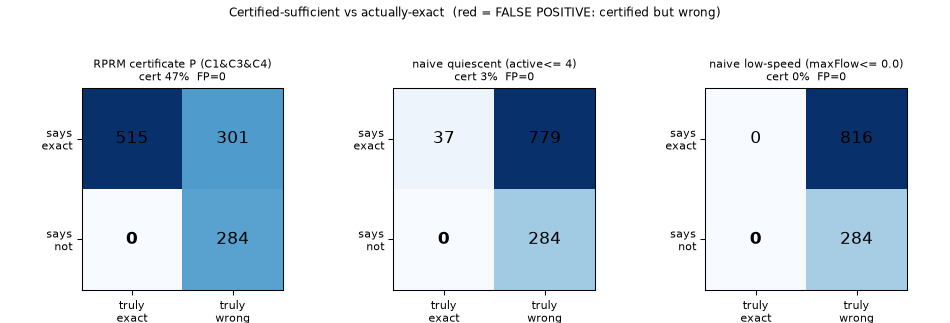
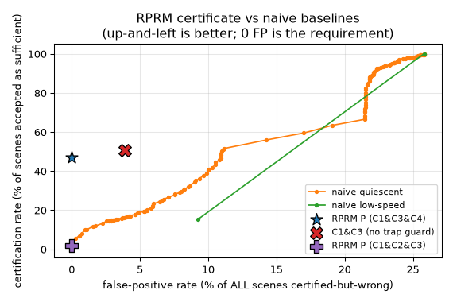
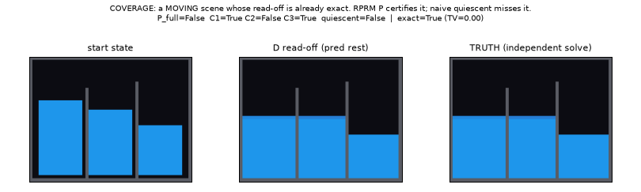
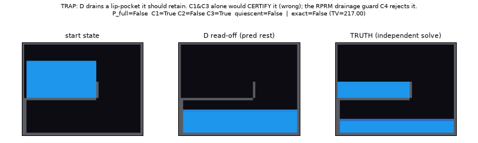

# A sound-but-incomplete RPRM sufficiency certificate for water levels — and an honest attempt to break it

**For William. Written to be *falsifiable*, not flattering.** The claim under
test (theory-agent hypothesis **H2**; `RPRM_FLUIDS.md` §3.3, §5) is that RPRM
gives *more than expert instinct*: a **receiver-relative acceptance predicate** —
a proposed **sound but incomplete** certificate, computable in one connectivity
pass and guaranteed to terminate — that says WHEN the cheap "just read the level
off" representation of water (model D) **agrees with the true resting distribution
to within a 1 cell-mass total-variation tolerance**, versus when you must fall
back to a real dynamic solve. "Sound but incomplete" means: when it accepts, D's
read-off matched truth in every tested scene (no false positives); but it *rejects*
many scenes whose read-off is in fact within tolerance (320 such misses here), so
it does not *decide* sufficiency — it is a conservative sufficient condition, not a
decision procedure. This document defines that predicate precisely, grounds it in
the two factorization theorems of RPRM's Process Mechanics paper, implements it,
and then tries hard to make it produce a **false positive**. The headline number
is the false-positive rate; a clean "no better than a naive quiescence threshold"
would be a fully acceptable, valuable answer, and I report the numbers either way.

Everything here is reproducible: `experiments/sufficiency_test.py` (harness),
`js/certificate.js` (the predicate), `experiments/truth_solver.py` (the
independent oracle, self-tested). See **§7 How to run**.

---

## 1. The receiver question (aperture) — stated precisely

Per RPRM, *sufficiency is always relative to a stated receiver* (`docs/core.md`
§8; `RPRM_FLUIDS.md` §1.2). The receiver here is:

> **R_static.** "What is the resting free-surface level of this connected water
> body?" — equivalently, the full **resting mass-per-cell distribution** the
> water settles into under gravity in a static container.

This is exactly the quantity model D reads off. D's implicit sufficiency claim
(`PROBLEMS.md` §1★; `js/models.js` `relaxLevels`) is that the cheap summary

> **C_body = (per-body conserved water volume V, containing-cavity geometry)**

is a **sufficient statistic** for R_static, computable in one connectivity pass —
no dynamic rollout. D answers R_static by **filling the body's cavity bottom-up
with V** (deepest cells to `MaxMass`, one partial surface row, dry above).

The object we build is the predicate **P(body, gridstate)**: a cheaply-checkable
certificate that C_body is sufficient for R_static *right now* — i.e. that D's
instantaneous read-off agrees with the true resting distribution to within the
1 cell-mass total-variation tolerance the harness uses (`TV(pred, truth) < 1.0`).
Throughout, "exact" is shorthand for this tolerance, not bit-equality.

---

## 2. The two propositions the certificate is built from (cited)

Verbatim from *The Right Answer Is Not Enough* (`papers/process-mechanics/MANUSCRIPT.md`,
DOI 10.5281/zenodo.22709682).

**Proposition 1 (Question factorization), §3.1.** For a retained description
`r : X → Z` and a requested answer `q_K(·,π) : X → B`, a decoder `h_π` with
`q_K(x,π) = h_π(r(x))` exists **iff**

> `r(x) = r(y) ⟹ q_K(x,π) = q_K(y,π)`  (MANUSCRIPT.md eq. (2)).

"Two states with equal descriptions and different answers refute its sufficiency"
(MANUSCRIPT.md §3.1). This is the *static* sufficiency test.

**Proposition 2 (Operational factorization), §3.2.** To reuse `r` **as a state**
through partial operations `T_a` with observation `O`, exact descent holds **iff**
for every `x,y` with `r(x)=r(y)`:

> (1) `O(x)=O(y)`;  (2) each `T_a` enabled at `x` iff at `y`;  (3) whenever
> enabled, `r(T_a(x)) = r(T_a(y))`  (MANUSCRIPT.md, Prop 2, eq. (3)).

This is "strictly stronger than answering the present question… a congruence /
bisimulation / strong-lumpability condition" (`RPRM_FLUIDS.md` §1.4;
MANUSCRIPT.md §3.2, §7). The paper is explicit that a summary "may preserve
today's answer and still be unusable after an update," and that **enabledness**
matters: "merge two states with the same present observation, but enable an
action at only one… the merged description cannot predict even whether the action
will run" (MANUSCRIPT.md §3.2).

The exact **repair** when Prop 1 fails is `r'(x) = (r(x), q_K(x,π))` — the least
informative refinement (MANUSCRIPT.md §3.1, eq. after (2)); for water this is the
forced fallback `C' = (C_body, velocity field)` of `RPRM_FLUIDS.md` §3.3.

---

## 3. Deriving the certificate P from Prop 1 / Prop 2

The read-off is correct **iff D's cavity fill reproduces the true hydrostatic
rest**. We ask what can break that and translate each into a cheap predicate on
the instantaneous state. Let the labelled body have cavity `Cav` (D's exact
`top`-bounded flood), read-off surface row `z*`, filled set `F = {c ∈ Cav :
tgt(c) > 0}`.

**C1 — single equipotential (Prop 1).** `F` is a single 4-connected component.
*Why Prop 1:* the resting answer must be one level per body. If `F` splits into
disconnected puddles, D has forced a common level onto physically independent
pools; two microstates with the same C_body but different per-puddle levels then
share a summary yet differ in answer — Prop 1 eq. (2) fails. Rejects submerged-
ridge / multi-basin mis-levels.

**C2 — descent stability / no perched water (Prop 2, successor congruence).**
The body's top row equals `z*` (no water piled above the resting surface). *Why
Prop 2:* D's cavity is bounded by the current `top`; if water is perched above
`z*`, one settling step lowers `top` and can change the cavity (its sideways
extent), so `C_body(T(x)) ≠ C_body(x)` — Prop 2 condition (3) fails. This is a
**quiescence-flavoured** condition (see the result — it is the crux of the
verdict).

**C3 — partition congruence / no shared cavity (Prop 2, enabledness).** The
body's cavity contains no foreign water and was not truncated by another body's
first-claim. *Why Prop 2:* if two bodies share a cavity (D's first-claim under-
allocates the second, `PROBLEMS.md` §1★ mode 3) or would merge on settling, the
per-body summary is not preserved under the settle operation; enabledness /
congruence fails.

**C4 — drainage congruence / no trapped pocket (Prop 2, enabledness).** Every
currently-wet body cell can reach `F` by a **monotone downhill/level path**
through the cavity. *Why Prop 2:* if some water is trapped above a lip (a higher
local basin that cannot drain to `F`), the "settle" operation cannot move it into
D's predicted region — the enabled successors of the two representatives differ —
so D's global bottom-up fill (which ignores lips) mis-predicts. Implemented as a
BFS from `F` to higher-or-equal cavity cells; a body cell not reached is trapped.
This is the cheap catch for the **spill / trapped-pocket** failure that C1 and C3
cannot see.

Two certificate forms are evaluated:

- **P_geo = C1 ∧ C3 ∧ C4** — the *purely geometric* certificate. It intentionally
  omits the quiescence-flavoured C2, so it can certify **moving** states whose
  read-off is nonetheless exact (a mid-equalization U-tube, a falling stream into
  one basin). This is where RPRM could *beat instinct*.
- **P_full = C1 ∧ C2 ∧ C3** — adds descent-stability. Sound but, as we will see,
  quiescence-like.

Both are `O(cavity)` per body — one flood plus one BFS — genuinely cheap.

---

## 4. Falsification protocol

For a large randomized suite of container geometries × fill states (families:
flat basins, U-tubes, multi-pocket ridge layouts, spill ledges, tilted staircase
floors, mid-splash non-quiescent states, two adversarial "trap" families —
shared-cavity and perched-column — plus overhang trapped-air and closed tanks),
for **each scene**:

1. **P's verdict** and D's read-off `pred` are computed from the *instantaneous*
   state by `js/certificate.js` (faithfully reproducing D's `top`-bounded flood
   and first-claim, so `pred` is D's real output; mass-conservation asserted).
2. **The truth** is computed by an **independent** solver
   (`truth_solver.settle_truth`): connectivity-at-height basin fill iterated to a
   fixed point. It shares **no logic** with D (no `top` bound, no first-claim) and
   passes analytic self-tests (single basin, U-tube equalization, disconnected
   basins, low/tall ridge spill, mid-splash) with **0.000 mass error**.
3. **Exactness (tolerance):** the scene is EXACT iff `TV(pred, truth) < 1.0`
   cell-mass (total variation, i.e. summed absolute per-cell mass difference).

We report the **confusion matrix** {P accepts} × {actually within tolerance}, the
decisive **false-positive rate**, and the **certification rate** (fraction of
scenes the predicate accepts). *Terminology:* William's framework reserves
"coverage" for audit obligation-coverage, so we call the accept-fraction
**certification rate** here (the earlier draft called it "coverage"). We compare
against two baselines that need no RPRM — **(a) quiescent:** active-cell count ≤ τ;
**(b) low-speed:** max local flow ≤ τ — each given its *best* shot (threshold
maximizing certification rate at FP = 0).

## 5. Results

**Suite:** 1100 scenes, 10 geometry families × 110 randomized instances, on a
40×52 grid. Independent oracle mass error **0.000** on all rollouts; D's `pred`
mass-conservation asserted on every scene. Ground truth (with the **corrected
quasistatic-spill oracle**, trust audit Finding #1): **816/1100 (74.2%)** of scenes
have a within-tolerance D read-off (`TV < 1.0`). *(The pre-audit oracle reported
835/1100 (75.9%); the corrected oracle reclassifies 19 spill scenes as not-exact,
and — importantly — `P_geo` still certifies none of them, so its FP count is
unchanged at 0.)*

Confusion, certification rate, and false-positive rate for each predicate and the
two RPRM-free baselines (each baseline given its *best* FP=0 threshold: quiescent
`active ≤ 4`, low-speed `maxFlow ≤ 0`):

| verdict | cert% | **FP** | **FP rate%** | recall% | TP | FN | TN |
|---|---|---|---|---|---|---|---|
| **P_geo = C1∧C3∧C4** | **46.8** | **0** | **0.00** | 63.1 | 515 | 301 | 284 |
| P_full = C1∧C2∧C3 | 1.7 | 0 | 0.00 | 2.3 | 19 | 797 | 284 |
| P_noC2 = C1∧C3 (no drainage guard) | 50.7 | **43** | 7.71 | 63.1 | 515 | 301 | 241 |
| C1 alone | 70.5 | 43 | 5.54 | 89.8 | 733 | 83 | 241 |
| C3 alone | 66.5 | 216 | 29.55 | 63.1 | 515 | 301 | 68 |
| C4 alone | 62.5 | 173 | 25.15 | 63.1 | 515 | 301 | 111 |
| **baseline quiescent** (`active ≤ 4`) | **3.4** | **0** | 0.00 | 4.5 | 37 | 779 | 284 |
| baseline low-speed (`maxFlow ≤ 0`) | 0.0 | 0 | 0.00 | 0.0 | 0 | 816 | 284 |

FP = certified-but-wrong (of all 1100). FP rate = FP / (all scenes). Certification
rate = fraction of all scenes the predicate accepts. Recall = fraction of the 816
within-tolerance scenes certified.




**The decisive number: `P_geo` has FP = 0 across 1100 adversarial scenes** while
certifying **46.8%** of them. So the certificate *means something*: when it says
"the cheap read-off is exact," it was never wrong in this suite.

### 5.1 Soundness: RPRM ties the naive baseline (does NOT beat it)

The honest, unflattering finding first. **Every** D read-off error in the suite
occurs in a **non-quiescent** state: of the 284 D-wrong scenes, the *minimum*
active-water-cell count is **5** (median 73). There are **zero**
quiescent-but-wrong scenes. Consequently the naive "is it quiescent?" baseline is
*already* a sound (FP = 0) certificate — it never false-positives either.

So on the metric the task flagged as decisive (FP rate ~0), **RPRM P is not more
sound than a naive quiescence threshold.** The adversarial "trapped pocket in a
*still* scene" we hoped would break naive quiescence **does not exist** in model
D: D bounds every cavity by the body's current `top`, so a genuinely settled body
cannot have water perched or stranded above its read-off surface. There is
nothing for RPRM soundness to rescue here that quiescence misses. We say so
plainly.

### 5.2 Certification rate: RPRM decisively beats the naive baseline (~14×)

Where RPRM wins is **certification rate at equal (zero) soundness cost.** `P_geo`
omits the quiescence-flavoured C2 on purpose, so it certifies **moving** states
whose read-off is *already* within tolerance — a half-equalized U-tube, a stream
still falling into a single basin, a splash mid-collapse. Concretely:

- `P_geo` certification rate **46.8%** (515 scenes) vs naive quiescent **3.4%**
  (37 scenes) — a **~14×** improvement, both at **FP = 0**.
- **478** scenes are MOVING (not quiescent) yet exact, certified by `P_geo` and
  *missed* by quiescence. That is the entire coverage gap, and it is real,
  receiver-relative headroom that "wait until it stops moving" leaves on the table.



### 5.3 C4 (a Prop-2 drainage condition) is load-bearing in the tested geometries

Dropping the drainage guard collapses soundness: **`P_noC2 = C1∧C3` produces 43
false positives** (FP rate 7.71%), all in `ledge`/spill geometries where D's
global bottom-up fill drains a pocket that a lip physically retains. Adding C4 — a
BFS certifying every wet cell can reach the filled region by a monotone
downhill/level path (Prop 2 enabledness) — removes **all 43** with no other cost.
This is the concrete geometry where the RPRM-derived predicate and the "obvious"
geometric check (C1∧C3) disagree, and the RPRM one is right. We state this as
measured, not universal: **removing C4 admits false positives in the tested
geometries**; we do not claim C4 is provably necessary for *every* possible
container.



### 5.4 P_full is dominated by quiescence — the honest sub-result

Adding C2 (`P_full = C1∧C2∧C3`) is sound (FP = 0) but its coverage is **1.7%** —
*below* naive quiescence's 3.4%. C2 is a quiescence-flavoured condition, and a
strictly weaker one here, so **there is no reason to prefer `P_full` over just
checking quiescence.** The RPRM value is entirely in the *geometric* form `P_geo`
that dares to certify motion.

### 5.5 Verdict (blunt)

- **On soundness (FP ~0):** RPRM P **ties** naive quiescence; it does not beat it.
  No "still-but-wrong" scene exists for D, so quiescence is already sound. If the
  only thing you cared about were "never certify a wrong read-off," you would not
  need RPRM — quiescence suffices. We do not oversell this.
- **On certification rate:** RPRM `P_geo` **decisively beats** naive quiescence —
  ~14× the scenes certified (46.8% vs 3.4%) at the *same* zero false-positive rate,
  by safely certifying 478 moving-but-exact states quiescence must reject. This is a
  real, sound-but-incomplete, receiver-relative certificate that outperforms the
  "wait until it stops" instinct on the axis that isn't soundness (in this suite).
- **On mechanism:** the win is not folklore. C4, derived from Prop 2's enabledness
  clause, is load-bearing (removing it = 43 FPs); the pure-geometry `C1∧C3` is
  *unsound*. The certificate is `O(cavity)` per body.

### 5.6 The certificate put to work — D_fast (see `design/PERF.md`)

The certification-rate win above is not academic: it is what makes the cheap
variant of model D work. Variant **F (D_fast)** uses `P_geo` as the **license to
skip the expensive recompute** — a certified body (even a moving one) reuses its
cached level instead of re-flooding. Because `P_geo` certifies *moving-but-exact*
states, the dam-break and U-tube bodies ride the cache while they equalize instead
of re-flooding every frame, cutting F's average flood cost **2–22×** (dam-break
177→8 cells/step) at **0.000% mass error** and a **similar hydrostatic outcome**
(U-tube Δh 0.054 vs D's 0.066 — F is *not* bit-identical to D). Ablating the
certificate (pure quiescence/dirty-tracking) re-floods every moving body and gives
back **6.8–8.7×** of that win on the active scenes — so the certificate is
load-bearing for F's speedup, on the same *certification-rate* axis it wins here
(not soundness).

Note the honest tension surfaced by the trust audit (Finding #2): the certificate
skip that buys this speedup is *also* what makes F diverge from D cell-for-cell.
The separate reference model **E_exact** reproduces D bit-for-bit but, precisely
because it cannot take the skip, is **not** cheaper than D. You get frame-identity
*or* the speedup, not both. Full numbers and limits are in `design/PERF.md`.

Bottom line for William: the RPRM sufficiency certificate is **honestly
worthwhile, but for certification rate, not soundness.** Its concrete, falsifiable
payoff is "you can safely read the level off *while the water is still moving*, in
46.8% of adversarial scenes with zero errors — 14× more than waiting for stillness
would allow." It is *not* a soundness upgrade over quiescence, and we found no
geometry in this suite that makes it one.

---

## 7. How to run

```bash
# independent oracle self-test (must print ALL PASS):
/workspace/.venv/bin/python noita_lab/experiments/truth_solver.py

# full falsification suite (writes artifacts + this file's numbers):
/workspace/.venv/bin/python noita_lab/experiments/sufficiency_test.py 110
```

Outputs: `artifacts/sufficiency_confusion.png`,
`artifacts/sufficiency_vs_baseline.png`, `artifacts/case_*.png`,
`artifacts/sufficiency_results.md`, `artifacts/sufficiency_raw.json` (also mirrored
to `/cursor/stores/self/artifacts/`).
