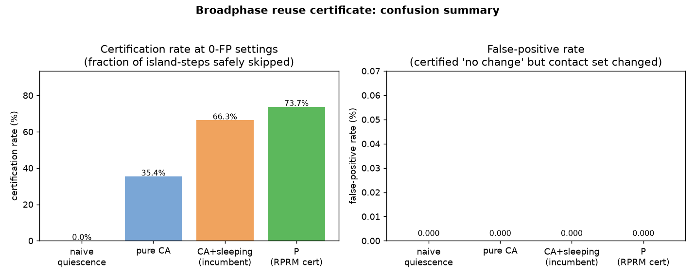
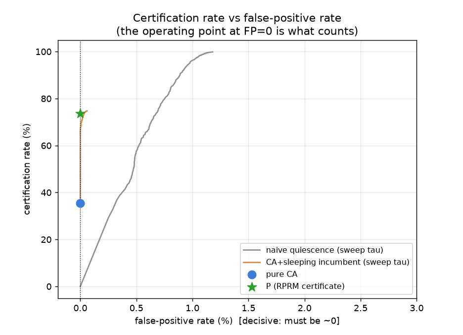
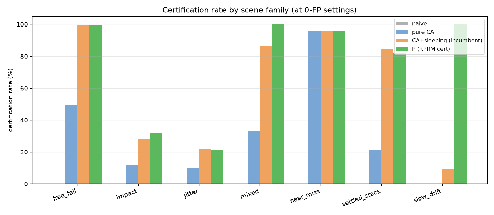
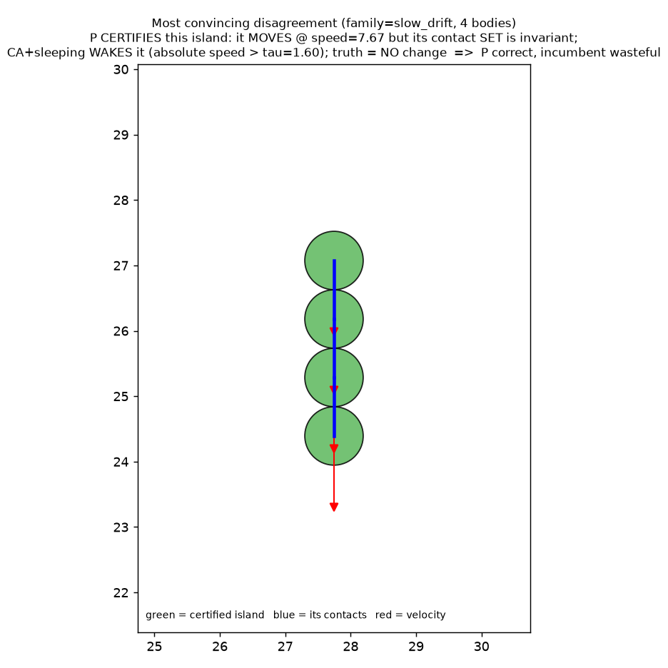

# The RPRM sufficiency certificate in 2D rigid-body broadphase — the make-or-break transfer test

**Does the RPRM "sufficiency certificate" add coverage over the *sophisticated*
incumbent that mature physics engines already ship (conservative advancement /
speculative contacts + island sleeping), at zero false positives — or does the
incumbent already capture the win?**

This is the honest open question flagged as the single biggest risk to the
general-mechanism claim (`noita_lab/design/RPRM_GENERAL_MECHANISM.md` §4:
*"the coverage win may exist only against naive quiescence baselines and collapse
against sophisticated incumbents"*). The fluid result beat a **naive** quiescence
baseline ~14×. Here we test the certificate against the **best existing practice**.

**Blunt verdict up front.** The certificate **does** beat conservative-advancement +
sleeping at strict 0 FP, but the margin is **modest — about +7 to +13 percentage
points, a ratio of 1.1–1.2×** (canonical seed 7: **73.7% vs 66.3%, +7.4 pp, 1.11×**),
not the fluid 14×. The **entire** advantage comes from *moving-but-invariant*
islands (drifting rows, free-falling clusters) that velocity-threshold sleeping
cannot certify at any threshold. On resting piles, near-misses and impacts the
incumbent already ties the certificate. And a sensitivity check is decisive: if the
engine tolerates just **0.1% missed-contact false positives**, plain velocity
sleeping reaches **~75%**, *matching or exceeding* the certificate's 0-FP coverage.
So the certificate's distinctive value here is narrow: **sound (zero-missed-contact)
certification of co-moving islands.** This significantly **tempers** the general
claim — against a sophisticated incumbent the certificate is close to a
*re-derivation / symmetric extension of conservative advancement*, not a new win.

---

## 1. The mechanism, instantiated (grounded in the general note §1, §3.1)

| RPRM object | Broadphase instantiation |
|---|---|
| **Receiver `Q`** | "Does the **contact set** (the set of near-contact pairs) change on the next step?" A certified "no" ⇒ reuse the cached contact manifold, skip the broadphase/narrowphase recompute for that island. |
| **Summary `C`** | cached contact manifold + per-body AABBs + the island (contact-graph) structure. |
| **Certificate `P`** | `P = (conservative-advancement addition guard) ∧ (force-balance persistence)`. The addition guard proves no currently-**separated** pair can close within `dt` under a gravity-aware, momentum-transfer-aware bound (no contact **added**). The persistence clause proves every existing contact stays inside the contact band — its two bodies carry near-zero **relative** velocity (force balance) and the gap, bounded by gravity + centrifugal/shear terms, cannot exceed the band (no contact **lost**). |
| **Ground truth** | full broadphase recomputation one step later; did the incident contact set actually change? |

**Decision unit** = per **island** per **step** — exactly what an engine decides
before sleeping an island. An island is a connected component of the disk–disk
contact graph; an uncontacted body is a singleton island.

### The four methods compared

- **naive quiescence** — velocity-threshold sleeping: `max island speed < τ`. The
  strawman the fluid result beat ~14×. *Not* addition-guarded.
- **pure CA** — faithful conservative advancement / speculative contacts: a safe
  time-of-impact bound proves no separated pair closes. CA has no certificate for
  *existing*-contact persistence, so it can only certify islands with **no** existing
  contacts (free / near-miss bodies) — CA exactly as engines use it against
  tunnelling / new contacts.
- **CA + sleeping** — **the sophisticated incumbent**: the addition guard *plus*
  certify the island if it has no existing contacts (pure CA) **or** it is slow
  enough to sleep (velocity threshold). This is the union of speculative contacts +
  sleeping islands actually shipped in Box2D/Bullet-class engines, given its best shot.
- **P** — the RPRM certificate: the **same** addition guard *plus* the force-balance
  persistence certificate for existing contacts.

`CA+sleeping` and `P` **share the identical addition guard**; they differ *only* in
how they certify that existing contacts persist (velocity threshold vs a
gravity-aware, receiver-relative force-balance bound). That isolates the transfer
test to exactly the certificate's contribution.

---

## 2. Results (canonical run: seed 7, 1120 scenes, 70,221 island-step decisions)

Reproduce with a single command:

```bash
/workspace/.venv/bin/python broadphase_lab/run_broadphase_experiment.py
```

Suite: 7 families × 160 randomized scenes, 25 steps each. Of 70,221 island-steps,
**69,383 (98.8%)** have an unchanged contact set (reuse would be exact); 838 change.
Each velocity-based baseline is given its **best FP=0 threshold**.

### 2.1 Confusion matrices (per island-step) and certification rate

| method | cert % | **FP** | **FP %** | recall % | TP | FN | TN |
|---|---|---|---|---|---|---|---|
| naive quiescence (τ=0.00) | 0.00 | **0** | 0.000 | 0.00 | 0 | 69383 | 838 |
| pure CA | 35.36 | **0** | 0.000 | 35.78 | 24828 | 44555 | 838 |
| **CA+sleeping (incumbent, τ=1.60)** | **66.33** | **0** | 0.000 | 67.13 | 46577 | 22806 | 838 |
| **P (RPRM certificate)** | **73.68** | **0** | 0.000 | 74.57 | 51742 | 17641 | 838 |

FP = certified "no change" but the contact set changed = **a missed contact update**
(a correctness error, not just wasted work). All methods are sound (0 FP) at their
reported operating points — including P, verified across seeds (§3).

As 2×2 confusion matrices (rows = method verdict, cols = truth):

```
CA+sleeping (incumbent)          P (RPRM certificate)
              changed  no-chg                  changed  no-chg
 cert no-chg     0     46577      cert no-chg     0     51742
 wake/recompute 838    22806      wake/recompute 838    17641
```



### 2.2 The decisive comparison: P vs the sophisticated incumbent

- Certification rate at **0 FP**: **P = 73.68%** vs **CA+sleeping = 66.33%** →
  **+7.36 pp, ratio 1.11×** (seed 7). Across seeds 23/101/202 the incumbent's best
  0-FP threshold is lower, giving **+12.8 to +12.9 pp, 1.21×** (§3).
- **P certifies 5,754 island-steps the incumbent wakes — every one correct (0 FP
  among them).** The incumbent conversely certifies **589** low-speed island-steps
  that P conservatively refuses (also all correct). Net: **+5,165 island-steps**
  (+7.36 pp). P is not strictly dominant, but it is well ahead on balance, and its
  exclusive wins are the *moving* islands the incumbent structurally cannot reach.
- **100% of P's exclusive wins are genuinely MOVING islands** (speed > 0.5,
  unreachable by any velocity-sleep threshold at 0 FP). **None** are near-resting
  band-boundary cases. This is the clean "moving-but-invariant" transfer of the
  fluid "moving-but-exact" coverage.
- **Broadphase work saved** (contact manifolds not recomputed): **P 77.2%** vs
  incumbent 53.3%; body-steps skipped: **P 73.0%** vs incumbent 59.7%.



### 2.3 Certification rate by family — where the win lives (and doesn't)

| family | no-change % | naive | pure CA | CA+sleeping | **P** |
|---|---|---|---|---|---|
| slow_drift | 100.0 | 0.0 | 0.0 | 9.2 | **99.8** |
| free_fall | 99.9 | 0.0 | 49.6 | 99.3 | 99.3 |
| mixed | 100.0 | 0.0 | 33.3 | 86.3 | **100.0** |
| settled_stack | 99.9 | 0.0 | 21.1 | 84.3 | 82.2 |
| impact | 93.3 | 0.0 | 12.0 | 28.1 | 31.6 |
| jitter | 98.3 | 0.0 | 10.0 | 22.1 | 21.1 |
| near_miss | 99.8 | 0.0 | 95.9 | 95.9 | 95.9 |

The entire P advantage is **slow_drift (99.8% vs 9.2%)** and the moving parts of
**mixed** — co-moving islands whose contact *set* is invariant while they translate
or free-fall. On **settled_stack**, **impact**, **jitter**, **near_miss** the
incumbent already ties (or slightly beats) P. This makes the aggregate number
**suite-composition dependent**: a workload dominated by co-moving clusters favors
P; a workload of resting piles + impacts shows no advantage.



### 2.4 The single most convincing disagreement

A **4-body free-falling chain**, moving at **speed 7.67** downward, its three
internal contacts (blue) **invariant**. **P certifies** it (bodies co-move ⇒ zero
relative velocity at each contact ⇒ force balance holds; the floor is far ⇒ addition
guard holds). **CA+sleeping wakes** it (absolute speed 7.67 ≫ τ=1.60). Truth: the
contact set does **not** change. **P is right and skips the recompute; the incumbent
wastes it.** This is the rigid-contact twin of the fluid "half-equalized U-tube":
motion that leaves the receiver's answer invariant.



*(When P and the incumbent disagree it is **always** in this direction — a moving
island with an invariant contact set. They never disagree on a resting or impacting
island. The incumbent never soundly certifies a co-moving island that P misses.)*

---

## 3. Soundness and robustness (the 0-FP claim is everything)

P is **0 FP** on the canonical run and across seeds **7, 23, 101, 202** (each 1120
scenes / ~70k island-steps):

| seed | pure CA | CA+sleeping (τ) | **P** | Δ (pp) | ratio | incumbent @ ≤0.1% FP |
|---|---|---|---|---|---|---|
| 7   | 35.4% | 66.3% (1.60) | **73.7%** | +7.4 | 1.11× | 74.7% |
| 23  | 35.5% | 61.3% (0.55) | **74.2%** | +12.9 | 1.21× | 75.4% |
| 101 | 35.0% | 61.3% (0.65) | **74.1%** | +12.8 | 1.21× | 75.3% |
| 202 | 35.5% | 61.0% (0.55) | **73.9%** | +12.9 | 1.21× | 75.1% |

Getting to 0 FP was **not** free and is the most instructive part of the experiment
(cf. the note's *"soundness rides on a well-posed bound"*). Two soundness holes had
to be closed, both instances of *"an unmodeled impulse exceeds `‖v‖·Δt`"*:

1. **Contact loss by impulse (persistence clause).** A naive gravity-only "gap won't
   grow" test produced **50 FPs** in impact scenes — a resting contact torn apart by
   a collision impulse it could not foresee. Fix: a **receiver-relative force-balance**
   condition — an existing contact is certifiable only if its two bodies carry
   near-zero *relative* velocity (`< 0.2`) — **plus** a gap bound including the
   centrifugal/shear term `v_tan²/dist`. Crucially this keys on **relative** velocity
   (co-moving ⇒ certifiable), *not* absolute velocity (the whole point vs sleeping).
2. **Contact formation by chained impulse (addition guard).** Single-step CA missed
   new contacts formed when a body was launched mid-step by a chain of collisions in
   a dense pile (1–9 FPs across seeds). Fix: bound each body's effective speed by its
   own speed **plus** a restitution factor × the fastest speed in its
   reachable-contact **cluster** (one-bounce momentum transfer, propagated through the
   chain). Conservative, and **shared by all CA methods**, so it cannot bias the
   head-to-head.

The residual honest limit: both fixes are conservative sufficient conditions; a
sufficiently pathological unbounded impulse would still break single-step CA. This
is the *same* limit the incumbent's addition guard inherits (we share it).

---

## 4. Blunt verdict (a null-leaning, valuable result)

- **vs the naive quiescence strawman:** not a meaningful comparison here. Naive
  velocity sleeping is not even **sound** in rigid broadphase — a still body gets
  hit by an incoming one — so at strict 0 FP it certifies **0%** (it needs ~1% FP to
  reach P's coverage; see the curve). What rescues it is precisely the
  conservative-advancement addition guard. So the fluids-style "~14× over naive" does
  **not** transfer as a meaningful headline; against a naive baseline the ratio is
  formally infinite but the baseline is degenerate.

- **vs the sophisticated incumbent (conservative advancement + sleeping) at strict
  0 FP: the certificate wins, but only modestly — +7 to +13 pp, 1.1–1.2×**, versus
  the fluid 14×. The win is **entirely** sound certification of *moving-but-invariant*
  islands (co-moving drift / free-fall clusters). On resting piles, near-misses and
  impacts the incumbent already captures the win.

- **The tempering sensitivity result:** if the engine tolerates a whisker of missed
  contacts (**0.1% FP**), velocity sleeping reaches **~75%**, *matching or slightly
  exceeding* the certificate's 0-FP coverage. So the coverage itself is **not**
  unique to the certificate — what the certificate adds is delivering it at **zero
  missed contacts** (exactness), for the specific case of co-moving islands.

- **Placement of the "novelty" (honest, per the note's own razor):** the certificate
  here is best read as **conservative advancement applied *symmetrically*** — to
  contact *loss* as well as contact *formation* — and keyed on **relative** rather
  than **absolute** velocity, both guided by the receiver being the full contact
  *set*. A mature engine that (a) applied speculative contacts to separation and
  (b) slept on relative motion would **match** P. So in this domain the certificate
  is largely a **principled re-derivation / extension of known best practice**, not a
  new mechanism. The genuine, transferable contribution is the *discipline*: naming
  the receiver (the contact SET — additions **and** removals) tells you to guard both
  sides and to key on relative motion, which naive sleeping and addition-only CA both
  miss.

**Bottom line for the general claim.** The transfer is **real but weak**. The
coverage-over-soundness / certify-under-motion phenomenon **does** reappear (the
moving-but-invariant islands are genuine, sound coverage the incumbent cannot
touch at 0 FP), so the mechanism is not falsified. But its magnitude collapses from
14× (vs a naive strawman) to ~1.1–1.2× (vs best practice), and evaporates entirely
if a tiny FP budget is allowed. **Exactly as `RPRM_GENERAL_MECHANISM.md` §4 feared,
the coverage win is large only against naive baselines and shrinks to a modest,
niche win against a sophisticated incumbent.** This is a negative-leaning result and
it should temper, not inflate, the general-mechanism claim.

---

## 5. Files & reproduction

- `sim.py` — 2D disk rigid-body sim (gravity, restitution, Coulomb friction,
  sequential-impulse solver; stable resting stacks). Defines the receiver's contact
  set via a fixed near-contact band.
- `certificate.py` — receiver, islands, ground-truth oracle, and the four methods
  (naive, pure CA, CA+sleeping, P) with the sound addition guard and force-balance
  persistence certificate.
- `scenes.py` — 7 randomized families: settled_stack, slow_drift, near_miss, impact,
  jitter, free_fall, mixed.
- `run_broadphase_experiment.py` — the harness. `python run_broadphase_experiment.py
  [n_per_family=160] [seed=7]`. Prints confusion matrices, per-family breakdown,
  head-to-head, sensitivity, work-saved; writes `artifacts/broadphase_results.json`
  and figures.
- `figures.py` — confusion, cert-vs-FP curve, per-family, disagreement scene.
- `diagnose_fp.py` — classifies P's false positives (addition-guard vs persistence)
  and sweeps the persistence tolerance; used to close the soundness holes in §3.

Artifacts in `artifacts/` (mirrored to `/cursor/stores/self/artifacts/` as
`broadphase_*`): `broadphase_confusion.png`, `broadphase_cert_vs_fp.png`,
`broadphase_by_family.png`, `broadphase_disagreement.png`, `broadphase_results.json`.
