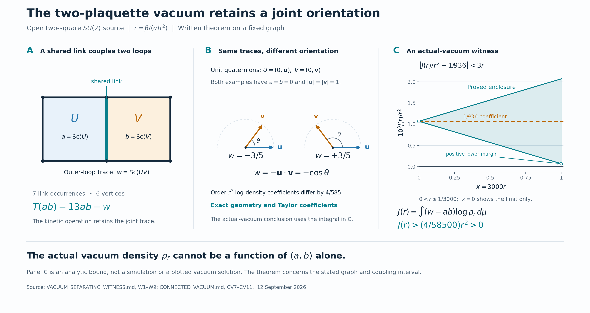

# The joint orientation survives in the actual vacuum

Both running tasks contributed a useful method, and applying them produced
a concrete Yang–Mills result. On our actual interacting two-cell SU(2)
source, the quantum vacuum depends on a joint orientation that cannot be
recovered from the two individual loop traces. We now have an exact proof
of that statement over a small explicit coupling interval, including a
bound on everything omitted from the calculation.

This is a continuation of the accepted YM2 work. The earlier energy-transfer
witnesses, classical joints and finite-graph quantum-gap bounds stay at
their established scope; they were not rerun here.

The P=NP task, **Locate liar-truth framework**, made the representation
question concrete. Its parity interface can describe an entire family by an
equation while preserving the boundary assignments needed by the next join.
The pilot finished while this review was underway. Its updated report says
the finite checks passed, but also records cases where the panel method was
no cheaper than ordinary Gaussian elimination. So the useful transfer is
precise: retain a representation that supports the next operation, and
account for the work required to obtain it. It supplies no general P=NP
conclusion for us to borrow. The [snapshot update](CROSS_SOURCE_UPDATE.md)
separates the earlier specification from the later reported execution.

The BSD task, **Run BSD E5 test 01**, contributes a complementary method.
Its generator argument first uses a universal bound to force every possible
missing candidate into a finite region. Its analytic estimates then keep
the complete remainder beside the calculated part. That is the relevant
parallel with your “prove this set covers what matters” idea: the coverage
argument has to come before promoting a finite calculation. We used that
method to keep the uncalculated vacuum terms from undoing the result.
The BSD conclusions themselves remain attributed to that running task.

Here is the geometry. A plaquette holonomy is an SU(2) group element: an
internal rotation-like quantity built by transporting around a loop. Its
half trace gives one number, a or b. Two such numbers tell us something
about each loop separately, but they omit the relative orientation of
their internal directions. That missing relationship appears in the
outer-loop half trace w. These directions are internal SU(2) coordinates;
the arrows in the figure are not spatial magnetic-field arrows.



Write the two holonomies as unit quaternions U=(a,u), V=(b,v). Then

```text
w = ab-u.v,            D = w-ab = -u.v.
```

At fixed a,b, the dot product can still vary. In particular, a=b=0 permits
every w between -1 and 1. Thus “same individual measurements” leaves a
whole joint completion fiber, not a unique configuration. This realizes
one useful part of your joint/distinction idea without replacing its
broader RPRM meaning.

The dynamics identifies why the missing information matters. In the exact
kinetic convention, T(a)=6a and T(b)=6b. Those two identities alone might
make the pair of traces look sufficient. But the next operation also needs
their product, and

```text
T(ab)=13ab-w.
```

The shared link introduces w. A change of coordinates on the same two
retained numbers cannot recreate it. This is the concrete analogue of a
message format that cannot express a relation required by its next join.
Adding w completes this configuration quotient; it does not make every
nonlinear function of those three variables a finite linear calculation.

We solved the ground-state equation through second order in the
dimensionless ratio r=beta/(alpha hbar^2). With the wavefunction phi
normalized to have Haar mean one,

```text
phi = 1 + r(a+b)/6
      + r^2[(a^2+b^2-1/2)/96 + ab/39 + w/351] + remainder.
```

The [full derivation](CONNECTED_VACUUM.md) proves convergence and gives an
explicit L2 bound on the entire remainder. Taking the logarithm of the
vacuum density isolates the joint term

```text
r^2 (4w-3ab)/702.
```

The subtraction in the logarithm matters. For plaquettes with no shared
edge, their apparent second-order cross contribution cancels exactly.
For adjacent plaquettes, the displayed term survives. This is an exact
calculation about signed terms, their support and the source operation.
The minus sign helps express the cancellation; it does not create the
interaction independently of the geometry and Hamiltonian.

A nonzero Taylor coefficient alone would leave a fair objection: perhaps
all the later terms cancel it at the coupling we actually use. We therefore
constructed a readout designed to detect only the forgotten relationship:

```text
J(r) = integral (w-ab) log(rho_r) dmu,
rho_r = phi_r^2 / integral phi_r^2 dmu.
```

Under Haar measure, the conditional mean of w-ab at fixed a,b is zero.
Consequently every description of the vacuum using only a,b would force
J(r)=0. Our exact coefficient is r^2/936. Combining the convergent
wavefunction remainder with the previously proved positive lower bound
on the actual wavefunction gives

```text
|J(r)-r^2/936| < 3r^3             for 0<r<=1/10,
J(r) > (4/58500)r^2 > 0          for 0<r<=1/3000.
```

That is the [actual-vacuum separating witness](VACUUM_SEPARATING_WITNESS.md).
It proves that the full vacuum retains the joint distinction in that
interval. The picture's band is this analytic error bound; it is not a
numerical simulation or a plotted guess at the eigenfunction. The small
interval is conservative. It does not locate a physical threshold.

The remaining difficulty now breaks into specific pieces:

1. **An average observation is weaker than a worst-case local response.**
   Our L2 estimate controls the integrated witness J. A conditional law can
   respond sharply on a small set while contributing little to an average
   error. The next argument needs control after fixing exterior links and
   changing one of them. We cannot silently replace that stronger norm by
   the one already proved.
2. **Local terms must remain controllable as more loops are added.**
   We proved that only adjacent pairs survive at second order on the
   declared square/cubic graph class. The associated finite-head response
   can be bounded using the number of nearby plaquettes, rather than the
   total graph size. But later orders can connect longer chains. Their
   actual conditional remainder must have a bound whose summed effect
   stays controlled across the family. The elementary global expansion
   radius currently shrinks like 3/N for N plaquettes. That is a limitation
   of this proof, not evidence that the actual gap closes.
3. **The physical limiting problem still needs its own argument.**
   A graph-family bound would then need an applicable functional inequality,
   the correct physical energy scale, and a continuum construction preserving
   the required quantum observables. The newly identified joint dependence
   supplies none of those steps automatically.

The [next conditional-port derivation](NEXT_CONDITIONAL_PORTS.md) makes the
second point quantitative: it isolates a graph-size-independent bound for
the calculated local terms and names the exact full-remainder estimate still
needed. We have progressed beyond saying “perhaps use connected pieces.”
We now know which connected piece appears first, why disconnected pairs
cancel, and which norm must control the rest.

Your relational-scaling point is useful here. Rescaling units consistently
preserves r. Enlarging or refining the graph changes the operator, support
incidence and physical-scale relation, so those must be transported together.
The aim is a bound governed by local relationships that remains valid through
the family, without paying for every independent distant combination. It
is not legitimate to carry the two-cell numerical constants unchanged into
a different graph and call that scaling.

There is also a terminology trap: small r means a weak magnetic perturbation
relative to the electric Hamiltonian. With the usual lattice coefficients
proportional to g^-2 and g^2, respectively, it corresponds to strong gauge
coupling, up to conventions. It is not already a result in the continuum
weak-gauge-coupling regime. [Mathur and Sreeraj's established loop formulation](https://journals.aps.org/prd/abstract/10.1103/PhysRevD.92.125018)
records this electric/magnetic coupling distinction.

This work therefore supplies a checked piece of the vacuum geometry and a
sharper next obligation. It does not improve the earlier finite-graph gap
bound by itself or solve the [continuum Yang–Mills mass-gap problem](https://www.claymath.org/wp-content/uploads/2022/06/yangmills.pdf).
The lattice framework and analytic tools are established literature; the
explicit coefficients, bounds and witness are derived here, without claiming
they are new to the literature. Independent written reviews and exact
standard-library checks accompany them. The README gives the portable replay
commands; the adjacent final-export evidence records what actually ran from
the final ZIP.
