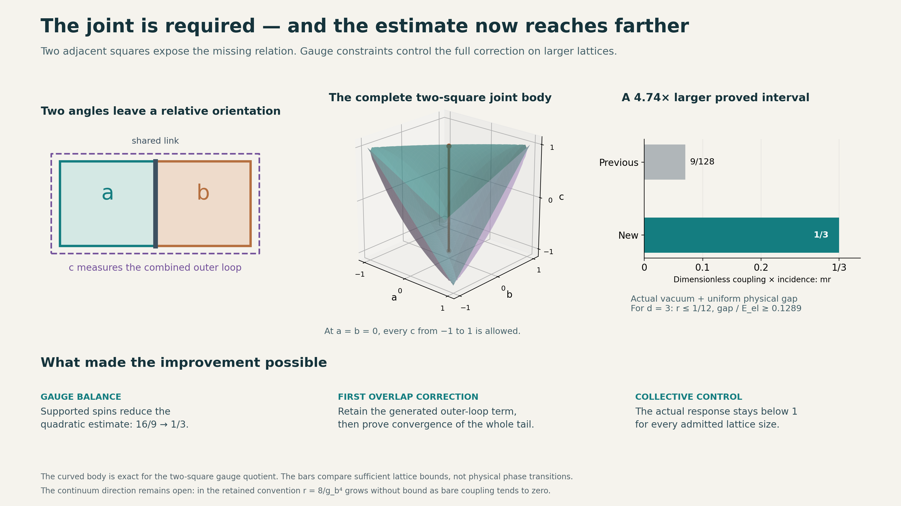

# What changed, and where the proof still stops

We obtained a larger proved interval for the **actual interacting
finite-lattice SU(2) vacuum and its physical gap**, with constants
independent of lattice size. We also identified exactly what the first
missing joint variable is and derived its geometry and kinetic operator.
The work uses the accepted earlier proofs without rerunning their tests.

## The checked advance

With the retained coupling r and m=2(d-1), the previous sufficient
interval ended at mr=9/128. The new proof covers

```text
mr <= 1/3,
gap_phys(H)/E_el >= [d/(7(d-1))] exp(-32/63).
```

The interval is larger by **128/27, about 4.74 times**. In three spatial
dimensions this means r<=1/12, with physical gap at least approximately
0.129 times E_el. The old endpoint was r=9/512, approximately 0.01758.
These are bounds at the same stated energy scale and for the same
Hamiltonian. They apply uniformly to every admitted finite lattice,
including all spins. They are sufficient bounds; an endpoint is not
asserted to be the true physical point where a gap disappears.

The [combined theorem](COMBINED_RESULT.md) states the complete carrier,
proof and limitations. This is a written mathematical result with
independent agent review and exact checks, not a proof-assistant result
or a claim of priority over the literature. Publication stays on hold.



## The joint has an exact physical job

Take two neighboring squares that share a link. Each square has a loop
matrix, P or Q. Its trace summarizes its rotation angle but forgets the
relative orientation of the two rotations. Let a and b be their half
traces. The third quantity is c=Tr(PQ)/2: the half trace around their
combined outer loop.

The [obstruction proof](CONDITIONAL_OBSTRUCTION.md) shows something
stronger than failure of one convenient ansatz: **at nonzero coupling,
no nonzero eigenfunction on this graph can depend only on a and b.**
So the missing information is not merely useful for an approximation.
The actual interacting eigenfunction needs more than those two traces.

Here is the intuition. Two pairs can have the same separate rotation
angles while one pair's axes align and the other's oppose. The shared
link responds differently. The Hamiltonian sees this distinction even
though the two separate traces agree. At a=b=0, the complete allowed
range of c is [-1,1], and the shared kinetic response changes across it.

The complete gauge-orbit coordinate on this two-square graph is (a,b,c),
inside the curved region

```text
1-a^2-b^2-c^2+2abc >= 0,      a,b,c in [-1,1].
```

This is a literal joint constraint. The admissible c values depend on a
and b; three unrelated intervals would erase the relationship. The
[geometry note](TWO_SQUARE_GEOMETRY.md) derives the full kinetic matrix
and the exact reduced Hamiltonian on this body, not just its picture.
Trace coordinates themselves are established mathematics; their role
and the kinetic coefficients for this lattice are derived here.
[Primary character-variety exposition, section2.2](https://www.numdam.org/item/10.5802/ahl.216.pdf).

At the first correction beyond the linear approximation, the actual
log-vacuum series already contains the term r^2 c/351. That is where
the overlap forces the joint variable into the calculation. No numeric
symbolism or fixed universal “plus one” is assumed: the missing
quantity is selected by the actual equation.

## Why the earlier estimate was too pessimistic

There were two distinct losses, and both are now reduced.

First, the broad coefficient estimate admitted input patterns that do
not obey the physical gauge constraints. At a vertex, a link carrying
spin needs other incident spins capable of balancing it. Following
that obligation through the surrounding vertices forces an additional
kinetic cost. Also, averaging the coefficient's local orientation data
under gauge symmetry gives a stronger contracted-gradient estimate.
The [all-spin gauge proof](GAUGE_NORM_GAIN.md) reduces the bilinear
constant from 16/9 to 1/3 in the same norm.

Second, the earlier bound treated the first correction like a generic
unknown interaction. We instead calculate which plaquette pairs can
actually contribute. Disjoint squares contribute no cross derivative;
overlapping squares contribute a specific joint term. Counting only
those interactions produces a smaller source bound. The
[local calculation](LOCAL_VACUUM_ROUTE.md) derives that bound exactly.

Crucially, we then keep the entire remaining correction. A contraction
argument sums all the generated terms in the declared function space.
Thus the result concerns the actual vacuum, not just an exponential of
the first two terms. We construct a law that meets all three requirements
from the preceding rail work: compatible conditionals, constant local
energy for the actual Hamiltonian, and uniform collective response.

At mr=1/3 the correction stays inside a proved radius 3/7, with strict
contraction factor at most 37/63. The actual influence bound is 19/21,
leaving a positive margin. The inherited forest cover converts that
margin into the physical gap quoted above.

## What remains difficult

**More room in the joint creates more relations.** The triple (a,b,c)
fully describes gauge orbits of these two squares. On a larger lattice,
different overlapping groups produce more loop relations. The proof
controls their total contribution through a norm; it does not establish
that one fixed three-number summary describes the whole lattice.

**A local correction is not automatically a global error estimate.**
The second-order trial cancels the error through order r^2. But if many
copies contribute the same remaining error, its full-range oscillation
still grows with their number. We retained an exact witness with residual
oscillation at least Nr^3/288. The construction handles the infinite
correction tail in a local norm instead of treating that extensive
residual as uniformly small. That distinction remains essential for the
next approximation too.

**Our current response comparison still has an endpoint.** The new
construction majorant has strict room while mr is below approximately
0.410. The present collective-response estimate can certify a positive
margin only below approximately 0.348; the simple theorem uses the closed
interval mr<=1/3. These are boundaries of sufficient estimates. We have
not shown the physical gap vanishes at either number.

The next useful calculation is therefore quite specific: retain more
information about the actual mixed responses before adding their worst
possible magnitudes. The weighted influence matrix from the preceding
turn is one candidate tool. Cluster support, correlated signs and block
response are other possible inputs. Any gain has to be proved for the
actual correction, for every exterior and graph size. Closing a route
around the coordinate system does not supply this estimate by itself.

**The continuum is still farther away.** In the accepted lattice
convention r=8/g_b^4. The weak-bare-coupling continuum direction sends r
toward infinity. Extending a finite interval by a factor of 4.74 does not
reach that regime. One must also construct the limiting theory and show
that an excitation retains a positive energy relative to a fixed physical
scale. This result advances a lattice research route; it does not solve
the continuum quantum Yang–Mills mass-gap problem.

The intuition to bring to the next step is: **we now know one joint that
the equation requires, and we know how much collective response our
present estimate can absorb. Can the larger joints be organized so that
their actual combined response stays controlled more tightly than the
sum of their separate worst cases?** This is a mathematical question
about the generated terms, not a request to assume their cancellation.

## Verification and retained evidence

The new [checker receipt](RESULTS.json) records 5,041 exact rational and
polynomial assertions. These include direct derivatives of seven-link
SU(2) configurations, the complete displayed quotient identities, the
second-order residual, 2,304 finite spin-pair controls, and all constants
in the combined endpoint. The all-spin and all-volume results rest on
written proofs, not extrapolation from those finite checks.

[Independent review](CONSTRUCTION_REVIEW.md) audits the load-bearing
gauge, source and combined arguments and records the reviewed file hashes.
The preceding frozen rail archive and selected accepted analytic sources
are included byte for byte, with [source provenance](SOURCE_PROVENANCE.json).
No old test suite, large simulation, installation, external publication,
or git commit/push/merge was performed. Final-export evidence is generated
beside the ZIP after a fresh extraction and replay of this new checker.
