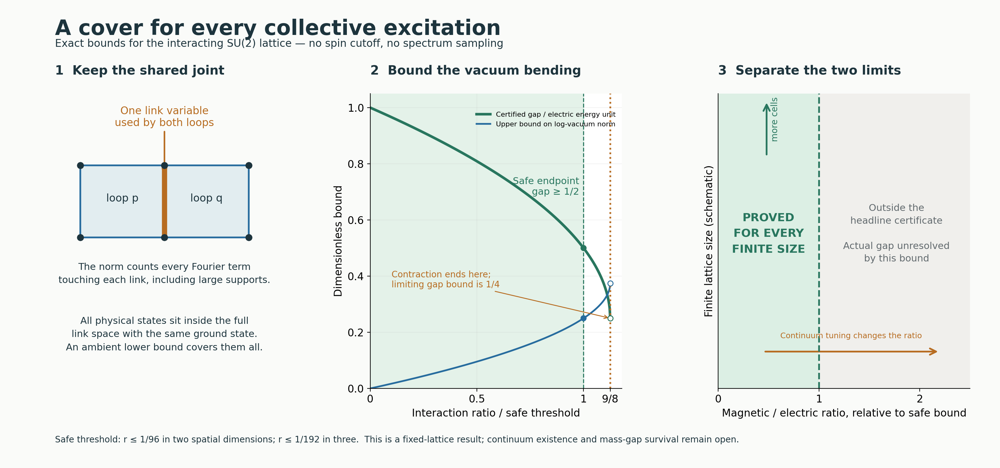

# YM2: the covering argument

Research continuation, 12 September 2026. Publication is on hold.

**Result:** for every admitted finite open SU(2) lattice graph in spatial
dimension d=2 or 3, with all spins and the actual interacting vacuum,

```text
m=2(d-1),  r=beta/(alpha hbar^2),
0<=r<=1/(48m)  ==>  gap_physical >= alpha hbar^2/2.
```

The bound is independent of the number of cells. In three spatial
dimensions the sufficient interval is r<=1/192. This is a written proof
with independent agent audits and bounded exact corroboration. It is
not a formal proof certificate, a priority claim, or a continuum
Yang-Mills mass-gap solution.

The physically motivated refinement also closes the earlier CP8
actual-vacuum remainder summability obligation on this interval. The
conditional influence rows are strictly below 1/12. The direct spectral
proof uses weighted curvature separately, so it does not assume an
unwritten implication from that conditional bound to the quantum gap.

Read in this order:

1. [COVERING_RESULT.md](COVERING_RESULT.md): exact model, proof mechanism,
   RPRM transfer, literature route and physical scaling boundary.
2. [DIRECT_COVER_ATTEMPT.md](DIRECT_COVER_ATTEMPT.md): complete Fourier
   fixed-point and weighted Bochner derivation. Its original filename is
   retained; the final disposition is a reviewed written proof.
3. [CONDITIONAL_REFINEMENT.md](CONDITIONAL_REFINEMENT.md): explicit bound
   on the full remainder, including all outside configurations and links.
4. [NEXT_OBLIGATION.md](NEXT_OBLIGATION.md): why the current certificate
   stops before its geometric margin vanishes, and what a new lens must
   preserve to extend it.



The [literature audit](LITERATURE_STABILITY_AUDIT.md) independently
applies Yarotsky's established stability theorem with an exact open-boundary
adapter. Its existential threshold is distinct from the explicit threshold
of the direct derivation. The [official-docs transfer](OFFICIAL_DOCS_TRANSFER.md)
records selected current RPRM sources and their evidence limits.

Reviews are in [DIRECT_COVER_REVIEW.md](DIRECT_COVER_REVIEW.md),
[DIRECT_COVER_RPRM_REVIEW.md](DIRECT_COVER_RPRM_REVIEW.md),
[CONDITIONAL_REVIEW.md](CONDITIONAL_REVIEW.md), and
[FINAL_MATH_REVIEW.md](FINAL_MATH_REVIEW.md).

Two new checkers require only Python's standard library:

```text
python -I -B -X utf8 check_covering.py
python -I -B -X utf8 check_conditional_cover.py
```

Their default mode recomputes and compares saved deterministic receipts
without writing files. The finite controls corroborate constants,
occurrences, boundary retention and hostile cases. The unbounded
mathematical claims rely on the written proofs. None of the accepted YM1,
YM2 or other-lane checkers was rerun.

[SOURCE_PROVENANCE.json](SOURCE_PROVENANCE.json) binds accepted frozen
source bytes and attributed current-document snapshots.
[SOURCE_AUDIT.md](SOURCE_AUDIT.md) separates literature, new derivations,
accepted evidence and remaining work. Historical source copies preserve
their original link contexts; this top-level reading path is portable.

The adjacent delivery directory contains the portable ZIP and
FINAL_EXPORT_EVIDENCE.md/json generated after freezing and freshly
extracting that exact ZIP. Its manifest and replay establish byte and
execution integrity, not mathematical truth on their own.
