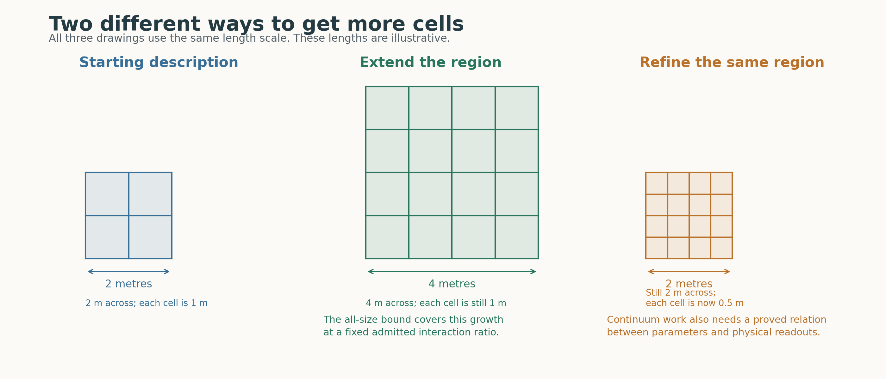

# YM2 estimate continuation

12 September 2026. Publication remains on hold.

The [explanation and combined result](RESULT.md) answers the questions
about repeated positive bounds, inverses, retained cancellations, changing
the lens and physical refinement. It also reports the new research.

On the same full SU(2) finite-lattice carrier as the accepted packet,
with m=2(d-1) and r=beta/(alpha hbar^2),

```text
0<=r<=9/(128m)
  ==> gap_physical >= (3/8)exp(-3/2) alpha hbar^2.
```

In three spatial dimensions, r<=9/512 suffices. This is a conservative
uniform finite-lattice lower bound with all spins retained. Continuum
existence and a continuum mass gap remain open.

The derivation has four independently assessable parts:

- [Recentring and inverse](RECENTER_AND_INVERSE.md): restarting the old
  estimates reproduces their old boundary; a spectral inverse in L2
  does not supply the missing local Fourier inverse estimate.
- [Exact source norm](SOURCE_NORM_REFINEMENT.md): the oriented plaquette
  coefficient has trace norm four, improving the previous bound eight.
- [Contracted joint estimate](SIGNED_AND_CONTRACTED_AUDIT.md): the
  bilinear norm constant improves from 8/3 to 16/9. That note first
  isolates its consequence with the old source bound; RESULT.md and the
  conditional note combine it with the new source bound.
- [Conditional gap extension](CONDITIONAL_GAP_EXTENSION.md): actual
  conditional laws give a positive quantum gap beyond the point where
  the simple curvature lower bound becomes zero.

[COMBINED_REVIEW.md](COMBINED_REVIEW.md) records the independent review.
The evidence grade is reviewed written analysis plus exact finite
corroboration, not external peer review or proof-assistant certification.
No historical novelty is claimed for the particular derivation.



Run the new check in an extracted packet with ordinary Python:

```text
python -I -B -X utf8 check_continuation.py
```

It recomputes and compares [RESULTS.json](RESULTS.json) without writing.
The old checkers are not imported or executed. New finite tests cover
exact source and swap matrices, 4,096 spin pairs, the scalar radii,
conditional constants, and distinguishing failures of proposed shortcuts.
The all-spin and all-graph statements rely on their written proofs.

[SOURCE_PROVENANCE.json](SOURCE_PROVENANCE.json) binds copies drawn from
the previously frozen ZIP. Those historical files preserve their original
link contexts. New top-level links are portable. The adjacent delivery
folder contains the ZIP and final-export evidence generated after a fresh
extraction and read-only replay of this new checker.
