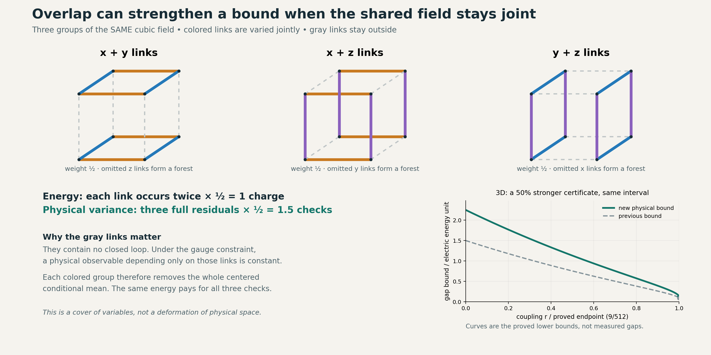

# What the overlap idea gives us

12 September 2026. Bounded YM2 continuation; publication remains on hold.

**The shared-variable overlap gives a stronger physical gap certificate.**
On every admitted finite open three-dimensional cubic lattice, three
overlapping direction groups improve the previous conditional physical
bound by a factor of **3/2**, without counting any link energy twice.
The interacting vacuum and coupling interval remain the accepted ones.
This is a written result with two independent agent audits and new exact
finite controls. It is not a formally certified proof or a continuum
Yang–Mills mass-gap solution.



## 1. The part of the mango picture that survives

Imagine marking the same field three ways. First highlight all links in
the x and y directions, then x and z, then y and z. A link is a variable
holding an SU(2) matrix, not an independently copied piece of material.
Whenever the same link appears in two groups, both appearances refer to
that one matrix. Give each group weight one half. Every original link
appears twice, so its total energy charge is exactly one.

The useful extra fact is about what each group leaves out. The x+y group
leaves only z-directed paths. Those paths have no cycles: they form a
forest. Gauge transformations at their vertices can change every forest
link to the identity. Consequently, a gauge-invariant observable that
depends only on that forest must be constant. Physical loop information
cannot remain solely in those outside paths.

This is an exact statement about conditional averages. It does **not**
say the colored links alone determine every physical state independently
of the gray links. The groups keep their joint interactions and their
actual conditional laws throughout.

Here is the gain. Each group detects the entire physical variance, while
the weighted sum charges the field's derivative energy only once:

```text
Three full variance contributions, each weighted 1/2:  3/2 × variance.
Two appearances of every edge, each weighted 1/2:      1 × edge energy.
```

That mismatch, proved from the gauge constraint, strengthens the lower
bound. Merely drawing two copies of an arbitrary object would multiply
both sides equally and produce no gain. The exact counterexample in
[BLOCK_COVER.md](BLOCK_COVER.md), section 6, shows why the physical
constraint is essential.

The term “half” here means a positive energy-counting weight. If instead
we make two Hilbert-space amplitude components, half the norm in each
requires amplitudes `f/sqrt(2)`, not `f/2`. This is distinct from RPRM's
centered coordinates and balanced dual-rail readouts. Those broader
meanings remain intact; this task uses a particular typed realization.

## 2. The new inequality and its exact domain

Keep the accepted Hamiltonian

```text
H/E_el = T+r sum_p(1-a_p),   T=-Delta/2,
a_p=(1/2)Tr(U_boundary(p)),  r=beta/E_el,
E_el=alpha hbar^2>0.
```

The graph is a finite open nearest-neighbor subgraph of Z^d, d=2 or 3;
links have the unit-round SU(2) metric, all spins are admitted, and gauge
constraints hold at every vertex. There are no boundary charges or
periodic identifications. Use the actual normalized positive vacuum
`psi`, the joint measure `dnu=psi^2 dmu`, and the accepted anchored local
Fourier bound `||log psi||_* <= Y` after removing its Haar constant.

For any block B whose exterior is a forest, the written proof establishes

```text
E_nu[f | exterior B] = nu(f)                  for physical f,
Var_(nu_B(.|exterior))(f)
 <= C_grad(Y) integral sum_(e in B)|grad_e f|^2 dnu_B,
C_grad(Y) = exp(8Y/3)/[3(1-4Y/3)],           Y<3/4.
```

The first identity uses gauge invariance. The second holds uniformly for
every block and exterior because its single-link conditional laws are
the original ones with exterior values fixed. No exponential-in-volume
comparison of a whole block density is inserted.

For a weighted forest-complement cover, put

```text
W=sum_B w_B,
Lambda=max_e sum_(B containing e) w_B.
```

The actual-vacuum ground-state form identity then gives

```text
gap_phys(H)/E_el >= W/[2 Lambda C_grad(Y)].
```

The three-dimensional direction cover has `W=3/2`, `Lambda=1`. More
generally the d-dimensional direction cover has factor `d/(d-1)`;
in two dimensions its two blocks happen to be disjoint. The benefit is
from their proved physical residuals and costs, not overlap as an
independent source of strength.

Using the already accepted construction

```text
m=2(d-1),
Y(r)=(9/16)[1-sqrt(1-128mr/9)],     0<=r<9/(128m),
```

and continuity of the physical spectrum at the endpoint yields

| Domain | Previous conditional bound / E_el | New physical bound / E_el |
|---|---:|---:|
| d=3, 0<=r<=9/512 | (3/8)exp(-3/2), about 0.083674 | (9/16)exp(-3/2), about 0.125511 |
| d=2, 0<=r<=9/256 | (3/8)exp(-3/2), about 0.083674 | (3/4)exp(-3/2), about 0.167348 |

The interior retains the stronger Y-dependent expression
`[d/(d-1)](3/2)(1-4Y/3)exp(-8Y/3)`.
These are guaranteed lower bounds; the true gap has not been computed.
For a tree, the physical excited subspace is empty and the corresponding
form inequality is vacuous. The all-state claims refer to the full
physical form domain, not a low-spin sample.

The complete derivation is in [BLOCK_COVER.md](BLOCK_COVER.md), with
[independent review](INDEPENDENT_REVIEW.md) and a second audit in
[GEOMETRIC_OVERLAP.md](GEOMETRIC_OVERLAP.md), section 7.

## 3. Why more squeezing does not improve this estimate forever

There is an exact counting ceiling for this class of covers. In a
connected graph with v vertices and e edges, a forest contains at most
v-1 edges. Its complementary block must therefore contain at least
e-v+1 edges. Counting every weighted incidence gives

```text
(e-v+1) W <= sum_B w_B |B| = sum_e load_e <= e Lambda,
W/Lambda <= e/(e-v+1).
```

On an n-by-n-by-n grid this upper bound tends to 3/2 as n grows. Our
direction cover already achieves 3/2 at every size. Therefore, among
forest-complement covers that use this same common block constant and
maximum-edge-load comparison, no larger factor can hold uniformly over
all cubic boxes. A different analytic estimate can go beyond this
method; extra overlapping occurrences alone cannot.

Small grids can do better within the same method:

| Graph | A checked optimal factor W/Lambda within this cover class |
|---|---:|
| One four-link square | 4 |
| Two adjacent squares, seven links | 7/2 |
| One cube, twelve links | 12/5 |

For the cube, we enumerated all 384 spanning trees. Their five-link
complements contain each edge exactly 160 times. Weighting every block
by 1/160 charges each edge once and gives `W=12/5`. The ceiling above
proves optimality for this cover comparison. This small graph example
does not substitute for the all-volume direction proof.

A positive bound repeated at every larger size is useful: it means the
certificate does not erode merely because more lattice is included.
What stops improving is this particular multiplicative factor, not the
field's dynamics. Size growth and lattice refinement remain different
limits. We have controlled the former bound on finite lattices at fixed
admitted coupling; the latter requires changing the physical parameters.

## 4. The stronger inverse is still a different problem

To extend the vacuum construction, we tried assembling inverses from
overlapping blocks. This exposed an exact failure worth preserving.
For a joint Fourier mode with total kinetic energy lambda and block
energies lambda_B, the naive sum of block inverses, followed by the
original kinetic operator, multiplies that mode by

```text
lambda sum_(B:lambda_B>0) theta_B/lambda_B.
```

It should be one if this were the full inverse. On a k-link loop with
singleton blocks and unit weights it is k^2. On two fixed disjoint loops,
keeping a low spin in one block while increasing an outside spin makes
the multiplier diverge. These are exact all-spin separating witnesses.

Intuitively, a local inverse can see a slowly varying piece while the
joint state is varying arbitrarily fast elsewhere. Dividing by the slow
piece's energy does not control the full response. Knowing an average
energy gap, even the improved one above, does not automatically supply
the stronger Fourier estimate needed by the nonlinear construction.

We also derived an exact free repair: partition every edge's kinetic
operator among the blocks, evolve all blocks with the **same** time
parameter, multiply their commuting heat operators, and integrate in
that common time. This retains the total energy and recovers the exact
free inverse. For the interacting weighted operator, the block pieces
generally do not commute. Boundary interactions and their effect in the
anchored norm must be controlled.

[OVERLAP_INVERSE.md](OVERLAP_INVERSE.md), equations OI11–OI13, gives a
specific sufficient target: an approximate weighted inverse whose defect
has norm rho<1, together with bounds on the actual driving source and
quadratic gradient term. Those bounds would justify a new continuation
step. They have not been established by the present overlap argument.

This is the next mathematical obligation: retain the full joint response
through the overlapping blocks strongly enough to continue the actual
vacuum beyond its existing construction window.

## 5. What bending the picture itself costs

There is another exact interpretation: represent one function as two
compatible components `(cos(theta) f, sin(theta) f)`. Their joint norm
equals the original norm and the source is reconstructible. When theta
varies with the field, differentiating the components adds the
localization term

```text
(1/2) integral |grad theta|^2 |f|^2 dnu.
```

For the actual plaquette choice `theta=s a_p`, this equals
`2s^2 integral (1-a_p^2)|f|^2 dnu`. It is a bookkeeping cost of using
the componentwise derivative. A correctly transported derivative
preserves the original energy exactly. Counting the extra localization
cost as physical excitation would even assign energy to the vacuum.
The proof and the incompatible-component counterexample are retained in
[GEOMETRIC_OVERLAP.md](GEOMETRIC_OVERLAP.md).

Physically folding the lattice until previously distant sites interact
would require specified contact interactions and a changed Hamiltonian.
The shared-variable cover above makes a useful change of description
without needing that additional model.

## 6. Mass-gap ambition and attribution

The result strengthens a uniform finite-lattice physical energy bound.
It does not extend the constructed-vacuum coupling window, construct an
infinite-volume quantum theory, or take the continuum limit. In the
previously matched standard Hamiltonian convention, `r=8/g_b^4` and
`E_el=g_b^2/(4a)`; the usual weak-bare-coupling continuum direction has
`g_b -> 0`, hence `r -> infinity`. It is outside the interval proved here.
Choosing another energy unit changes neither that ratio nor which
Hamiltonians the theorem covers. That is the physical scaling obstacle
behind the still-open inverse estimate, not a lack of diagrammatic
overlap. The convention and its accepted derivation are retained in
[the preceding result](accepted/estimate/RESULT.md).

Gauge fixing on a maximal tree is established literature, including
[Ligterink, Walet and Bishop (2000)](https://arxiv.org/abs/hep-lat/0001028).
The component derivative identity uses the established IMS localization
formula; see [Teschl, Lemma 11.3](https://www.mat.univie.ac.at/~gerald/ftp/book-schroe/schroe.pdf#page=255).
Those standard ingredients are distinguished from the explicit
conditional forest-complement synthesis, weighted comparisons and
separating witnesses derived in this research continuation. “Derived
here” records this work's derivation, not a claim that nobody previously
obtained an equivalent result. The original RPRM concept remains broader
than these particular realizations.

## 7. Evidence and portable continuation

The new [exact checker](check_overlap.py) passed **1,343 assertions**,
including the complete cube tree census, square and two-square covers,
six direction-grid instances, duplicate-cover controls, all seven active
support classes of the auxiliary three-link product control, rational
isometry/IMS checks, and selected exact inverse multipliers. Its
[saved receipt](RESULTS.json) is recomputed in read-only replay. The
general proofs do not follow from those finite controls alone.

[SOURCE_PROVENANCE.json](SOURCE_PROVENANCE.json) binds the accepted source
snapshots and preceding frozen archive. The new top-level notes have
portable links. Accepted snapshots retain their original historical
links and context; deeper historical navigation is not a new claim of
complete source recovery. The preceding frozen ZIP is also included.
The final export's separate evidence records fresh extraction, hashes,
CRC and execution of this new checker from the delivered archive.
