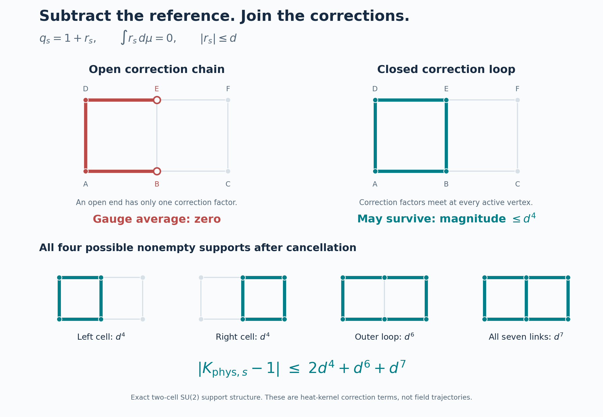

# What the stacked-difference idea gave us

The useful version of your idea is now concrete: **subtract a retained
reference, keep the residuals joint, and prove which combinations cancel
and which survive.** That produced a stronger bound on the actual quantum
vacuum in our two-cell SU(2) model. It also exposed why this particular
bound will need a different way of combining contributions on larger graphs.

## A correction that keeps the useful idea

In ordinary arithmetic, addition can indeed be written using subtraction:

```text
x+y = x-(0-y).
```

The expression `1+x-y-1` gives `x-y`; the nested inner minus is needed.
Keeping the nesting is keeping part of the construction.

There is an especially useful version with different reference points.
Define `J_a(x)=a-x`. Then

```text
J_b(J_a(x)) = x+(b-a).
```

Two reversals around different references produce a translation. Repeating
the same negation twice instead returns the original value. So a count
of minus signs misses which references and input occurrences were used.
That connects well with the retained-construction issue in your earlier
Prestige discussion. This scalar realization does not replace its broader
meaning.

Multiplication by an integer count can use repeated additions compiled
this way. A fixed finite subtraction-only expression, however, stays
affine in its variable inputs. General multiplication or division needs
extra operations or control, and division keeps its domain restrictions.
The details and exact hostile cases are in [SIGNED_SEMANTICS.md](SIGNED_SEMANTICS.md).

## Your -0.6 and +0.4 example separates two effects

Take a bit that is 1 with probability 0.6, and subtract its mean 0.6.
The result is -0.6 with probability 0.4 and +0.4 with probability 0.6.
Those unequal-looking offsets have weighted mean zero and variance 0.24.

Stack `n` independent copies and add them: the variance is `0.24n`.
Average them: the variance is `0.24/n`. Copy the *same* underlying bit
into all `n` slots instead, and the sum's variance is `0.24n²`. The
individual signs and marginal distributions have not changed. The joint
dependence has.

The number of possible independent configurations is `2^n`, but the
conditional-resampling gap is exactly 1 at every size when each coordinate
is updated at rate one. We proved that for every finite `n`, using a
complete basis. So growing combinatorial complexity, growing variance,
and a shrinking gap are separate measurements. One does not determine
the others without the actual operation and law.

## What was really growing in the earlier two-sign example

The variance in that example never exceeded 4. What grew without bound
was the ratio of whole variance to the local conditional variances.
The local readouts became almost blind to a collective distinction.

We made that exact. For a patch `B`, subtract its conditional prediction:

```text
R_B f = f - E[f | everything outside B].
```

Stack these residuals. Their total squared size is exactly the quantity
in the missing patch inequality. The operator

```text
A = sum_B R_B
```

has a precise role: its lowest value relative to the centered squared
size of `f` tells us how well the collection detects every collective
mode. The sharp correlation constant is the reciprocal of that lower
bound. We also proved that these conditional operators preserve the
physical gauge-invariant function space for the actual source measure.

In the two-sign example the complete spectrum is
`0, 1-rho, 1+rho, 2`, where `rho` is their correlation. Positive strong
correlation makes the joint sum slow and the signed contrast fast;
negative strong correlation reverses their roles. Keeping only one
orientation can therefore miss exactly the distinction that matters.

These are established conditional-expectation methods applied explicitly
here. The complete derivation and operation controls are in
[DIFFERENCE_PROJECTION.md](DIFFERENCE_PROJECTION.md).

## The actual SU(2) advance: open corrections cancel

We then applied reference subtraction to the auxiliary heat kernel of
the quantum model. This kernel is a tool for estimating the vacuum;
its time parameter is not ordinary real-time field evolution.

Write a one-link heat kernel as

```text
q_s = 1 + r_s,    where r_s=q_s-1 and integral r_s dHaar=0.
```

The reference 1 is the uniform Haar density. Now multiply the seven
link factors, retaining the shared graph and full vertex gauge action.
An open-ended correction has one factor at its end. Averaging over that
vertex's gauge freedom integrates this zero-mean correction to zero.



On our particular graph only four nonempty support shapes can survive:
the left cell, right cell, outside loop, and all seven links. If each
one-link correction has magnitude at most `d`, the total deviation from
the uniform physical kernel is bounded by

```text
2d^4 + d^6 + d^7.
```

That is an exact finite expansion with a coverage proof. The heat estimate
also bounds the entire infinite spin tail analytically. We have not
discarded higher spins or replaced the true vacuum by a product law.

Using the ground-state equation, this kernel bound controls the ratio
between the maximum and minimum of the actual vacuum density `psi_0²`.
With `r=beta/(alpha hbar²)`, we obtain

```text
R_actual <= exp(32r/3) (104207/52043)^2.
```

This supplies concrete bounds on the previously missing finite-graph
patch constants. A direct comparison gives the stronger energy result

```text
gap >= 6 alpha hbar² exp(-32r/3) (52043/104207)^2 > 0.
```

It holds at every finite nonnegative interaction ratio. The estimate is
conservative. It complements our earlier bound `6 alpha hbar²-2 beta`:
where that earlier result is stronger, we retain it. At the reference
choice `alpha=beta=hbar=1`, the previous lower bound 4 still wins. The new
work gives an explicit positive estimate in the parameter region where
the old subtraction bound was inconclusive, and explains how the joint
gauge constraints improve the comparison.

## The remaining issue is connected vacuum response

The four-support formula belongs to this graph. More cells admit more
closed combinations. We proved a concrete limit of simply repeating the
same estimate: six edge-disjoint square loops already make our chosen
absolute-support envelope exceed 1. That makes this particular kernel
lower bound uninformative. It does not prove that the physical gap
disappears there.

The reason to look at *connected* responses is that independent distant
factors should cancel from a conditional comparison. We proved that
cancellation exactly for a supplied factorized density: changing an
outside edge affects the patch conditional only through factors that
connect that edge to the patch. We also derived a sharp bound on how
much a bounded change of log density can alter the conditional law.

The unresolved part is supplying useful bounds for the **actual quantum
vacuum**. A Hamiltonian built from local plaquettes does not immediately
give a local formula for `log(psi_0²)`. Substituting `exp(-V)` would change
the measure and evade the hard part.

So the next substantial obligations are to control the true vacuum's
connected conditional responses, preserve that control as volume and
lattice spacing change, and construct the required continuum quantum
theory with its observables and positive physical-energy bound.
These are substantial mathematical obligations; we have not reduced the
continuum problem to a known short list of routine calculations.

On the butterfly point, a fully retained endpoint and an invertible law
can identify a unique predecessor. A coarse endpoint may instead have
many compatible histories. Reversal can also amplify error: the exact
Hamiltonian example in the semantics note is equally sensitive forward
and backward, along different directions. Retaining the construction
can help backward inference; minus notation alone cannot restore it.

## What was checked

The packet separates established theory, proofs derived here, exact finite
checks, and open applications. Independent reviews checked the vacuum
comparison, the gauge cancellation refinement, and the product controls.
No new-to-literature theorem or proof-assistant certification is claimed.

The three new checkers cover seven complete four-state matrix models,
twelve complete product-cube bases, and exact rational certificates for
the heat-tail/support bounds. Further exact controls test the six-cycle
envelope and sharp conditional-tilt inequality. No numerical spectrum,
simulation campaign, old-suite rerun, installation, publication, or git
mutation was used. Final-export evidence records actual fresh ZIP replay.
